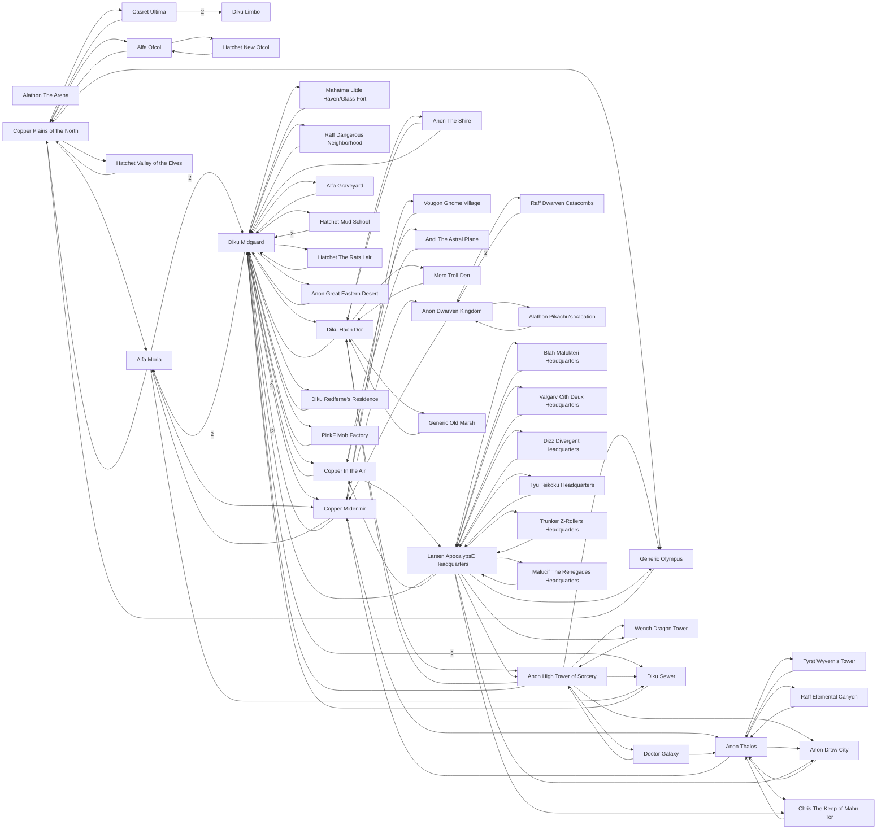

# Static Chaos -- World Map

> Generated by `tools/build-world-map.mjs` from `area/area.lst`. Do not edit by hand.

## At a glance

| Metric | Value |
|---|---:|
| Areas | 45 |
| Rooms | 2500 |
| Exits | 5853 |
| Cross-area links | 112 |
| Reachable from recall (Temple, #3001) | 2487 |
| **Unreachable rooms** | 13 |
| **Unreachable areas** | 1 |
| One-way exits | 161 |
| Dangling exits (broken) | 22 |
| Orphan rooms (no way in) | 11 |

## World overview (area connectivity)

Each node is an area; an arrow means at least one room in the source area has an exit into the target area. A number on the arrow is how many such links exist.

## Areas

| Area | Name | Rooms | VNUMs | Reachable from recall? | Reached from |
|---|---|---:|---|:---:|---|
| [`limbo`](world-maps/limbo.md) | Diku Limbo | 2 | 1–2 | ✅ 1/2 | ultima |
| [`arena`](world-maps/arena.md) | Alathon The Arena | 4 | 96–99 | ❌ 0 | — |
| [`plains`](world-maps/plains.md) | Copper Plains of the North | 44 | 300–345 | ✅ 44/44 | moria, ofcol, olympus, ultima, valley |
| [`ofcol2`](world-maps/ofcol2.md) | Hatchet New Ofcol | 100 | 600–699 | ✅ 100/100 | ofcol |
| [`apoc`](world-maps/apoc.md) | Larsen ApocalypsE Headquarters | 54 | 800–853 | ✅ 53/54 | air, cithdeux, divergent, malokteri, renegades, teikoku, zrollers |
| [`olympus`](world-maps/olympus.md) | Generic Olympus | 50 | 901–954 | ✅ 50/50 | apoc, hitower, plains |
| [`air`](world-maps/air.md) | Copper In the Air | 40 | 1001–1040 | ✅ 40/40 | apoc, astral, midgaard |
| [`shire`](world-maps/shire.md) | Anon The Shire | 58 | 1100–1157 | ✅ 58/58 | haon |
| [`hitower`](world-maps/hitower.md) | Anon High Tower of Sorcery | 184 | 1200–1499 | ✅ 182/184 | apoc, draconia, galaxy, haon |
| [`gnome`](world-maps/gnome.md) | Vougon Gnome Village | 89 | 1501–1590 | ✅ 89/89 | midennir |
| [`wyvern`](world-maps/wyvern.md) | Tyrst Wyvern's Tower | 61 | 1601–1720 | ✅ 61/61 | thalos |
| [`haven`](world-maps/haven.md) | Mahatma Little Haven/Glass Fort | 33 | 1801–1833 | ✅ 33/33 | midgaard |
| [`astral`](world-maps/astral.md) | Andi The Astral Plane | 80 | 1900–1979 | ✅ 80/80 | air |
| [`catacomb`](world-maps/catacomb.md) | Raff Dwarven Catacombs | 69 | 2001–2069 | ✅ 69/69 | dwarven |
| [`hood`](world-maps/hood.md) | Raff Dangerous Neighborhood | 72 | 2101–2172 | ✅ 72/72 | midgaard |
| [`draconia`](world-maps/draconia.md) | Wench Dragon Tower | 44 | 2201–2244 | ✅ 44/44 | apoc, hitower |
| [`mahntor`](world-maps/mahntor.md) | Chris The Keep of Mahn-Tor | 100 | 2300–2399 | ✅ 100/100 | apoc, thalos |
| [`ultima`](world-maps/ultima.md) | Casret Ultima | 185 | 2400–2584 | ✅ 185/185 | plains |
| [`trollden`](world-maps/trollden.md) | Merc Troll Den | 5 | 2801–2805 | ✅ 5/5 | haon |
| [`midgaard`](world-maps/midgaard.md) | Diku Midgaard | 101 | 3001–3205 | ✅ 101/101 | air, apoc, eastern, grave, haon, haven, hitower, hood, midennir, mobfact, moria, rats, redferne, school, sewer, shire |
| [`midennir`](world-maps/midennir.md) | Copper Miden'nir | 45 | 3500–3584 | ✅ 45/45 | dwarven, gnome, midgaard, moria, thalos |
| [`grave`](world-maps/grave.md) | Alfa Graveyard | 33 | 3600–3651 | ✅ 33/33 | midgaard |
| [`school`](world-maps/school.md) | Hatchet Mud School | 59 | 3700–3760 | ✅ 59/59 | midgaard |
| [`rats`](world-maps/rats.md) | Hatchet The Rats Lair | 43 | 3801–3899 | ✅ 42/43 | midgaard |
| [`moria`](world-maps/moria.md) | Alfa Moria | 121 | 3900–4172 | ✅ 121/121 | midennir, midgaard, plains |
| [`eastern`](world-maps/eastern.md) | Anon Great Eastern Desert | 47 | 5001–5070 | ✅ 47/47 | midgaard |
| [`drow`](world-maps/drow.md) | Anon Drow City | 51 | 5100–5150 | ✅ 51/51 | apoc, hitower, thalos |
| [`thalos`](world-maps/thalos.md) | Anon Thalos | 80 | 5200–5280 | ✅ 80/80 | canyon, drow, galaxy, mahntor, midennir, wyvern |
| [`ofcol`](world-maps/ofcol.md) | Alfa Ofcol | 8 | 5550–5577 | ✅ 7/8 | ofcol2, plains |
| [`haon`](world-maps/haon.md) | Diku Haon Dor | 71 | 6000–6155 | ✅ 71/71 | hitower, marsh, midgaard, shire, trollden |
| [`dwarven`](world-maps/dwarven.md) | Anon Dwarven Kingdom | 50 | 6500–6554 | ✅ 50/50 | catacomb, midennir, vacation |
| [`vacation`](world-maps/vacation.md) | Alathon Pikachu's Vacation | 20 | 6600–6619 | ✅ 20/20 | dwarven |
| [`sewer`](world-maps/sewer.md) | Diku Sewer | 177 | 7001–7445 | ✅ 175/177 | hitower, midgaard, moria |
| [`valley`](world-maps/valley.md) | Hatchet Valley of the Elves | 84 | 7800–7883 | ✅ 84/84 | plains |
| [`redferne`](world-maps/redferne.md) | Diku Redferne's Residence | 17 | 7900–7918 | ✅ 16/17 | midgaard |
| [`marsh`](world-maps/marsh.md) | Generic Old Marsh | 18 | 8301–8318 | ✅ 18/18 | haon |
| [`canyon`](world-maps/canyon.md) | Raff Elemental Canyon | 55 | 9201–9260 | ✅ 55/55 | thalos |
| [`galaxy`](world-maps/galaxy.md) | Doctor Galaxy | 61 | 9301–9371 | ✅ 61/61 | hitower |
| [`mobfact`](world-maps/mobfact.md) | PinkF Mob Factory | 25 | 9400–9424 | ✅ 25/25 | midgaard |
| [`malokteri`](world-maps/malokteri.md) | Blah Malokteri Headquarters | 13 | 9500–9512 | ✅ 13/13 | apoc |
| [`cithdeux`](world-maps/cithdeux.md) | Valgarv Cith Deux Headquarters | 18 | 9600–9617 | ✅ 18/18 | apoc |
| [`divergent`](world-maps/divergent.md) | Dizz Divergent Headquarters | 6 | 9700–9705 | ✅ 6/6 | apoc |
| [`teikoku`](world-maps/teikoku.md) | Tyu Teikoku Headquarters | 6 | 9800–9805 | ✅ 6/6 | apoc |
| [`zrollers`](world-maps/zrollers.md) | Trunker Z-Rollers Headquarters | 6 | 9900–9905 | ✅ 6/6 | apoc |
| [`renegades`](world-maps/renegades.md) | Malucif The Renegades Headquarters | 11 | 9950–9960 | ✅ 11/11 | apoc |

## ⚠️ Unreachable areas

These areas have **no path from the recall point** (Temple of Midgaard, room 3001) by walking exits. They still exist in the world data, but a mortal cannot reach them on foot — an immortal must `goto` a room inside. (This is exactly how the old Apocalypse HQ got stranded.)

- **Alathon The Arena** (`arena`, rooms 96–99) — no inbound links at all

## Dangling exits (point at rooms that do not exist)

| From room | Dir | Target vnum (missing) |
|---:|:--:|---:|
| 1418 | N | 0 |
| 1418 | S | 0 |
| 1418 | W | 0 |
| 1499 | D | 0 |
| 1945 | S | 0 |
| 1946 | E | 0 |
| 1947 | U | 0 |
| 1948 | W | 0 |
| 1949 | U | 0 |
| 1949 | D | 0 |
| 1968 | E | 0 |
| 3518 | E | 0 |
| 3519 | W | 0 |
| 7105 | D | 0 |
| 7122 | E | 0 |
| 7301 | N | 0 |
| 7301 | U | 0 |
| 7434 | D | 0 |
| 7903 | W | 0 |
| 7910 | E | 0 |
| 7912 | D | 0 |
| 8318 | S | 0 |

