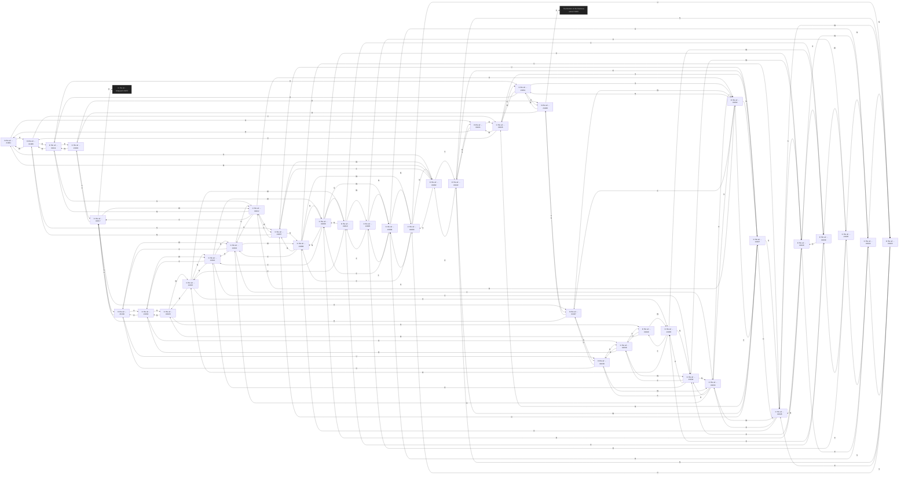

# Copper In the Air  `(air)`

[← back to world map](../WORLD-MAP.md) · 40 rooms · vnums 1001–1040

Dashed nodes are exits that leave this area.

## Rooms

| VNUM | Name | Exits |
|---:|---|---|
| 1001 | In the air ... | E→1006 S→1002 U→1021 |
| 1002 | In the air ... | N→1001 E→1007 S→1003 U→1022 |
| 1003 | In the air ... | N→1002 E→1008 S→1004 U→1023 |
| 1004 | In the air ... | N→1003 E→1009 S→1005 U→1024 |
| 1005 | In the air ... | N→1004 E→1010 U→1025 |
| 1006 | In the air ... | E→1011 S→1007 W→1001 U→1026 |
| 1007 | In the air ... | N→1006 E→1012 S→1008 W→1002 U→1027 |
| 1008 | In the air ... | N→1007 E→1013 S→1009 W→1003 U→1028 |
| 1009 | In the air ... | N→1008 E→1014 S→1010 W→1004 U→1029 |
| 1010 | In the air ... | N→1009 E→1015 W→1005 U→1030 |
| 1011 | In the air ... | E→1016 S→1012 W→1006 U→1031 |
| 1012 | In the air ... | N→1011 E→1017 S→1013 W→1007 U→1032 |
| 1013 | In the air ... | N→1012 E→1018 S→1014 W→1008 U→1033 |
| 1014 | In the air ... | N→1013 E→1019 S→1015 W→1009 U→1034 |
| 1015 | In the air ... | N→1014 E→1020 W→1010 U→1035 |
| 1016 | In the air ... | S→1017 W→1011 U→1036 |
| 1017 | In the air ... | N→1016 S→1018 W→1012 U→1037 D→3057 |
| 1018 | In the air ... | N→1017 S→1019 W→1013 U→1038 |
| 1019 | In the air ... | N→1018 S→1020 W→1014 U→1039 |
| 1020 | In the air ... | N→1019 W→1015 U→1040 |
| 1021 | In the air ... | E→1026 S→1022 D→1001 |
| 1022 | In the air ... | N→1021 E→1027 S→1023 D→1002 |
| 1023 | In the air ... | N→1022 E→1028 S→1024 D→1003 |
| 1024 | In the air ... | N→1023 E→1029 S→1025 D→1004 |
| 1025 | In the air ... | N→1024 E→1030 D→1005 |
| 1026 | In the air ... | E→1031 S→1027 W→1021 D→1006 |
| 1027 | In the air ... | N→1026 E→1032 S→1028 W→1022 D→1007 |
| 1028 | In the air ... | N→1027 E→1033 S→1029 W→1023 D→1008 |
| 1029 | In the air ... | N→1028 E→1034 S→1030 W→1024 D→1009 |
| 1030 | In the air ... | N→1029 E→1035 W→1025 D→1010 |
| 1031 | In the air ... | E→1036 S→1032 W→1026 D→1011 |
| 1032 | In the air ... | N→1031 E→1037 S→1033 W→1027 D→1012 |
| 1033 | In the air ... | N→1032 E→1038 S→1034 W→1028 D→1013 |
| 1034 | In the air ... | N→1033 E→1039 S→1035 W→1029 D→1014 |
| 1035 | In the air ... | N→1034 E→1040 W→1030 D→1015 |
| 1036 | In the air ... | S→1037 W→1031 U→1900 D→1016 |
| 1037 | In the air ... | N→1036 S→1038 W→1032 D→1017 |
| 1038 | In the air ... | N→1037 S→1039 W→1033 D→1018 |
| 1039 | In the air ... | N→1038 S→1040 W→1034 D→1019 |
| 1040 | In the air ... | N→1039 W→1035 D→1020 |

