# Larsen ApocalypsE Headquarters  `(apoc)`

[← back to world map](WORLD-MAP.md) · 54 rooms · vnums 800–853

Dashed nodes are exits that leave this area.

```mermaid
graph LR
  R800["Larsen's Torture Chamber<br/>#800"]
  R801["End of the Hall<br/>#801"]
  R802["A Hallway<br/>#802"]
  R803["A Bend in the Hall<br/>#803"]
  R804["The Eastern Hall<br/>#804"]
  R805["A Portal<br/>#805"]
  R806["The Inner Ward<br/>#806"]
  R807["The Northern Wing<br/>#807"]
  R808["A Hallway<br/>#808"]
  R809["The Courtyard<br/>#809"]
  R810["Another Hallway<br/>#810"]
  R811["The Hallway<br/>#811"]
  R812["A Portal<br/>#812"]
  R813["A Portal<br/>#813"]
  R814["A Portal<br/>#814"]
  R815["A Portal<br/>#815"]
  R816["A Portal<br/>#816"]
  R817["The Entryway to Bathing Chambers<br/>#817"]
  R818["The Bathing Chamber<br/>#818"]
  R819["The Tower<br/>#819"]
  R820["The Southern Hallway<br/>#820"]
  R821["The Top of the Tower<br/>#821"]
  R822["A Duel<br/>#822"]
  R823["A Stair Well<br/>#823"]
  R824["The Dungeon<br/>#824"]
  R825["A Cell<br/>#825"]
  R826["A Cell<br/>#826"]
  R827["A Cell<br/>#827"]
  R828["A Cell<br/>#828"]
  R829["The Nexus of Clans<br/>#829"]
  R830["The Nexus of Clans<br/>#830"]
  R831["The Nexus of Clans<br/>#831"]
  R832["The Nexus of Clans<br/>#832"]
  R833["The Nexus of Clans<br/>#833"]
  R834["The Nexus of Clans<br/>#834"]
  R835["The Nexus of Clans<br/>#835"]
  R836["The Nexus of Clans<br/>#836"]
  R837["The Nexus of Clans<br/>#837"]
  R838["The Nexus of Clans<br/>#838"]
  R839["The Nexus of Clans<br/>#839"]
  R840["The Nexus of Clans<br/>#840"]
  R841["The Nexus of Clans<br/>#841"]
  R842["The Nexus of Clans<br/>#842"]
  R843["The Nexus of Clans<br/>#843"]
  R844["The Nexus of Clans<br/>#844"]
  R845["The Nexus of Clans<br/>#845"]
  R846["The Nexus of Clans<br/>#846"]
  R847["The Nexus of Clans<br/>#847"]
  R848["The Nexus of Clans<br/>#848"]
  R849["The Nexus of Clans<br/>#849"]
  R850["The Nexus of Clans<br/>#850"]
  R851["The Nexus of Clans<br/>#851"]
  R852["The Nexus of Clans<br/>#852"]
  R853["The Nexus of Clans<br/>#853"]
  R800 -->|S| R801
  R801 -->|N| R800
  R801 -->|S| R802
  R802 -->|N| R801
  R802 -->|E| R816
  R802 -->|S| R803
  R803 -->|N| R802
  R803 -->|W| R804
  R804 -->|E| R803
  R804 -->|S| R805
  R804 -->|W| R806
  R805 -->|N| R804
  R805 -->|S| X5100
  R806 -->|N| R807
  R806 -->|E| R804
  R806 -->|S| R820
  R806 -->|W| R810
  R806 -->|U| R829
  R807 -->|N| R808
  R807 -->|S| R806
  R807 -->|D| R823
  R808 -->|N| R809
  R808 -->|S| R807
  R809 -->|S| R808
  R809 -->|W| R822
  R810 -->|N| R812
  R810 -->|E| R806
  R810 -->|S| R813
  R810 -->|W| R817
  R812 -->|N| X904
  R812 -->|S| R810
  R813 -->|N| R810
  R813 -->|S| X1312
  R814 -->|N| R820
  R814 -->|S| X3001
  R815 -->|E| X2201
  R815 -->|W| R819
  R816 -->|E| X2362
  R816 -->|W| R802
  R817 -->|N| R818
  R817 -->|E| R810
  R818 -->|S| R817
  R819 -->|E| R815
  R819 -->|U| R821
  R819 -->|D| R820
  R820 -->|N| R806
  R820 -->|S| R814
  R820 -->|U| R819
  R820 -->|D| X1017
  R821 -->|D| R819
  R822 -->|E| R809
  R823 -->|U| R807
  R823 -->|D| R824
  R824 -->|N| R826
  R824 -->|E| R828
  R824 -->|S| R827
  R824 -->|W| R825
  R824 -->|U| R823
  R825 -->|E| R824
  R826 -->|S| R824
  R827 -->|N| R824
  R828 -->|W| R824
  R829 -->|N| R832
  R829 -->|E| R830
  R829 -->|S| R836
  R829 -->|W| R834
  R829 -->|D| R806
  R830 -->|N| R831
  R830 -->|E| R838
  R830 -->|S| R837
  R830 -->|W| R829
  R831 -->|N| R841
  R831 -->|E| R839
  R831 -->|S| R830
  R831 -->|W| R832
  R832 -->|N| R842
  R832 -->|E| R831
  R832 -->|S| R829
  R832 -->|W| R833
  R833 -->|N| R843
  R833 -->|E| R832
  R833 -->|S| R834
  R833 -->|W| R845
  R834 -->|N| R833
  R834 -->|E| R829
  R834 -->|S| R835
  R834 -->|W| R846
  R835 -->|N| R834
  R835 -->|E| R836
  R835 -->|S| R849
  R835 -->|W| R847
  R836 -->|N| R829
  R836 -->|E| R837
  R836 -->|S| R850
  R836 -->|W| R835
  R837 -->|N| R830
  R837 -->|E| R853
  R837 -->|S| R851
  R837 -->|W| R836
  R838 -->|N| R839
  R838 -->|E| X9600
  R838 -->|S| R853
  R838 -->|W| R830
  R839 -->|N| R840
  R839 -->|S| R838
  R839 -->|W| R831
  R840 -->|S| R839
  R840 -->|W| R841
  R841 -->|E| R840
  R841 -->|S| R831
  R841 -->|W| R842
  R842 -->|N| X9500
  R842 -->|E| R841
  R842 -->|S| R832
  R842 -->|W| R843
  R843 -->|E| R842
  R843 -->|S| R833
  R843 -->|W| R844
  R844 -->|E| R843
  R844 -->|S| R845
  R845 -->|N| R844
  R845 -->|E| R833
  R845 -->|S| R846
  R845 -->|W| X9700
  R846 -->|N| R845
  R846 -->|E| R834
  R846 -->|S| R847
  R847 -->|N| R846
  R847 -->|E| R835
  R847 -->|S| R848
  R847 -->|W| X9800
  R848 -->|N| R847
  R848 -->|E| R849
  R849 -->|N| R835
  R849 -->|E| R850
  R849 -->|S| X9900
  R849 -->|W| R848
  R850 -->|N| R836
  R850 -->|E| R851
  R850 -->|W| R849
  R851 -->|N| R837
  R851 -->|E| R852
  R851 -->|S| X9950
  R851 -->|W| R850
  R852 -->|N| R853
  R852 -->|W| R851
  R853 -->|N| R838
  R853 -->|S| R852
  R853 -->|W| R837
  X5100["City Entrance<br/>drow #5100"]:::ext
  X904["Entrance<br/>olympus #904"]:::ext
  X1312["Entrance to the High Tower<br/>hitower #1312"]:::ext
  X3001["The Temple Of Midgaard<br/>midgaard #3001"]:::ext
  X2201["The Tower Gates<br/>draconia #2201"]:::ext
  X2362["Before the gates of Mahn-Tor<br/>mahntor #2362"]:::ext
  X1017["In the air ...<br/>air #1017"]:::ext
  X9600["A cave entrance<br/>cithdeux #9600"]:::ext
  X9500["The Vestibule<br/>malokteri #9500"]:::ext
  X9700["Divergence<br/>divergent #9700"]:::ext
  X9800["Entrance of the Teikoku<br/>teikoku #9800"]:::ext
  X9900["Entrance to the Mansion<br/>zrollers #9900"]:::ext
  X9950["Slaughterhouse<br/>renegades #9950"]:::ext
  classDef ext fill:#222,stroke:#888,color:#bbb,stroke-dasharray:3 3;
```

## Rooms

| VNUM | Name | Exits |
|---:|---|---|
| 800 | Larsen's Torture Chamber | S→801 |
| 801 | End of the Hall | N→800 S→802 |
| 802 | A Hallway | N→801 E→816 S→803 |
| 803 | A Bend in the Hall | N→802 W→804 |
| 804 | The Eastern Hall | E→803 S→805 W→806 |
| 805 | A Portal | N→804 S→5100 |
| 806 | The Inner Ward | N→807 E→804 S→820 W→810 U→829 |
| 807 | The Northern Wing | N→808 S→806 D→823 |
| 808 | A Hallway | N→809 S→807 |
| 809 | The Courtyard | S→808 W→822 |
| 810 | Another Hallway | N→812 E→806 S→813 W→817 |
| 811 | The Hallway | — |
| 812 | A Portal | N→904 S→810 |
| 813 | A Portal | N→810 S→1312 |
| 814 | A Portal | N→820 S→3001 |
| 815 | A Portal | E→2201 W→819 |
| 816 | A Portal | E→2362 W→802 |
| 817 | The Entryway to Bathing Chambers | N→818 E→810 |
| 818 | The Bathing Chamber | S→817 |
| 819 | The Tower | E→815 U→821 D→820 |
| 820 | The Southern Hallway | N→806 S→814 U→819 D→1017 |
| 821 | The Top of the Tower | D→819 |
| 822 | A Duel | E→809 |
| 823 | A Stair Well | U→807 D→824 |
| 824 | The Dungeon | N→826 E→828 S→827 W→825 U→823 |
| 825 | A Cell | E→824 |
| 826 | A Cell | S→824 |
| 827 | A Cell | N→824 |
| 828 | A Cell | W→824 |
| 829 | The Nexus of Clans | N→832 E→830 S→836 W→834 D→806 |
| 830 | The Nexus of Clans | N→831 E→838 S→837 W→829 |
| 831 | The Nexus of Clans | N→841 E→839 S→830 W→832 |
| 832 | The Nexus of Clans | N→842 E→831 S→829 W→833 |
| 833 | The Nexus of Clans | N→843 E→832 S→834 W→845 |
| 834 | The Nexus of Clans | N→833 E→829 S→835 W→846 |
| 835 | The Nexus of Clans | N→834 E→836 S→849 W→847 |
| 836 | The Nexus of Clans | N→829 E→837 S→850 W→835 |
| 837 | The Nexus of Clans | N→830 E→853 S→851 W→836 |
| 838 | The Nexus of Clans | N→839 E→9600 S→853 W→830 |
| 839 | The Nexus of Clans | N→840 S→838 W→831 |
| 840 | The Nexus of Clans | S→839 W→841 |
| 841 | The Nexus of Clans | E→840 S→831 W→842 |
| 842 | The Nexus of Clans | N→9500 E→841 S→832 W→843 |
| 843 | The Nexus of Clans | E→842 S→833 W→844 |
| 844 | The Nexus of Clans | E→843 S→845 |
| 845 | The Nexus of Clans | N→844 E→833 S→846 W→9700 |
| 846 | The Nexus of Clans | N→845 E→834 S→847 |
| 847 | The Nexus of Clans | N→846 E→835 S→848 W→9800 |
| 848 | The Nexus of Clans | N→847 E→849 |
| 849 | The Nexus of Clans | N→835 E→850 S→9900 W→848 |
| 850 | The Nexus of Clans | N→836 E→851 W→849 |
| 851 | The Nexus of Clans | N→837 E→852 S→9950 W→850 |
| 852 | The Nexus of Clans | N→853 W→851 |
| 853 | The Nexus of Clans | N→838 S→852 W→837 |

