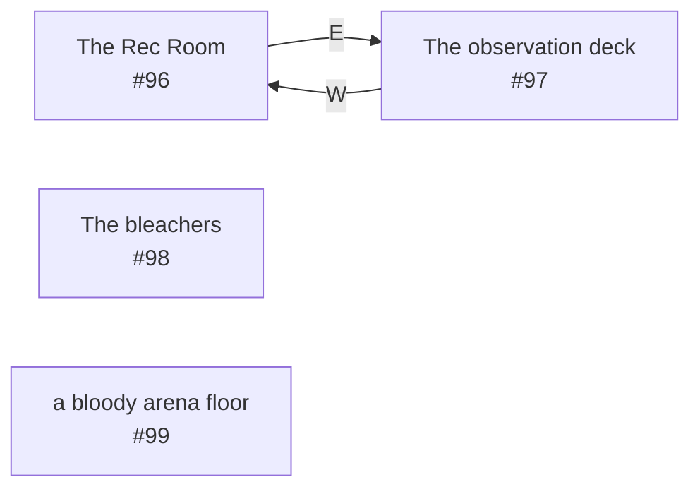

# Alathon The Arena  `(arena)`

[← back to world map](WORLD-MAP.md) · 4 rooms · vnums 96–99

Grey dashed nodes leave the area; green dashed nodes (`▸ Part X`) continue on another sub-map below.

## Map

## Rooms

| VNUM | Name | Exits |
|---:|---|---|
| 96 | The Rec Room | E→97 |
| 97 | The observation deck | W→96 |
| 98 | The bleachers | — |
| 99 | a bloody arena floor | — |

