# Andi The Astral Plane  `(astral)`

[← back to world map](WORLD-MAP.md) · 80 rooms · vnums 1900–1979

Dashed nodes are exits that leave this area.

```mermaid
graph LR
  R1900["The Bottom of the Rainbow<br/>#1900"]
  R1901["On the Rainbow<br/>#1901"]
  R1902["On the Rainbow<br/>#1902"]
  R1903["On the Rainbow<br/>#1903"]
  R1904["On the Rainbow<br/>#1904"]
  R1905["The Glowing Bridge at the Rainbow's End<br/>#1905"]
  R1906["The Astral Gate<br/>#1906"]
  R1907["Into the Astral Plane<br/>#1907"]
  R1908["Exploring the Astral Plane<br/>#1908"]
  R1909["Exploring the Astral Plane<br/>#1909"]
  R1910["Exploring the Astral Plane<br/>#1910"]
  R1911["Exploring the Astral Plane<br/>#1911"]
  R1912["Exploring the Astral Plane<br/>#1912"]
  R1913["Roaming the Astral Plane<br/>#1913"]
  R1914["Roaming the Astral Plane<br/>#1914"]
  R1915["Roaming the Astral Plane<br/>#1915"]
  R1916["Roaming the Astral Plane<br/>#1916"]
  R1917["Roaming the Astral Plane<br/>#1917"]
  R1918["Wandering the Astral Plane<br/>#1918"]
  R1919["Wandering the Astral Plane<br/>#1919"]
  R1920["Wandering the Astral Plane<br/>#1920"]
  R1921["Wandering the Astral Plane<br/>#1921"]
  R1922["Wandering the Astral Plane<br/>#1922"]
  R1923["Travelling the Astral Plane<br/>#1923"]
  R1924["Travelling the Astral Plane<br/>#1924"]
  R1925["Travelling the Astral Plane<br/>#1925"]
  R1926["Travelling the Astral Plane<br/>#1926"]
  R1927["Travelling the Astral Plane<br/>#1927"]
  R1928["Traversing the Astral Plane<br/>#1928"]
  R1929["Traversing the Astral Plane<br/>#1929"]
  R1930["Traversing the Astral Plane<br/>#1930"]
  R1931["Traversing the Astral Plane<br/>#1931"]
  R1932["Traversing the Astral Plane<br/>#1932"]
  R1933["Lost in the Astral Plane<br/>#1933"]
  R1934["Lost in the Astral Plane<br/>#1934"]
  R1935["Lost in the Astral Plane<br/>#1935"]
  R1936["Walking the Silvery Strand<br/>#1936"]
  R1937["Walking the Silvery Strand<br/>#1937"]
  R1938["Walking the Silvery Strand<br/>#1938"]
  R1939["Walking the Silvery Strand<br/>#1939"]
  R1940["Walking the Silvery Strand<br/>#1940"]
  R1941["Walking the Silvery Strand<br/>#1941"]
  R1942["Walking the Silvery Strand<br/>#1942"]
  R1943["Walking the Silvery Strand<br/>#1943"]
  R1944["Walking the Silvery Strand<br/>#1944"]
  R1945["Deep Within the Astral Plane<br/>#1945"]
  R1946["Deep Within the Astral Plane<br/>#1946"]
  R1947["Deep Within the Astral Plane<br/>#1947"]
  R1948["Deep Within the Astral Plane<br/>#1948"]
  R1949["Deep Within the Astral Plane<br/>#1949"]
  R1950["Inside the Githyanki Keep<br/>#1950"]
  R1951["A guard station<br/>#1951"]
  R1952["A grey road<br/>#1952"]
  R1953["A grey road<br/>#1953"]
  R1954["A grey road<br/>#1954"]
  R1955["A grey road<br/>#1955"]
  R1956["A grey road<br/>#1956"]
  R1957["A grey road<br/>#1957"]
  R1958["A grey road<br/>#1958"]
  R1959["A grey road<br/>#1959"]
  R1960["A grey road<br/>#1960"]
  R1961["A grey road<br/>#1961"]
  R1962["A small building<br/>#1962"]
  R1963["A small building<br/>#1963"]
  R1964["A large dwelling<br/>#1964"]
  R1965["The Githyanki Weaponry<br/>#1965"]
  R1966["The Forge<br/>#1966"]
  R1967["The Githyanki Armoury<br/>#1967"]
  R1968["Inside the furnace<br/>#1968"]
  R1969["A guard station<br/>#1969"]
  R1970["The cellblock<br/>#1970"]
  R1971["A cramped cell<br/>#1971"]
  R1972["A tiny cell<br/>#1972"]
  R1973["A large dwelling<br/>#1973"]
  R1974["South End of the Hall<br/>#1974"]
  R1975["North End of the Hall<br/>#1975"]
  R1976["The Altar Chamber<br/>#1976"]
  R1977["Before the Altar<br/>#1977"]
  R1978["A Gateway to the Underworld<br/>#1978"]
  R1979["Utter darkness and despair<br/>#1979"]
  R1900 -->|U| R1901
  R1900 -->|D| X1036
  R1901 -->|U| R1902
  R1901 -->|D| R1900
  R1902 -->|U| R1903
  R1902 -->|D| R1901
  R1903 -->|U| R1904
  R1903 -->|D| R1902
  R1904 -->|U| R1905
  R1904 -->|D| R1903
  R1905 -->|N| R1906
  R1905 -->|D| R1904
  R1906 -->|N| R1907
  R1906 -->|S| R1905
  R1907 -->|N| R1908
  R1907 -->|E| R1909
  R1907 -->|S| R1906
  R1907 -->|W| R1910
  R1907 -->|U| R1911
  R1907 -->|D| R1912
  R1908 -->|N| R1913
  R1908 -->|E| R1910
  R1908 -->|S| R1907
  R1908 -->|W| R1912
  R1908 -->|D| R1914
  R1909 -->|N| R1914
  R1909 -->|E| R1916
  R1909 -->|W| R1907
  R1909 -->|U| R1910
  R1909 -->|D| R1911
  R1910 -->|N| R1915
  R1910 -->|E| R1907
  R1910 -->|W| R1908
  R1910 -->|U| R1913
  R1910 -->|D| R1909
  R1911 -->|N| R1916
  R1911 -->|E| R1912
  R1911 -->|W| R1917
  R1911 -->|U| R1909
  R1911 -->|D| R1907
  R1912 -->|N| R1917
  R1912 -->|E| R1908
  R1912 -->|W| R1911
  R1912 -->|U| R1907
  R1912 -->|D| R1915
  R1913 -->|N| R1918
  R1913 -->|E| R1915
  R1913 -->|S| R1908
  R1913 -->|W| R1920
  R1913 -->|U| R1914
  R1913 -->|D| R1910
  R1914 -->|N| R1919
  R1914 -->|E| R1917
  R1914 -->|S| R1909
  R1914 -->|W| R1918
  R1914 -->|U| R1908
  R1914 -->|D| R1913
  R1915 -->|N| R1920
  R1915 -->|E| R1922
  R1915 -->|S| R1910
  R1915 -->|W| R1913
  R1915 -->|U| R1912
  R1915 -->|D| R1916
  R1916 -->|N| R1921
  R1916 -->|E| R1919
  R1916 -->|S| R1911
  R1916 -->|W| R1909
  R1916 -->|U| R1915
  R1916 -->|D| R1917
  R1917 -->|N| R1922
  R1917 -->|E| R1911
  R1917 -->|S| R1912
  R1917 -->|W| R1914
  R1917 -->|U| R1916
  R1917 -->|D| R1921
  R1918 -->|N| R1909
  R1918 -->|E| R1914
  R1918 -->|S| R1913
  R1918 -->|W| R1919
  R1918 -->|U| R1933
  R1918 -->|D| R1936
  R1919 -->|N| R1910
  R1919 -->|E| R1918
  R1919 -->|S| R1914
  R1919 -->|W| R1916
  R1919 -->|U| R1934
  R1919 -->|D| R1938
  R1920 -->|N| R1911
  R1920 -->|E| R1913
  R1920 -->|S| R1915
  R1920 -->|W| R1921
  R1920 -->|U| R1935
  R1920 -->|D| R1940
  R1921 -->|N| R1912
  R1921 -->|E| R1920
  R1921 -->|S| R1916
  R1921 -->|W| R1942
  R1921 -->|U| R1917
  R1921 -->|D| R1933
  R1922 -->|N| R1912
  R1922 -->|S| R1917
  R1922 -->|W| R1915
  R1922 -->|U| R1944
  R1922 -->|D| R1934
  R1923 -->|N| R1924
  R1923 -->|E| R1928
  R1923 -->|S| R1937
  R1923 -->|W| R1926
  R1923 -->|U| R1932
  R1923 -->|D| R1935
  R1924 -->|N| R1925
  R1924 -->|E| R1929
  R1924 -->|S| R1923
  R1924 -->|W| R1933
  R1924 -->|U| R1930
  R1924 -->|D| R1939
  R1925 -->|N| R1941
  R1925 -->|E| R1927
  R1925 -->|S| R1924
  R1925 -->|W| R1934
  R1925 -->|U| R1928
  R1925 -->|D| R1930
  R1926 -->|N| R1931
  R1926 -->|E| R1923
  R1926 -->|S| R1927
  R1926 -->|W| R1935
  R1926 -->|U| R1943
  R1926 -->|D| R1929
  R1927 -->|N| R1926
  R1927 -->|E| R1932
  R1927 -->|S| R1933
  R1927 -->|W| R1925
  R1927 -->|U| R1931
  R1927 -->|D| R1944
  R1928 -->|N| R1909
  R1928 -->|E| R1947
  R1928 -->|S| R1934
  R1928 -->|W| R1923
  R1928 -->|U| R1945
  R1928 -->|D| R1925
  R1929 -->|N| R1930
  R1929 -->|E| R1949
  R1929 -->|S| R1935
  R1929 -->|W| R1924
  R1929 -->|U| R1926
  R1929 -->|D| R1946
  R1930 -->|N| R1947
  R1930 -->|E| R1933
  R1930 -->|S| R1929
  R1930 -->|W| R1945
  R1930 -->|U| R1925
  R1930 -->|D| R1924
  R1931 -->|N| R1932
  R1931 -->|E| R1934
  R1931 -->|S| R1926
  R1931 -->|W| R1948
  R1931 -->|U| R1946
  R1931 -->|D| R1927
  R1932 -->|N| R1949
  R1932 -->|E| R1935
  R1932 -->|S| R1931
  R1932 -->|W| R1927
  R1932 -->|U| R1948
  R1932 -->|D| R1923
  R1933 -->|N| R1927
  R1933 -->|E| R1924
  R1933 -->|W| R1930
  R1933 -->|U| R1921
  R1933 -->|D| R1918
  R1934 -->|N| R1928
  R1934 -->|E| R1925
  R1934 -->|W| R1931
  R1934 -->|U| R1922
  R1934 -->|D| R1919
  R1935 -->|N| R1929
  R1935 -->|E| R1926
  R1935 -->|W| R1932
  R1935 -->|U| R1923
  R1935 -->|D| R1920
  R1936 -->|N| R1937
  R1936 -->|U| R1918
  R1937 -->|N| R1923
  R1937 -->|S| R1936
  R1938 -->|E| R1939
  R1938 -->|U| R1919
  R1939 -->|W| R1938
  R1939 -->|U| R1924
  R1940 -->|E| R1941
  R1940 -->|U| R1920
  R1941 -->|S| R1925
  R1941 -->|W| R1940
  R1942 -->|N| R1943
  R1942 -->|E| R1921
  R1943 -->|S| R1942
  R1943 -->|D| R1926
  R1944 -->|U| R1927
  R1944 -->|D| R1922
  R1945 -->|N| R1946
  R1945 -->|E| R1930
  R1945 -->|S| X0
  R1945 -->|W| R1949
  R1945 -->|U| R1950
  R1945 -->|D| R1928
  R1946 -->|N| R1933
  R1946 -->|E| X0
  R1946 -->|S| R1945
  R1946 -->|W| R1947
  R1946 -->|U| R1929
  R1946 -->|D| R1931
  R1947 -->|N| R1934
  R1947 -->|E| R1946
  R1947 -->|S| R1930
  R1947 -->|W| R1928
  R1947 -->|U| X0
  R1947 -->|D| R1948
  R1948 -->|N| R1935
  R1948 -->|E| R1931
  R1948 -->|S| R1949
  R1948 -->|W| X0
  R1948 -->|U| R1947
  R1948 -->|D| R1932
  R1949 -->|N| R1948
  R1949 -->|E| R1945
  R1949 -->|S| R1932
  R1949 -->|W| R1929
  R1949 -->|U| X0
  R1949 -->|D| X0
  R1950 -->|N| R1951
  R1950 -->|D| R1945
  R1951 -->|E| R1961
  R1951 -->|S| R1950
  R1951 -->|W| R1952
  R1952 -->|N| R1953
  R1952 -->|E| R1951
  R1953 -->|N| R1954
  R1953 -->|E| R1962
  R1953 -->|S| R1952
  R1953 -->|W| R1969
  R1954 -->|E| R1955
  R1954 -->|S| R1953
  R1955 -->|N| R1974
  R1955 -->|E| R1956
  R1955 -->|W| R1954
  R1956 -->|E| R1957
  R1956 -->|S| R1964
  R1956 -->|W| R1955
  R1957 -->|N| R1973
  R1957 -->|S| R1958
  R1957 -->|W| R1956
  R1958 -->|N| R1957
  R1958 -->|E| R1967
  R1958 -->|S| R1959
  R1959 -->|N| R1958
  R1959 -->|S| R1960
  R1960 -->|N| R1959
  R1960 -->|E| R1965
  R1960 -->|W| R1961
  R1961 -->|N| R1963
  R1961 -->|E| R1960
  R1961 -->|W| R1951
  R1962 -->|W| R1953
  R1963 -->|S| R1961
  R1964 -->|N| R1956
  R1965 -->|N| R1966
  R1965 -->|W| R1960
  R1966 -->|N| R1967
  R1966 -->|E| R1968
  R1966 -->|S| R1965
  R1967 -->|S| R1966
  R1967 -->|W| R1958
  R1968 -->|N| R1968
  R1968 -->|E| X0
  R1968 -->|S| R1968
  R1968 -->|W| R1966
  R1969 -->|E| R1953
  R1969 -->|W| R1970
  R1970 -->|N| R1971
  R1970 -->|E| R1969
  R1970 -->|S| R1972
  R1971 -->|S| R1970
  R1972 -->|N| R1970
  R1973 -->|S| R1957
  R1974 -->|N| R1975
  R1974 -->|S| R1955
  R1975 -->|N| R1976
  R1975 -->|S| R1974
  R1976 -->|N| R1977
  R1976 -->|S| R1975
  R1977 -->|S| R1976
  R1977 -->|D| R1978
  R1978 -->|U| R1977
  R1978 -->|D| R1979
  X1036["In the air ...<br/>air #1036"]:::ext
  X0["?? broken<br/>#0"]:::ext
  classDef ext fill:#222,stroke:#888,color:#bbb,stroke-dasharray:3 3;
```

## Rooms

| VNUM | Name | Exits |
|---:|---|---|
| 1900 | The Bottom of the Rainbow | U→1901 D→1036 |
| 1901 | On the Rainbow | U→1902 D→1900 |
| 1902 | On the Rainbow | U→1903 D→1901 |
| 1903 | On the Rainbow | U→1904 D→1902 |
| 1904 | On the Rainbow | U→1905 D→1903 |
| 1905 | The Glowing Bridge at the Rainbow's End | N→1906 D→1904 |
| 1906 | The Astral Gate | N→1907 S→1905 |
| 1907 | Into the Astral Plane | N→1908 E→1909 S→1906 W→1910 U→1911 D→1912 |
| 1908 | Exploring the Astral Plane | N→1913 E→1910 S→1907 W→1912 D→1914 |
| 1909 | Exploring the Astral Plane | N→1914 E→1916 W→1907 U→1910 D→1911 |
| 1910 | Exploring the Astral Plane | N→1915 E→1907 W→1908 U→1913 D→1909 |
| 1911 | Exploring the Astral Plane | N→1916 E→1912 W→1917 U→1909 D→1907 |
| 1912 | Exploring the Astral Plane | N→1917 E→1908 W→1911 U→1907 D→1915 |
| 1913 | Roaming the Astral Plane | N→1918 E→1915 S→1908 W→1920 U→1914 D→1910 |
| 1914 | Roaming the Astral Plane | N→1919 E→1917 S→1909 W→1918 U→1908 D→1913 |
| 1915 | Roaming the Astral Plane | N→1920 E→1922 S→1910 W→1913 U→1912 D→1916 |
| 1916 | Roaming the Astral Plane | N→1921 E→1919 S→1911 W→1909 U→1915 D→1917 |
| 1917 | Roaming the Astral Plane | N→1922 E→1911 S→1912 W→1914 U→1916 D→1921 |
| 1918 | Wandering the Astral Plane | N→1909 E→1914 S→1913 W→1919 U→1933 D→1936 |
| 1919 | Wandering the Astral Plane | N→1910 E→1918 S→1914 W→1916 U→1934 D→1938 |
| 1920 | Wandering the Astral Plane | N→1911 E→1913 S→1915 W→1921 U→1935 D→1940 |
| 1921 | Wandering the Astral Plane | N→1912 E→1920 S→1916 W→1942 U→1917 D→1933 |
| 1922 | Wandering the Astral Plane | N→1912 S→1917 W→1915 U→1944 D→1934 |
| 1923 | Travelling the Astral Plane | N→1924 E→1928 S→1937 W→1926 U→1932 D→1935 |
| 1924 | Travelling the Astral Plane | N→1925 E→1929 S→1923 W→1933 U→1930 D→1939 |
| 1925 | Travelling the Astral Plane | N→1941 E→1927 S→1924 W→1934 U→1928 D→1930 |
| 1926 | Travelling the Astral Plane | N→1931 E→1923 S→1927 W→1935 U→1943 D→1929 |
| 1927 | Travelling the Astral Plane | N→1926 E→1932 S→1933 W→1925 U→1931 D→1944 |
| 1928 | Traversing the Astral Plane | N→1909 E→1947 S→1934 W→1923 U→1945 D→1925 |
| 1929 | Traversing the Astral Plane | N→1930 E→1949 S→1935 W→1924 U→1926 D→1946 |
| 1930 | Traversing the Astral Plane | N→1947 E→1933 S→1929 W→1945 U→1925 D→1924 |
| 1931 | Traversing the Astral Plane | N→1932 E→1934 S→1926 W→1948 U→1946 D→1927 |
| 1932 | Traversing the Astral Plane | N→1949 E→1935 S→1931 W→1927 U→1948 D→1923 |
| 1933 | Lost in the Astral Plane | N→1927 E→1924 W→1930 U→1921 D→1918 |
| 1934 | Lost in the Astral Plane | N→1928 E→1925 W→1931 U→1922 D→1919 |
| 1935 | Lost in the Astral Plane | N→1929 E→1926 W→1932 U→1923 D→1920 |
| 1936 | Walking the Silvery Strand | N→1937 U→1918 |
| 1937 | Walking the Silvery Strand | N→1923 S→1936 |
| 1938 | Walking the Silvery Strand | E→1939 U→1919 |
| 1939 | Walking the Silvery Strand | W→1938 U→1924 |
| 1940 | Walking the Silvery Strand | E→1941 U→1920 |
| 1941 | Walking the Silvery Strand | S→1925 W→1940 |
| 1942 | Walking the Silvery Strand | N→1943 E→1921 |
| 1943 | Walking the Silvery Strand | S→1942 D→1926 |
| 1944 | Walking the Silvery Strand | U→1927 D→1922 |
| 1945 | Deep Within the Astral Plane | N→1946 E→1930 S→0 W→1949 U→1950 D→1928 |
| 1946 | Deep Within the Astral Plane | N→1933 E→0 S→1945 W→1947 U→1929 D→1931 |
| 1947 | Deep Within the Astral Plane | N→1934 E→1946 S→1930 W→1928 U→0 D→1948 |
| 1948 | Deep Within the Astral Plane | N→1935 E→1931 S→1949 W→0 U→1947 D→1932 |
| 1949 | Deep Within the Astral Plane | N→1948 E→1945 S→1932 W→1929 U→0 D→0 |
| 1950 | Inside the Githyanki Keep | N→1951 D→1945 |
| 1951 | A guard station | E→1961 S→1950 W→1952 |
| 1952 | A grey road | N→1953 E→1951 |
| 1953 | A grey road | N→1954 E→1962 S→1952 W→1969 |
| 1954 | A grey road | E→1955 S→1953 |
| 1955 | A grey road | N→1974 E→1956 W→1954 |
| 1956 | A grey road | E→1957 S→1964 W→1955 |
| 1957 | A grey road | N→1973 S→1958 W→1956 |
| 1958 | A grey road | N→1957 E→1967 S→1959 |
| 1959 | A grey road | N→1958 S→1960 |
| 1960 | A grey road | N→1959 E→1965 W→1961 |
| 1961 | A grey road | N→1963 E→1960 W→1951 |
| 1962 | A small building | W→1953 |
| 1963 | A small building | S→1961 |
| 1964 | A large dwelling | N→1956 |
| 1965 | The Githyanki Weaponry | N→1966 W→1960 |
| 1966 | The Forge | N→1967 E→1968 S→1965 |
| 1967 | The Githyanki Armoury | S→1966 W→1958 |
| 1968 | Inside the furnace | N→1968 E→0 S→1968 W→1966 |
| 1969 | A guard station | E→1953 W→1970 |
| 1970 | The cellblock | N→1971 E→1969 S→1972 |
| 1971 | A cramped cell | S→1970 |
| 1972 | A tiny cell | N→1970 |
| 1973 | A large dwelling | S→1957 |
| 1974 | South End of the Hall | N→1975 S→1955 |
| 1975 | North End of the Hall | N→1976 S→1974 |
| 1976 | The Altar Chamber | N→1977 S→1975 |
| 1977 | Before the Altar | S→1976 D→1978 |
| 1978 | A Gateway to the Underworld | U→1977 D→1979 |
| 1979 | Utter darkness and despair | — |

