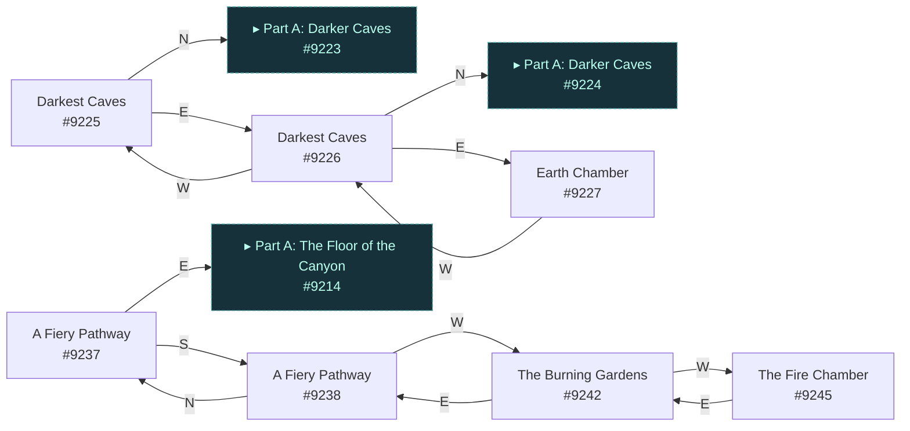
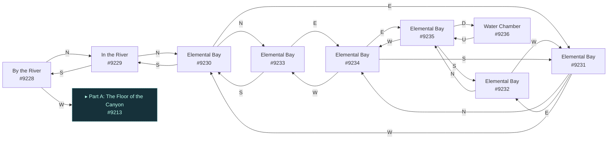
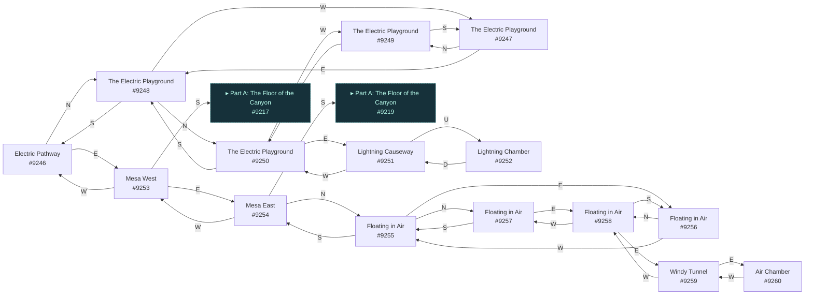

# Raff Elemental Canyon  `(canyon)`

[← back to world map](WORLD-MAP.md) · 55 rooms · vnums 9201–9260

Grey dashed nodes leave the area; green dashed nodes (`▸ Part X`) continue on another sub-map below.

_This area is split into 4 sub-maps for legibility._

## Map — Part A (24 rooms: #9201–#9224)

```mermaid
graph LR
  R9201["A Mountain Path<br/>#9201"]
  R9202["A Mountain Path<br/>#9202"]
  R9203["Mountainside Tombs<br/>#9203"]
  R9204["A Blind Curve on the Mountain Path.<br/>#9204"]
  R9205["Vista<br/>#9205"]
  R9206["The Overlook<br/>#9206"]
  R9207["Entrance to Elemental Canyon<br/>#9207"]
  R9208["The Floor of the Canyon<br/>#9208"]
  R9209["Elemental Gateway<br/>#9209"]
  R9210["The Floor of the Canyon<br/>#9210"]
  R9211["The Floor of the Canyon<br/>#9211"]
  R9212["The Floor of the Canyon<br/>#9212"]
  R9213["The Floor of the Canyon<br/>#9213"]
  R9214["The Floor of the Canyon<br/>#9214"]
  R9215["The Floor of the Canyon<br/>#9215"]
  R9216["The Floor of the Canyon<br/>#9216"]
  R9217["The Floor of the Canyon<br/>#9217"]
  R9218["The Floor of the Canyon<br/>#9218"]
  R9219["The Floor of the Canyon<br/>#9219"]
  R9220["Dark Cave<br/>#9220"]
  R9221["Darker Caves<br/>#9221"]
  R9222["Darker Caves<br/>#9222"]
  R9223["Darker Caves<br/>#9223"]
  R9224["Darker Caves<br/>#9224"]
  R9201 -->|N| X5267
  R9201 -->|U| R9202
  R9202 -->|U| R9203
  R9202 -->|D| R9201
  R9203 -->|U| R9204
  R9203 -->|D| R9202
  R9204 -->|U| R9205
  R9204 -->|D| R9203
  R9205 -->|N| R9206
  R9205 -->|D| R9204
  R9206 -->|S| R9205
  R9206 -->|D| R9207
  R9207 -->|N| R9209
  R9207 -->|U| R9206
  R9208 -->|N| R9211
  R9208 -->|E| R9209
  R9209 -->|N| R9212
  R9209 -->|E| R9210
  R9209 -->|S| R9207
  R9209 -->|W| R9208
  R9210 -->|N| R9213
  R9210 -->|E| R9220
  R9210 -->|W| R9209
  R9211 -->|N| R9214
  R9211 -->|E| R9212
  R9211 -->|S| R9208
  R9212 -->|N| R9215
  R9212 -->|E| R9213
  R9212 -->|S| R9209
  R9212 -->|W| R9211
  R9213 -->|N| R9216
  R9213 -->|E| X9228
  R9213 -->|S| R9210
  R9213 -->|W| R9212
  R9214 -->|N| R9217
  R9214 -->|E| R9215
  R9214 -->|S| R9211
  R9214 -->|W| X9237
  R9215 -->|N| R9218
  R9215 -->|E| R9216
  R9215 -->|S| R9212
  R9215 -->|W| R9214
  R9216 -->|N| R9219
  R9216 -->|S| R9213
  R9216 -->|W| R9215
  R9217 -->|N| X9253
  R9217 -->|E| R9218
  R9217 -->|S| R9214
  R9218 -->|E| R9219
  R9218 -->|S| R9215
  R9218 -->|W| R9217
  R9219 -->|N| X9254
  R9219 -->|S| R9216
  R9219 -->|W| R9218
  R9220 -->|E| R9221
  R9220 -->|W| R9210
  R9221 -->|E| R9222
  R9221 -->|S| R9223
  R9221 -->|W| R9220
  R9222 -->|S| R9224
  R9222 -->|W| R9221
  R9223 -->|N| R9221
  R9223 -->|E| R9224
  R9223 -->|S| X9225
  R9224 -->|N| R9222
  R9224 -->|S| X9226
  R9224 -->|W| R9223
  X5267["A valley in the dark dwarf forest<br/>thalos #5267"]:::ext
  X9228["▸ Part C: By the River<br/>#9228"]:::part
  X9237["▸ Part B: A Fiery Pathway<br/>#9237"]:::part
  X9253["▸ Part D: Mesa West<br/>#9253"]:::part
  X9254["▸ Part D: Mesa East<br/>#9254"]:::part
  X9225["▸ Part B: Darkest Caves<br/>#9225"]:::part
  X9226["▸ Part B: Darkest Caves<br/>#9226"]:::part
  classDef ext fill:#222,stroke:#888,color:#bbb,stroke-dasharray:3 3;
  classDef part fill:#16313a,stroke:#5aa,color:#bfe,stroke-dasharray:4 2;
```

## Map — Part B (7 rooms: #9225–#9245)

## Map — Part C (9 rooms: #9228–#9236)

## Map — Part D (15 rooms: #9246–#9260)

## Rooms

| VNUM | Name | Exits |
|---:|---|---|
| 9201 | A Mountain Path | N→5267 U→9202 |
| 9202 | A Mountain Path | U→9203 D→9201 |
| 9203 | Mountainside Tombs | U→9204 D→9202 |
| 9204 | A Blind Curve on the Mountain Path. | U→9205 D→9203 |
| 9205 | Vista | N→9206 D→9204 |
| 9206 | The Overlook | S→9205 D→9207 |
| 9207 | Entrance to Elemental Canyon | N→9209 U→9206 |
| 9208 | The Floor of the Canyon | N→9211 E→9209 |
| 9209 | Elemental Gateway | N→9212 E→9210 S→9207 W→9208 |
| 9210 | The Floor of the Canyon | N→9213 E→9220 W→9209 |
| 9211 | The Floor of the Canyon | N→9214 E→9212 S→9208 |
| 9212 | The Floor of the Canyon | N→9215 E→9213 S→9209 W→9211 |
| 9213 | The Floor of the Canyon | N→9216 E→9228 S→9210 W→9212 |
| 9214 | The Floor of the Canyon | N→9217 E→9215 S→9211 W→9237 |
| 9215 | The Floor of the Canyon | N→9218 E→9216 S→9212 W→9214 |
| 9216 | The Floor of the Canyon | N→9219 S→9213 W→9215 |
| 9217 | The Floor of the Canyon | N→9253 E→9218 S→9214 |
| 9218 | The Floor of the Canyon | E→9219 S→9215 W→9217 |
| 9219 | The Floor of the Canyon | N→9254 S→9216 W→9218 |
| 9220 | Dark Cave | E→9221 W→9210 |
| 9221 | Darker Caves | E→9222 S→9223 W→9220 |
| 9222 | Darker Caves | S→9224 W→9221 |
| 9223 | Darker Caves | N→9221 E→9224 S→9225 |
| 9224 | Darker Caves | N→9222 S→9226 W→9223 |
| 9225 | Darkest Caves | N→9223 E→9226 |
| 9226 | Darkest Caves | N→9224 E→9227 W→9225 |
| 9227 | Earth Chamber | W→9226 |
| 9228 | By the River | N→9229 W→9213 |
| 9229 | In the River | N→9230 S→9228 |
| 9230 | Elemental Bay | N→9233 E→9231 S→9229 |
| 9231 | Elemental Bay | N→9234 E→9232 W→9230 |
| 9232 | Elemental Bay | N→9235 W→9231 |
| 9233 | Elemental Bay | E→9234 S→9230 |
| 9234 | Elemental Bay | E→9235 S→9231 W→9233 |
| 9235 | Elemental Bay | S→9232 W→9234 D→9236 |
| 9236 | Water Chamber | U→9235 |
| 9237 | A Fiery Pathway | E→9214 S→9238 |
| 9238 | A Fiery Pathway | N→9237 W→9242 |
| 9242 | The Burning Gardens | E→9238 W→9245 |
| 9245 | The Fire Chamber | E→9242 |
| 9246 | Electric Pathway | N→9248 E→9253 |
| 9247 | The Electric Playground | N→9249 E→9248 |
| 9248 | The Electric Playground | N→9250 S→9246 W→9247 |
| 9249 | The Electric Playground | E→9250 S→9247 |
| 9250 | The Electric Playground | E→9251 S→9248 W→9249 |
| 9251 | Lightning Causeway | W→9250 U→9252 |
| 9252 | Lightning Chamber | D→9251 |
| 9253 | Mesa West | E→9254 S→9217 W→9246 |
| 9254 | Mesa East | N→9255 S→9219 W→9253 |
| 9255 | Floating in Air | N→9257 E→9256 S→9254 |
| 9256 | Floating in Air | N→9258 W→9255 |
| 9257 | Floating in Air | E→9258 S→9255 |
| 9258 | Floating in Air | E→9259 S→9256 W→9257 |
| 9259 | Windy Tunnel | E→9260 W→9258 |
| 9260 | Air Chamber | W→9259 |

