# Raff Dwarven Catacombs  `(catacomb)`

[← back to world map](../WORLD-MAP.md) · 69 rooms · vnums 2001–2069

Dashed nodes are exits that leave this area.

```mermaid
graph LR
  R2001["North entrance to the catacombs<br/>#2001"]
  R2002["North/south tunnel<br/>#2002"]
  R2003["Weapon training area<br/>#2003"]
  R2004["Prayer training area<br/>#2004"]
  R2005["Junction of hallways<br/>#2005"]
  R2006["Hallway<br/>#2006"]
  R2007["Intersection<br/>#2007"]
  R2008["Pages' sleeping quarters<br/>#2008"]
  R2009["Templar Knights sleeping quarters<br/>#2009"]
  R2010["N/S hallway<br/>#2010"]
  R2011["A Middle-aged templar's room<br/>#2011"]
  R2012["Humid, damp tunnel<br/>#2012"]
  R2013["Administration room<br/>#2013"]
  R2014["N/S hallway<br/>#2014"]
  R2015["Mid-level leader's room<br/>#2015"]
  R2016["Mess hall<br/>#2016"]
  R2017["N/S hallway<br/>#2017"]
  R2018["High officer's room<br/>#2018"]
  R2019["Mossy intersection<br/>#2019"]
  R2020["The holy grove<br/>#2020"]
  R2021["The holy grove<br/>#2021"]
  R2022["The holy grove<br/>#2022"]
  R2023["Mess hall<br/>#2023"]
  R2024["End of a hallway<br/>#2024"]
  R2025["Grand Templar's room<br/>#2025"]
  R2026["Very dark passage<br/>#2026"]
  R2027["The holy grove<br/>#2027"]
  R2028["The holy grove<br/>#2028"]
  R2029["Very dark caveway<br/>#2029"]
  R2030["Deep within the catacombs<br/>#2030"]
  R2031["Very dark cavern<br/>#2031"]
  R2032["The holy place<br/>#2032"]
  R2033["Misty passageway<br/>#2033"]
  R2034["Intersection of caverns<br/>#2034"]
  R2035["Entrance to the burial grounds<br/>#2035"]
  R2036["The burial grounds<br/>#2036"]
  R2037["The burial grounds<br/>#2037"]
  R2038["The burial grounds<br/>#2038"]
  R2039["New graves<br/>#2039"]
  R2040["Misty cavern<br/>#2040"]
  R2041["Misty cavern<br/>#2041"]
  R2042["Mist cavern<br/>#2042"]
  R2043["Waterfall of mist<br/>#2043"]
  R2044["Huge multicolored tunnel<br/>#2044"]
  R2045["Desolate ruins<br/>#2045"]
  R2046["Curators place<br/>#2046"]
  R2047["Fresh graves<br/>#2047"]
  R2048["Twisty cavern<br/>#2048"]
  R2049["Striped tunnel<br/>#2049"]
  R2050["Prism cave<br/>#2050"]
  R2051["Ruined monument<br/>#2051"]
  R2052["Basement<br/>#2052"]
  R2053["Fresh graves<br/>#2053"]
  R2054["Southern gate<br/>#2054"]
  R2055["Scene of ghastly horror<br/>#2055"]
  R2056["Twisty passage<br/>#2056"]
  R2057["Cross of caverns<br/>#2057"]
  R2058["Lonely tunnel<br/>#2058"]
  R2059["Lonely tunnel<br/>#2059"]
  R2060["Bend in the lonely tunnel<br/>#2060"]
  R2061["Lonely tunnel<br/>#2061"]
  R2062["Intersection<br/>#2062"]
  R2063["Tunnel<br/>#2063"]
  R2064["Tunnel<br/>#2064"]
  R2065["Southern entrance to the catacombs<br/>#2065"]
  R2066["Unknown passage<br/>#2066"]
  R2067["Unknown passage<br/>#2067"]
  R2068["Unknown passage<br/>#2068"]
  R2069["Unknown passage<br/>#2069"]
  R2001 -->|S| R2002
  R2001 -->|U| X6524
  R2002 -->|N| R2001
  R2002 -->|S| R2007
  R2003 -->|E| R2004
  R2003 -->|S| R2008
  R2004 -->|E| R2005
  R2004 -->|W| R2003
  R2005 -->|E| R2006
  R2005 -->|S| R2010
  R2005 -->|W| R2004
  R2006 -->|E| R2007
  R2006 -->|W| R2005
  R2007 -->|N| R2002
  R2007 -->|S| R2012
  R2007 -->|W| R2006
  R2008 -->|N| R2003
  R2008 -->|E| R2009
  R2009 -->|S| R2013
  R2009 -->|W| R2008
  R2010 -->|N| R2005
  R2010 -->|E| R2011
  R2010 -->|S| R2014
  R2011 -->|W| R2010
  R2012 -->|N| R2007
  R2012 -->|S| R2019
  R2013 -->|N| R2009
  R2013 -->|S| R2016
  R2013 -->|W| R2069
  R2014 -->|N| R2010
  R2014 -->|E| R2015
  R2014 -->|S| R2017
  R2015 -->|W| R2014
  R2016 -->|N| R2013
  R2016 -->|S| R2023
  R2017 -->|N| R2014
  R2017 -->|E| R2018
  R2017 -->|S| R2024
  R2018 -->|W| R2017
  R2019 -->|N| R2012
  R2019 -->|E| R2020
  R2019 -->|S| R2026
  R2020 -->|E| R2021
  R2020 -->|W| R2019
  R2021 -->|N| R2068
  R2021 -->|E| R2022
  R2021 -->|S| R2027
  R2021 -->|W| R2020
  R2022 -->|S| R2028
  R2022 -->|W| R2021
  R2023 -->|N| R2016
  R2023 -->|E| R2024
  R2024 -->|N| R2017
  R2024 -->|E| R2025
  R2024 -->|W| R2023
  R2025 -->|W| R2024
  R2026 -->|N| R2019
  R2026 -->|S| R2030
  R2027 -->|N| R2021
  R2027 -->|E| R2028
  R2028 -->|N| R2022
  R2028 -->|S| R2032
  R2028 -->|W| R2027
  R2029 -->|E| R2030
  R2029 -->|W| R2033
  R2030 -->|N| R2026
  R2030 -->|E| R2031
  R2030 -->|W| R2029
  R2031 -->|S| R2034
  R2031 -->|W| R2030
  R2032 -->|N| R2028
  R2033 -->|N| R2029
  R2033 -->|S| R2042
  R2034 -->|N| R2031
  R2034 -->|E| R2035
  R2034 -->|S| R2044
  R2035 -->|E| R2036
  R2035 -->|W| R2034
  R2036 -->|E| R2037
  R2036 -->|S| R2045
  R2036 -->|W| R2035
  R2037 -->|E| R2038
  R2037 -->|W| R2036
  R2038 -->|E| R2039
  R2038 -->|W| R2037
  R2039 -->|S| R2047
  R2039 -->|W| R2038
  R2040 -->|E| R2041
  R2040 -->|S| R2048
  R2041 -->|E| R2042
  R2041 -->|W| R2040
  R2042 -->|N| R2033
  R2042 -->|E| R2043
  R2042 -->|W| R2041
  R2043 -->|W| R2042
  R2044 -->|N| R2034
  R2044 -->|S| R2050
  R2045 -->|S| R2051
  R2046 -->|E| R2047
  R2046 -->|D| R2052
  R2047 -->|N| R2039
  R2047 -->|S| R2053
  R2047 -->|W| R2046
  R2048 -->|N| R2040
  R2048 -->|E| R2049
  R2048 -->|S| R2056
  R2049 -->|E| R2050
  R2049 -->|W| R2048
  R2050 -->|N| R2044
  R2050 -->|E| R2058
  R2050 -->|S| R2057
  R2050 -->|W| R2049
  R2051 -->|N| R2045
  R2051 -->|E| R2052
  R2051 -->|S| R2054
  R2052 -->|W| R2051
  R2052 -->|U| R2046
  R2053 -->|N| R2047
  R2053 -->|S| R2055
  R2054 -->|N| R2051
  R2054 -->|E| R2066
  R2054 -->|S| R2059
  R2055 -->|N| R2053
  R2055 -->|S| R2062
  R2056 -->|N| R2048
  R2056 -->|E| R2057
  R2057 -->|N| R2050
  R2057 -->|S| R2066
  R2057 -->|W| R2056
  R2058 -->|E| R2059
  R2058 -->|W| R2050
  R2059 -->|N| R2054
  R2059 -->|E| R2060
  R2059 -->|W| R2058
  R2060 -->|S| R2061
  R2060 -->|W| R2059
  R2061 -->|N| R2060
  R2061 -->|E| R2062
  R2062 -->|N| R2055
  R2062 -->|S| R2063
  R2062 -->|W| R2061
  R2063 -->|N| R2062
  R2063 -->|S| R2064
  R2064 -->|N| R2063
  R2064 -->|S| R2065
  R2065 -->|N| R2064
  R2065 -->|U| X6527
  R2066 -->|E| R2067
  R2066 -->|S| R2068
  R2067 -->|S| R2069
  R2067 -->|W| R2066
  R2068 -->|N| R2066
  R2068 -->|E| R2069
  R2069 -->|N| R2067
  R2069 -->|W| R2068
  X6524["Back of Barracks<br/>dwarven #6524"]:::ext
  X6527["Wine cellar<br/>dwarven #6527"]:::ext
  classDef ext fill:#222,stroke:#888,color:#bbb,stroke-dasharray:3 3;
```

## Rooms

| VNUM | Name | Exits |
|---:|---|---|
| 2001 | North entrance to the catacombs | S→2002 U→6524 |
| 2002 | North/south tunnel | N→2001 S→2007 |
| 2003 | Weapon training area | E→2004 S→2008 |
| 2004 | Prayer training area | E→2005 W→2003 |
| 2005 | Junction of hallways | E→2006 S→2010 W→2004 |
| 2006 | Hallway | E→2007 W→2005 |
| 2007 | Intersection | N→2002 S→2012 W→2006 |
| 2008 | Pages' sleeping quarters | N→2003 E→2009 |
| 2009 | Templar Knights sleeping quarters | S→2013 W→2008 |
| 2010 | N/S hallway | N→2005 E→2011 S→2014 |
| 2011 | A Middle-aged templar's room | W→2010 |
| 2012 | Humid, damp tunnel | N→2007 S→2019 |
| 2013 | Administration room | N→2009 S→2016 W→2069 |
| 2014 | N/S hallway | N→2010 E→2015 S→2017 |
| 2015 | Mid-level leader's room | W→2014 |
| 2016 | Mess hall | N→2013 S→2023 |
| 2017 | N/S hallway | N→2014 E→2018 S→2024 |
| 2018 | High officer's room | W→2017 |
| 2019 | Mossy intersection | N→2012 E→2020 S→2026 |
| 2020 | The holy grove | E→2021 W→2019 |
| 2021 | The holy grove | N→2068 E→2022 S→2027 W→2020 |
| 2022 | The holy grove | S→2028 W→2021 |
| 2023 | Mess hall | N→2016 E→2024 |
| 2024 | End of a hallway | N→2017 E→2025 W→2023 |
| 2025 | Grand Templar's room | W→2024 |
| 2026 | Very dark passage | N→2019 S→2030 |
| 2027 | The holy grove | N→2021 E→2028 |
| 2028 | The holy grove | N→2022 S→2032 W→2027 |
| 2029 | Very dark caveway | E→2030 W→2033 |
| 2030 | Deep within the catacombs | N→2026 E→2031 W→2029 |
| 2031 | Very dark cavern | S→2034 W→2030 |
| 2032 | The holy place | N→2028 |
| 2033 | Misty passageway | N→2029 S→2042 |
| 2034 | Intersection of caverns | N→2031 E→2035 S→2044 |
| 2035 | Entrance to the burial grounds | E→2036 W→2034 |
| 2036 | The burial grounds | E→2037 S→2045 W→2035 |
| 2037 | The burial grounds | E→2038 W→2036 |
| 2038 | The burial grounds | E→2039 W→2037 |
| 2039 | New graves | S→2047 W→2038 |
| 2040 | Misty cavern | E→2041 S→2048 |
| 2041 | Misty cavern | E→2042 W→2040 |
| 2042 | Mist cavern | N→2033 E→2043 W→2041 |
| 2043 | Waterfall of mist | W→2042 |
| 2044 | Huge multicolored tunnel | N→2034 S→2050 |
| 2045 | Desolate ruins | S→2051 |
| 2046 | Curators place | E→2047 D→2052 |
| 2047 | Fresh graves | N→2039 S→2053 W→2046 |
| 2048 | Twisty cavern | N→2040 E→2049 S→2056 |
| 2049 | Striped tunnel | E→2050 W→2048 |
| 2050 | Prism cave | N→2044 E→2058 S→2057 W→2049 |
| 2051 | Ruined monument | N→2045 E→2052 S→2054 |
| 2052 | Basement | W→2051 U→2046 |
| 2053 | Fresh graves | N→2047 S→2055 |
| 2054 | Southern gate | N→2051 E→2066 S→2059 |
| 2055 | Scene of ghastly horror | N→2053 S→2062 |
| 2056 | Twisty passage | N→2048 E→2057 |
| 2057 | Cross of caverns | N→2050 S→2066 W→2056 |
| 2058 | Lonely tunnel | E→2059 W→2050 |
| 2059 | Lonely tunnel | N→2054 E→2060 W→2058 |
| 2060 | Bend in the lonely tunnel | S→2061 W→2059 |
| 2061 | Lonely tunnel | N→2060 E→2062 |
| 2062 | Intersection | N→2055 S→2063 W→2061 |
| 2063 | Tunnel | N→2062 S→2064 |
| 2064 | Tunnel | N→2063 S→2065 |
| 2065 | Southern entrance to the catacombs | N→2064 U→6527 |
| 2066 | Unknown passage | E→2067 S→2068 |
| 2067 | Unknown passage | S→2069 W→2066 |
| 2068 | Unknown passage | N→2066 E→2069 |
| 2069 | Unknown passage | N→2067 W→2068 |

