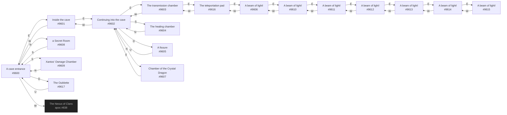

# Valgarv Cith Deux Headquarters  `(cithdeux)`

[← back to world map](../WORLD-MAP.md) · 18 rooms · vnums 9600–9617

Dashed nodes are exits that leave this area.

## Rooms

| VNUM | Name | Exits |
|---:|---|---|
| 9600 | A cave entrance | N→9608 E→9601 S→9609 W→838 D→9617 |
| 9601 | Inside the cave | E→9602 W→9600 |
| 9602 | Continuing into the cave | N→9607 E→9603 S→9604 W→9601 D→9605 |
| 9603 | The transmission chamber | E→9616 W→9602 |
| 9604 | The healing chamber | N→9602 |
| 9605 | A fissure | U→9602 |
| 9606 | A beam of light! | E→9610 W→9616 |
| 9607 | Chamber of the Crystal Dragon | S→9602 |
| 9608 | a Secret Room | S→9600 |
| 9609 | Xantos' Ownage Chamber | N→9600 |
| 9610 | A beam of light! | E→9611 W→9606 |
| 9611 | A beam of light! | E→9612 W→9610 |
| 9612 | A beam of light! | E→9613 W→9611 |
| 9613 | A beam of light! | E→9614 W→9612 |
| 9614 | A beam of light! | E→9615 W→9613 |
| 9615 | A beam of light! | W→9614 |
| 9616 | The teleportation pad | E→9606 W→9603 |
| 9617 | The Oubliette | U→9600 |

