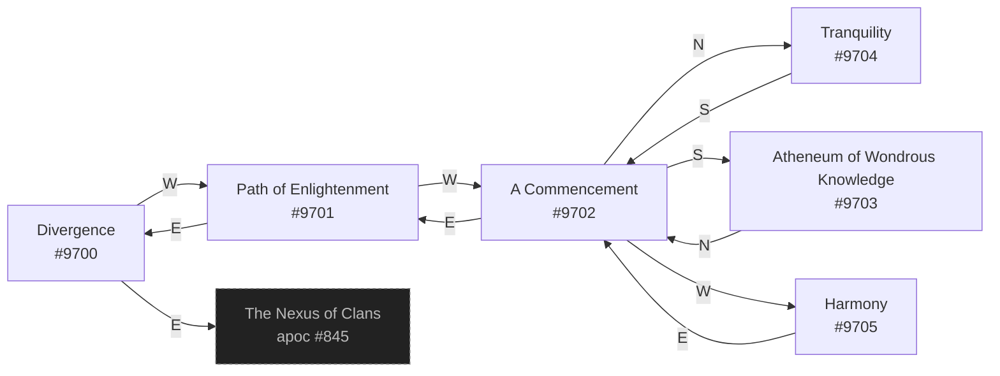

# Dizz Divergent Headquarters  `(divergent)`

[← back to world map](WORLD-MAP.md) · 6 rooms · vnums 9700–9705

Dashed nodes are exits that leave this area.

## Rooms

| VNUM | Name | Exits |
|---:|---|---|
| 9700 | Divergence | E→845 W→9701 |
| 9701 | Path of Enlightenment | E→9700 W→9702 |
| 9702 | A Commencement | N→9704 E→9701 S→9703 W→9705 |
| 9703 | [Atheneum of Wondrous Knowledge] | N→9702 |
| 9704 | Tranquility | S→9702 |
| 9705 | Harmony | E→9702 |

