# Wench Dragon Tower  `(draconia)`

[← back to world map](WORLD-MAP.md) · 44 rooms · vnums 2201–2244

Dashed nodes are exits that leave this area.

```mermaid
graph LR
  R2201["The Tower Gates<br/>#2201"]
  R2202["The Foyer<br/>#2202"]
  R2203["Hallway<br/>#2203"]
  R2204["Hallway<br/>#2204"]
  R2205["Nursery<br/>#2205"]
  R2206["Storage Room<br/>#2206"]
  R2207["End of the Hallway<br/>#2207"]
  R2208["Guardian's Room<br/>#2208"]
  R2209["The Treasure Room<br/>#2209"]
  R2210["The Second Floor<br/>#2210"]
  R2211["The Court<br/>#2211"]
  R2212["Hall O' Pleasure<br/>#2212"]
  R2213["The Court<br/>#2213"]
  R2214["The Library<br/>#2214"]
  R2215["The Sanctum<br/>#2215"]
  R2216["The Court Ends<br/>#2216"]
  R2217["bedroom<br/>#2217"]
  R2218["Entrance to the Crypt<br/>#2218"]
  R2219["Crypt<br/>#2219"]
  R2220["The Lair<br/>#2220"]
  R2221["A Lair<br/>#2221"]
  R2222["The Crypt Ends<br/>#2222"]
  R2223["Entrance to the Great Hall<br/>#2223"]
  R2224["The Great Hall<br/>#2224"]
  R2225["A Narrow Passageway<br/>#2225"]
  R2226["Lair<br/>#2226"]
  R2227["Underground Tunnel<br/>#2227"]
  R2228["Underground Tunnel<br/>#2228"]
  R2229["The Great Hall Ends.<br/>#2229"]
  R2230["THE Lair<br/>#2230"]
  R2231["The End...<br/>#2231"]
  R2232["Stairwell<br/>#2232"]
  R2233["Wine cellar<br/>#2233"]
  R2234["Tunnel<br/>#2234"]
  R2235["A cave opening<br/>#2235"]
  R2236["The End of the tunnel<br/>#2236"]
  R2237["The Bridge<br/>#2237"]
  R2238["A small opening<br/>#2238"]
  R2239["Clearing<br/>#2239"]
  R2240["A path<br/>#2240"]
  R2241["A cave opening<br/>#2241"]
  R2242["The path continues<br/>#2242"]
  R2243["The top of the mountain<br/>#2243"]
  R2244["Well<br/>#2244"]
  R2201 -->|N| R2202
  R2201 -->|E| X1304
  R2202 -->|N| R2203
  R2202 -->|S| R2201
  R2203 -->|N| R2204
  R2203 -->|S| R2202
  R2204 -->|N| R2207
  R2204 -->|E| R2205
  R2204 -->|S| R2203
  R2204 -->|W| R2206
  R2205 -->|E| R2223
  R2205 -->|W| R2204
  R2206 -->|E| R2204
  R2206 -->|D| R2208
  R2207 -->|S| R2204
  R2207 -->|U| R2210
  R2208 -->|S| R2209
  R2208 -->|U| R2206
  R2209 -->|N| R2208
  R2209 -->|W| R2218
  R2210 -->|S| R2211
  R2210 -->|D| R2207
  R2211 -->|N| R2210
  R2211 -->|E| R2212
  R2211 -->|S| R2213
  R2212 -->|W| R2211
  R2213 -->|N| R2211
  R2213 -->|E| R2214
  R2213 -->|S| R2216
  R2213 -->|W| R2215
  R2214 -->|W| R2213
  R2215 -->|E| R2213
  R2216 -->|N| R2213
  R2216 -->|E| R2217
  R2217 -->|W| R2216
  R2218 -->|E| R2209
  R2218 -->|W| R2219
  R2219 -->|E| R2218
  R2219 -->|W| R2222
  R2220 -->|S| R2235
  R2221 -->|N| R2241
  R2222 -->|E| R2219
  R2222 -->|W| R2232
  R2223 -->|E| R2224
  R2223 -->|W| R2205
  R2224 -->|N| R2225
  R2224 -->|E| R2229
  R2225 -->|N| R2226
  R2225 -->|S| R2224
  R2226 -->|S| R2225
  R2226 -->|D| R2227
  R2227 -->|N| R2228
  R2227 -->|U| R2226
  R2228 -->|S| R2227
  R2229 -->|E| R2230
  R2229 -->|W| R2224
  R2230 -->|W| R2229
  R2231 -->|S| R2243
  R2232 -->|E| R2222
  R2232 -->|D| R2233
  R2233 -->|E| R2234
  R2233 -->|U| R2232
  R2234 -->|N| R2235
  R2234 -->|E| R2236
  R2234 -->|W| R2233
  R2235 -->|N| R2220
  R2235 -->|S| R2234
  R2236 -->|S| R2237
  R2236 -->|W| R2234
  R2236 -->|U| R2202
  R2237 -->|N| R2236
  R2237 -->|S| R2238
  R2238 -->|N| R2237
  R2238 -->|S| R2239
  R2239 -->|N| R2238
  R2239 -->|U| R2240
  R2239 -->|D| R2244
  R2240 -->|W| R2241
  R2240 -->|U| R2242
  R2240 -->|D| R2239
  R2241 -->|E| R2240
  R2241 -->|S| R2221
  R2242 -->|U| R2243
  R2242 -->|D| R2240
  R2243 -->|N| R2231
  R2243 -->|D| R2242
  X1304["The Shadow Grove<br/>hitower #1304"]:::ext
  classDef ext fill:#222,stroke:#888,color:#bbb,stroke-dasharray:3 3;
```

## Rooms

| VNUM | Name | Exits |
|---:|---|---|
| 2201 | The Tower Gates | N→2202 E→1304 |
| 2202 | The Foyer | N→2203 S→2201 |
| 2203 | Hallway | N→2204 S→2202 |
| 2204 | Hallway | N→2207 E→2205 S→2203 W→2206 |
| 2205 | Nursery | E→2223 W→2204 |
| 2206 | Storage Room | E→2204 D→2208 |
| 2207 | End of the Hallway | S→2204 U→2210 |
| 2208 | Guardian's Room | S→2209 U→2206 |
| 2209 | The Treasure Room | N→2208 W→2218 |
| 2210 | The Second Floor | S→2211 D→2207 |
| 2211 | The Court | N→2210 E→2212 S→2213 |
| 2212 | Hall O' Pleasure | W→2211 |
| 2213 | The Court | N→2211 E→2214 S→2216 W→2215 |
| 2214 | The Library | W→2213 |
| 2215 | The Sanctum | E→2213 |
| 2216 | The Court Ends | N→2213 E→2217 |
| 2217 | bedroom | W→2216 |
| 2218 | Entrance to the Crypt | E→2209 W→2219 |
| 2219 | Crypt | E→2218 W→2222 |
| 2220 | The Lair | S→2235 |
| 2221 | A Lair | N→2241 |
| 2222 | The Crypt Ends | E→2219 W→2232 |
| 2223 | Entrance to the Great Hall | E→2224 W→2205 |
| 2224 | The Great Hall | N→2225 E→2229 |
| 2225 | A Narrow Passageway | N→2226 S→2224 |
| 2226 | Lair | S→2225 D→2227 |
| 2227 | Underground Tunnel | N→2228 U→2226 |
| 2228 | Underground Tunnel | S→2227 |
| 2229 | The Great Hall Ends. | E→2230 W→2224 |
| 2230 | THE Lair | W→2229 |
| 2231 | The End... | S→2243 |
| 2232 | Stairwell | E→2222 D→2233 |
| 2233 | Wine cellar | E→2234 U→2232 |
| 2234 | Tunnel | N→2235 E→2236 W→2233 |
| 2235 | A cave opening | N→2220 S→2234 |
| 2236 | The End of the tunnel | S→2237 W→2234 U→2202 |
| 2237 | The Bridge | N→2236 S→2238 |
| 2238 | A small opening | N→2237 S→2239 |
| 2239 | Clearing | N→2238 U→2240 D→2244 |
| 2240 | A path | W→2241 U→2242 D→2239 |
| 2241 | A cave opening | E→2240 S→2221 |
| 2242 | The path continues | U→2243 D→2240 |
| 2243 | The top of the mountain | N→2231 D→2242 |
| 2244 | Well | — |

