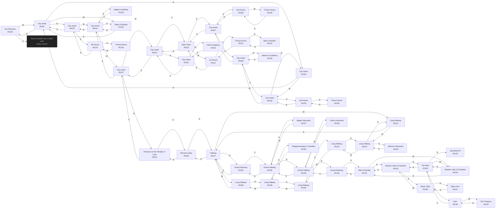

# Anon Drow City  `(drow)`

[← back to world map](../WORLD-MAP.md) · 51 rooms · vnums 5100–5150

Dashed nodes are exits that leave this area.

## Rooms

| VNUM | Name | Exits |
|---:|---|---|
| 5100 | City Entrance | W→5101 U→5270 |
| 5101 | City street | N→5123 E→5100 S→5102 W→5122 |
| 5102 | City street | N→5101 W→5103 |
| 5103 | City street | E→5102 S→5104 W→5106 |
| 5104 | 3rd House | N→5103 S→5105 |
| 5105 | Throne Room | N→5104 |
| 5106 | City street | N→5118 E→5103 W→5107 |
| 5107 | City street | N→5110 E→5106 S→5108 |
| 5108 | 2nd House | N→5107 W→5109 |
| 5109 | Throne Room | E→5108 |
| 5110 | Main Gate | N→5114 S→5107 W→5111 |
| 5111 | 1st House | E→5110 W→5112 |
| 5112 | Throne Room | N→5113 E→5111 |
| 5113 | Main Chamber | S→5112 |
| 5114 | City street | N→5115 E→5117 S→5110 |
| 5115 | City street | S→5114 W→5116 |
| 5116 | Cleric Academy | E→5115 |
| 5117 | City street | N→5119 E→5121 W→5114 |
| 5118 | Warrior's Academy | S→5106 |
| 5119 | Entrance to the Temple of Lloth | S→5117 D→5126 |
| 5120 | Mage's Academy | S→5121 |
| 5121 | City street | N→5120 E→5123 S→5122 W→5117 |
| 5122 | Slave Chamber | N→5121 E→5101 |
| 5123 | City street | N→5124 S→5101 W→5121 |
| 5124 | 4th house | E→5125 S→5123 |
| 5125 | Throne Room | W→5124 |
| 5126 | Entrance Way | N→5127 U→5119 |
| 5127 | Hallway | N→5135 E→5128 S→5126 W→5131 |
| 5128 | Long Hallway | E→5129 W→5127 |
| 5129 | Long Hallway | N→5150 E→5130 W→5128 |
| 5130 | Long Hallway | E→5134 W→5129 |
| 5131 | Long Hallway | E→5127 W→5132 |
| 5132 | Long Hallway | E→5131 S→5133 W→5134 |
| 5133 | Warrior's Barracks | N→5132 |
| 5134 | Long Hallway | E→5132 W→5130 |
| 5135 | Grand Stairway | S→5127 U→5136 |
| 5136 | Grand Hallway | N→5138 E→5137 D→5135 |
| 5137 | Mage's Barracks | W→5136 |
| 5138 | Grand Hallway | S→5136 W→5139 D→5140 |
| 5139 | Cleric's Barracks | E→5138 |
| 5140 | Grand Stairway | N→5141 U→5138 |
| 5141 | Main Chamber | E→5142 S→5140 W→5144 |
| 5142 | Eastern side of Chamber | N→5145 E→5146 S→5141 |
| 5143 | Sacrificial Pit | — |
| 5144 | Western side of Chamber | N→5145 S→5141 |
| 5145 | The Altar | N→5148 E→5142 W→5144 D→5143 |
| 5146 | Slave Cells | N→5147 W→5142 |
| 5147 | Slave Pen | S→5146 |
| 5148 | Dais | S→5145 W→5149 |
| 5149 | The Treasury | E→5148 |
| 5150 | Weaponsmaster's Chamber | S→5129 |

