# Anon Dwarven Kingdom  `(dwarven)`

[← back to world map](WORLD-MAP.md) · 50 rooms · vnums 6500–6554

Dashed nodes are exits that leave this area.

```mermaid
graph LR
  R6500["Path to Dwarven Village<br/>#6500"]
  R6501["Path, base of mountain<br/>#6501"]
  R6502["Path, middle of mountain<br/>#6502"]
  R6503["Top of mountain<br/>#6503"]
  R6504["Narrow Path<br/>#6504"]
  R6505["Entrance to Mountain<br/>#6505"]
  R6506["Bend in Narrow Path<br/>#6506"]
  R6507["Narrow path<br/>#6507"]
  R6508["Narrow north-south path<br/>#6508"]
  R6509["Door to Kingdom<br/>#6509"]
  R6510["Path to the Castle<br/>#6510"]
  R6511["Still on the path to the Castle<br/>#6511"]
  R6512["Door to Castle<br/>#6512"]
  R6513["Inside the entrance<br/>#6513"]
  R6514["Path<br/>#6514"]
  R6515["Turn in road<br/>#6515"]
  R6516["Hide & Tooth Shop<br/>#6516"]
  R6517["Path to the north of shop<br/>#6517"]
  R6518["North of Shops<br/>#6518"]
  R6519["Path by Hospital<br/>#6519"]
  R6520["Path next to barracks<br/>#6520"]
  R6521["Entrance to barracks<br/>#6521"]
  R6522["Guard House<br/>#6522"]
  R6523["First Barrack room<br/>#6523"]
  R6524["Back of Barracks<br/>#6524"]
  R6525["Inside of Castle Strangelove<br/>#6525"]
  R6526["A store room<br/>#6526"]
  R6527["Wine cellar<br/>#6527"]
  R6528["Stairs in castle<br/>#6528"]
  R6529["Stairs<br/>#6529"]
  R6530["Top of stairs<br/>#6530"]
  R6531["Queen's waiting room<br/>#6531"]
  R6532["Bedroom<br/>#6532"]
  R6534["Hospital<br/>#6534"]
  R6535["Granite Head's Bakery<br/>#6535"]
  R6540["Dark path<br/>#6540"]
  R6541["Mine entrance<br/>#6541"]
  R6542["Inside the mine<br/>#6542"]
  R6543["Path in the mine<br/>#6543"]
  R6544["Mine crossroad<br/>#6544"]
  R6545["Coal Room<br/>#6545"]
  R6546["Mine Maze<br/>#6546"]
  R6547["Maze inscription<br/>#6547"]
  R6548["Maze<br/>#6548"]
  R6549["Maze<br/>#6549"]
  R6550["Maze<br/>#6550"]
  R6551["Mining equipment room<br/>#6551"]
  R6552["Solved the Maze.<br/>#6552"]
  R6553["The Mazekeeper's Room<br/>#6553"]
  R6554["Bottom of mineshaft<br/>#6554"]
  R6500 -->|N| R6501
  R6500 -->|S| X6600
  R6500 -->|U| X3502
  R6501 -->|N| R6502
  R6501 -->|S| R6500
  R6502 -->|N| R6503
  R6502 -->|S| R6501
  R6503 -->|E| R6540
  R6503 -->|S| R6502
  R6503 -->|W| R6505
  R6504 -->|N| R6506
  R6504 -->|S| R6540
  R6505 -->|E| R6503
  R6505 -->|W| R6513
  R6506 -->|E| R6507
  R6506 -->|S| R6504
  R6507 -->|N| R6508
  R6507 -->|W| R6506
  R6508 -->|N| R6509
  R6508 -->|S| R6507
  R6509 -->|E| R6510
  R6509 -->|S| R6508
  R6509 -->|W| R6522
  R6510 -->|N| R6511
  R6510 -->|W| R6509
  R6511 -->|N| R6512
  R6511 -->|S| R6510
  R6512 -->|E| R6525
  R6512 -->|S| R6511
  R6513 -->|N| R6514
  R6513 -->|E| R6505
  R6513 -->|W| R6526
  R6514 -->|N| R6515
  R6514 -->|S| R6513
  R6515 -->|S| R6514
  R6515 -->|W| R6516
  R6516 -->|N| R6517
  R6516 -->|E| R6515
  R6517 -->|N| R6518
  R6517 -->|S| R6516
  R6517 -->|W| R6535
  R6518 -->|E| R6519
  R6518 -->|S| R6517
  R6519 -->|N| R6534
  R6519 -->|E| R6520
  R6519 -->|W| R6518
  R6520 -->|E| R6521
  R6520 -->|W| R6519
  R6521 -->|S| R6523
  R6521 -->|W| R6520
  R6522 -->|E| R6509
  R6523 -->|N| R6521
  R6523 -->|S| R6524
  R6524 -->|N| R6523
  R6524 -->|D| X2001
  R6525 -->|W| R6512
  R6525 -->|U| R6528
  R6526 -->|E| R6513
  R6526 -->|D| R6527
  R6527 -->|U| R6526
  R6527 -->|D| X2065
  R6528 -->|U| R6529
  R6528 -->|D| R6525
  R6529 -->|U| R6530
  R6529 -->|D| R6528
  R6530 -->|E| R6531
  R6530 -->|D| R6529
  R6531 -->|N| R6532
  R6531 -->|W| R6530
  R6532 -->|S| R6531
  R6534 -->|S| R6519
  R6535 -->|E| R6517
  R6540 -->|N| R6504
  R6540 -->|E| R6541
  R6540 -->|W| R6503
  R6541 -->|W| R6540
  R6541 -->|D| R6542
  R6542 -->|U| R6541
  R6542 -->|D| R6554
  R6543 -->|E| R6544
  R6543 -->|W| R6554
  R6544 -->|N| R6546
  R6544 -->|E| R6545
  R6544 -->|S| R6551
  R6544 -->|W| R6543
  R6545 -->|W| R6544
  R6546 -->|E| R6547
  R6546 -->|S| R6544
  R6547 -->|N| R6548
  R6547 -->|W| R6546
  R6548 -->|N| R6549
  R6548 -->|S| R6547
  R6549 -->|N| R6550
  R6549 -->|W| R6548
  R6550 -->|S| R6549
  R6550 -->|W| R6552
  R6551 -->|N| R6544
  R6552 -->|E| R6550
  R6552 -->|W| R6553
  R6553 -->|E| R6552
  R6554 -->|E| R6543
  R6554 -->|U| R6542
  X6600["On a trail<br/>vacation #6600"]:::ext
  X3502["The Cross Roads<br/>midennir #3502"]:::ext
  X2001["North entrance to the catacombs<br/>catacomb #2001"]:::ext
  X2065["Southern entrance to the catacombs<br/>catacomb #2065"]:::ext
  classDef ext fill:#222,stroke:#888,color:#bbb,stroke-dasharray:3 3;
```

## Rooms

| VNUM | Name | Exits |
|---:|---|---|
| 6500 | Path to Dwarven Village | N→6501 S→6600 U→3502 |
| 6501 | Path, base of mountain | N→6502 S→6500 |
| 6502 | Path, middle of mountain | N→6503 S→6501 |
| 6503 | Top of mountain | E→6540 S→6502 W→6505 |
| 6504 | Narrow Path | N→6506 S→6540 |
| 6505 | Entrance to Mountain | E→6503 W→6513 |
| 6506 | Bend in Narrow Path | E→6507 S→6504 |
| 6507 | Narrow path | N→6508 W→6506 |
| 6508 | Narrow north-south path | N→6509 S→6507 |
| 6509 | Door to Kingdom | E→6510 S→6508 W→6522 |
| 6510 | Path to the Castle | N→6511 W→6509 |
| 6511 | Still on the path to the Castle | N→6512 S→6510 |
| 6512 | Door to Castle | E→6525 S→6511 |
| 6513 | Inside the entrance | N→6514 E→6505 W→6526 |
| 6514 | Path | N→6515 S→6513 |
| 6515 | Turn in road | S→6514 W→6516 |
| 6516 | Hide & Tooth Shop | N→6517 E→6515 |
| 6517 | Path to the north of shop | N→6518 S→6516 W→6535 |
| 6518 | North of Shops | E→6519 S→6517 |
| 6519 | Path by Hospital | N→6534 E→6520 W→6518 |
| 6520 | Path next to barracks | E→6521 W→6519 |
| 6521 | Entrance to barracks | S→6523 W→6520 |
| 6522 | Guard House | E→6509 |
| 6523 | First Barrack room | N→6521 S→6524 |
| 6524 | Back of Barracks | N→6523 D→2001 |
| 6525 | Inside of Castle Strangelove | W→6512 U→6528 |
| 6526 | A store room | E→6513 D→6527 |
| 6527 | Wine cellar | U→6526 D→2065 |
| 6528 | Stairs in castle | U→6529 D→6525 |
| 6529 | Stairs | U→6530 D→6528 |
| 6530 | Top of stairs | E→6531 D→6529 |
| 6531 | Queen's waiting room | N→6532 W→6530 |
| 6532 | Bedroom | S→6531 |
| 6534 | Hospital | S→6519 |
| 6535 | Granite Head's Bakery | E→6517 |
| 6540 | Dark path | N→6504 E→6541 W→6503 |
| 6541 | Mine entrance | W→6540 D→6542 |
| 6542 | Inside the mine | U→6541 D→6554 |
| 6543 | Path in the mine | E→6544 W→6554 |
| 6544 | Mine crossroad | N→6546 E→6545 S→6551 W→6543 |
| 6545 | Coal Room | W→6544 |
| 6546 | Mine Maze | E→6547 S→6544 |
| 6547 | Maze inscription | N→6548 W→6546 |
| 6548 | Maze | N→6549 S→6547 |
| 6549 | Maze | N→6550 W→6548 |
| 6550 | Maze | S→6549 W→6552 |
| 6551 | Mining equipment room | N→6544 |
| 6552 | Solved the Maze. | E→6550 W→6553 |
| 6553 | The Mazekeeper's Room | E→6552 |
| 6554 | Bottom of mineshaft | E→6543 U→6542 |

