# Anon Great Eastern Desert  `(eastern)`

[← back to world map](WORLD-MAP.md) · 47 rooms · vnums 5001–5070

Dashed nodes are exits that leave this area.

```mermaid
graph LR
  R5001["A long tunnel<br/>#5001"]
  R5002["A long tunnel<br/>#5002"]
  R5003["A long tunnel<br/>#5003"]
  R5004["A long tunnel<br/>#5004"]
  R5005["An underground lake<br/>#5005"]
  R5006["A long narrow tunnel<br/>#5006"]
  R5007["A wide tunnel<br/>#5007"]
  R5008["Cave-in<br/>#5008"]
  R5009["At the foot of the rubble<br/>#5009"]
  R5010["Cave entrance<br/>#5010"]
  R5011["Giant cave<br/>#5011"]
  R5012["Narrow bend<br/>#5012"]
  R5013["Large cave<br/>#5013"]
  R5014["Damp hallway<br/>#5014"]
  R5015["Underground pool<br/>#5015"]
  R5016["Damp hallway<br/>#5016"]
  R5017["Narrow crawlway<br/>#5017"]
  R5018["Large cavern<br/>#5018"]
  R5019["Fungus patch<br/>#5019"]
  R5020["Fungus path<br/>#5020"]
  R5021["Fungus temple<br/>#5021"]
  R5022["Sloping passage<br/>#5022"]
  R5023["Sloping passage<br/>#5023"]
  R5024["The Great Eastern Desert<br/>#5024"]
  R5025["The Great Eastern Desert<br/>#5025"]
  R5026["The Great Eastern Desert<br/>#5026"]
  R5027["The Great Eastern Desert<br/>#5027"]
  R5028["The Great Eastern Desert<br/>#5028"]
  R5029["The Great Eastern Desert<br/>#5029"]
  R5030["The Great Eastern Desert<br/>#5030"]
  R5031["The Great Eastern Desert<br/>#5031"]
  R5032["The Great Eastern Desert<br/>#5032"]
  R5056["A nomad camp<br/>#5056"]
  R5057["Inside a small tent<br/>#5057"]
  R5058["Beside the camels<br/>#5058"]
  R5059["The warrior's tent.<br/>#5059"]
  R5060["The main tent<br/>#5060"]
  R5061["The main tent<br/>#5061"]
  R5062["Upon a small hill.<br/>#5062"]
  R5063["The wind-swept ledge<br/>#5063"]
  R5064["The cave mouth<br/>#5064"]
  R5065["The mysterious lair.<br/>#5065"]
  R5066["A wide tunnel<br/>#5066"]
  R5067["A narrower tunnel<br/>#5067"]
  R5068["A narrow crack<br/>#5068"]
  R5069["A small cavern.<br/>#5069"]
  R5070["A small shaft<br/>#5070"]
  R5001 -->|E| R5002
  R5001 -->|W| X3205
  R5002 -->|N| R5008
  R5002 -->|E| R5003
  R5002 -->|W| R5001
  R5003 -->|E| R5004
  R5003 -->|S| R5017
  R5003 -->|W| R5002
  R5004 -->|E| R5005
  R5004 -->|S| R5018
  R5004 -->|W| R5003
  R5005 -->|N| R5016
  R5005 -->|E| R5006
  R5005 -->|S| R5023
  R5005 -->|W| R5004
  R5006 -->|E| R5007
  R5006 -->|W| R5005
  R5007 -->|E| R5027
  R5007 -->|W| R5006
  R5008 -->|S| R5002
  R5008 -->|D| R5009
  R5009 -->|N| R5010
  R5009 -->|E| R5012
  R5009 -->|U| R5008
  R5010 -->|S| R5009
  R5010 -->|D| R5011
  R5011 -->|U| R5010
  R5012 -->|S| R5013
  R5012 -->|W| R5009
  R5013 -->|N| R5012
  R5013 -->|E| R5014
  R5014 -->|E| R5015
  R5014 -->|W| R5013
  R5015 -->|S| R5016
  R5015 -->|W| R5014
  R5016 -->|N| R5015
  R5016 -->|S| R5005
  R5017 -->|N| R5003
  R5017 -->|E| R5018
  R5017 -->|S| R5019
  R5018 -->|N| R5004
  R5018 -->|W| R5017
  R5019 -->|N| R5017
  R5019 -->|E| R5020
  R5020 -->|S| R5021
  R5020 -->|W| R5019
  R5021 -->|N| R5020
  R5021 -->|E| R5022
  R5022 -->|W| R5021
  R5022 -->|D| R5023
  R5023 -->|N| R5005
  R5023 -->|U| R5022
  R5024 -->|N| R5030
  R5024 -->|E| R5025
  R5024 -->|S| R5027
  R5024 -->|W| R5026
  R5025 -->|N| R5056
  R5025 -->|E| R5026
  R5025 -->|S| R5028
  R5025 -->|W| R5024
  R5026 -->|N| R5032
  R5026 -->|E| R5024
  R5026 -->|S| R5029
  R5026 -->|W| R5025
  R5027 -->|N| R5024
  R5027 -->|E| R5028
  R5027 -->|S| R5030
  R5027 -->|W| R5007
  R5028 -->|N| R5025
  R5028 -->|E| R5029
  R5028 -->|S| R5031
  R5028 -->|W| R5027
  R5029 -->|N| R5026
  R5029 -->|E| R5062
  R5029 -->|S| R5032
  R5029 -->|W| R5028
  R5030 -->|N| R5027
  R5030 -->|E| R5031
  R5030 -->|S| R5024
  R5030 -->|W| R5032
  R5031 -->|N| R5028
  R5031 -->|E| R5032
  R5031 -->|S| R5063
  R5031 -->|W| R5030
  R5032 -->|N| R5029
  R5032 -->|E| R5030
  R5032 -->|S| R5026
  R5032 -->|W| R5031
  R5056 -->|N| R5058
  R5056 -->|E| R5057
  R5056 -->|S| R5025
  R5057 -->|W| R5056
  R5058 -->|N| R5060
  R5058 -->|E| R5059
  R5058 -->|S| R5056
  R5059 -->|W| R5058
  R5060 -->|E| R5061
  R5060 -->|S| R5058
  R5061 -->|W| R5060
  R5063 -->|N| R5031
  R5063 -->|E| R5031
  R5063 -->|W| R5064
  R5064 -->|E| R5063
  R5064 -->|W| R5065
  R5065 -->|E| R5064
  R5065 -->|W| R5066
  R5066 -->|E| R5065
  R5066 -->|W| R5067
  R5067 -->|E| R5066
  R5067 -->|S| R5068
  R5068 -->|N| R5067
  R5068 -->|W| R5069
  R5069 -->|N| R5070
  R5069 -->|E| R5068
  R5070 -->|S| R5069
  R5070 -->|U| R5009
  X3205["On the River<br/>midgaard #3205"]:::ext
  classDef ext fill:#222,stroke:#888,color:#bbb,stroke-dasharray:3 3;
```

## Rooms

| VNUM | Name | Exits |
|---:|---|---|
| 5001 | A long tunnel | E→5002 W→3205 |
| 5002 | A long tunnel | N→5008 E→5003 W→5001 |
| 5003 | A long tunnel | E→5004 S→5017 W→5002 |
| 5004 | A long tunnel | E→5005 S→5018 W→5003 |
| 5005 | An underground lake | N→5016 E→5006 S→5023 W→5004 |
| 5006 | A long narrow tunnel | E→5007 W→5005 |
| 5007 | A wide tunnel | E→5027 W→5006 |
| 5008 | Cave-in | S→5002 D→5009 |
| 5009 | At the foot of the rubble | N→5010 E→5012 U→5008 |
| 5010 | Cave entrance | S→5009 D→5011 |
| 5011 | Giant cave | U→5010 |
| 5012 | Narrow bend | S→5013 W→5009 |
| 5013 | Large cave | N→5012 E→5014 |
| 5014 | Damp hallway | E→5015 W→5013 |
| 5015 | Underground pool | S→5016 W→5014 |
| 5016 | Damp hallway | N→5015 S→5005 |
| 5017 | Narrow crawlway | N→5003 E→5018 S→5019 |
| 5018 | Large cavern | N→5004 W→5017 |
| 5019 | Fungus patch | N→5017 E→5020 |
| 5020 | Fungus path | S→5021 W→5019 |
| 5021 | Fungus temple | N→5020 E→5022 |
| 5022 | Sloping passage | W→5021 D→5023 |
| 5023 | Sloping passage | N→5005 U→5022 |
| 5024 | The Great Eastern Desert | N→5030 E→5025 S→5027 W→5026 |
| 5025 | The Great Eastern Desert | N→5056 E→5026 S→5028 W→5024 |
| 5026 | The Great Eastern Desert | N→5032 E→5024 S→5029 W→5025 |
| 5027 | The Great Eastern Desert | N→5024 E→5028 S→5030 W→5007 |
| 5028 | The Great Eastern Desert | N→5025 E→5029 S→5031 W→5027 |
| 5029 | The Great Eastern Desert | N→5026 E→5062 S→5032 W→5028 |
| 5030 | The Great Eastern Desert | N→5027 E→5031 S→5024 W→5032 |
| 5031 | The Great Eastern Desert | N→5028 E→5032 S→5063 W→5030 |
| 5032 | The Great Eastern Desert | N→5029 E→5030 S→5026 W→5031 |
| 5056 | A nomad camp | N→5058 E→5057 S→5025 |
| 5057 | Inside a small tent | W→5056 |
| 5058 | Beside the camels | N→5060 E→5059 S→5056 |
| 5059 | The warrior's tent. | W→5058 |
| 5060 | The main tent | E→5061 S→5058 |
| 5061 | The main tent | W→5060 |
| 5062 | Upon a small hill. | — |
| 5063 | The wind-swept ledge | N→5031 E→5031 W→5064 |
| 5064 | The cave mouth | E→5063 W→5065 |
| 5065 | The mysterious lair. | E→5064 W→5066 |
| 5066 | A wide tunnel | E→5065 W→5067 |
| 5067 | A narrower tunnel | E→5066 S→5068 |
| 5068 | A narrow crack | N→5067 W→5069 |
| 5069 | A small cavern. | N→5070 E→5068 |
| 5070 | A small shaft | S→5069 U→5009 |

