# Doctor Galaxy  `(galaxy)`

[← back to world map](../WORLD-MAP.md) · 61 rooms · vnums 9301–9371

Dashed nodes are exits that leave this area.

```mermaid
graph LR
  R9301["Inside a Tavern<br/>#9301"]
  R9302["Inside the Crystal Ball<br/>#9302"]
  R9303["Inside the Galaxy<br/>#9303"]
  R9304["On an InterGalactic Walkway<br/>#9304"]
  R9305["End of the InterGalactic Walkway<br/>#9305"]
  R9306["At the Undeveloped Part of the Galaxy<br/>#9306"]
  R9308["On the Bridge of Stars<br/>#9308"]
  R9309["On the Bridge of Nebulae<br/>#9309"]
  R9310["The Throne Room of the Nebula King<br/>#9310"]
  R9312["At the Start of the Milky Way<br/>#9312"]
  R9313["Along the Milky Way<br/>#9313"]
  R9314["At the End of the Milky Way<br/>#9314"]
  R9317["A Small Clearing<br/>#9317"]
  R9318["An Edge of the Galaxy<br/>#9318"]
  R9319["Very Near to a Gigantic Star<br/>#9319"]
  R9320["Too Bright to Tell<br/>#9320"]
  R9321["The Star Cluster<br/>#9321"]
  R9322["Another Edge of the Galaxy<br/>#9322"]
  R9323["Corner of the Galaxy<br/>#9323"]
  R9324["Lost in Space<br/>#9324"]
  R9325["Black Hole<br/>#9325"]
  R9326["The Homes of the Pleiades<br/>#9326"]
  R9327["Western Side of the Temple<br/>#9327"]
  R9328["Orion's Hunting Lodge<br/>#9328"]
  R9329["Northern Side of the Temple<br/>#9329"]
  R9330["The Offering Chamber<br/>#9330"]
  R9331["The Entrance of the Ancient Temple<br/>#9331"]
  R9332["Hercules' Mighty Throne<br/>#9332"]
  R9333["Eastern Side of the Temple<br/>#9333"]
  R9334["Perseus' Chamber<br/>#9334"]
  R9339["On the Mystic Chains<br/>#9339"]
  R9342["On a Hill<br/>#9342"]
  R9343["Inside a Spanish Bull-Ring<br/>#9343"]
  R9344["Inside a study<br/>#9344"]
  R9345["Along the seashore<br/>#9345"]
  R9346["Within the Deep Jungle<br/>#9346"]
  R9347["Inside a Luxurious Bedroom<br/>#9347"]
  R9348["The Supreme Court<br/>#9348"]
  R9349["In the Dry Desert<br/>#9349"]
  R9350["In the Woods<br/>#9350"]
  R9351["On a Mountain Peak<br/>#9351"]
  R9352["Inside a Waterfall<br/>#9352"]
  R9353["Inside a Gigantic Clam<br/>#9353"]
  R9354["End of the Mystic Chains<br/>#9354"]
  R9355["On the Draco<br/>#9355"]
  R9356["Tail of the Draco<br/>#9356"]
  R9357["Path of the Draco<br/>#9357"]
  R9358["Near the Legs of Draco<br/>#9358"]
  R9359["On the Back of Draco<br/>#9359"]
  R9360["Between the Wings of Draco<br/>#9360"]
  R9361["Near the Arms of Draco<br/>#9361"]
  R9362["On the Neck of Draco<br/>#9362"]
  R9363["Approaching the Head of Draco<br/>#9363"]
  R9364["At the Entrance of the Great Dipper<br/>#9364"]
  R9365["Cassiopeia's Throne<br/>#9365"]
  R9366["Along the Path of the Dipper<br/>#9366"]
  R9367["Cepheus' Throne<br/>#9367"]
  R9368["Along the path of the Dipper<br/>#9368"]
  R9369["Along the path of the Dipper<br/>#9369"]
  R9370["End of the Dipper<br/>#9370"]
  R9371["The Polar Star<br/>#9371"]
  R9301 -->|W| X1306
  R9301 -->|D| R9302
  R9302 -->|N| R9303
  R9303 -->|N| R9304
  R9303 -->|E| R9308
  R9303 -->|S| R9302
  R9303 -->|W| R9321
  R9304 -->|N| R9305
  R9304 -->|S| R9303
  R9304 -->|W| R9322
  R9305 -->|N| R9306
  R9305 -->|E| R9309
  R9305 -->|S| R9304
  R9305 -->|W| R9323
  R9306 -->|S| R9305
  R9306 -->|W| R9324
  R9308 -->|N| R9331
  R9308 -->|E| R9312
  R9308 -->|W| R9303
  R9309 -->|N| R9310
  R9309 -->|E| R9314
  R9309 -->|W| R9305
  R9310 -->|S| R9309
  R9312 -->|N| R9313
  R9312 -->|W| R9308
  R9313 -->|N| R9314
  R9313 -->|E| R9317
  R9313 -->|S| R9312
  R9314 -->|E| R9318
  R9314 -->|S| R9313
  R9314 -->|W| R9309
  R9317 -->|N| R9318
  R9317 -->|W| R9313
  R9318 -->|S| R9317
  R9318 -->|W| R9314
  R9318 -->|D| R9319
  R9319 -->|N| R9320
  R9319 -->|E| R9320
  R9319 -->|S| R9320
  R9319 -->|W| R9320
  R9321 -->|N| R9322
  R9321 -->|E| R9303
  R9322 -->|N| R9323
  R9322 -->|E| R9304
  R9322 -->|S| R9321
  R9323 -->|N| R9324
  R9323 -->|E| R9305
  R9323 -->|S| R9322
  R9324 -->|N| R9325
  R9324 -->|E| R9306
  R9324 -->|S| R9323
  R9326 -->|E| R9329
  R9326 -->|S| R9327
  R9327 -->|N| R9326
  R9327 -->|E| R9330
  R9327 -->|S| R9328
  R9328 -->|N| R9327
  R9328 -->|E| R9331
  R9329 -->|E| R9332
  R9329 -->|S| R9330
  R9329 -->|W| R9326
  R9330 -->|N| R9329
  R9330 -->|E| R9333
  R9330 -->|S| R9331
  R9330 -->|W| R9327
  R9330 -->|U| R9339
  R9330 -->|D| X5250
  R9331 -->|N| R9330
  R9331 -->|E| R9334
  R9331 -->|S| R9308
  R9331 -->|W| R9328
  R9332 -->|S| R9333
  R9332 -->|W| R9329
  R9333 -->|N| R9332
  R9333 -->|S| R9334
  R9333 -->|W| R9330
  R9334 -->|N| R9333
  R9334 -->|W| R9331
  R9339 -->|N| R9348
  R9339 -->|E| R9351
  R9339 -->|S| R9342
  R9339 -->|W| R9345
  R9339 -->|U| R9354
  R9339 -->|D| R9330
  R9342 -->|N| R9339
  R9342 -->|E| R9353
  R9342 -->|W| R9343
  R9343 -->|E| R9342
  R9343 -->|W| R9344
  R9344 -->|E| R9343
  R9345 -->|E| R9339
  R9345 -->|W| R9346
  R9346 -->|E| R9345
  R9347 -->|W| R9348
  R9348 -->|E| R9347
  R9348 -->|S| R9339
  R9348 -->|W| R9349
  R9349 -->|E| R9348
  R9349 -->|W| R9350
  R9350 -->|E| R9349
  R9351 -->|E| R9352
  R9351 -->|W| R9339
  R9352 -->|W| R9351
  R9353 -->|W| R9342
  R9354 -->|U| R9355
  R9354 -->|D| R9339
  R9355 -->|N| R9356
  R9355 -->|D| R9354
  R9356 -->|N| R9357
  R9356 -->|S| R9355
  R9357 -->|N| R9358
  R9357 -->|S| R9356
  R9358 -->|N| R9359
  R9358 -->|S| R9357
  R9359 -->|E| R9360
  R9359 -->|S| R9358
  R9360 -->|E| R9361
  R9360 -->|W| R9359
  R9361 -->|S| R9362
  R9361 -->|W| R9360
  R9362 -->|N| R9361
  R9362 -->|W| R9363
  R9363 -->|E| R9362
  R9363 -->|S| R9364
  R9364 -->|N| R9363
  R9364 -->|S| R9365
  R9364 -->|W| R9366
  R9365 -->|N| R9364
  R9365 -->|W| R9367
  R9366 -->|E| R9364
  R9366 -->|S| R9367
  R9367 -->|N| R9366
  R9367 -->|E| R9365
  R9367 -->|S| R9368
  R9368 -->|N| R9367
  R9368 -->|W| R9369
  R9369 -->|E| R9368
  R9369 -->|S| R9370
  R9370 -->|N| R9369
  R9370 -->|S| R9371
  R9371 -->|N| R9370
  X1306["The Shadow Grove<br/>hitower #1306"]:::ext
  X5250["The Temple of Thalos<br/>thalos #5250"]:::ext
  classDef ext fill:#222,stroke:#888,color:#bbb,stroke-dasharray:3 3;
```

## Rooms

| VNUM | Name | Exits |
|---:|---|---|
| 9301 | Inside a Tavern | W→1306 D→9302 |
| 9302 | Inside the Crystal Ball | N→9303 |
| 9303 | Inside the Galaxy | N→9304 E→9308 S→9302 W→9321 |
| 9304 | On an InterGalactic Walkway | N→9305 S→9303 W→9322 |
| 9305 | End of the InterGalactic Walkway | N→9306 E→9309 S→9304 W→9323 |
| 9306 | At the Undeveloped Part of the Galaxy | S→9305 W→9324 |
| 9308 | On the Bridge of Stars | N→9331 E→9312 W→9303 |
| 9309 | On the Bridge of Nebulae | N→9310 E→9314 W→9305 |
| 9310 | The Throne Room of the Nebula King | S→9309 |
| 9312 | At the Start of the Milky Way | N→9313 W→9308 |
| 9313 | Along the Milky Way | N→9314 E→9317 S→9312 |
| 9314 | At the End of the Milky Way | E→9318 S→9313 W→9309 |
| 9317 | A Small Clearing | N→9318 W→9313 |
| 9318 | An Edge of the Galaxy | S→9317 W→9314 D→9319 |
| 9319 | Very Near to a Gigantic Star | N→9320 E→9320 S→9320 W→9320 |
| 9320 | Too Bright to Tell | — |
| 9321 | The Star Cluster | N→9322 E→9303 |
| 9322 | Another Edge of the Galaxy | N→9323 E→9304 S→9321 |
| 9323 | Corner of the Galaxy | N→9324 E→9305 S→9322 |
| 9324 | Lost in Space | N→9325 E→9306 S→9323 |
| 9325 | Black Hole | — |
| 9326 | The Homes of the Pleiades | E→9329 S→9327 |
| 9327 | Western Side of the Temple | N→9326 E→9330 S→9328 |
| 9328 | Orion's Hunting Lodge | N→9327 E→9331 |
| 9329 | Northern Side of the Temple | E→9332 S→9330 W→9326 |
| 9330 | The Offering Chamber | N→9329 E→9333 S→9331 W→9327 U→9339 D→5250 |
| 9331 | The Entrance of the Ancient Temple | N→9330 E→9334 S→9308 W→9328 |
| 9332 | Hercules' Mighty Throne | S→9333 W→9329 |
| 9333 | Eastern Side of the Temple | N→9332 S→9334 W→9330 |
| 9334 | Perseus' Chamber | N→9333 W→9331 |
| 9339 | On the Mystic Chains | N→9348 E→9351 S→9342 W→9345 U→9354 D→9330 |
| 9342 | On a Hill | N→9339 E→9353 W→9343 |
| 9343 | Inside a Spanish Bull-Ring | E→9342 W→9344 |
| 9344 | Inside a study | E→9343 |
| 9345 | Along the seashore | E→9339 W→9346 |
| 9346 | Within the Deep Jungle | E→9345 |
| 9347 | Inside a Luxurious Bedroom | W→9348 |
| 9348 | The Supreme Court | E→9347 S→9339 W→9349 |
| 9349 | In the Dry Desert | E→9348 W→9350 |
| 9350 | In the Woods | E→9349 |
| 9351 | On a Mountain Peak | E→9352 W→9339 |
| 9352 | Inside a Waterfall | W→9351 |
| 9353 | Inside a Gigantic Clam | W→9342 |
| 9354 | End of the Mystic Chains | U→9355 D→9339 |
| 9355 | On the Draco | N→9356 D→9354 |
| 9356 | Tail of the Draco | N→9357 S→9355 |
| 9357 | Path of the Draco | N→9358 S→9356 |
| 9358 | Near the Legs of Draco | N→9359 S→9357 |
| 9359 | On the Back of Draco | E→9360 S→9358 |
| 9360 | Between the Wings of Draco | E→9361 W→9359 |
| 9361 | Near the Arms of Draco | S→9362 W→9360 |
| 9362 | On the Neck of Draco | N→9361 W→9363 |
| 9363 | Approaching the Head of Draco | E→9362 S→9364 |
| 9364 | At the Entrance of the Great Dipper | N→9363 S→9365 W→9366 |
| 9365 | Cassiopeia's Throne | N→9364 W→9367 |
| 9366 | Along the Path of the Dipper | E→9364 S→9367 |
| 9367 | Cepheus' Throne | N→9366 E→9365 S→9368 |
| 9368 | Along the path of the Dipper | N→9367 W→9369 |
| 9369 | Along the path of the Dipper | E→9368 S→9370 |
| 9370 | End of the Dipper | N→9369 S→9371 |
| 9371 | The Polar Star | N→9370 |

