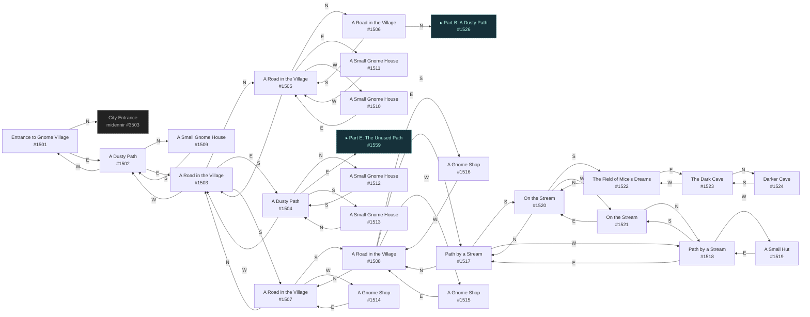
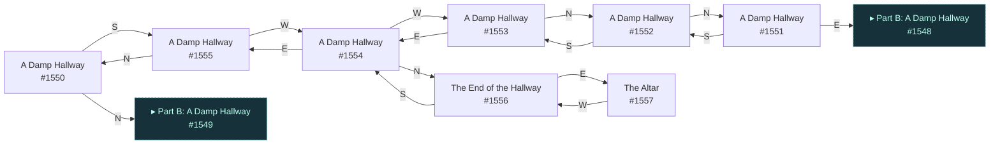
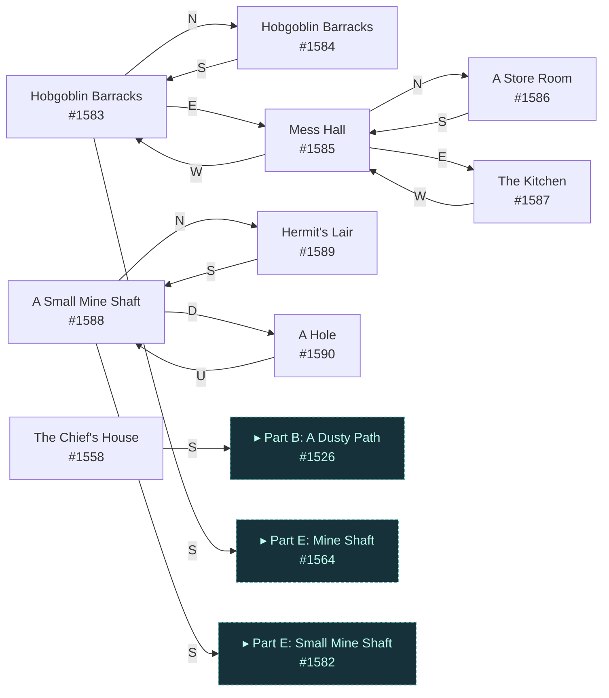
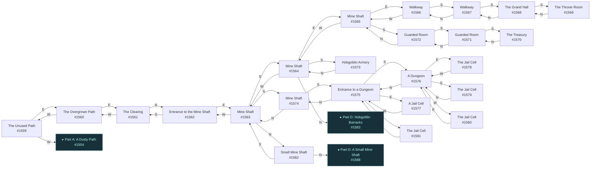

# Vougon Gnome Village  `(gnome)`

[← back to world map](WORLD-MAP.md) · 89 rooms · vnums 1501–1590

Grey dashed nodes leave the area; green dashed nodes (`▸ Part X`) continue on another sub-map below.

_This area is split into 5 sub-maps for legibility._

## Map — Part A (24 rooms: #1501–#1524)

## Map — Part B (24 rooms: #1526–#1549)

```mermaid
graph LR
  R1526["A Dusty Path<br/>#1526"]
  R1527["The Iron Gateway<br/>#1527"]
  R1528["A Long Hallway<br/>#1528"]
  R1529["A Long Hallway<br/>#1529"]
  R1530["The Barracks<br/>#1530"]
  R1531["A Small Storage Room<br/>#1531"]
  R1532["A Small Storage Room<br/>#1532"]
  R1533["A Small Storage Room<br/>#1533"]
  R1534["The Mess Hall<br/>#1534"]
  R1535["A Small Room<br/>#1535"]
  R1536["A Small Unused Room<br/>#1536"]
  R1537["Dark Hallway<br/>#1537"]
  R1538["Torture Chamber<br/>#1538"]
  R1539["Dark Hallway<br/>#1539"]
  R1540["Dark Hallway<br/>#1540"]
  R1541["Prison Cell<br/>#1541"]
  R1542["Prison Cell<br/>#1542"]
  R1543["Prison Cell<br/>#1543"]
  R1544["Prison Cell<br/>#1544"]
  R1545["End of the Dark Hallway<br/>#1545"]
  R1546["A Ladder<br/>#1546"]
  R1547["Lair<br/>#1547"]
  R1548["A Damp Hallway<br/>#1548"]
  R1549["A Damp Hallway<br/>#1549"]
  R1526 -->|N| X1558
  R1526 -->|S| X1506
  R1526 -->|W| R1527
  R1527 -->|E| R1526
  R1527 -->|W| R1528
  R1528 -->|N| R1530
  R1528 -->|E| R1527
  R1528 -->|S| R1532
  R1528 -->|W| R1529
  R1529 -->|E| R1528
  R1529 -->|S| R1534
  R1529 -->|W| R1535
  R1530 -->|E| R1531
  R1530 -->|S| R1528
  R1531 -->|W| R1530
  R1532 -->|N| R1528
  R1532 -->|E| R1533
  R1533 -->|W| R1532
  R1534 -->|N| R1529
  R1535 -->|E| R1529
  R1535 -->|D| R1536
  R1536 -->|E| R1537
  R1536 -->|U| R1535
  R1537 -->|E| R1538
  R1537 -->|S| R1539
  R1537 -->|W| R1536
  R1538 -->|W| R1537
  R1539 -->|N| R1537
  R1539 -->|E| R1542
  R1539 -->|S| R1540
  R1539 -->|W| R1541
  R1540 -->|N| R1539
  R1540 -->|E| R1544
  R1540 -->|S| R1543
  R1540 -->|W| R1545
  R1541 -->|E| R1539
  R1542 -->|W| R1539
  R1543 -->|N| R1540
  R1544 -->|W| R1540
  R1545 -->|E| R1540
  R1545 -->|W| R1546
  R1546 -->|E| R1545
  R1546 -->|D| R1547
  R1547 -->|S| R1548
  R1547 -->|U| R1546
  R1548 -->|N| R1547
  R1548 -->|E| R1549
  R1548 -->|W| X1551
  R1549 -->|S| X1550
  R1549 -->|W| R1548
  X1558["▸ Part D: The Chief's House<br/>#1558"]:::part
  X1506["▸ Part A: A Road in the Village<br/>#1506"]:::part
  X1551["▸ Part C: A Damp Hallway<br/>#1551"]:::part
  X1550["▸ Part C: A Damp Hallway<br/>#1550"]:::part
  classDef ext fill:#222,stroke:#888,color:#bbb,stroke-dasharray:3 3;
  classDef part fill:#16313a,stroke:#5aa,color:#bfe,stroke-dasharray:4 2;
```

## Map — Part C (8 rooms: #1550–#1557)

## Map — Part D (9 rooms: #1558–#1590)

## Map — Part E (24 rooms: #1559–#1582)

## Rooms

| VNUM | Name | Exits |
|---:|---|---|
| 1501 | Entrance to Gnome Village | N→3503 E→1502 |
| 1502 | A Dusty Path | N→1509 E→1503 W→1501 |
| 1503 | A Road in the Village | N→1505 E→1504 S→1507 W→1502 |
| 1504 | A Dusty Path | N→1512 E→1559 S→1513 W→1503 |
| 1505 | A Road in the Village | N→1506 E→1511 S→1503 W→1510 |
| 1506 | A Road in the Village | N→1526 S→1505 |
| 1507 | A Road in the Village | N→1503 S→1508 W→1514 |
| 1508 | A Road in the Village | N→1507 E→1516 S→1517 W→1515 |
| 1509 | A Small Gnome House | S→1502 |
| 1510 | A Small Gnome House | E→1505 |
| 1511 | A Small Gnome House | W→1505 |
| 1512 | A Small Gnome House | S→1504 |
| 1513 | A Small Gnome House | N→1504 |
| 1514 | A Gnome Shop | E→1507 |
| 1515 | A Gnome Shop | E→1508 |
| 1516 | A Gnome Shop | W→1508 |
| 1517 | Path by a Stream | N→1508 S→1520 W→1518 |
| 1518 | Path by a Stream | E→1517 S→1521 W→1519 |
| 1519 | A Small Hut | E→1518 |
| 1520 | On the Stream | N→1517 S→1522 W→1521 |
| 1521 | On the Stream | N→1518 E→1520 |
| 1522 | The Field of Mice's Dreams | N→1520 E→1523 |
| 1523 | The Dark Cave | N→1524 W→1522 |
| 1524 | Darker Cave | S→1523 |
| 1526 | A Dusty Path | N→1558 S→1506 W→1527 |
| 1527 | The Iron Gateway | E→1526 W→1528 |
| 1528 | A Long Hallway | N→1530 E→1527 S→1532 W→1529 |
| 1529 | A Long Hallway | E→1528 S→1534 W→1535 |
| 1530 | The Barracks | E→1531 S→1528 |
| 1531 | A Small Storage Room | W→1530 |
| 1532 | A Small Storage Room | N→1528 E→1533 |
| 1533 | A Small Storage Room | W→1532 |
| 1534 | The Mess Hall | N→1529 |
| 1535 | A Small Room | E→1529 D→1536 |
| 1536 | A Small Unused Room | E→1537 U→1535 |
| 1537 | Dark Hallway | E→1538 S→1539 W→1536 |
| 1538 | Torture Chamber | W→1537 |
| 1539 | Dark Hallway | N→1537 E→1542 S→1540 W→1541 |
| 1540 | Dark Hallway | N→1539 E→1544 S→1543 W→1545 |
| 1541 | Prison Cell | E→1539 |
| 1542 | Prison Cell | W→1539 |
| 1543 | Prison Cell | N→1540 |
| 1544 | Prison Cell | W→1540 |
| 1545 | End of the Dark Hallway | E→1540 W→1546 |
| 1546 | A Ladder | E→1545 D→1547 |
| 1547 | Lair | S→1548 U→1546 |
| 1548 | A Damp Hallway | N→1547 E→1549 W→1551 |
| 1549 | A Damp Hallway | S→1550 W→1548 |
| 1550 | A Damp Hallway | N→1549 S→1555 |
| 1551 | A Damp Hallway | E→1548 S→1552 |
| 1552 | A Damp Hallway | N→1551 S→1553 |
| 1553 | A Damp Hallway | N→1552 E→1554 |
| 1554 | A Damp Hallway | N→1556 E→1555 W→1553 |
| 1555 | A Damp Hallway | N→1550 W→1554 |
| 1556 | The End of the Hallway | E→1557 S→1554 |
| 1557 | The Altar | W→1556 |
| 1558 | The Chief's House | S→1526 |
| 1559 | The Unused Path | E→1560 W→1504 |
| 1560 | The Overgrown Path | E→1561 W→1559 |
| 1561 | The Clearing | N→1562 W→1560 |
| 1562 | Entrance to the Mine Shaft | E→1563 S→1561 |
| 1563 | Mine Shaft | N→1582 E→1564 S→1574 W→1562 |
| 1564 | Mine Shaft | N→1583 E→1565 S→1573 W→1563 |
| 1565 | Mine Shaft | E→1566 S→1572 W→1564 |
| 1566 | Walkway | S→1567 W→1565 |
| 1567 | Walkway | N→1566 S→1568 |
| 1568 | The Grand Hall | N→1567 S→1569 |
| 1569 | The Throne Room | N→1568 |
| 1570 | The Treasury | N→1571 |
| 1571 | Guarded Room | N→1572 S→1570 |
| 1572 | Guarded Room | N→1565 S→1571 |
| 1573 | Hobgoblin Armory | N→1564 |
| 1574 | Mine Shaft | N→1563 S→1575 |
| 1575 | Entrance to a Dungeon | N→1574 E→1577 S→1576 W→1581 |
| 1576 | A Dungeon | N→1575 E→1578 S→1579 W→1580 |
| 1577 | A Jail Cell | W→1575 |
| 1578 | The Jail Cell | W→1576 |
| 1579 | The Jail Cell | N→1576 |
| 1580 | The Jail Cell | E→1576 |
| 1581 | The Jail Cell | E→1575 |
| 1582 | Small Mine Shaft | N→1588 S→1563 |
| 1583 | Hobgoblin Barracks | N→1584 E→1585 S→1564 |
| 1584 | Hobgoblin Barracks | S→1583 |
| 1585 | Mess Hall | N→1586 E→1587 W→1583 |
| 1586 | A Store Room | S→1585 |
| 1587 | The Kitchen | W→1585 |
| 1588 | A Small Mine Shaft | N→1589 S→1582 D→1590 |
| 1589 | Hermit's Lair | S→1588 |
| 1590 | A Hole | U→1588 |

