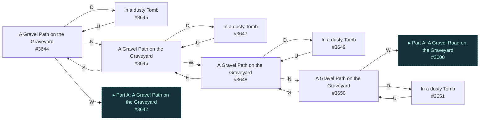

# Alfa Graveyard  `(grave)`

[← back to world map](WORLD-MAP.md) · 33 rooms · vnums 3600–3651

Grey dashed nodes leave the area; green dashed nodes (`▸ Part X`) continue on another sub-map below.

_This area is split into 3 sub-maps for legibility._

## Map — Part A (24 rooms: #3600–#3642)

```mermaid
graph LR
  R3600["A Gravel Road on the Graveyard<br/>#3600"]
  R3601["A Gravel Road on the Graveyard<br/>#3601"]
  R3602["A Gravel Road on the Graveyard<br/>#3602"]
  R3603["A Gravel Road on the Graveyard<br/>#3603"]
  R3604["In front of the Chapel<br/>#3604"]
  R3606["A Gravel Path on the Graveyard<br/>#3606"]
  R3607["In a dusty Tomb<br/>#3607"]
  R3608["A Gravel Path on the Graveyard<br/>#3608"]
  R3609["In a dusty Tomb<br/>#3609"]
  R3610["A Gravel Path on the Graveyard<br/>#3610"]
  R3611["In a dusty Tomb<br/>#3611"]
  R3612["A Gravel Path on the Graveyard<br/>#3612"]
  R3613["In a shed on the Graveyard<br/>#3613"]
  R3614["A Gravel Path on the Graveyard<br/>#3614"]
  R3615["In a dusty Tomb<br/>#3615"]
  R3616["A Gravel Path on the Graveyard<br/>#3616"]
  R3617["In a dusty Tomb<br/>#3617"]
  R3618["A Gravel Path on the Graveyard<br/>#3618"]
  R3619["In a dusty Tomb<br/>#3619"]
  R3638["A Gravel Path on the Graveyard<br/>#3638"]
  R3639["In a dusty Tomb<br/>#3639"]
  R3640["A Gravel Path on the Graveyard<br/>#3640"]
  R3641["In a dusty Tomb<br/>#3641"]
  R3642["A Gravel Path on the Graveyard<br/>#3642"]
  R3600 -->|N| X3129
  R3600 -->|E| X3650
  R3600 -->|S| R3601
  R3600 -->|W| R3606
  R3601 -->|N| R3600
  R3601 -->|S| R3602
  R3602 -->|N| R3601
  R3602 -->|S| R3603
  R3603 -->|N| R3602
  R3603 -->|S| R3604
  R3604 -->|N| R3603
  R3604 -->|E| R3638
  R3604 -->|W| R3618
  R3606 -->|E| R3600
  R3606 -->|S| R3608
  R3606 -->|D| R3607
  R3607 -->|U| R3606
  R3608 -->|N| R3606
  R3608 -->|W| R3610
  R3608 -->|D| R3609
  R3609 -->|U| R3608
  R3610 -->|E| R3608
  R3610 -->|S| R3612
  R3610 -->|D| R3611
  R3611 -->|U| R3610
  R3612 -->|N| R3610
  R3612 -->|E| R3614
  R3612 -->|W| R3613
  R3613 -->|E| R3612
  R3614 -->|S| R3616
  R3614 -->|W| R3612
  R3614 -->|D| R3615
  R3615 -->|U| R3614
  R3616 -->|N| R3614
  R3616 -->|S| R3618
  R3616 -->|D| R3617
  R3617 -->|U| R3616
  R3618 -->|N| R3616
  R3618 -->|E| R3604
  R3618 -->|D| R3619
  R3619 -->|U| R3618
  R3638 -->|N| R3640
  R3638 -->|W| R3604
  R3638 -->|D| R3639
  R3639 -->|U| R3638
  R3640 -->|N| R3642
  R3640 -->|S| R3638
  R3640 -->|D| R3641
  R3641 -->|U| R3640
  R3642 -->|E| X3644
  R3642 -->|S| R3640
  R3642 -->|D| X3643
  X3129["On the Concourse<br/>midgaard #3129"]:::ext
  X3650["▸ Part C: A Gravel Path on the Graveyard<br/>#3650"]:::part
  X3644["▸ Part C: A Gravel Path on the Graveyard<br/>#3644"]:::part
  X3643["▸ Part B: In a dusty Tomb<br/>#3643"]:::part
  classDef ext fill:#222,stroke:#888,color:#bbb,stroke-dasharray:3 3;
  classDef part fill:#16313a,stroke:#5aa,color:#bfe,stroke-dasharray:4 2;
```

## Map — Part B (1 rooms: #3643–#3643)

## Map — Part C (8 rooms: #3644–#3651)

## Rooms

| VNUM | Name | Exits |
|---:|---|---|
| 3600 | A Gravel Road on the Graveyard | N→3129 E→3650 S→3601 W→3606 |
| 3601 | A Gravel Road on the Graveyard | N→3600 S→3602 |
| 3602 | A Gravel Road on the Graveyard | N→3601 S→3603 |
| 3603 | A Gravel Road on the Graveyard | N→3602 S→3604 |
| 3604 | In front of the Chapel | N→3603 E→3638 W→3618 |
| 3606 | A Gravel Path on the Graveyard | E→3600 S→3608 D→3607 |
| 3607 | In a dusty Tomb | U→3606 |
| 3608 | A Gravel Path on the Graveyard | N→3606 W→3610 D→3609 |
| 3609 | In a dusty Tomb | U→3608 |
| 3610 | A Gravel Path on the Graveyard | E→3608 S→3612 D→3611 |
| 3611 | In a dusty Tomb | U→3610 |
| 3612 | A Gravel Path on the Graveyard | N→3610 E→3614 W→3613 |
| 3613 | In a shed on the Graveyard | E→3612 |
| 3614 | A Gravel Path on the Graveyard | S→3616 W→3612 D→3615 |
| 3615 | In a dusty Tomb | U→3614 |
| 3616 | A Gravel Path on the Graveyard | N→3614 S→3618 D→3617 |
| 3617 | In a dusty Tomb | U→3616 |
| 3618 | A Gravel Path on the Graveyard | N→3616 E→3604 D→3619 |
| 3619 | In a dusty Tomb | U→3618 |
| 3638 | A Gravel Path on the Graveyard | N→3640 W→3604 D→3639 |
| 3639 | In a dusty Tomb | U→3638 |
| 3640 | A Gravel Path on the Graveyard | N→3642 S→3638 D→3641 |
| 3641 | In a dusty Tomb | U→3640 |
| 3642 | A Gravel Path on the Graveyard | E→3644 S→3640 D→3643 |
| 3643 | In a dusty Tomb | U→3642 |
| 3644 | A Gravel Path on the Graveyard | N→3646 W→3642 D→3645 |
| 3645 | In a dusty Tomb | U→3644 |
| 3646 | A Gravel Path on the Graveyard | S→3644 W→3648 D→3647 |
| 3647 | In a dusty Tomb | U→3646 |
| 3648 | A Gravel Path on the Graveyard | N→3650 E→3646 D→3649 |
| 3649 | In a dusty Tomb | U→3648 |
| 3650 | A Gravel Path on the Graveyard | S→3648 W→3600 D→3651 |
| 3651 | In a dusty Tomb | U→3650 |

