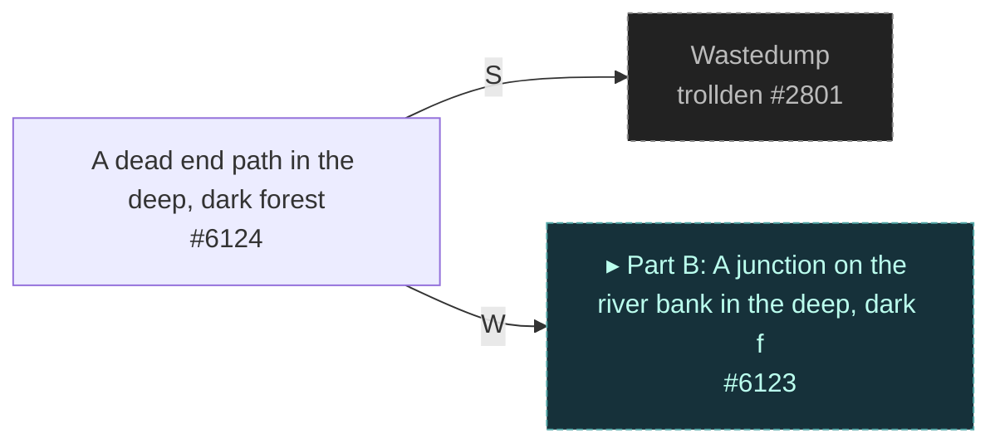
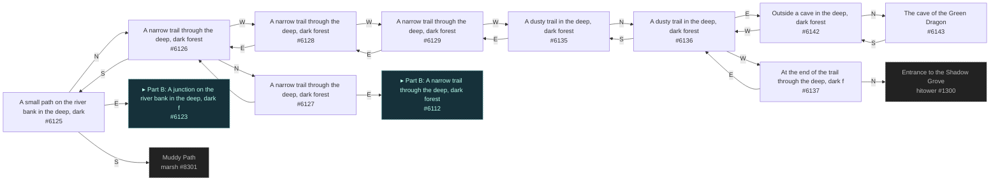
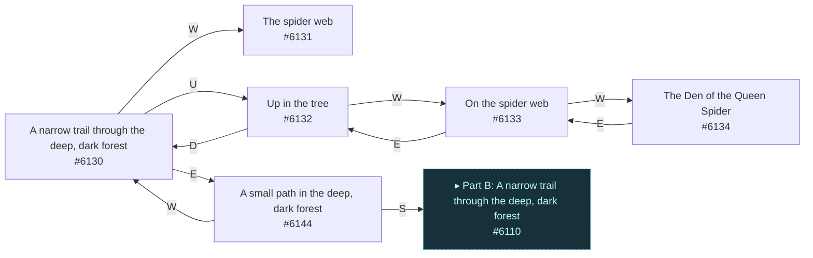
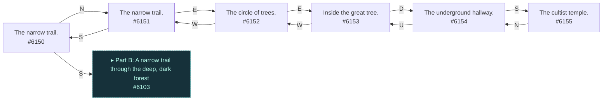

# Diku Haon Dor  `(haon)`

[← back to world map](WORLD-MAP.md) · 71 rooms · vnums 6000–6155

Grey dashed nodes leave the area; green dashed nodes (`▸ Part X`) continue on another sub-map below.

_This area is split into 6 sub-maps for legibility._

## Map — Part A (24 rooms: #6000–#6023)

```mermaid
graph LR
  R6000["The edge of the forest<br/>#6000"]
  R6001["A trail through the light forest<br/>#6001"]
  R6002["A trail through the light forest<br/>#6002"]
  R6003["A trail through the dense forest<br/>#6003"]
  R6004["A trail through the dense forest<br/>#6004"]
  R6005["A small path in the dense forest<br/>#6005"]
  R6006["A small path in the dense forest<br/>#6006"]
  R6007["An intersection in the dense forest<br/>#6007"]
  R6008["The forest clearing<br/>#6008"]
  R6009["Outside a small cabin in the forest<br/>#6009"]
  R6010["Inside the cabin<br/>#6010"]
  R6011["A small path through the light forest<br/>#6011"]
  R6012["An intersection in the dense forest<br/>#6012"]
  R6013["A small path in the dense forest<br/>#6013"]
  R6014["An intersection in the dense forest<br/>#6014"]
  R6015["A small path in the dense forest<br/>#6015"]
  R6016["A small path in the dense forest<br/>#6016"]
  R6017["A small path in the dense forest<br/>#6017"]
  R6018["An intersection in the light forest<br/>#6018"]
  R6019["A small path in the dense forest<br/>#6019"]
  R6020["A small path in the dense forest<br/>#6020"]
  R6021["A small path in the dense forest<br/>#6021"]
  R6022["Inside the cave<br/>#6022"]
  R6023["On a small, grassy field<br/>#6023"]
  R6000 -->|N| X1100
  R6000 -->|E| X3052
  R6000 -->|W| R6001
  R6001 -->|E| R6000
  R6001 -->|W| R6002
  R6002 -->|E| R6001
  R6002 -->|S| R6011
  R6002 -->|W| R6003
  R6003 -->|E| R6002
  R6003 -->|W| R6004
  R6004 -->|E| R6003
  R6004 -->|S| R6005
  R6004 -->|W| X6100
  R6005 -->|N| R6004
  R6005 -->|S| R6006
  R6006 -->|N| R6005
  R6006 -->|E| R6007
  R6007 -->|E| R6008
  R6007 -->|S| R6012
  R6007 -->|W| R6006
  R6008 -->|N| R6011
  R6008 -->|E| R6009
  R6008 -->|W| R6007
  R6009 -->|N| R6010
  R6009 -->|S| R6014
  R6009 -->|W| R6008
  R6010 -->|S| R6009
  R6011 -->|N| R6002
  R6011 -->|S| R6008
  R6012 -->|N| R6007
  R6012 -->|E| R6013
  R6012 -->|S| R6021
  R6013 -->|E| R6014
  R6013 -->|W| R6012
  R6014 -->|N| R6009
  R6014 -->|E| R6015
  R6014 -->|W| R6013
  R6015 -->|S| R6016
  R6015 -->|W| R6014
  R6016 -->|N| R6015
  R6016 -->|S| R6017
  R6017 -->|N| R6016
  R6017 -->|W| R6018
  R6018 -->|N| R6023
  R6018 -->|E| R6017
  R6018 -->|W| R6019
  R6019 -->|N| R6020
  R6019 -->|E| R6018
  R6020 -->|S| R6019
  R6020 -->|W| R6021
  R6021 -->|N| R6012
  R6021 -->|E| R6020
  R6021 -->|W| R6022
  R6022 -->|E| R6021
  R6023 -->|S| R6018
  X1100["A dimly lit path<br/>shire #1100"]:::ext
  X3052["Outside the West Gate of Midgaard<br/>midgaard #3052"]:::ext
  X6100["▸ Part B: A narrow trail through the deep, dark forest<br/>#6100"]:::part
  classDef ext fill:#222,stroke:#888,color:#bbb,stroke-dasharray:3 3;
  classDef part fill:#16313a,stroke:#5aa,color:#bfe,stroke-dasharray:4 2;
```

## Map — Part B (24 rooms: #6100–#6123)

```mermaid
graph LR
  R6100["A narrow trail through the deep, dark forest<br/>#6100"]
  R6101["A narrow trail through the deep, dark forest<br/>#6101"]
  R6102["A narrow trail through the deep, dark forest<br/>#6102"]
  R6103["A narrow trail through the deep, dark forest<br/>#6103"]
  R6104["A small path in the deep, dark forest<br/>#6104"]
  R6105["A small path in the deep, dark forest<br/>#6105"]
  R6106["A junction in the deep, dark forest<br/>#6106"]
  R6107["A small path in the deep, dark forest<br/>#6107"]
  R6108["A narrow trail through the deep, dark forest<br/>#6108"]
  R6109["A narrow trail through the deep, dark forest<br/>#6109"]
  R6110["A narrow trail through the deep, dark forest<br/>#6110"]
  R6111["A narrow trail through the deep, dark forest<br/>#6111"]
  R6112["A narrow trail through the deep, dark forest<br/>#6112"]
  R6113["A small path in the deep, dark forest<br/>#6113"]
  R6114["A junction in the deep, dark forest<br/>#6114"]
  R6115["A small path in the deep, dark forest<br/>#6115"]
  R6116["A small path in the deep, dark forest<br/>#6116"]
  R6117["A junction in the deep, dark forest<br/>#6117"]
  R6118["A small path in the deep, dark forest<br/>#6118"]
  R6119["A small path in the deep, dark forest<br/>#6119"]
  R6120["On the river bank in the deep, dark forest<br/>#6120"]
  R6121["A dead end path on the river bank in the deep, d<br/>#6121"]
  R6122["A small path in the deep, dark forest<br/>#6122"]
  R6123["A junction on the river bank in the deep, dark f<br/>#6123"]
  R6100 -->|E| X6004
  R6100 -->|W| R6101
  R6101 -->|E| R6100
  R6101 -->|S| R6104
  R6101 -->|W| R6102
  R6102 -->|E| R6101
  R6102 -->|W| R6103
  R6103 -->|N| X6150
  R6103 -->|E| R6102
  R6103 -->|S| R6108
  R6104 -->|N| R6101
  R6104 -->|S| R6105
  R6105 -->|N| R6104
  R6105 -->|W| R6106
  R6106 -->|E| R6105
  R6106 -->|S| R6117
  R6106 -->|W| R6107
  R6107 -->|N| R6108
  R6107 -->|E| R6106
  R6108 -->|N| R6103
  R6108 -->|S| R6107
  R6108 -->|W| R6109
  R6109 -->|E| R6108
  R6109 -->|W| R6110
  R6110 -->|N| X6144
  R6110 -->|E| R6109
  R6110 -->|S| R6111
  R6111 -->|N| R6110
  R6111 -->|S| R6112
  R6112 -->|N| R6111
  R6112 -->|E| R6113
  R6112 -->|W| X6127
  R6113 -->|S| R6114
  R6113 -->|W| R6112
  R6114 -->|N| R6113
  R6114 -->|E| R6115
  R6114 -->|W| R6122
  R6115 -->|N| R6116
  R6115 -->|W| R6114
  R6116 -->|E| R6117
  R6116 -->|S| R6115
  R6117 -->|N| R6106
  R6117 -->|E| R6118
  R6117 -->|W| R6116
  R6118 -->|S| R6119
  R6118 -->|W| R6117
  R6119 -->|N| R6118
  R6119 -->|S| R6120
  R6120 -->|N| R6119
  R6120 -->|W| R6121
  R6121 -->|E| R6120
  R6122 -->|E| R6114
  R6122 -->|S| R6123
  R6123 -->|N| R6122
  R6123 -->|E| X6124
  R6123 -->|W| X6125
  X6004["▸ Part A: A trail through the dense forest<br/>#6004"]:::part
  X6150["▸ Part F: The narrow trail.<br/>#6150"]:::part
  X6144["▸ Part E: A small path in the deep, dark forest<br/>#6144"]:::part
  X6127["▸ Part D: A narrow trail through the deep, dark forest<br/>#6127"]:::part
  X6124["▸ Part C: A dead end path in the deep, dark forest<br/>#6124"]:::part
  X6125["▸ Part D: A small path on the river bank in the deep, dark<br/>#6125"]:::part
  classDef ext fill:#222,stroke:#888,color:#bbb,stroke-dasharray:3 3;
  classDef part fill:#16313a,stroke:#5aa,color:#bfe,stroke-dasharray:4 2;
```

## Map — Part C (1 rooms: #6124–#6124)

## Map — Part D (10 rooms: #6125–#6143)

## Map — Part E (6 rooms: #6130–#6144)

## Map — Part F (6 rooms: #6150–#6155)

## Rooms

| VNUM | Name | Exits |
|---:|---|---|
| 6000 | The edge of the forest | N→1100 E→3052 W→6001 |
| 6001 | A trail through the light forest | E→6000 W→6002 |
| 6002 | A trail through the light forest | E→6001 S→6011 W→6003 |
| 6003 | A trail through the dense forest | E→6002 W→6004 |
| 6004 | A trail through the dense forest | E→6003 S→6005 W→6100 |
| 6005 | A small path in the dense forest | N→6004 S→6006 |
| 6006 | A small path in the dense forest | N→6005 E→6007 |
| 6007 | An intersection in the dense forest | E→6008 S→6012 W→6006 |
| 6008 | The forest clearing | N→6011 E→6009 W→6007 |
| 6009 | Outside a small cabin in the forest | N→6010 S→6014 W→6008 |
| 6010 | Inside the cabin | S→6009 |
| 6011 | A small path through the light forest | N→6002 S→6008 |
| 6012 | An intersection in the dense forest | N→6007 E→6013 S→6021 |
| 6013 | A small path in the dense forest | E→6014 W→6012 |
| 6014 | An intersection in the dense forest | N→6009 E→6015 W→6013 |
| 6015 | A small path in the dense forest | S→6016 W→6014 |
| 6016 | A small path in the dense forest | N→6015 S→6017 |
| 6017 | A small path in the dense forest | N→6016 W→6018 |
| 6018 | An intersection in the light forest | N→6023 E→6017 W→6019 |
| 6019 | A small path in the dense forest | N→6020 E→6018 |
| 6020 | A small path in the dense forest | S→6019 W→6021 |
| 6021 | A small path in the dense forest | N→6012 E→6020 W→6022 |
| 6022 | Inside the cave | E→6021 |
| 6023 | On a small, grassy field | S→6018 |
| 6100 | A narrow trail through the deep, dark forest | E→6004 W→6101 |
| 6101 | A narrow trail through the deep, dark forest | E→6100 S→6104 W→6102 |
| 6102 | A narrow trail through the deep, dark forest | E→6101 W→6103 |
| 6103 | A narrow trail through the deep, dark forest | N→6150 E→6102 S→6108 |
| 6104 | A small path in the deep, dark forest | N→6101 S→6105 |
| 6105 | A small path in the deep, dark forest | N→6104 W→6106 |
| 6106 | A junction in the deep, dark forest | E→6105 S→6117 W→6107 |
| 6107 | A small path in the deep, dark forest | N→6108 E→6106 |
| 6108 | A narrow trail through the deep, dark forest | N→6103 S→6107 W→6109 |
| 6109 | A narrow trail through the deep, dark forest | E→6108 W→6110 |
| 6110 | A narrow trail through the deep, dark forest | N→6144 E→6109 S→6111 |
| 6111 | A narrow trail through the deep, dark forest | N→6110 S→6112 |
| 6112 | A narrow trail through the deep, dark forest | N→6111 E→6113 W→6127 |
| 6113 | A small path in the deep, dark forest | S→6114 W→6112 |
| 6114 | A junction in the deep, dark forest | N→6113 E→6115 W→6122 |
| 6115 | A small path in the deep, dark forest | N→6116 W→6114 |
| 6116 | A small path in the deep, dark forest | E→6117 S→6115 |
| 6117 | A junction in the deep, dark forest | N→6106 E→6118 W→6116 |
| 6118 | A small path in the deep, dark forest | S→6119 W→6117 |
| 6119 | A small path in the deep, dark forest | N→6118 S→6120 |
| 6120 | On the river bank in the deep, dark forest | N→6119 W→6121 |
| 6121 | A dead end path on the river bank in the deep, dark forest | E→6120 |
| 6122 | A small path in the deep, dark forest | E→6114 S→6123 |
| 6123 | A junction on the river bank in the deep, dark forest | N→6122 E→6124 W→6125 |
| 6124 | A dead end path in the deep, dark forest | S→2801 W→6123 |
| 6125 | A small path on the river bank in the deep, dark forest | N→6126 E→6123 S→8301 |
| 6126 | A narrow trail through the deep, dark forest | N→6127 S→6125 W→6128 |
| 6127 | A narrow trail through the deep, dark forest | E→6112 S→6126 |
| 6128 | A narrow trail through the deep, dark forest | E→6126 W→6129 |
| 6129 | A narrow trail through the deep, dark forest | E→6128 W→6135 |
| 6130 | A narrow trail through the deep, dark forest | E→6144 W→6131 U→6132 |
| 6131 | The spider web | — |
| 6132 | Up in the tree | W→6133 D→6130 |
| 6133 | On the spider web | E→6132 W→6134 |
| 6134 | The Den of the Queen Spider | E→6133 |
| 6135 | A dusty trail in the deep, dark forest | N→6136 E→6129 |
| 6136 | A dusty trail in the deep, dark forest | E→6142 S→6135 W→6137 |
| 6137 | At the end of the trail through the deep, dark forest | N→1300 E→6136 |
| 6142 | Outside a cave in the deep, dark forest | N→6143 W→6136 |
| 6143 | The cave of the Green Dragon | S→6142 |
| 6144 | A small path in the deep, dark forest | S→6110 W→6130 |
| 6150 | The narrow trail. | N→6151 S→6103 |
| 6151 | The narrow trail. | E→6152 S→6150 |
| 6152 | The circle of trees. | E→6153 W→6151 |
| 6153 | Inside the great tree. | W→6152 D→6154 |
| 6154 | The underground hallway. | S→6155 U→6153 |
| 6155 | The cultist temple. | N→6154 |

