# Mahatma Little Haven/Glass Fort  `(haven)`

[← back to world map](../WORLD-MAP.md) · 33 rooms · vnums 1801–1833

Dashed nodes are exits that leave this area.

```mermaid
graph LR
  R1801["The Big, Blue Ocean<br/>#1801"]
  R1802["The Big, Blue Ocean<br/>#1802"]
  R1803["The Big, Blue Ocean<br/>#1803"]
  R1804["The Icy Waters<br/>#1804"]
  R1805["The Hardpack<br/>#1805"]
  R1806["The Snow-filled Land<br/>#1806"]
  R1807["The Gnome Outpost<br/>#1807"]
  R1808["The Tight Passage<br/>#1808"]
  R1809["The Even Tighter Passage<br/>#1809"]
  R1810["The Center Chamber<br/>#1810"]
  R1811["A Passageway<br/>#1811"]
  R1812["The Cold Passageway<br/>#1812"]
  R1813["The Warm Passageway<br/>#1813"]
  R1814["The Little Temple<br/>#1814"]
  R1815["The Vestibule<br/>#1815"]
  R1816["The Chanting Room<br/>#1816"]
  R1817["The Furnace<br/>#1817"]
  R1818["The Arboretum<br/>#1818"]
  R1819["The Snow Queen's Chamber<br/>#1819"]
  R1820["The Master Herbal's Room<br/>#1820"]
  R1821["The Guard's Dining Hall<br/>#1821"]
  R1822["The Vat Room<br/>#1822"]
  R1823["The Frost Giant Guard Quarters<br/>#1823"]
  R1824["The White Dragon's Lair<br/>#1824"]
  R1825["The Blue Dragon's Lair<br/>#1825"]
  R1826["The connecting tunnel<br/>#1826"]
  R1827["The Great Door<br/>#1827"]
  R1828["The Snow Queen's Entry Hall<br/>#1828"]
  R1829["Another Mirrored Room<br/>#1829"]
  R1830["Another Mirrored Room<br/>#1830"]
  R1831["The Snow-filled Land<br/>#1831"]
  R1832["The Snow-filled Land<br/>#1832"]
  R1833["The Snow-filled Land<br/>#1833"]
  R1801 -->|E| X3200
  R1801 -->|W| R1802
  R1802 -->|S| R1803
  R1803 -->|S| R1804
  R1804 -->|S| R1805
  R1805 -->|N| R1804
  R1805 -->|S| R1806
  R1806 -->|N| R1805
  R1806 -->|E| R1831
  R1806 -->|S| R1832
  R1806 -->|W| R1831
  R1807 -->|N| R1833
  R1807 -->|D| R1808
  R1808 -->|U| R1807
  R1808 -->|D| R1809
  R1809 -->|U| R1808
  R1809 -->|D| R1810
  R1810 -->|E| R1811
  R1810 -->|W| R1813
  R1811 -->|E| R1812
  R1811 -->|W| R1810
  R1812 -->|N| R1821
  R1812 -->|W| R1811
  R1813 -->|E| R1810
  R1813 -->|W| R1816
  R1814 -->|N| R1817
  R1814 -->|S| R1815
  R1815 -->|N| R1814
  R1815 -->|S| R1818
  R1816 -->|N| R1818
  R1816 -->|E| R1813
  R1817 -->|N| R1827
  R1817 -->|S| R1814
  R1818 -->|N| R1815
  R1818 -->|E| R1820
  R1818 -->|S| R1816
  R1820 -->|W| R1818
  R1820 -->|D| R1815
  R1821 -->|N| R1823
  R1821 -->|E| R1822
  R1821 -->|S| R1812
  R1822 -->|W| R1821
  R1823 -->|N| R1826
  R1823 -->|S| R1821
  R1824 -->|N| R1825
  R1824 -->|S| R1826
  R1825 -->|D| R1822
  R1826 -->|N| R1824
  R1826 -->|S| R1823
  R1827 -->|N| R1828
  R1827 -->|S| R1817
  R1828 -->|N| R1829
  R1828 -->|E| R1829
  R1828 -->|S| R1827
  R1828 -->|W| R1829
  R1829 -->|N| R1830
  R1829 -->|E| R1828
  R1829 -->|S| R1828
  R1829 -->|W| R1828
  R1830 -->|N| R1819
  R1830 -->|E| R1830
  R1830 -->|S| R1829
  R1830 -->|W| R1830
  R1831 -->|N| R1832
  R1831 -->|E| R1806
  R1831 -->|S| R1833
  R1831 -->|W| R1806
  R1832 -->|N| R1806
  R1832 -->|E| R1833
  R1832 -->|S| R1831
  R1832 -->|W| R1833
  R1833 -->|N| R1831
  R1833 -->|E| R1832
  R1833 -->|S| R1807
  R1833 -->|W| R1832
  X3200["Under the Bridge<br/>midgaard #3200"]:::ext
  classDef ext fill:#222,stroke:#888,color:#bbb,stroke-dasharray:3 3;
```

## Rooms

| VNUM | Name | Exits |
|---:|---|---|
| 1801 | The Big, Blue Ocean | E→3200 W→1802 |
| 1802 | The Big, Blue Ocean | S→1803 |
| 1803 | The Big, Blue Ocean | S→1804 |
| 1804 | The Icy Waters | S→1805 |
| 1805 | The Hardpack | N→1804 S→1806 |
| 1806 | The Snow-filled Land | N→1805 E→1831 S→1832 W→1831 |
| 1807 | The Gnome Outpost | N→1833 D→1808 |
| 1808 | The Tight Passage | U→1807 D→1809 |
| 1809 | The Even Tighter Passage | U→1808 D→1810 |
| 1810 | The Center Chamber | E→1811 W→1813 |
| 1811 | A Passageway | E→1812 W→1810 |
| 1812 | The Cold Passageway | N→1821 W→1811 |
| 1813 | The Warm Passageway | E→1810 W→1816 |
| 1814 | The Little Temple | N→1817 S→1815 |
| 1815 | The Vestibule | N→1814 S→1818 |
| 1816 | The Chanting Room | N→1818 E→1813 |
| 1817 | The Furnace | N→1827 S→1814 |
| 1818 | The Arboretum | N→1815 E→1820 S→1816 |
| 1819 | The Snow Queen's Chamber | — |
| 1820 | The Master Herbal's Room | W→1818 D→1815 |
| 1821 | The Guard's Dining Hall | N→1823 E→1822 S→1812 |
| 1822 | The Vat Room | W→1821 |
| 1823 | The Frost Giant Guard Quarters | N→1826 S→1821 |
| 1824 | The White Dragon's Lair | N→1825 S→1826 |
| 1825 | The Blue Dragon's Lair | D→1822 |
| 1826 | The connecting tunnel | N→1824 S→1823 |
| 1827 | The Great Door | N→1828 S→1817 |
| 1828 | The Snow Queen's Entry Hall | N→1829 E→1829 S→1827 W→1829 |
| 1829 | Another Mirrored Room | N→1830 E→1828 S→1828 W→1828 |
| 1830 | Another Mirrored Room | N→1819 E→1830 S→1829 W→1830 |
| 1831 | The Snow-filled Land | N→1832 E→1806 S→1833 W→1806 |
| 1832 | The Snow-filled Land | N→1806 E→1833 S→1831 W→1833 |
| 1833 | The Snow-filled Land | N→1831 E→1832 S→1807 W→1832 |

