# Anon High Tower of Sorcery  `(hitower)`

[← back to world map](../WORLD-MAP.md) · 184 rooms · vnums 1200–1499

Dashed nodes are exits that leave this area.

```mermaid
graph LR
  R1200["The Chat Room<br/>#1200"]
  R1300["Entrance to the Shadow Grove<br/>#1300"]
  R1301["The Shadow Grove<br/>#1301"]
  R1302["The Shadow Grove<br/>#1302"]
  R1303["The Shadow Grove<br/>#1303"]
  R1304["The Shadow Grove<br/>#1304"]
  R1305["The Shadow Grove<br/>#1305"]
  R1306["The Shadow Grove<br/>#1306"]
  R1307["The Shadow Grove<br/>#1307"]
  R1308["The Shadow Grove<br/>#1308"]
  R1309["The Shadow Grove<br/>#1309"]
  R1311["A small clearing<br/>#1311"]
  R1312["Entrance to the High Tower<br/>#1312"]
  R1313["Inside the High Tower of Sorcerery<br/>#1313"]
  R1314["Common Room<br/>#1314"]
  R1315["The Hallway<br/>#1315"]
  R1316["Dining Room<br/>#1316"]
  R1317["Dark Hallway<br/>#1317"]
  R1318["Mages Tavern<br/>#1318"]
  R1319["The Magic Shop<br/>#1319"]
  R1320["the kitchen<br/>#1320"]
  R1321["Below the trapdoor<br/>#1321"]
  R1322["A damp intersection<br/>#1322"]
  R1323["A dark passage<br/>#1323"]
  R1324["A dark passage<br/>#1324"]
  R1325["The stagnant pool<br/>#1325"]
  R1326["A dark passage<br/>#1326"]
  R1327["A dark cell<br/>#1327"]
  R1328["The Jailor's office<br/>#1328"]
  R1329["Below the stagnant pool<br/>#1329"]
  R1330["The hallway<br/>#1330"]
  R1331["A bend in the hallway<br/>#1331"]
  R1332["A store room<br/>#1332"]
  R1333["A broom closet<br/>#1333"]
  R1334["A hallway<br/>#1334"]
  R1335["Guardians chamber<br/>#1335"]
  R1336["A guest bedroom<br/>#1336"]
  R1337["A guest bedroom<br/>#1337"]
  R1338["A hallway<br/>#1338"]
  R1339["The burnt room<br/>#1339"]
  R1340["A hallway<br/>#1340"]
  R1341["A culdesac<br/>#1341"]
  R1342["The Apprentice's Barracks<br/>#1342"]
  R1343["A hallway<br/>#1343"]
  R1344["The Apprentice's barracks<br/>#1344"]
  R1345["A hallway<br/>#1345"]
  R1346["The apprentice's workshop<br/>#1346"]
  R1347["A bend in the hallway<br/>#1347"]
  R1348["The hallway<br/>#1348"]
  R1349["A classroom<br/>#1349"]
  R1350["A hallway<br/>#1350"]
  R1351["A hallway<br/>#1351"]
  R1352["An empty classroom<br/>#1352"]
  R1353["A bend in the hallway<br/>#1353"]
  R1354["An empty classroom<br/>#1354"]
  R1355["A hallway<br/>#1355"]
  R1356["A hallway<br/>#1356"]
  R1357["The Amphitheater<br/>#1357"]
  R1358["A hallway<br/>#1358"]
  R1359["The training room<br/>#1359"]
  R1360["A bend in the hallway<br/>#1360"]
  R1361["A dueling room<br/>#1361"]
  R1362["A hallway<br/>#1362"]
  R1363["A hallway<br/>#1363"]
  R1364["The spellmaster's lounge<br/>#1364"]
  R1365["A bedroom<br/>#1365"]
  R1366["A hallway<br/>#1366"]
  R1367["The study<br/>#1367"]
  R1368["Below the stairs<br/>#1368"]
  R1369["Atop the stairway<br/>#1369"]
  R1370["A hallway<br/>#1370"]
  R1371["A small office<br/>#1371"]
  R1372["A hallway<br/>#1372"]
  R1373["The master scribe's workshop<br/>#1373"]
  R1374["A hallway<br/>#1374"]
  R1375["A store room<br/>#1375"]
  R1376["A bend in the hallway<br/>#1376"]
  R1377["A hallway<br/>#1377"]
  R1378["A hallway<br/>#1378"]
  R1379["A store room<br/>#1379"]
  R1380["A hallway<br/>#1380"]
  R1381["A very hot room<br/>#1381"]
  R1382["The master Enchanter's chamber<br/>#1382"]
  R1383["A bend in the hallway<br/>#1383"]
  R1384["A hallway<br/>#1384"]
  R1385["A hallway<br/>#1385"]
  R1386["A laboratory<br/>#1386"]
  R1387["A hallway<br/>#1387"]
  R1388["The Mad Alchemist's workroom<br/>#1388"]
  R1389["A bend in the hallway<br/>#1389"]
  R1390["The pentagram chamber<br/>#1390"]
  R1391["A hallway<br/>#1391"]
  R1392["Inside the Energy Field<br/>#1392"]
  R1393["A hallway<br/>#1393"]
  R1394["An empty room<br/>#1394"]
  R1395["The charm master's chamber<br/>#1395"]
  R1396["A hallway<br/>#1396"]
  R1397["The animal pens<br/>#1397"]
  R1398["The end of the hallway<br/>#1398"]
  R1399["Atop the stairway<br/>#1399"]
  R1400["A hallway<br/>#1400"]
  R1401["A store room<br/>#1401"]
  R1402["The master spellbinder's chamber<br/>#1402"]
  R1403["The spellbinder's cache<br/>#1403"]
  R1404["A hallway<br/>#1404"]
  R1405["A hallway<br/>#1405"]
  R1406["A bend in the hallway<br/>#1406"]
  R1407["A hallway<br/>#1407"]
  R1408["A hallway<br/>#1408"]
  R1409["The golem master's workshop<br/>#1409"]
  R1410["A store room<br/>#1410"]
  R1411["The golem chamber<br/>#1411"]
  R1412["It is very dark here...<br/>#1412"]
  R1413["A hallway<br/>#1413"]
  R1414["A bend in the hallway<br/>#1414"]
  R1415["A hallway<br/>#1415"]
  R1416["A hallway<br/>#1416"]
  R1417["The master of illusion's chamber<br/>#1417"]
  R1418["A bedroom<br/>#1418"]
  R1419["A hallway<br/>#1419"]
  R1420["The meditation chamber<br/>#1420"]
  R1421["A bend in the hallway<br/>#1421"]
  R1422["A hallway<br/>#1422"]
  R1423["A dark room<br/>#1423"]
  R1424["A dark room<br/>#1424"]
  R1425["The Necromancer's Lair<br/>#1425"]
  R1426["A hallway<br/>#1426"]
  R1427["A hallway<br/>#1427"]
  R1428["The end of the hallway<br/>#1428"]
  R1429["A corridor<br/>#1429"]
  R1430["A corridor<br/>#1430"]
  R1431["A bend in the corridor<br/>#1431"]
  R1432["A corridor<br/>#1432"]
  R1433["An intersection<br/>#1433"]
  R1434["A corridor<br/>#1434"]
  R1435["The scrying chamber<br/>#1435"]
  R1436["A corridor<br/>#1436"]
  R1437["The entrance to the library<br/>#1437"]
  R1438["In the library<br/>#1438"]
  R1439["In the library<br/>#1439"]
  R1440["In the library<br/>#1440"]
  R1441["In the library<br/>#1441"]
  R1442["In the library<br/>#1442"]
  R1443["In the library<br/>#1443"]
  R1444["Between the shelves<br/>#1444"]
  R1445["The reading room<br/>#1445"]
  R1446["A corridor<br/>#1446"]
  R1447["The end of the corridor<br/>#1447"]
  R1448["The arched entrance<br/>#1448"]
  R1449["The landing<br/>#1449"]
  R1450["An intersection<br/>#1450"]
  R1451["A grey tiled hallway<br/>#1451"]
  R1452["A grey tiled hallway<br/>#1452"]
  R1453["The antechamber<br/>#1453"]
  R1454["The main chamber<br/>#1454"]
  R1455["The study<br/>#1455"]
  R1456["A closet<br/>#1456"]
  R1457["A bedroom<br/>#1457"]
  R1458["A dark hallway<br/>#1458"]
  R1459["A dark hallway<br/>#1459"]
  R1460["The end of the hallway<br/>#1460"]
  R1461["The chamber of darkness<br/>#1461"]
  R1462["It is very dark here...<br/>#1462"]
  R1463["Torture chamber<br/>#1463"]
  R1464["The inner chamber<br/>#1464"]
  R1465["A bright hallway<br/>#1465"]
  R1466["A bright hallway<br/>#1466"]
  R1467["An antechamber<br/>#1467"]
  R1469["The chamber of the white light<br/>#1469"]
  R1470["The meditation chamber<br/>#1470"]
  R1471["A study<br/>#1471"]
  R1472["A closet<br/>#1472"]
  R1473["A wide hallway<br/>#1473"]
  R1474["A wide hallway<br/>#1474"]
  R1475["A wide hallway<br/>#1475"]
  R1476["The entranceway<br/>#1476"]
  R1477["The audience chamber<br/>#1477"]
  R1478["A dressing room<br/>#1478"]
  R1479["The library<br/>#1479"]
  R1480["The altar<br/>#1480"]
  R1481["The treasury<br/>#1481"]
  R1482["A passage<br/>#1482"]
  R1483["In the light<br/>#1483"]
  R1499["Skylar's Hideout<br/>#1499"]
  R1300 -->|N| R1308
  R1300 -->|S| X6137
  R1301 -->|N| R1307
  R1301 -->|E| R1302
  R1301 -->|S| R1304
  R1301 -->|W| R1303
  R1302 -->|N| R1311
  R1302 -->|E| R1303
  R1302 -->|S| R1305
  R1302 -->|W| R1301
  R1303 -->|N| R1309
  R1303 -->|E| R1301
  R1303 -->|S| R1306
  R1303 -->|W| R1302
  R1304 -->|N| R1301
  R1304 -->|E| R1305
  R1304 -->|S| R1307
  R1304 -->|W| X2201
  R1305 -->|N| R1302
  R1305 -->|E| R1306
  R1305 -->|S| R1308
  R1305 -->|W| R1304
  R1306 -->|N| R1303
  R1306 -->|E| X9301
  R1306 -->|S| R1309
  R1306 -->|W| R1305
  R1307 -->|N| R1304
  R1307 -->|E| R1308
  R1307 -->|S| R1301
  R1307 -->|W| R1309
  R1308 -->|N| R1305
  R1308 -->|E| R1309
  R1308 -->|S| R1300
  R1308 -->|W| R1307
  R1309 -->|N| R1306
  R1309 -->|E| R1307
  R1309 -->|S| R1303
  R1309 -->|W| R1308
  R1311 -->|N| R1312
  R1311 -->|S| R1302
  R1312 -->|N| R1313
  R1313 -->|N| R1314
  R1313 -->|E| R1315
  R1313 -->|S| R1312
  R1313 -->|W| R1316
  R1314 -->|N| R1317
  R1314 -->|E| R1318
  R1314 -->|S| R1313
  R1314 -->|W| R1319
  R1315 -->|E| R1330
  R1315 -->|W| R1313
  R1316 -->|E| R1313
  R1316 -->|W| R1320
  R1317 -->|S| R1314
  R1317 -->|D| R1321
  R1318 -->|W| R1314
  R1319 -->|E| R1314
  R1320 -->|E| R1316
  R1321 -->|U| R1317
  R1321 -->|D| R1322
  R1322 -->|N| R1323
  R1322 -->|E| R1324
  R1322 -->|S| R1325
  R1322 -->|W| R1326
  R1322 -->|U| R1321
  R1323 -->|N| R1327
  R1323 -->|S| R1322
  R1324 -->|E| R1328
  R1324 -->|W| R1322
  R1325 -->|N| R1322
  R1325 -->|D| R1329
  R1326 -->|E| R1322
  R1327 -->|S| R1323
  R1328 -->|W| R1324
  R1330 -->|N| R1332
  R1330 -->|E| R1331
  R1330 -->|S| R1333
  R1330 -->|W| R1315
  R1331 -->|N| R1334
  R1331 -->|E| R1336
  R1331 -->|S| R1335
  R1331 -->|W| R1330
  R1332 -->|S| R1330
  R1333 -->|N| R1330
  R1334 -->|N| R1338
  R1334 -->|E| R1337
  R1334 -->|S| R1331
  R1335 -->|N| R1331
  R1336 -->|W| R1331
  R1337 -->|W| R1334
  R1338 -->|E| R1339
  R1338 -->|S| R1334
  R1338 -->|U| R1340
  R1339 -->|W| R1338
  R1340 -->|N| R1342
  R1340 -->|E| R1341
  R1340 -->|W| R1343
  R1340 -->|D| R1338
  R1341 -->|W| R1340
  R1342 -->|S| R1340
  R1342 -->|W| R1344
  R1343 -->|N| R1344
  R1343 -->|E| R1340
  R1343 -->|W| R1345
  R1344 -->|E| R1342
  R1344 -->|S| R1343
  R1345 -->|N| R1346
  R1345 -->|E| R1343
  R1345 -->|W| R1347
  R1346 -->|S| R1345
  R1347 -->|E| R1345
  R1347 -->|S| R1348
  R1348 -->|N| R1347
  R1348 -->|S| R1350
  R1348 -->|W| R1349
  R1349 -->|E| R1348
  R1350 -->|N| R1348
  R1350 -->|S| R1351
  R1350 -->|W| R1352
  R1351 -->|N| R1350
  R1351 -->|S| R1353
  R1351 -->|W| R1354
  R1352 -->|E| R1350
  R1353 -->|N| R1351
  R1353 -->|E| R1355
  R1354 -->|E| R1351
  R1355 -->|E| R1356
  R1355 -->|S| R1357
  R1355 -->|W| R1353
  R1356 -->|E| R1358
  R1356 -->|S| R1359
  R1356 -->|W| R1355
  R1357 -->|N| R1355
  R1358 -->|E| R1360
  R1358 -->|S| R1361
  R1358 -->|W| R1356
  R1359 -->|N| R1356
  R1360 -->|N| R1362
  R1360 -->|W| R1358
  R1361 -->|N| R1358
  R1362 -->|N| R1363
  R1362 -->|E| R1364
  R1362 -->|S| R1360
  R1363 -->|N| R1366
  R1363 -->|E| R1365
  R1363 -->|S| R1362
  R1364 -->|W| R1362
  R1365 -->|W| R1363
  R1366 -->|N| R1368
  R1366 -->|E| R1367
  R1366 -->|S| R1363
  R1367 -->|W| R1366
  R1368 -->|S| R1366
  R1368 -->|U| R1369
  R1369 -->|W| R1370
  R1369 -->|D| R1368
  R1370 -->|N| R1371
  R1370 -->|E| R1369
  R1370 -->|W| R1372
  R1371 -->|S| R1370
  R1371 -->|W| R1373
  R1372 -->|E| R1370
  R1372 -->|W| R1374
  R1373 -->|E| R1371
  R1374 -->|N| R1375
  R1374 -->|E| R1372
  R1374 -->|W| R1376
  R1375 -->|S| R1374
  R1376 -->|E| R1374
  R1376 -->|S| R1377
  R1377 -->|N| R1376
  R1377 -->|S| R1378
  R1377 -->|W| R1379
  R1378 -->|N| R1377
  R1378 -->|S| R1380
  R1378 -->|W| R1381
  R1379 -->|E| R1377
  R1379 -->|S| R1381
  R1380 -->|N| R1378
  R1380 -->|S| R1383
  R1381 -->|N| R1379
  R1381 -->|E| R1378
  R1381 -->|S| R1382
  R1381 -->|U| R1412
  R1382 -->|N| R1381
  R1383 -->|N| R1380
  R1383 -->|E| R1384
  R1384 -->|E| R1385
  R1384 -->|S| R1386
  R1384 -->|W| R1383
  R1385 -->|E| R1387
  R1385 -->|W| R1384
  R1386 -->|N| R1384
  R1386 -->|E| R1388
  R1387 -->|E| R1389
  R1387 -->|S| R1390
  R1387 -->|W| R1385
  R1388 -->|W| R1386
  R1389 -->|N| R1391
  R1389 -->|W| R1387
  R1390 -->|N| R1387
  R1390 -->|S| R1392
  R1391 -->|N| R1393
  R1391 -->|E| R1394
  R1391 -->|S| R1389
  R1392 -->|E| X5113
  R1392 -->|W| X7428
  R1392 -->|U| X938
  R1393 -->|N| R1396
  R1393 -->|E| R1395
  R1393 -->|S| R1391
  R1394 -->|W| R1391
  R1395 -->|N| R1397
  R1395 -->|W| R1393
  R1396 -->|N| R1398
  R1396 -->|S| R1393
  R1397 -->|S| R1395
  R1398 -->|S| R1396
  R1398 -->|U| R1399
  R1399 -->|W| R1400
  R1399 -->|D| R1398
  R1400 -->|N| R1401
  R1400 -->|E| R1399
  R1400 -->|W| R1404
  R1401 -->|S| R1400
  R1401 -->|W| R1402
  R1402 -->|E| R1401
  R1402 -->|W| R1403
  R1403 -->|E| R1402
  R1403 -->|S| R1405
  R1404 -->|E| R1400
  R1404 -->|W| R1405
  R1405 -->|N| R1403
  R1405 -->|E| R1404
  R1405 -->|W| R1406
  R1406 -->|E| R1405
  R1406 -->|S| R1407
  R1407 -->|N| R1406
  R1407 -->|S| R1408
  R1408 -->|N| R1407
  R1408 -->|S| R1413
  R1408 -->|W| R1409
  R1409 -->|N| R1410
  R1409 -->|E| R1408
  R1409 -->|S| R1411
  R1409 -->|D| R1412
  R1410 -->|S| R1409
  R1411 -->|N| R1409
  R1412 -->|U| R1409
  R1412 -->|D| R1381
  R1413 -->|N| R1408
  R1413 -->|S| R1414
  R1414 -->|N| R1413
  R1414 -->|E| R1415
  R1415 -->|E| R1416
  R1415 -->|W| R1414
  R1416 -->|E| R1419
  R1416 -->|S| R1417
  R1416 -->|W| R1415
  R1417 -->|N| R1416
  R1417 -->|W| R1418
  R1418 -->|N| X0
  R1418 -->|E| R1417
  R1418 -->|S| X0
  R1418 -->|W| X0
  R1419 -->|E| R1421
  R1419 -->|S| R1420
  R1419 -->|W| R1416
  R1420 -->|N| R1419
  R1421 -->|N| R1422
  R1421 -->|W| R1419
  R1422 -->|N| R1426
  R1422 -->|E| R1423
  R1422 -->|S| R1421
  R1423 -->|N| R1424
  R1423 -->|W| R1422
  R1424 -->|N| R1425
  R1424 -->|S| R1423
  R1425 -->|S| R1424
  R1426 -->|N| R1427
  R1426 -->|S| R1422
  R1427 -->|N| R1428
  R1427 -->|S| R1426
  R1428 -->|S| R1427
  R1428 -->|U| R1429
  R1429 -->|W| R1430
  R1429 -->|D| R1428
  R1430 -->|E| R1429
  R1430 -->|W| R1431
  R1431 -->|E| R1430
  R1431 -->|S| R1432
  R1432 -->|N| R1431
  R1432 -->|S| R1433
  R1433 -->|N| R1432
  R1433 -->|E| R1434
  R1433 -->|S| R1446
  R1433 -->|W| R1436
  R1434 -->|E| R1435
  R1434 -->|W| R1433
  R1435 -->|W| R1434
  R1436 -->|E| R1433
  R1436 -->|W| R1437
  R1437 -->|N| R1439
  R1437 -->|E| R1436
  R1437 -->|S| R1440
  R1437 -->|W| R1438
  R1438 -->|N| R1441
  R1438 -->|E| R1437
  R1438 -->|S| R1442
  R1438 -->|W| R1443
  R1439 -->|N| R1440
  R1439 -->|E| R1442
  R1439 -->|S| R1437
  R1439 -->|W| R1441
  R1440 -->|N| R1437
  R1440 -->|E| R1441
  R1440 -->|S| R1439
  R1440 -->|W| R1442
  R1441 -->|N| R1442
  R1441 -->|E| R1439
  R1441 -->|S| R1438
  R1441 -->|W| R1440
  R1442 -->|N| R1438
  R1442 -->|E| R1440
  R1442 -->|S| R1441
  R1442 -->|W| R1439
  R1443 -->|E| R1438
  R1443 -->|W| R1444
  R1444 -->|N| R1445
  R1444 -->|E| R1443
  R1445 -->|S| R1444
  R1446 -->|N| R1433
  R1446 -->|S| R1447
  R1447 -->|N| R1446
  R1447 -->|S| R1448
  R1448 -->|N| R1447
  R1448 -->|U| R1449
  R1449 -->|U| R1450
  R1449 -->|D| R1448
  R1450 -->|N| R1473
  R1450 -->|E| R1458
  R1450 -->|S| R1451
  R1450 -->|W| R1465
  R1450 -->|D| R1449
  R1451 -->|N| R1450
  R1451 -->|S| R1452
  R1452 -->|N| R1451
  R1452 -->|S| R1453
  R1453 -->|N| R1452
  R1453 -->|S| R1454
  R1454 -->|N| R1453
  R1454 -->|E| R1456
  R1454 -->|S| R1457
  R1454 -->|W| R1455
  R1455 -->|E| R1454
  R1456 -->|W| R1454
  R1457 -->|N| R1454
  R1458 -->|E| R1459
  R1458 -->|W| R1450
  R1459 -->|E| R1460
  R1459 -->|W| R1458
  R1460 -->|E| R1461
  R1460 -->|W| R1459
  R1461 -->|N| R1462
  R1461 -->|E| R1464
  R1461 -->|S| R1463
  R1461 -->|W| R1460
  R1462 -->|S| R1461
  R1463 -->|N| R1461
  R1464 -->|W| R1461
  R1465 -->|E| R1450
  R1465 -->|W| R1466
  R1466 -->|E| R1465
  R1466 -->|W| R1467
  R1467 -->|E| R1466
  R1467 -->|W| R1469
  R1469 -->|N| R1470
  R1469 -->|E| R1467
  R1469 -->|S| R1471
  R1469 -->|W| R1472
  R1470 -->|S| R1469
  R1471 -->|N| R1469
  R1472 -->|E| R1469
  R1473 -->|N| R1474
  R1473 -->|S| R1450
  R1474 -->|N| R1475
  R1474 -->|S| R1473
  R1475 -->|N| R1476
  R1475 -->|S| R1474
  R1476 -->|N| R1477
  R1476 -->|S| R1475
  R1477 -->|N| R1480
  R1477 -->|E| R1478
  R1477 -->|S| R1476
  R1477 -->|W| R1479
  R1478 -->|W| R1477
  R1479 -->|E| R1477
  R1480 -->|E| R1481
  R1480 -->|S| R1477
  R1480 -->|W| R1482
  R1481 -->|W| R1480
  R1482 -->|W| R1483
  R1483 -->|U| X3001
  R1499 -->|D| X0
  X6137["At the end of the trail through the deep, dark f<br/>haon #6137"]:::ext
  X2201["The Tower Gates<br/>draconia #2201"]:::ext
  X9301["Inside a Tavern<br/>galaxy #9301"]:::ext
  X5113["Main Chamber<br/>drow #5113"]:::ext
  X7428["Dragons lair<br/>sewer #7428"]:::ext
  X938["The Planning Room<br/>olympus #938"]:::ext
  X0["?? broken<br/>#0"]:::ext
  X3001["The Temple Of Midgaard<br/>midgaard #3001"]:::ext
  classDef ext fill:#222,stroke:#888,color:#bbb,stroke-dasharray:3 3;
```

## Rooms

| VNUM | Name | Exits |
|---:|---|---|
| 1200 | The Chat Room | — |
| 1300 | Entrance to the Shadow Grove | N→1308 S→6137 |
| 1301 | The Shadow Grove | N→1307 E→1302 S→1304 W→1303 |
| 1302 | The Shadow Grove | N→1311 E→1303 S→1305 W→1301 |
| 1303 | The Shadow Grove | N→1309 E→1301 S→1306 W→1302 |
| 1304 | The Shadow Grove | N→1301 E→1305 S→1307 W→2201 |
| 1305 | The Shadow Grove | N→1302 E→1306 S→1308 W→1304 |
| 1306 | The Shadow Grove | N→1303 E→9301 S→1309 W→1305 |
| 1307 | The Shadow Grove | N→1304 E→1308 S→1301 W→1309 |
| 1308 | The Shadow Grove | N→1305 E→1309 S→1300 W→1307 |
| 1309 | The Shadow Grove | N→1306 E→1307 S→1303 W→1308 |
| 1311 | A small clearing | N→1312 S→1302 |
| 1312 | Entrance to the High Tower | N→1313 |
| 1313 | Inside the High Tower of Sorcerery | N→1314 E→1315 S→1312 W→1316 |
| 1314 | Common Room | N→1317 E→1318 S→1313 W→1319 |
| 1315 | The Hallway | E→1330 W→1313 |
| 1316 | Dining Room | E→1313 W→1320 |
| 1317 | Dark Hallway | S→1314 D→1321 |
| 1318 | Mages Tavern | W→1314 |
| 1319 | The Magic Shop | E→1314 |
| 1320 | the kitchen | E→1316 |
| 1321 | Below the trapdoor | U→1317 D→1322 |
| 1322 | A damp intersection | N→1323 E→1324 S→1325 W→1326 U→1321 |
| 1323 | A dark passage | N→1327 S→1322 |
| 1324 | A dark passage | E→1328 W→1322 |
| 1325 | The stagnant pool | N→1322 D→1329 |
| 1326 | A dark passage | E→1322 |
| 1327 | A dark cell | S→1323 |
| 1328 | The Jailor's office | W→1324 |
| 1329 | Below the stagnant pool | — |
| 1330 | The hallway | N→1332 E→1331 S→1333 W→1315 |
| 1331 | A bend in the hallway | N→1334 E→1336 S→1335 W→1330 |
| 1332 | A store room | S→1330 |
| 1333 | A broom closet | N→1330 |
| 1334 | A hallway | N→1338 E→1337 S→1331 |
| 1335 | Guardians chamber | N→1331 |
| 1336 | A guest bedroom | W→1331 |
| 1337 | A guest bedroom | W→1334 |
| 1338 | A hallway | E→1339 S→1334 U→1340 |
| 1339 | The burnt room | W→1338 |
| 1340 | A hallway | N→1342 E→1341 W→1343 D→1338 |
| 1341 | A culdesac | W→1340 |
| 1342 | The Apprentice's Barracks | S→1340 W→1344 |
| 1343 | A hallway | N→1344 E→1340 W→1345 |
| 1344 | The Apprentice's barracks | E→1342 S→1343 |
| 1345 | A hallway | N→1346 E→1343 W→1347 |
| 1346 | The apprentice's workshop | S→1345 |
| 1347 | A bend in the hallway | E→1345 S→1348 |
| 1348 | The hallway | N→1347 S→1350 W→1349 |
| 1349 | A classroom | E→1348 |
| 1350 | A hallway | N→1348 S→1351 W→1352 |
| 1351 | A hallway | N→1350 S→1353 W→1354 |
| 1352 | An empty classroom | E→1350 |
| 1353 | A bend in the hallway | N→1351 E→1355 |
| 1354 | An empty classroom | E→1351 |
| 1355 | A hallway | E→1356 S→1357 W→1353 |
| 1356 | A hallway | E→1358 S→1359 W→1355 |
| 1357 | The Amphitheater | N→1355 |
| 1358 | A hallway | E→1360 S→1361 W→1356 |
| 1359 | The training room | N→1356 |
| 1360 | A bend in the hallway | N→1362 W→1358 |
| 1361 | A dueling room | N→1358 |
| 1362 | A hallway | N→1363 E→1364 S→1360 |
| 1363 | A hallway | N→1366 E→1365 S→1362 |
| 1364 | The spellmaster's lounge | W→1362 |
| 1365 | A bedroom | W→1363 |
| 1366 | A hallway | N→1368 E→1367 S→1363 |
| 1367 | The study | W→1366 |
| 1368 | Below the stairs | S→1366 U→1369 |
| 1369 | Atop the stairway | W→1370 D→1368 |
| 1370 | A hallway | N→1371 E→1369 W→1372 |
| 1371 | A small office | S→1370 W→1373 |
| 1372 | A hallway | E→1370 W→1374 |
| 1373 | The master scribe's workshop | E→1371 |
| 1374 | A hallway | N→1375 E→1372 W→1376 |
| 1375 | A store room | S→1374 |
| 1376 | A bend in the hallway | E→1374 S→1377 |
| 1377 | A hallway | N→1376 S→1378 W→1379 |
| 1378 | A hallway | N→1377 S→1380 W→1381 |
| 1379 | A store room | E→1377 S→1381 |
| 1380 | A hallway | N→1378 S→1383 |
| 1381 | A very hot room | N→1379 E→1378 S→1382 U→1412 |
| 1382 | The master Enchanter's chamber | N→1381 |
| 1383 | A bend in the hallway | N→1380 E→1384 |
| 1384 | A hallway | E→1385 S→1386 W→1383 |
| 1385 | A hallway | E→1387 W→1384 |
| 1386 | A laboratory | N→1384 E→1388 |
| 1387 | A hallway | E→1389 S→1390 W→1385 |
| 1388 | The Mad Alchemist's workroom | W→1386 |
| 1389 | A bend in the hallway | N→1391 W→1387 |
| 1390 | The pentagram chamber | N→1387 S→1392 |
| 1391 | A hallway | N→1393 E→1394 S→1389 |
| 1392 | Inside the Energy Field | E→5113 W→7428 U→938 |
| 1393 | A hallway | N→1396 E→1395 S→1391 |
| 1394 | An empty room | W→1391 |
| 1395 | The charm master's chamber | N→1397 W→1393 |
| 1396 | A hallway | N→1398 S→1393 |
| 1397 | The animal pens | S→1395 |
| 1398 | The end of the hallway | S→1396 U→1399 |
| 1399 | Atop the stairway | W→1400 D→1398 |
| 1400 | A hallway | N→1401 E→1399 W→1404 |
| 1401 | A store room | S→1400 W→1402 |
| 1402 | The master spellbinder's chamber | E→1401 W→1403 |
| 1403 | The spellbinder's cache | E→1402 S→1405 |
| 1404 | A hallway | E→1400 W→1405 |
| 1405 | A hallway | N→1403 E→1404 W→1406 |
| 1406 | A bend in the hallway | E→1405 S→1407 |
| 1407 | A hallway | N→1406 S→1408 |
| 1408 | A hallway | N→1407 S→1413 W→1409 |
| 1409 | The golem master's workshop | N→1410 E→1408 S→1411 D→1412 |
| 1410 | A store room | S→1409 |
| 1411 | The golem chamber | N→1409 |
| 1412 | It is very dark here... | U→1409 D→1381 |
| 1413 | A hallway | N→1408 S→1414 |
| 1414 | A bend in the hallway | N→1413 E→1415 |
| 1415 | A hallway | E→1416 W→1414 |
| 1416 | A hallway | E→1419 S→1417 W→1415 |
| 1417 | The master of illusion's chamber | N→1416 W→1418 |
| 1418 | A bedroom | N→0 E→1417 S→0 W→0 |
| 1419 | A hallway | E→1421 S→1420 W→1416 |
| 1420 | The meditation chamber | N→1419 |
| 1421 | A bend in the hallway | N→1422 W→1419 |
| 1422 | A hallway | N→1426 E→1423 S→1421 |
| 1423 | A dark room | N→1424 W→1422 |
| 1424 | A dark room | N→1425 S→1423 |
| 1425 | The Necromancer's Lair | S→1424 |
| 1426 | A hallway | N→1427 S→1422 |
| 1427 | A hallway | N→1428 S→1426 |
| 1428 | The end of the hallway | S→1427 U→1429 |
| 1429 | A corridor | W→1430 D→1428 |
| 1430 | A corridor | E→1429 W→1431 |
| 1431 | A bend in the corridor | E→1430 S→1432 |
| 1432 | A corridor | N→1431 S→1433 |
| 1433 | An intersection | N→1432 E→1434 S→1446 W→1436 |
| 1434 | A corridor | E→1435 W→1433 |
| 1435 | The scrying chamber | W→1434 |
| 1436 | A corridor | E→1433 W→1437 |
| 1437 | The entrance to the library | N→1439 E→1436 S→1440 W→1438 |
| 1438 | In the library | N→1441 E→1437 S→1442 W→1443 |
| 1439 | In the library | N→1440 E→1442 S→1437 W→1441 |
| 1440 | In the library | N→1437 E→1441 S→1439 W→1442 |
| 1441 | In the library | N→1442 E→1439 S→1438 W→1440 |
| 1442 | In the library | N→1438 E→1440 S→1441 W→1439 |
| 1443 | In the library | E→1438 W→1444 |
| 1444 | Between the shelves | N→1445 E→1443 |
| 1445 | The reading room | S→1444 |
| 1446 | A corridor | N→1433 S→1447 |
| 1447 | The end of the corridor | N→1446 S→1448 |
| 1448 | The arched entrance | N→1447 U→1449 |
| 1449 | The landing | U→1450 D→1448 |
| 1450 | An intersection | N→1473 E→1458 S→1451 W→1465 D→1449 |
| 1451 | A grey tiled hallway | N→1450 S→1452 |
| 1452 | A grey tiled hallway | N→1451 S→1453 |
| 1453 | The antechamber | N→1452 S→1454 |
| 1454 | The main chamber | N→1453 E→1456 S→1457 W→1455 |
| 1455 | The study | E→1454 |
| 1456 | A closet | W→1454 |
| 1457 | A bedroom | N→1454 |
| 1458 | A dark hallway | E→1459 W→1450 |
| 1459 | A dark hallway | E→1460 W→1458 |
| 1460 | The end of the hallway | E→1461 W→1459 |
| 1461 | The chamber of darkness | N→1462 E→1464 S→1463 W→1460 |
| 1462 | It is very dark here... | S→1461 |
| 1463 | Torture chamber | N→1461 |
| 1464 | The inner chamber | W→1461 |
| 1465 | A bright hallway | E→1450 W→1466 |
| 1466 | A bright hallway | E→1465 W→1467 |
| 1467 | An antechamber | E→1466 W→1469 |
| 1469 | The chamber of the white light | N→1470 E→1467 S→1471 W→1472 |
| 1470 | The meditation chamber | S→1469 |
| 1471 | A study | N→1469 |
| 1472 | A closet | E→1469 |
| 1473 | A wide hallway | N→1474 S→1450 |
| 1474 | A wide hallway | N→1475 S→1473 |
| 1475 | A wide hallway | N→1476 S→1474 |
| 1476 | The entranceway | N→1477 S→1475 |
| 1477 | The audience chamber | N→1480 E→1478 S→1476 W→1479 |
| 1478 | A dressing room | W→1477 |
| 1479 | The library | E→1477 |
| 1480 | The altar | E→1481 S→1477 W→1482 |
| 1481 | The treasury | W→1480 |
| 1482 | A passage | W→1483 |
| 1483 | In the light | U→3001 |
| 1499 | Skylar's Hideout | D→0 |

