# Raff Dangerous Neighborhood  `(hood)`

[← back to world map](../WORLD-MAP.md) · 72 rooms · vnums 2101–2172

Dashed nodes are exits that leave this area.

```mermaid
graph LR
  R2101["A Dark Alleyway<br/>#2101"]
  R2102["Beginning of White Dragon Boulevard<br/>#2102"]
  R2103["Along White Dragon Boulevard<br/>#2103"]
  R2104["White Dragon Boulevard at Armory<br/>#2104"]
  R2105["White Dragon Blvd.<br/>#2105"]
  R2106["Corner of Ice and White Dragon<br/>#2106"]
  R2107["White Dragon Boulevard<br/>#2107"]
  R2108["Corner of Bronze and White Dragon<br/>#2108"]
  R2109["An over-grown lot<br/>#2109"]
  R2110["East end of an over-grown plot of land<br/>#2110"]
  R2111["Armory<br/>#2111"]
  R2112["A Bend in the Way<br/>#2112"]
  R2113["Ice Dragon Bend<br/>#2113"]
  R2114["The remains of the magic shop<br/>#2114"]
  R2115["Bronze Dragon Street at wizard's back door<br/>#2115"]
  R2116["Dracolich Plaza<br/>#2116"]
  R2117["Shortcut<br/>#2117"]
  R2118["Ice Dragon Way<br/>#2118"]
  R2119["Courtyard North<br/>#2119"]
  R2120["Bronze Dragon Street<br/>#2120"]
  R2121["Shortcut<br/>#2121"]
  R2122["Ice Dragon Way<br/>#2122"]
  R2123["Courtyard South<br/>#2123"]
  R2124["Old Abandoned Warehouse<br/>#2124"]
  R2125["Bronze Dragon Street at Warehouse<br/>#2125"]
  R2126["Yellow Dragon Road<br/>#2126"]
  R2127["Yellow Dragon Road<br/>#2127"]
  R2128["Yellow Dragon Road<br/>#2128"]
  R2129["Yellow Dragon Road<br/>#2129"]
  R2130["Yellow Dragon Road<br/>#2130"]
  R2131["NO MAN'S LAND<br/>#2131"]
  R2132["NO MAN'S LAND<br/>#2132"]
  R2133["NO MAN'S LAND<br/>#2133"]
  R2134["NO MAN'S LAND<br/>#2134"]
  R2135["NO MAN'S LAND<br/>#2135"]
  R2136["NO MAN'S LAND<br/>#2136"]
  R2137["NO MAN'S LAND<br/>#2137"]
  R2138["NO MAN'S LAND<br/>#2138"]
  R2139["NO MAN'S LAND<br/>#2139"]
  R2140["NO MAN'S LAND<br/>#2140"]
  R2141["Bend in Hector Street<br/>#2141"]
  R2142["Hector Street at Bakery<br/>#2142"]
  R2143["Another corner of Hector and Achilles streets<br/>#2143"]
  R2144["Hector Street at Jeweler<br/>#2144"]
  R2145["Corner of Ajax and Hector<br/>#2145"]
  R2146["Hector Street<br/>#2146"]
  R2147["Achilles Avenue<br/>#2147"]
  R2148["A small ruined chapel<br/>#2148"]
  R2149["Ajax Avenue at chapel<br/>#2149"]
  R2150["First intersection of Hector and Achilles<br/>#2150"]
  R2151["Hector street<br/>#2151"]
  R2152["A bend in the road<br/>#2152"]
  R2153["What is left of the weaponshop<br/>#2153"]
  R2154["Ajax street at Weaponshop (or whats left of it)<br/>#2154"]
  R2155["Khan Park<br/>#2155"]
  R2156["Achilles avenue at entrance to park<br/>#2156"]
  R2157["A bend in Ajax<br/>#2157"]
  R2158["Ajax street<br/>#2158"]
  R2159["Curve in the road<br/>#2159"]
  R2160["A wide alleyway<br/>#2160"]
  R2161["Alexander Road<br/>#2161"]
  R2162["Alexander Street at park entrance<br/>#2162"]
  R2163["Achilles Avenue<br/>#2163"]
  R2164["Ajax Street<br/>#2164"]
  R2165["The inn/pub<br/>#2165"]
  R2166["Solomon Street<br/>#2166"]
  R2167["Intersection of Achilles and Solomon<br/>#2167"]
  R2168["Solomon Street<br/>#2168"]
  R2169["Intersection of Ajax and Solomon<br/>#2169"]
  R2170["Hallway<br/>#2170"]
  R2171["Wall Road<br/>#2171"]
  R2172["Wall Road<br/>#2172"]
  R2101 -->|E| R2102
  R2101 -->|W| R2172
  R2102 -->|E| R2103
  R2102 -->|S| R2109
  R2102 -->|W| R2101
  R2103 -->|E| R2104
  R2103 -->|S| R2110
  R2103 -->|W| R2102
  R2104 -->|E| R2105
  R2104 -->|S| R2111
  R2104 -->|W| R2103
  R2105 -->|E| R2106
  R2105 -->|W| R2104
  R2106 -->|E| R2107
  R2106 -->|S| R2113
  R2106 -->|W| R2105
  R2107 -->|E| R2108
  R2107 -->|W| R2106
  R2108 -->|S| R2115
  R2108 -->|W| R2107
  R2109 -->|N| R2102
  R2109 -->|E| R2110
  R2110 -->|N| R2103
  R2110 -->|S| R2116
  R2110 -->|W| R2109
  R2111 -->|N| R2104
  R2111 -->|S| R2117
  R2112 -->|E| R2113
  R2112 -->|S| R2118
  R2113 -->|N| R2106
  R2113 -->|E| R2114
  R2113 -->|W| R2112
  R2114 -->|E| R2115
  R2114 -->|W| R2113
  R2115 -->|N| R2108
  R2115 -->|S| R2120
  R2115 -->|W| R2114
  R2116 -->|N| R2110
  R2116 -->|E| R2117
  R2117 -->|N| R2111
  R2117 -->|S| R2121
  R2117 -->|W| R2116
  R2118 -->|N| R2112
  R2118 -->|E| R2119
  R2118 -->|S| R2122
  R2119 -->|S| R2123
  R2119 -->|W| R2118
  R2120 -->|N| R2115
  R2120 -->|S| R2125
  R2121 -->|N| R2117
  R2121 -->|E| R2122
  R2122 -->|N| R2118
  R2122 -->|S| R2127
  R2122 -->|W| R2121
  R2123 -->|N| R2119
  R2123 -->|S| R2128
  R2124 -->|E| R2125
  R2125 -->|N| R2120
  R2125 -->|S| R2130
  R2125 -->|W| R2124
  R2126 -->|E| R2127
  R2126 -->|S| R2131
  R2127 -->|N| R2122
  R2127 -->|E| R2128
  R2127 -->|W| R2126
  R2128 -->|N| R2123
  R2128 -->|E| R2129
  R2128 -->|S| R2133
  R2128 -->|W| R2127
  R2129 -->|E| R2130
  R2129 -->|S| R2134
  R2129 -->|W| R2128
  R2130 -->|N| R2125
  R2130 -->|W| R2129
  R2131 -->|N| R2126
  R2131 -->|E| R2132
  R2131 -->|S| R2136
  R2132 -->|E| R2133
  R2132 -->|S| R2137
  R2132 -->|W| R2131
  R2133 -->|N| R2128
  R2133 -->|E| R2134
  R2133 -->|S| R2138
  R2133 -->|W| R2132
  R2134 -->|N| R2129
  R2134 -->|E| R2135
  R2134 -->|S| R2139
  R2134 -->|W| R2133
  R2135 -->|S| R2140
  R2135 -->|W| R2134
  R2136 -->|N| R2131
  R2136 -->|E| R2137
  R2136 -->|S| R2141
  R2137 -->|N| R2132
  R2137 -->|E| R2138
  R2137 -->|W| R2136
  R2138 -->|N| R2133
  R2138 -->|E| R2139
  R2138 -->|S| R2143
  R2138 -->|W| R2137
  R2139 -->|N| R2134
  R2139 -->|E| R2140
  R2139 -->|W| R2138
  R2140 -->|N| R2135
  R2140 -->|S| R2145
  R2140 -->|W| R2139
  R2141 -->|N| R2136
  R2141 -->|E| R2142
  R2141 -->|S| R2146
  R2142 -->|E| R2143
  R2142 -->|W| R2141
  R2143 -->|N| R2138
  R2143 -->|E| R2144
  R2143 -->|S| R2147
  R2143 -->|W| R2142
  R2144 -->|E| R2145
  R2144 -->|W| R2143
  R2145 -->|N| R2140
  R2145 -->|S| R2149
  R2145 -->|W| R2144
  R2146 -->|N| R2141
  R2146 -->|S| R2150
  R2147 -->|N| R2143
  R2147 -->|S| R2152
  R2148 -->|E| R2149
  R2149 -->|N| R2145
  R2149 -->|S| R2154
  R2149 -->|W| R2148
  R2150 -->|N| R2146
  R2150 -->|E| R2151
  R2150 -->|S| R2156
  R2151 -->|E| R2152
  R2151 -->|W| R2150
  R2152 -->|N| R2147
  R2152 -->|S| R2157
  R2152 -->|W| R2151
  R2153 -->|E| R2154
  R2154 -->|N| R2149
  R2154 -->|S| R2159
  R2154 -->|W| R2153
  R2155 -->|E| R2156
  R2155 -->|S| R2162
  R2156 -->|N| R2150
  R2156 -->|S| R2163
  R2156 -->|W| R2155
  R2157 -->|N| R2152
  R2157 -->|E| R2158
  R2157 -->|S| R2164
  R2158 -->|E| R2159
  R2158 -->|S| R2165
  R2158 -->|W| R2157
  R2159 -->|N| R2154
  R2159 -->|W| R2158
  R2160 -->|E| R2161
  R2161 -->|E| R2162
  R2161 -->|W| R2160
  R2162 -->|N| R2155
  R2162 -->|S| R2166
  R2162 -->|W| R2161
  R2163 -->|N| R2156
  R2163 -->|S| R2167
  R2164 -->|N| R2157
  R2164 -->|S| R2169
  R2165 -->|N| R2158
  R2165 -->|S| R2170
  R2166 -->|N| R2162
  R2166 -->|E| R2167
  R2167 -->|N| R2163
  R2167 -->|E| R2168
  R2167 -->|W| R2166
  R2168 -->|E| R2169
  R2168 -->|W| R2167
  R2169 -->|N| R2164
  R2169 -->|E| R2170
  R2169 -->|W| R2168
  R2170 -->|N| R2165
  R2170 -->|W| R2169
  R2171 -->|N| X3041
  R2171 -->|S| R2172
  R2172 -->|N| R2171
  R2172 -->|E| R2101
  X3041["Inside the East Gate of Midgaard<br/>midgaard #3041"]:::ext
  classDef ext fill:#222,stroke:#888,color:#bbb,stroke-dasharray:3 3;
```

## Rooms

| VNUM | Name | Exits |
|---:|---|---|
| 2101 | A Dark Alleyway | E→2102 W→2172 |
| 2102 | Beginning of White Dragon Boulevard | E→2103 S→2109 W→2101 |
| 2103 | Along White Dragon Boulevard | E→2104 S→2110 W→2102 |
| 2104 | White Dragon Boulevard at Armory | E→2105 S→2111 W→2103 |
| 2105 | White Dragon Blvd. | E→2106 W→2104 |
| 2106 | Corner of Ice and White Dragon | E→2107 S→2113 W→2105 |
| 2107 | White Dragon Boulevard | E→2108 W→2106 |
| 2108 | Corner of Bronze and White Dragon | S→2115 W→2107 |
| 2109 | An over-grown lot | N→2102 E→2110 |
| 2110 | East end of an over-grown plot of land | N→2103 S→2116 W→2109 |
| 2111 | Armory | N→2104 S→2117 |
| 2112 | A Bend in the Way | E→2113 S→2118 |
| 2113 | Ice Dragon Bend | N→2106 E→2114 W→2112 |
| 2114 | The remains of the magic shop | E→2115 W→2113 |
| 2115 | Bronze Dragon Street at wizard's back door | N→2108 S→2120 W→2114 |
| 2116 | Dracolich Plaza | N→2110 E→2117 |
| 2117 | Shortcut | N→2111 S→2121 W→2116 |
| 2118 | Ice Dragon Way | N→2112 E→2119 S→2122 |
| 2119 | Courtyard North | S→2123 W→2118 |
| 2120 | Bronze Dragon Street | N→2115 S→2125 |
| 2121 | Shortcut | N→2117 E→2122 |
| 2122 | Ice Dragon Way | N→2118 S→2127 W→2121 |
| 2123 | Courtyard South | N→2119 S→2128 |
| 2124 | Old Abandoned Warehouse | E→2125 |
| 2125 | Bronze Dragon Street at Warehouse | N→2120 S→2130 W→2124 |
| 2126 | Yellow Dragon Road | E→2127 S→2131 |
| 2127 | Yellow Dragon Road | N→2122 E→2128 W→2126 |
| 2128 | Yellow Dragon Road | N→2123 E→2129 S→2133 W→2127 |
| 2129 | Yellow Dragon Road | E→2130 S→2134 W→2128 |
| 2130 | Yellow Dragon Road | N→2125 W→2129 |
| 2131 | NO MAN'S LAND | N→2126 E→2132 S→2136 |
| 2132 | NO MAN'S LAND | E→2133 S→2137 W→2131 |
| 2133 | NO MAN'S LAND | N→2128 E→2134 S→2138 W→2132 |
| 2134 | NO MAN'S LAND | N→2129 E→2135 S→2139 W→2133 |
| 2135 | NO MAN'S LAND | S→2140 W→2134 |
| 2136 | NO MAN'S LAND | N→2131 E→2137 S→2141 |
| 2137 | NO MAN'S LAND | N→2132 E→2138 W→2136 |
| 2138 | NO MAN'S LAND | N→2133 E→2139 S→2143 W→2137 |
| 2139 | NO MAN'S LAND | N→2134 E→2140 W→2138 |
| 2140 | NO MAN'S LAND | N→2135 S→2145 W→2139 |
| 2141 | Bend in Hector Street | N→2136 E→2142 S→2146 |
| 2142 | Hector Street at Bakery | E→2143 W→2141 |
| 2143 | Another corner of Hector and Achilles streets | N→2138 E→2144 S→2147 W→2142 |
| 2144 | Hector Street at Jeweler | E→2145 W→2143 |
| 2145 | Corner of Ajax and Hector | N→2140 S→2149 W→2144 |
| 2146 | Hector Street | N→2141 S→2150 |
| 2147 | Achilles Avenue | N→2143 S→2152 |
| 2148 | A small ruined chapel | E→2149 |
| 2149 | Ajax Avenue at chapel | N→2145 S→2154 W→2148 |
| 2150 | First intersection of Hector and Achilles | N→2146 E→2151 S→2156 |
| 2151 | Hector street | E→2152 W→2150 |
| 2152 | A bend in the road | N→2147 S→2157 W→2151 |
| 2153 | What is left of the weaponshop | E→2154 |
| 2154 | Ajax street at Weaponshop (or whats left of it) | N→2149 S→2159 W→2153 |
| 2155 | Khan Park | E→2156 S→2162 |
| 2156 | Achilles avenue at entrance to park | N→2150 S→2163 W→2155 |
| 2157 | A bend in Ajax | N→2152 E→2158 S→2164 |
| 2158 | Ajax street | E→2159 S→2165 W→2157 |
| 2159 | Curve in the road | N→2154 W→2158 |
| 2160 | A wide alleyway | E→2161 |
| 2161 | Alexander Road | E→2162 W→2160 |
| 2162 | Alexander Street at park entrance | N→2155 S→2166 W→2161 |
| 2163 | Achilles Avenue | N→2156 S→2167 |
| 2164 | Ajax Street | N→2157 S→2169 |
| 2165 | The inn/pub | N→2158 S→2170 |
| 2166 | Solomon Street | N→2162 E→2167 |
| 2167 | Intersection of Achilles and Solomon | N→2163 E→2168 W→2166 |
| 2168 | Solomon Street | E→2169 W→2167 |
| 2169 | Intersection of Ajax and Solomon | N→2164 E→2170 W→2168 |
| 2170 | Hallway | N→2165 W→2169 |
| 2171 | Wall Road | N→3041 S→2172 |
| 2172 | Wall Road | N→2171 E→2101 |

