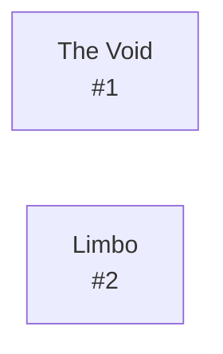

# Diku Limbo  `(limbo)`

[← back to world map](WORLD-MAP.md) · 2 rooms · vnums 1–2

Grey dashed nodes leave the area; green dashed nodes (`▸ Part X`) continue on another sub-map below.

## Map

## Rooms

| VNUM | Name | Exits |
|---:|---|---|
| 1 | The Void | — |
| 2 | Limbo | — |

