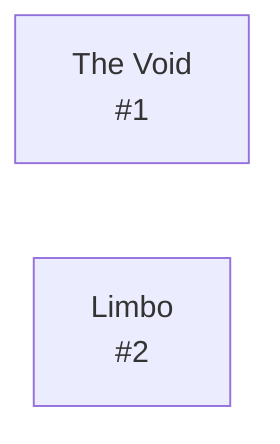

# Diku Limbo  `(limbo)`

[← back to world map](../WORLD-MAP.md) · 2 rooms · vnums 1–2

Dashed nodes are exits that leave this area.

## Rooms

| VNUM | Name | Exits |
|---:|---|---|
| 1 | The Void | — |
| 2 | Limbo | — |

