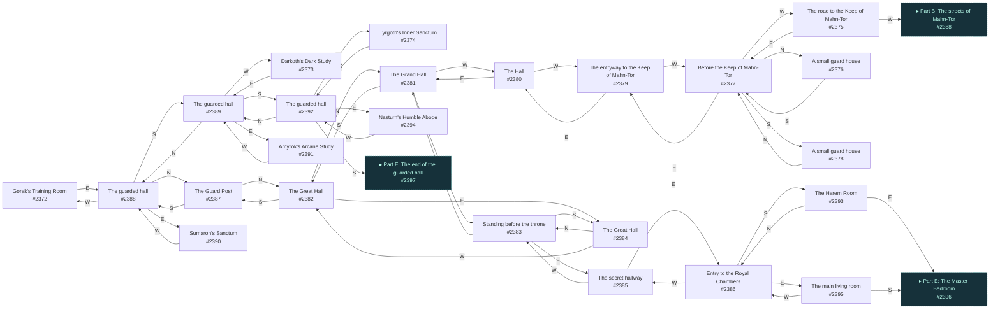
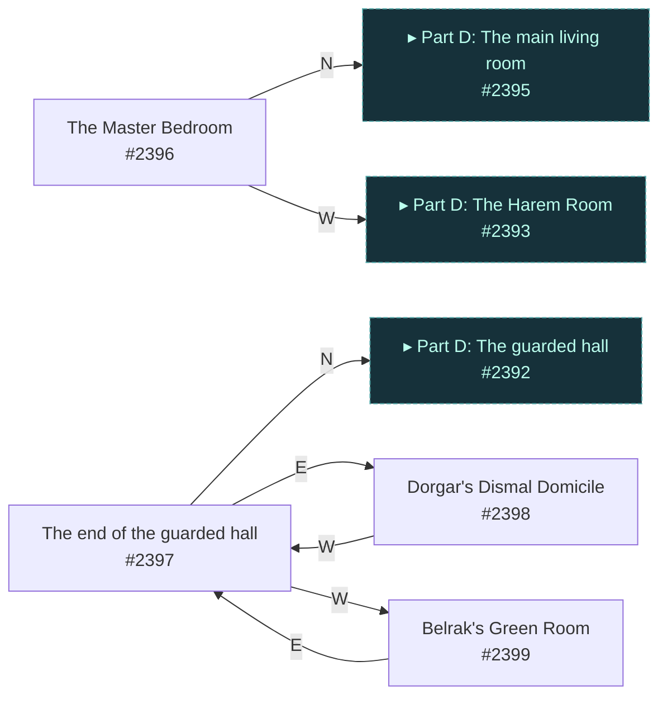

# Chris The Keep of Mahn-Tor  `(mahntor)`

[← back to world map](WORLD-MAP.md) · 100 rooms · vnums 2300–2399

Grey dashed nodes leave the area; green dashed nodes (`▸ Part X`) continue on another sub-map below.

_This area is split into 5 sub-maps for legibility._

## Map — Part A (24 rooms: #2300–#2323)

```mermaid
graph LR
  R2300["The dark woods<br/>#2300"]
  R2301["The dark woods<br/>#2301"]
  R2302["The small intersection in the forest<br/>#2302"]
  R2303["The edge of the forest and hills<br/>#2303"]
  R2304["In the dense forest<br/>#2304"]
  R2305["The dark forest path<br/>#2305"]
  R2306["A turn in the path<br/>#2306"]
  R2307["The bloody intersection<br/>#2307"]
  R2308["The rocky path<br/>#2308"]
  R2309["The rocky path<br/>#2309"]
  R2310["Up the rocky hillside<br/>#2310"]
  R2311["The sparse foothills<br/>#2311"]
  R2312["Standing on level ground<br/>#2312"]
  R2313["In the foothills<br/>#2313"]
  R2314["Before the huge tree<br/>#2314"]
  R2315["Before the dark cave<br/>#2315"]
  R2316["Inside the horrid cave<br/>#2316"]
  R2317["The hills overlooking the shore<br/>#2317"]
  R2318["The hills overlooking the shoreline<br/>#2318"]
  R2319["The hills above the shoreline<br/>#2319"]
  R2320["The rocky shore<br/>#2320"]
  R2321["The rocky shoreline<br/>#2321"]
  R2322["The rocky shore<br/>#2322"]
  R2323["The edge of the sea<br/>#2323"]
  R2300 -->|N| X5280
  R2300 -->|S| R2301
  R2301 -->|N| R2300
  R2301 -->|S| R2302
  R2302 -->|N| R2301
  R2302 -->|E| R2304
  R2302 -->|S| R2303
  R2303 -->|N| R2302
  R2303 -->|W| R2309
  R2304 -->|S| R2305
  R2304 -->|W| R2302
  R2305 -->|N| R2304
  R2305 -->|E| X2327
  R2305 -->|S| R2306
  R2306 -->|N| R2305
  R2306 -->|W| R2307
  R2307 -->|E| R2306
  R2307 -->|S| R2310
  R2307 -->|W| R2308
  R2308 -->|N| R2309
  R2308 -->|E| R2307
  R2309 -->|E| R2303
  R2309 -->|S| R2308
  R2310 -->|N| R2307
  R2310 -->|E| R2312
  R2310 -->|S| R2314
  R2310 -->|W| R2311
  R2311 -->|E| R2310
  R2311 -->|S| R2313
  R2312 -->|S| R2315
  R2312 -->|W| R2310
  R2313 -->|N| R2311
  R2313 -->|E| R2314
  R2313 -->|S| R2317
  R2314 -->|N| R2310
  R2314 -->|E| R2315
  R2314 -->|S| R2318
  R2314 -->|W| R2313
  R2315 -->|N| R2312
  R2315 -->|E| R2316
  R2315 -->|S| R2319
  R2315 -->|W| R2314
  R2316 -->|W| R2315
  R2317 -->|N| R2313
  R2317 -->|E| R2318
  R2317 -->|D| R2320
  R2318 -->|N| R2314
  R2318 -->|E| R2319
  R2318 -->|W| R2317
  R2318 -->|D| R2321
  R2319 -->|N| R2315
  R2319 -->|W| R2318
  R2319 -->|D| R2322
  R2320 -->|E| R2321
  R2320 -->|S| R2323
  R2320 -->|U| R2317
  R2321 -->|E| R2322
  R2321 -->|S| X2324
  R2321 -->|W| R2320
  R2321 -->|U| R2318
  R2322 -->|S| X2325
  R2322 -->|W| R2321
  R2322 -->|U| R2319
  R2323 -->|N| R2320
  R2323 -->|E| X2324
  X5280["A dark bend in the forest<br/>thalos #5280"]:::ext
  X2327["▸ Part C: The swampy path<br/>#2327"]:::part
  X2324["▸ Part B: The Blood Sea Portal<br/>#2324"]:::part
  X2325["▸ Part B: The edge of the sea<br/>#2325"]:::part
  classDef ext fill:#222,stroke:#888,color:#bbb,stroke-dasharray:3 3;
  classDef part fill:#16313a,stroke:#5aa,color:#bfe,stroke-dasharray:4 2;
```

## Map — Part B (24 rooms: #2324–#2371)

```mermaid
graph LR
  R2324["The Blood Sea Portal<br/>#2324"]
  R2325["The edge of the sea<br/>#2325"]
  R2326["Floating in blue light<br/>#2326"]
  R2351["The frigid wastelands<br/>#2351"]
  R2352["The frigid wastelands<br/>#2352"]
  R2353["The Glacier Temple<br/>#2353"]
  R2354["The frigid wastelands<br/>#2354"]
  R2355["The frigid wastelands<br/>#2355"]
  R2356["The frigid wastelands<br/>#2356"]
  R2357["The frigid wastelands<br/>#2357"]
  R2358["The frigid wastelands<br/>#2358"]
  R2359["The frigid wastelands<br/>#2359"]
  R2360["The edge of the frigid wastes<br/>#2360"]
  R2361["On the cliffside<br/>#2361"]
  R2362["Before the gates of Mahn-Tor<br/>#2362"]
  R2363["The city streets of Mahn-Tor<br/>#2363"]
  R2364["Inside the gates of Mahn-Tor<br/>#2364"]
  R2365["The city streets of Mahn-Tor<br/>#2365"]
  R2366["The city streets of Mahn-Tor<br/>#2366"]
  R2367["The Square of Mahn-Tor<br/>#2367"]
  R2368["The streets of Mahn-Tor<br/>#2368"]
  R2369["The Inn of the Broken Horn<br/>#2369"]
  R2370["The Mahn-Tor Equipment Shop<br/>#2370"]
  R2371["The Mahn-Tor General Store<br/>#2371"]
  R2324 -->|N| X2321
  R2324 -->|E| R2325
  R2324 -->|S| R2326
  R2324 -->|W| X2323
  R2325 -->|N| X2322
  R2325 -->|W| R2324
  R2326 -->|N| R2324
  R2326 -->|S| R2353
  R2351 -->|N| R2353
  R2351 -->|E| R2352
  R2351 -->|S| R2355
  R2351 -->|W| R2354
  R2352 -->|N| R2357
  R2352 -->|E| R2354
  R2352 -->|S| R2358
  R2352 -->|W| R2351
  R2353 -->|N| R2326
  R2353 -->|S| R2351
  R2354 -->|N| R2359
  R2354 -->|E| R2351
  R2354 -->|S| R2356
  R2354 -->|W| R2352
  R2355 -->|N| R2351
  R2355 -->|E| R2356
  R2355 -->|S| R2357
  R2355 -->|W| R2356
  R2356 -->|N| R2354
  R2356 -->|E| R2355
  R2356 -->|S| R2359
  R2356 -->|W| R2355
  R2357 -->|N| R2355
  R2357 -->|E| R2358
  R2357 -->|S| R2352
  R2357 -->|W| R2359
  R2358 -->|N| R2352
  R2358 -->|E| R2359
  R2358 -->|S| R2360
  R2358 -->|W| R2357
  R2359 -->|N| R2356
  R2359 -->|E| R2357
  R2359 -->|S| R2354
  R2359 -->|W| R2358
  R2360 -->|N| R2358
  R2360 -->|U| R2361
  R2361 -->|U| R2362
  R2361 -->|D| R2360
  R2362 -->|S| R2364
  R2362 -->|D| R2361
  R2363 -->|E| R2364
  R2363 -->|S| R2366
  R2364 -->|N| R2362
  R2364 -->|E| R2365
  R2364 -->|S| R2367
  R2364 -->|W| R2363
  R2365 -->|S| R2368
  R2365 -->|W| R2364
  R2366 -->|N| R2363
  R2366 -->|E| R2367
  R2366 -->|S| R2369
  R2367 -->|N| R2364
  R2367 -->|E| R2368
  R2367 -->|S| R2370
  R2367 -->|W| R2366
  R2368 -->|N| R2365
  R2368 -->|E| X2375
  R2368 -->|S| R2371
  R2368 -->|W| R2367
  R2369 -->|N| R2366
  R2370 -->|N| R2367
  R2371 -->|N| R2368
  X2321["▸ Part A: The rocky shoreline<br/>#2321"]:::part
  X2323["▸ Part A: The edge of the sea<br/>#2323"]:::part
  X2322["▸ Part A: The rocky shore<br/>#2322"]:::part
  X2375["▸ Part D: The road to the Keep of Mahn-Tor<br/>#2375"]:::part
  classDef ext fill:#222,stroke:#888,color:#bbb,stroke-dasharray:3 3;
  classDef part fill:#16313a,stroke:#5aa,color:#bfe,stroke-dasharray:4 2;
```

## Map — Part C (24 rooms: #2327–#2350)

```mermaid
graph LR
  R2327["The swampy path<br/>#2327"]
  R2328["The swampy path<br/>#2328"]
  R2329["The swampy path<br/>#2329"]
  R2330["The turn in the swampy path<br/>#2330"]
  R2331["The swampy path<br/>#2331"]
  R2332["Lost in the Mist<br/>#2332"]
  R2333["Lost in the Mist<br/>#2333"]
  R2334["Lost in the Mist<br/>#2334"]
  R2335["Lost in the Mist<br/>#2335"]
  R2336["Lost in the Mist<br/>#2336"]
  R2337["Lost in the Mist<br/>#2337"]
  R2338["Lost in the Mist<br/>#2338"]
  R2339["The solid path<br/>#2339"]
  R2340["A forested path<br/>#2340"]
  R2341["The gate before the Ogre Village<br/>#2341"]
  R2342["Among the crude huts<br/>#2342"]
  R2343["Inside the gates<br/>#2343"]
  R2344["Among the crude huts<br/>#2344"]
  R2345["The gathering place<br/>#2345"]
  R2346["The firepit before the lodge<br/>#2346"]
  R2347["The village dump<br/>#2347"]
  R2348["The entryway to the lodge<br/>#2348"]
  R2349["The throne room<br/>#2349"]
  R2350["The chieftain's room<br/>#2350"]
  R2327 -->|E| R2328
  R2327 -->|W| X2305
  R2328 -->|E| R2329
  R2328 -->|W| R2327
  R2329 -->|E| R2330
  R2329 -->|W| R2328
  R2330 -->|S| R2331
  R2330 -->|W| R2329
  R2331 -->|N| R2330
  R2331 -->|E| R2335
  R2332 -->|N| R2337
  R2332 -->|E| R2334
  R2332 -->|S| R2335
  R2332 -->|W| R2334
  R2333 -->|N| R2333
  R2333 -->|E| R2336
  R2333 -->|S| R2333
  R2333 -->|W| R2335
  R2334 -->|N| R2338
  R2334 -->|E| R2332
  R2334 -->|S| R2336
  R2334 -->|W| R2332
  R2335 -->|N| R2332
  R2335 -->|E| R2333
  R2335 -->|S| R2337
  R2335 -->|W| R2331
  R2336 -->|N| R2334
  R2336 -->|E| R2339
  R2336 -->|S| R2338
  R2336 -->|W| R2333
  R2337 -->|N| R2335
  R2337 -->|E| R2338
  R2337 -->|S| R2332
  R2337 -->|W| R2338
  R2338 -->|N| R2336
  R2338 -->|E| R2337
  R2338 -->|S| R2334
  R2338 -->|W| R2337
  R2339 -->|N| R2340
  R2339 -->|W| R2336
  R2340 -->|N| R2341
  R2340 -->|S| R2339
  R2341 -->|N| R2343
  R2341 -->|S| R2340
  R2342 -->|N| R2345
  R2342 -->|E| R2343
  R2343 -->|N| R2346
  R2343 -->|E| R2344
  R2343 -->|S| R2341
  R2343 -->|W| R2342
  R2344 -->|N| R2347
  R2344 -->|W| R2343
  R2345 -->|E| R2346
  R2345 -->|S| R2342
  R2346 -->|N| R2348
  R2346 -->|E| R2347
  R2346 -->|S| R2343
  R2346 -->|W| R2345
  R2347 -->|S| R2344
  R2348 -->|N| R2349
  R2348 -->|S| R2346
  R2349 -->|N| R2350
  R2349 -->|S| R2348
  R2350 -->|S| R2349
  X2305["▸ Part A: The dark forest path<br/>#2305"]:::part
  classDef ext fill:#222,stroke:#888,color:#bbb,stroke-dasharray:3 3;
  classDef part fill:#16313a,stroke:#5aa,color:#bfe,stroke-dasharray:4 2;
```

## Map — Part D (24 rooms: #2372–#2395)

## Map — Part E (4 rooms: #2396–#2399)

## Rooms

| VNUM | Name | Exits |
|---:|---|---|
| 2300 | The dark woods | N→5280 S→2301 |
| 2301 | The dark woods | N→2300 S→2302 |
| 2302 | The small intersection in the forest | N→2301 E→2304 S→2303 |
| 2303 | The edge of the forest and hills | N→2302 W→2309 |
| 2304 | In the dense forest | S→2305 W→2302 |
| 2305 | The dark forest path | N→2304 E→2327 S→2306 |
| 2306 | A turn in the path | N→2305 W→2307 |
| 2307 | The bloody intersection | E→2306 S→2310 W→2308 |
| 2308 | The rocky path | N→2309 E→2307 |
| 2309 | The rocky path | E→2303 S→2308 |
| 2310 | Up the rocky hillside | N→2307 E→2312 S→2314 W→2311 |
| 2311 | The sparse foothills | E→2310 S→2313 |
| 2312 | Standing on level ground | S→2315 W→2310 |
| 2313 | In the foothills | N→2311 E→2314 S→2317 |
| 2314 | Before the huge tree | N→2310 E→2315 S→2318 W→2313 |
| 2315 | Before the dark cave | N→2312 E→2316 S→2319 W→2314 |
| 2316 | Inside the horrid cave | W→2315 |
| 2317 | The hills overlooking the shore | N→2313 E→2318 D→2320 |
| 2318 | The hills overlooking the shoreline | N→2314 E→2319 W→2317 D→2321 |
| 2319 | The hills above the shoreline | N→2315 W→2318 D→2322 |
| 2320 | The rocky shore | E→2321 S→2323 U→2317 |
| 2321 | The rocky shoreline | E→2322 S→2324 W→2320 U→2318 |
| 2322 | The rocky shore | S→2325 W→2321 U→2319 |
| 2323 | The edge of the sea | N→2320 E→2324 |
| 2324 | The Blood Sea Portal | N→2321 E→2325 S→2326 W→2323 |
| 2325 | The edge of the sea | N→2322 W→2324 |
| 2326 | Floating in blue light | N→2324 S→2353 |
| 2327 | The swampy path | E→2328 W→2305 |
| 2328 | The swampy path | E→2329 W→2327 |
| 2329 | The swampy path | E→2330 W→2328 |
| 2330 | The turn in the swampy path | S→2331 W→2329 |
| 2331 | The swampy path | N→2330 E→2335 |
| 2332 | Lost in the Mist | N→2337 E→2334 S→2335 W→2334 |
| 2333 | Lost in the Mist | N→2333 E→2336 S→2333 W→2335 |
| 2334 | Lost in the Mist | N→2338 E→2332 S→2336 W→2332 |
| 2335 | Lost in the Mist | N→2332 E→2333 S→2337 W→2331 |
| 2336 | Lost in the Mist | N→2334 E→2339 S→2338 W→2333 |
| 2337 | Lost in the Mist | N→2335 E→2338 S→2332 W→2338 |
| 2338 | Lost in the Mist | N→2336 E→2337 S→2334 W→2337 |
| 2339 | The solid path | N→2340 W→2336 |
| 2340 | A forested path | N→2341 S→2339 |
| 2341 | The gate before the Ogre Village | N→2343 S→2340 |
| 2342 | Among the crude huts | N→2345 E→2343 |
| 2343 | Inside the gates | N→2346 E→2344 S→2341 W→2342 |
| 2344 | Among the crude huts | N→2347 W→2343 |
| 2345 | The gathering place | E→2346 S→2342 |
| 2346 | The firepit before the lodge | N→2348 E→2347 S→2343 W→2345 |
| 2347 | The village dump | S→2344 |
| 2348 | The entryway to the lodge | N→2349 S→2346 |
| 2349 | The throne room | N→2350 S→2348 |
| 2350 | The chieftain's room | S→2349 |
| 2351 | The frigid wastelands | N→2353 E→2352 S→2355 W→2354 |
| 2352 | The frigid wastelands | N→2357 E→2354 S→2358 W→2351 |
| 2353 | The Glacier Temple | N→2326 S→2351 |
| 2354 | The frigid wastelands | N→2359 E→2351 S→2356 W→2352 |
| 2355 | The frigid wastelands | N→2351 E→2356 S→2357 W→2356 |
| 2356 | The frigid wastelands | N→2354 E→2355 S→2359 W→2355 |
| 2357 | The frigid wastelands | N→2355 E→2358 S→2352 W→2359 |
| 2358 | The frigid wastelands | N→2352 E→2359 S→2360 W→2357 |
| 2359 | The frigid wastelands | N→2356 E→2357 S→2354 W→2358 |
| 2360 | The edge of the frigid wastes | N→2358 U→2361 |
| 2361 | On the cliffside | U→2362 D→2360 |
| 2362 | Before the gates of Mahn-Tor | S→2364 D→2361 |
| 2363 | The city streets of Mahn-Tor | E→2364 S→2366 |
| 2364 | Inside the gates of Mahn-Tor | N→2362 E→2365 S→2367 W→2363 |
| 2365 | The city streets of Mahn-Tor | S→2368 W→2364 |
| 2366 | The city streets of Mahn-Tor | N→2363 E→2367 S→2369 |
| 2367 | The Square of Mahn-Tor | N→2364 E→2368 S→2370 W→2366 |
| 2368 | The streets of Mahn-Tor | N→2365 E→2375 S→2371 W→2367 |
| 2369 | The Inn of the Broken Horn | N→2366 |
| 2370 | The Mahn-Tor Equipment Shop | N→2367 |
| 2371 | The Mahn-Tor General Store | N→2368 |
| 2372 | Gorak's Training Room | E→2388 |
| 2373 | Darkoth's Dark Study | E→2389 |
| 2374 | Tyrgoth's Inner Sanctum | E→2392 |
| 2375 | The road to the Keep of Mahn-Tor | E→2377 W→2368 |
| 2376 | A small guard house | S→2377 |
| 2377 | Before the Keep of Mahn-Tor | N→2376 E→2379 S→2378 W→2375 |
| 2378 | A small guard house | N→2377 |
| 2379 | The entryway to the Keep of Mahn-Tor | E→2380 W→2377 |
| 2380 | The Hall | E→2381 W→2379 |
| 2381 | The Grand Hall | E→2383 S→2382 W→2380 |
| 2382 | The Great Hall | N→2381 E→2384 S→2387 |
| 2383 | Standing before the throne | E→2385 S→2384 W→2381 |
| 2384 | The Great Hall | N→2383 W→2382 |
| 2385 | The secret hallway | E→2386 W→2383 |
| 2386 | Entry to the Royal Chambers | E→2395 S→2393 W→2385 |
| 2387 | The Guard Post | N→2382 S→2388 |
| 2388 | The guarded hall | N→2387 E→2390 S→2389 W→2372 |
| 2389 | The guarded hall | N→2388 E→2391 S→2392 W→2373 |
| 2390 | Sumaron's Sanctum | W→2388 |
| 2391 | Amyrok's Arcane Study | W→2389 |
| 2392 | The guarded hall | N→2389 E→2394 S→2397 W→2374 |
| 2393 | The Harem Room | N→2386 E→2396 |
| 2394 | Nasturn's Humble Abode | W→2392 |
| 2395 | The main living room | S→2396 W→2386 |
| 2396 | The Master Bedroom | N→2395 W→2393 |
| 2397 | The end of the guarded hall | N→2392 E→2398 W→2399 |
| 2398 | Dorgar's Dismal Domicile | W→2397 |
| 2399 | Belrak's Green Room | E→2397 |

