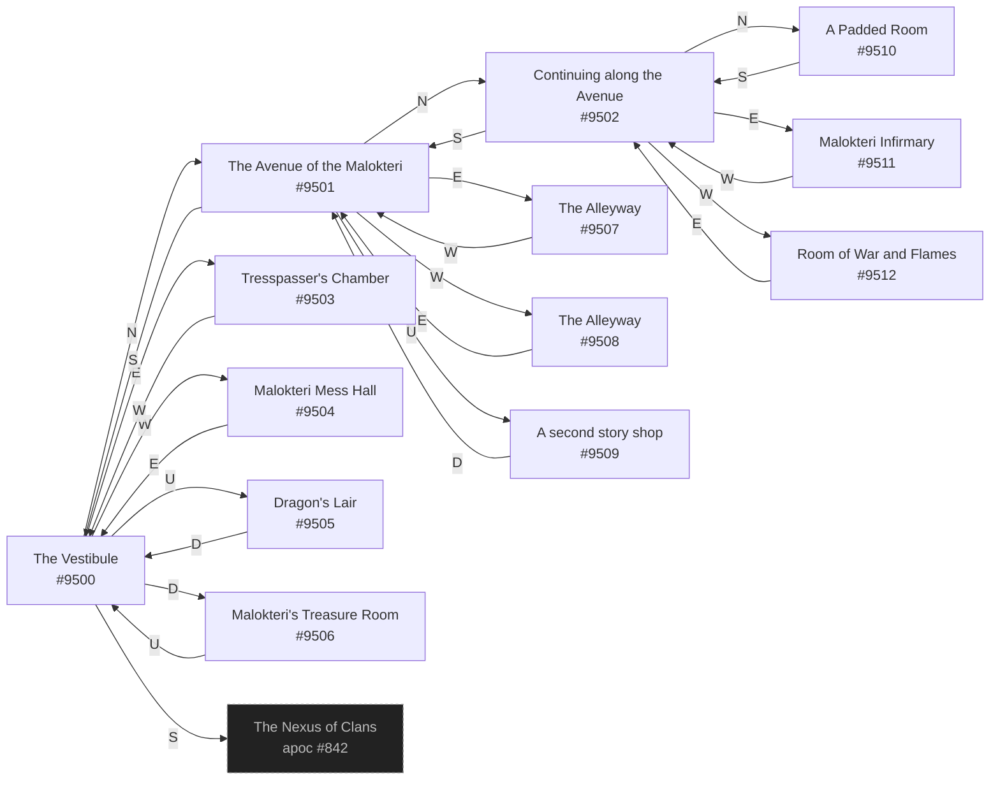

# Blah Malokteri Headquarters  `(malokteri)`

[← back to world map](../WORLD-MAP.md) · 13 rooms · vnums 9500–9512

Dashed nodes are exits that leave this area.

## Rooms

| VNUM | Name | Exits |
|---:|---|---|
| 9500 | The Vestibule | N→9501 E→9503 S→842 W→9504 U→9505 D→9506 |
| 9501 | The Avenue of the Malokteri | N→9502 E→9507 S→9500 W→9508 U→9509 |
| 9502 | Continuing along the Avenue | N→9510 E→9511 S→9501 W→9512 |
| 9503 | Tresspasser's Chamber | W→9500 |
| 9504 | Malokteri Mess Hall | E→9500 |
| 9505 | Dragon's Lair | D→9500 |
| 9506 | Malokteri's Treasure Room | U→9500 |
| 9507 | The Alleyway | W→9501 |
| 9508 | The Alleyway | E→9501 |
| 9509 | A second story shop | D→9501 |
| 9510 | A Padded Room | S→9502 |
| 9511 | Malokteri Infirmary | W→9502 |
| 9512 | Room of War and Flames | E→9502 |

