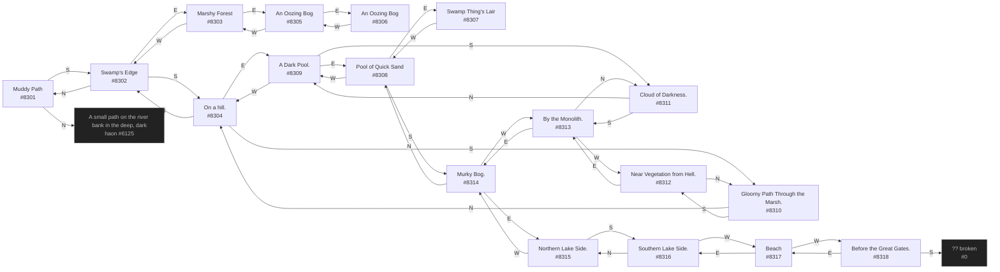

# Generic Old Marsh  `(marsh)`

[← back to world map](WORLD-MAP.md) · 18 rooms · vnums 8301–8318

Grey dashed nodes leave the area; green dashed nodes (`▸ Part X`) continue on another sub-map below.

## Map

## Rooms

| VNUM | Name | Exits |
|---:|---|---|
| 8301 | Muddy Path | N→6125 S→8302 |
| 8302 | Swamp's Edge | N→8301 E→8303 S→8304 |
| 8303 | Marshy Forest | E→8305 W→8302 |
| 8304 | On a hill. | N→8302 E→8309 S→8310 |
| 8305 | An Oozing Bog | E→8306 W→8303 |
| 8306 | An Oozing Bog | W→8305 |
| 8307 | Swamp Thing's Lair | W→8308 |
| 8308 | Pool of Quick Sand | E→8307 S→8314 W→8309 |
| 8309 | A Dark Pool. | E→8308 S→8311 W→8304 |
| 8310 | Gloomy Path Through the Marsh. | N→8304 S→8312 |
| 8311 | Cloud of Darkness. | N→8309 S→8313 |
| 8312 | Near Vegetation from Hell. | N→8310 E→8313 |
| 8313 | By the Monolith. | N→8311 E→8314 W→8312 |
| 8314 | Murky Bog. | N→8308 E→8315 W→8313 |
| 8315 | Northern Lake Side. | S→8316 W→8314 |
| 8316 | Southern Lake Side. | N→8315 W→8317 |
| 8317 | Beach | E→8316 W→8318 |
| 8318 | Before the Great Gates. | E→8317 S→0 |

