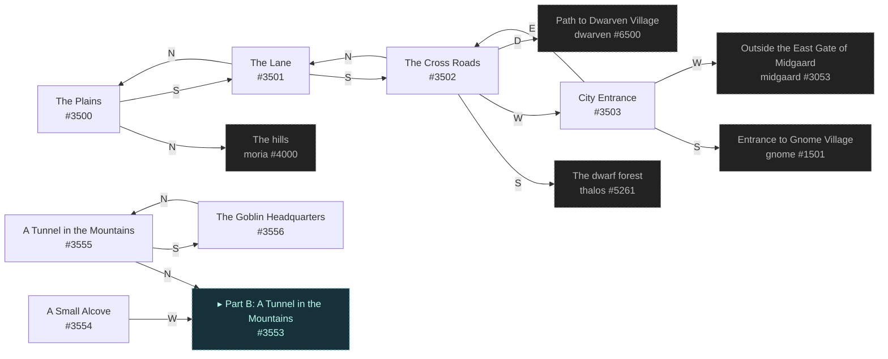
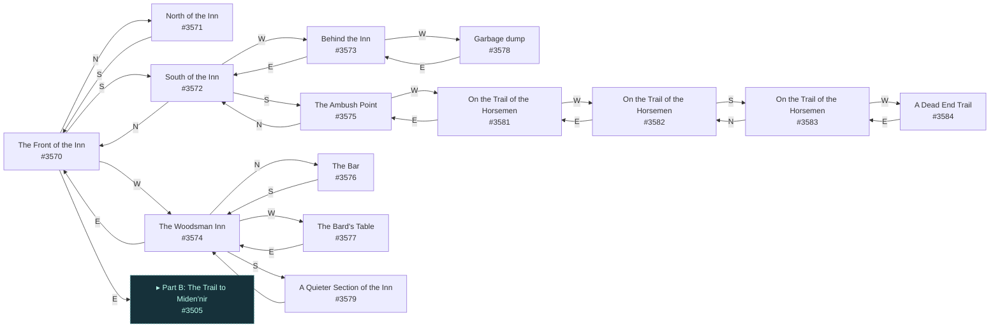

# Copper Miden'nir  `(midennir)`

[← back to world map](WORLD-MAP.md) · 45 rooms · vnums 3500–3584

Grey dashed nodes leave the area; green dashed nodes (`▸ Part X`) continue on another sub-map below.

_This area is split into 3 sub-maps for legibility._

## Map — Part A (7 rooms: #3500–#3556)

## Map — Part B (24 rooms: #3504–#3553)

```mermaid
graph LR
  R3504["The South Bridge<br/>#3504"]
  R3505["The Trail to Miden'nir<br/>#3505"]
  R3506["The Miden'nir<br/>#3506"]
  R3507["The Miden'nir<br/>#3507"]
  R3508["On a Small Path<br/>#3508"]
  R3509["The Miden'nir<br/>#3509"]
  R3510["A Crossroads<br/>#3510"]
  R3511["The Trail<br/>#3511"]
  R3512["The Miden'nir<br/>#3512"]
  R3513["The Miden'nir<br/>#3513"]
  R3514["Deep Forest<br/>#3514"]
  R3515["Light Forest<br/>#3515"]
  R3516["Muddy Ground<br/>#3516"]
  R3517["Near the Mountains<br/>#3517"]
  R3518["The Fading Trail<br/>#3518"]
  R3519["The Dark Path<br/>#3519"]
  R3520["The Dark Forest<br/>#3520"]
  R3521["Carnage<br/>#3521"]
  R3522["Deep in the Forest of Miden'nir<br/>#3522"]
  R3523["The Dark Forest<br/>#3523"]
  R3550["At The Foot of The Mountains<br/>#3550"]
  R3551["The Deep in the Forest of Miden'nir<br/>#3551"]
  R3552["A Tunnel in the Mountains<br/>#3552"]
  R3553["A Tunnel in the Mountains<br/>#3553"]
  R3504 -->|N| X3030
  R3504 -->|S| R3505
  R3505 -->|N| R3504
  R3505 -->|E| R3506
  R3505 -->|S| R3507
  R3505 -->|W| X3570
  R3506 -->|E| R3550
  R3506 -->|S| R3509
  R3506 -->|W| R3505
  R3507 -->|N| R3505
  R3507 -->|S| R3510
  R3507 -->|W| R3508
  R3508 -->|E| R3507
  R3508 -->|S| R3511
  R3509 -->|N| R3506
  R3509 -->|E| R3512
  R3509 -->|S| R3514
  R3510 -->|N| R3507
  R3510 -->|E| R3514
  R3510 -->|S| R3516
  R3511 -->|N| R3508
  R3511 -->|S| R3515
  R3512 -->|N| R3550
  R3512 -->|S| R3513
  R3512 -->|W| R3509
  R3513 -->|N| R3512
  R3513 -->|W| R3514
  R3514 -->|N| R3509
  R3514 -->|E| R3513
  R3514 -->|S| R3517
  R3514 -->|W| R3510
  R3515 -->|N| R3511
  R3515 -->|E| R3516
  R3515 -->|S| R3518
  R3516 -->|N| R3510
  R3516 -->|E| R3517
  R3516 -->|S| R3519
  R3516 -->|W| R3515
  R3517 -->|N| R3514
  R3517 -->|W| R3516
  R3518 -->|N| R3515
  R3518 -->|E| X0
  R3518 -->|S| R3522
  R3519 -->|N| R3516
  R3519 -->|E| R3520
  R3519 -->|S| R3521
  R3519 -->|W| X0
  R3520 -->|S| R3523
  R3520 -->|W| R3519
  R3521 -->|N| R3519
  R3521 -->|E| R3523
  R3521 -->|W| R3522
  R3522 -->|N| R3518
  R3522 -->|E| R3521
  R3523 -->|N| R3520
  R3523 -->|E| R3551
  R3523 -->|W| R3521
  R3550 -->|S| R3512
  R3550 -->|W| R3506
  R3551 -->|S| R3552
  R3551 -->|W| R3523
  R3552 -->|N| R3551
  R3552 -->|S| R3553
  R3553 -->|N| R3552
  R3553 -->|E| X3554
  R3553 -->|S| X3555
  X3030["The Dump<br/>midgaard #3030"]:::ext
  X3570["▸ Part C: The Front of the Inn<br/>#3570"]:::part
  X0["?? broken<br/>#0"]:::ext
  X3554["▸ Part A: A Small Alcove<br/>#3554"]:::part
  X3555["▸ Part A: A Tunnel in the Mountains<br/>#3555"]:::part
  classDef ext fill:#222,stroke:#888,color:#bbb,stroke-dasharray:3 3;
  classDef part fill:#16313a,stroke:#5aa,color:#bfe,stroke-dasharray:4 2;
```

## Map — Part C (14 rooms: #3570–#3584)

## Rooms

| VNUM | Name | Exits |
|---:|---|---|
| 3500 | The Plains | N→4000 S→3501 |
| 3501 | The Lane | N→3500 S→3502 |
| 3502 | The Cross Roads | N→3501 S→5261 W→3503 D→6500 |
| 3503 | City Entrance | E→3502 S→1501 W→3053 |
| 3504 | The South Bridge | N→3030 S→3505 |
| 3505 | The Trail to Miden'nir | N→3504 E→3506 S→3507 W→3570 |
| 3506 | The Miden'nir | E→3550 S→3509 W→3505 |
| 3507 | The Miden'nir | N→3505 S→3510 W→3508 |
| 3508 | On a Small Path | E→3507 S→3511 |
| 3509 | The Miden'nir | N→3506 E→3512 S→3514 |
| 3510 | A Crossroads | N→3507 E→3514 S→3516 |
| 3511 | The Trail | N→3508 S→3515 |
| 3512 | The Miden'nir | N→3550 S→3513 W→3509 |
| 3513 | The Miden'nir | N→3512 W→3514 |
| 3514 | Deep Forest | N→3509 E→3513 S→3517 W→3510 |
| 3515 | Light Forest | N→3511 E→3516 S→3518 |
| 3516 | Muddy Ground | N→3510 E→3517 S→3519 W→3515 |
| 3517 | Near the Mountains | N→3514 W→3516 |
| 3518 | The Fading Trail | N→3515 E→0 S→3522 |
| 3519 | The Dark Path | N→3516 E→3520 S→3521 W→0 |
| 3520 | The Dark Forest | S→3523 W→3519 |
| 3521 | Carnage | N→3519 E→3523 W→3522 |
| 3522 | Deep in the Forest of Miden'nir | N→3518 E→3521 |
| 3523 | The Dark Forest | N→3520 E→3551 W→3521 |
| 3550 | At The Foot of The Mountains | S→3512 W→3506 |
| 3551 | The Deep in the Forest of Miden'nir | S→3552 W→3523 |
| 3552 | A Tunnel in the Mountains | N→3551 S→3553 |
| 3553 | A Tunnel in the Mountains | N→3552 E→3554 S→3555 |
| 3554 | A Small Alcove | W→3553 |
| 3555 | A Tunnel in the Mountains | N→3553 S→3556 |
| 3556 | The Goblin Headquarters | N→3555 |
| 3570 | The Front of the Inn | N→3571 E→3505 S→3572 W→3574 |
| 3571 | North of the Inn | S→3570 |
| 3572 | South of the Inn | N→3570 S→3575 W→3573 |
| 3573 | Behind the Inn | E→3572 W→3578 |
| 3574 | The Woodsman Inn | N→3576 E→3570 S→3579 W→3577 |
| 3575 | The Ambush Point | N→3572 W→3581 |
| 3576 | The Bar | S→3574 |
| 3577 | The Bard's Table | E→3574 |
| 3578 | Garbage dump | E→3573 |
| 3579 | A Quieter Section of the Inn | N→3574 |
| 3581 | On the Trail of the Horsemen | E→3575 W→3582 |
| 3582 | On the Trail of the Horsemen | E→3581 S→3583 |
| 3583 | On the Trail of the Horsemen | N→3582 W→3584 |
| 3584 | A Dead End Trail | E→3583 |

