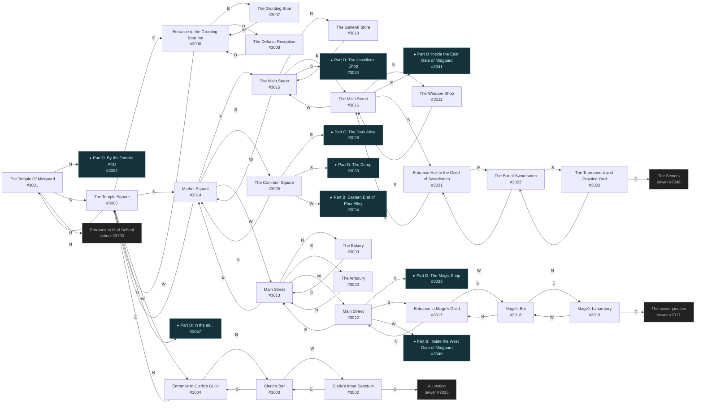
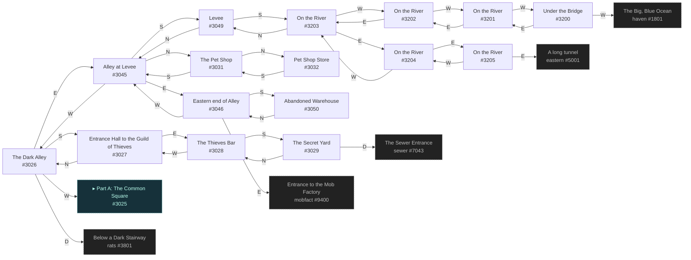
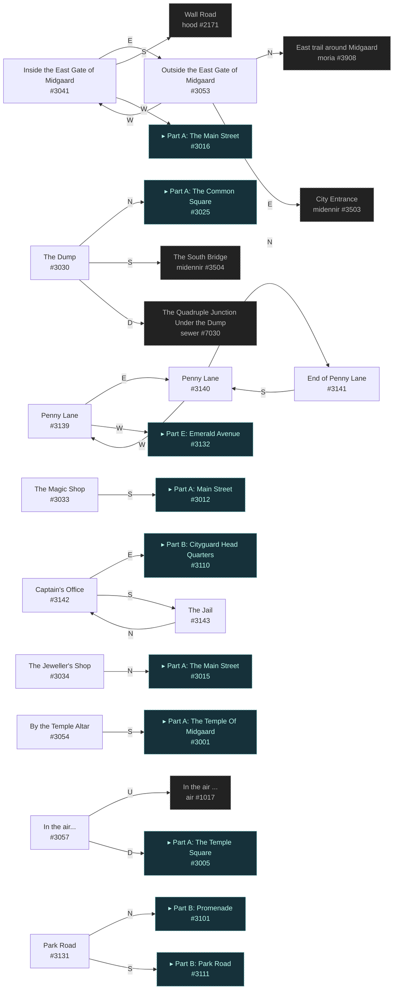

# Diku Midgaard  `(midgaard)`

[← back to world map](WORLD-MAP.md) · 101 rooms · vnums 3001–3205

Grey dashed nodes leave the area; green dashed nodes (`▸ Part X`) continue on another sub-map below.

_This area is split into 5 sub-maps for legibility._

## Map — Part A (24 rooms: #3001–#3025)

## Map — Part B (24 rooms: #3024–#3113)

```mermaid
graph LR
  R3024["Eastern End of Poor Alley<br/>#3024"]
  R3035["The Leather Shop<br/>#3035"]
  R3040["Inside the West Gate of Midgaard<br/>#3040"]
  R3042["Wall Road<br/>#3042"]
  R3043["Wall Road<br/>#3043"]
  R3044["Poor Alley<br/>#3044"]
  R3047["Wall Road<br/>#3047"]
  R3048["Grubby Inn<br/>#3048"]
  R3051["On the Bridge<br/>#3051"]
  R3052["Outside the West Gate of Midgaard<br/>#3052"]
  R3100["Northwest end of Concourse<br/>#3100"]
  R3101["Promenade<br/>#3101"]
  R3102["Promenade<br/>#3102"]
  R3103["Promenade<br/>#3103"]
  R3104["Northeast end of Concourse<br/>#3104"]
  R3105["Park Entrance<br/>#3105"]
  R3106["Park Cafe<br/>#3106"]
  R3107["Small path through the park<br/>#3107"]
  R3108["Small path in the park<br/>#3108"]
  R3109["Small path in the park<br/>#3109"]
  R3110["Cityguard Head Quarters<br/>#3110"]
  R3111["Park Road<br/>#3111"]
  R3112["Western Park Entrance<br/>#3112"]
  R3113["A path in the park<br/>#3113"]
  R3024 -->|E| X3025
  R3024 -->|S| R3048
  R3024 -->|W| R3044
  R3035 -->|S| R3044
  R3040 -->|E| X3012
  R3040 -->|S| R3042
  R3040 -->|W| R3052
  R3042 -->|N| R3040
  R3042 -->|S| R3043
  R3043 -->|N| R3042
  R3043 -->|E| R3044
  R3043 -->|S| R3047
  R3044 -->|N| R3035
  R3044 -->|E| R3024
  R3044 -->|W| R3043
  R3047 -->|N| R3043
  R3047 -->|S| R3051
  R3048 -->|N| R3024
  R3051 -->|N| R3047
  R3051 -->|S| R3100
  R3052 -->|N| X3900
  R3052 -->|E| R3040
  R3052 -->|W| X6000
  R3100 -->|N| R3051
  R3100 -->|E| R3101
  R3100 -->|S| X3127
  R3101 -->|E| R3102
  R3101 -->|S| X3131
  R3101 -->|W| R3100
  R3102 -->|E| R3103
  R3102 -->|S| R3105
  R3102 -->|W| R3101
  R3103 -->|E| R3104
  R3103 -->|S| X3132
  R3103 -->|W| R3102
  R3104 -->|S| X3130
  R3104 -->|W| R3103
  R3105 -->|N| R3102
  R3105 -->|E| R3106
  R3105 -->|S| R3108
  R3106 -->|W| R3105
  R3107 -->|E| R3108
  R3107 -->|S| R3113
  R3108 -->|N| R3105
  R3108 -->|E| R3109
  R3108 -->|W| R3107
  R3109 -->|S| X3115
  R3109 -->|W| R3108
  R3110 -->|E| R3111
  R3110 -->|W| X3142
  R3111 -->|N| X3131
  R3111 -->|E| R3112
  R3111 -->|S| X3118
  R3111 -->|W| R3110
  R3112 -->|E| R3113
  R3112 -->|W| R3111
  R3113 -->|N| R3107
  R3113 -->|E| X3114
  R3113 -->|W| R3112
  X3025["▸ Part A: The Common Square<br/>#3025"]:::part
  X3012["▸ Part A: Main Street<br/>#3012"]:::part
  X3900["West trail around Midgaard<br/>moria #3900"]:::ext
  X6000["The edge of the forest<br/>haon #6000"]:::ext
  X3127["▸ Part E: On the Concourse<br/>#3127"]:::part
  X3131["▸ Part D: Park Road<br/>#3131"]:::part
  X3132["▸ Part E: Emerald Avenue<br/>#3132"]:::part
  X3130["▸ Part E: On the Concourse<br/>#3130"]:::part
  X3115["▸ Part E: A path in the park<br/>#3115"]:::part
  X3142["▸ Part D: Captain's Office<br/>#3142"]:::part
  X3118["▸ Part E: Park Road<br/>#3118"]:::part
  X3114["▸ Part E: The Pond<br/>#3114"]:::part
  classDef ext fill:#222,stroke:#888,color:#bbb,stroke-dasharray:3 3;
  classDef part fill:#16313a,stroke:#5aa,color:#bfe,stroke-dasharray:4 2;
```

## Map — Part C (16 rooms: #3026–#3205)

## Map — Part D (13 rooms: #3030–#3143)

## Map — Part E (24 rooms: #3114–#3138)

```mermaid
graph LR
  R3114["The Pond<br/>#3114"]
  R3115["A path in the park<br/>#3115"]
  R3116["Eastern Park Entrance<br/>#3116"]
  R3117["Emerald Avenue<br/>#3117"]
  R3118["Park Road<br/>#3118"]
  R3119["Emerald Avenue<br/>#3119"]
  R3120["Road Crossing<br/>#3120"]
  R3121["Emerald Avenue<br/>#3121"]
  R3122["Park Road<br/>#3122"]
  R3123["Elm Street<br/>#3123"]
  R3124["End of Elm Street<br/>#3124"]
  R3125["Emerald Avenue<br/>#3125"]
  R3126["Park Road<br/>#3126"]
  R3127["On the Concourse<br/>#3127"]
  R3128["On the Concourse<br/>#3128"]
  R3129["On the Concourse<br/>#3129"]
  R3130["On the Concourse<br/>#3130"]
  R3132["Emerald Avenue<br/>#3132"]
  R3133["Emerald Avenue<br/>#3133"]
  R3134["Emerald Avenue<br/>#3134"]
  R3135["Park Road<br/>#3135"]
  R3136["Park Road<br/>#3136"]
  R3137["The Waiting Room<br/>#3137"]
  R3138["The Mayor's Office<br/>#3138"]
  R3114 -->|E| R3115
  R3114 -->|W| X3113
  R3115 -->|N| X3109
  R3115 -->|E| R3116
  R3115 -->|W| R3114
  R3116 -->|E| R3117
  R3116 -->|W| R3115
  R3117 -->|N| R3132
  R3117 -->|E| R3137
  R3117 -->|S| R3119
  R3117 -->|W| R3116
  R3118 -->|N| X3111
  R3118 -->|S| R3135
  R3119 -->|N| R3117
  R3119 -->|W| R3133
  R3120 -->|N| R3133
  R3120 -->|E| R3136
  R3120 -->|S| R3134
  R3120 -->|W| R3135
  R3120 -->|U| X7914
  R3121 -->|E| R3134
  R3121 -->|S| R3125
  R3122 -->|N| R3136
  R3122 -->|E| R3123
  R3122 -->|S| R3126
  R3123 -->|E| R3124
  R3123 -->|W| R3122
  R3124 -->|W| R3123
  R3125 -->|N| R3121
  R3125 -->|S| R3128
  R3126 -->|N| R3122
  R3126 -->|S| R3129
  R3127 -->|N| X3100
  R3127 -->|E| R3128
  R3128 -->|N| R3125
  R3128 -->|E| R3129
  R3128 -->|W| R3127
  R3129 -->|N| R3126
  R3129 -->|E| R3130
  R3129 -->|S| X3600
  R3129 -->|W| R3128
  R3130 -->|N| X3104
  R3130 -->|W| R3129
  R3132 -->|N| X3103
  R3132 -->|E| X3139
  R3132 -->|S| R3117
  R3133 -->|E| R3119
  R3133 -->|S| R3120
  R3134 -->|N| R3120
  R3134 -->|W| R3121
  R3135 -->|N| R3118
  R3135 -->|E| R3120
  R3136 -->|S| R3122
  R3136 -->|W| R3120
  R3137 -->|E| R3138
  R3137 -->|W| R3117
  R3138 -->|W| R3137
  X3113["▸ Part B: A path in the park<br/>#3113"]:::part
  X3109["▸ Part B: Small path in the park<br/>#3109"]:::part
  X3111["▸ Part B: Park Road<br/>#3111"]:::part
  X7914["On the Huge Chain<br/>redferne #7914"]:::ext
  X3100["▸ Part B: Northwest end of Concourse<br/>#3100"]:::part
  X3600["A Gravel Road on the Graveyard<br/>grave #3600"]:::ext
  X3104["▸ Part B: Northeast end of Concourse<br/>#3104"]:::part
  X3103["▸ Part B: Promenade<br/>#3103"]:::part
  X3139["▸ Part D: Penny Lane<br/>#3139"]:::part
  classDef ext fill:#222,stroke:#888,color:#bbb,stroke-dasharray:3 3;
  classDef part fill:#16313a,stroke:#5aa,color:#bfe,stroke-dasharray:4 2;
```

## Rooms

| VNUM | Name | Exits |
|---:|---|---|
| 3001 | The Temple Of Midgaard | N→3054 S→3005 U→3700 |
| 3002 | Cleric's Inner Sanctum | E→3003 D→7026 |
| 3003 | Cleric's Bar | S→3004 W→3002 |
| 3004 | Entrance to Cleric's Guild | N→3003 E→3005 |
| 3005 | The Temple Square | N→3001 E→3006 S→3014 W→3004 U→3057 |
| 3006 | Entrance to the Grunting Boar Inn | E→3007 W→3005 U→3008 |
| 3007 | The Grunting Boar | W→3006 |
| 3008 | The Defunct Reception | D→3006 |
| 3009 | The Bakery | S→3013 |
| 3010 | The General Store | S→3015 |
| 3011 | The Weapon Shop | S→3016 |
| 3012 | Main Street | N→3033 E→3013 S→3017 W→3040 |
| 3013 | Main Street | N→3009 E→3014 S→3020 W→3012 |
| 3014 | Market Square | N→3005 E→3015 S→3025 W→3013 |
| 3015 | The Main Street | N→3010 E→3016 S→3034 W→3014 |
| 3016 | The Main Street | N→3011 E→3041 S→3021 W→3015 |
| 3017 | Entrance to Mage's Guild | N→3012 S→3018 |
| 3018 | Mage's Bar | N→3017 E→3019 |
| 3019 | Mage's Laboratory | W→3018 D→7017 |
| 3020 | The Armoury | N→3013 |
| 3021 | Entrance Hall to the Guild of Swordsmen | N→3016 E→3022 |
| 3022 | The Bar of Swordsmen | S→3023 W→3021 |
| 3023 | The Tournament and Practice Yard | N→3022 D→7048 |
| 3024 | Eastern End of Poor Alley | E→3025 S→3048 W→3044 |
| 3025 | The Common Square | N→3014 E→3026 S→3030 W→3024 |
| 3026 | The Dark Alley | E→3045 S→3027 W→3025 D→3801 |
| 3027 | Entrance Hall to the Guild of Thieves | N→3026 E→3028 |
| 3028 | The Thieves Bar | S→3029 W→3027 |
| 3029 | The Secret Yard | N→3028 D→7043 |
| 3030 | The Dump | N→3025 S→3504 D→7030 |
| 3031 | The Pet Shop | N→3032 S→3045 |
| 3032 | Pet Shop Store | S→3031 |
| 3033 | The Magic Shop | S→3012 |
| 3034 | The Jeweller's Shop | N→3015 |
| 3035 | The Leather Shop | S→3044 |
| 3040 | Inside the West Gate of Midgaard | E→3012 S→3042 W→3052 |
| 3041 | Inside the East Gate of Midgaard | E→3053 S→2171 W→3016 |
| 3042 | Wall Road | N→3040 S→3043 |
| 3043 | Wall Road | N→3042 E→3044 S→3047 |
| 3044 | Poor Alley | N→3035 E→3024 W→3043 |
| 3045 | Alley at Levee | N→3031 E→3046 S→3049 W→3026 |
| 3046 | Eastern end of Alley | E→9400 S→3050 W→3045 |
| 3047 | Wall Road | N→3043 S→3051 |
| 3048 | Grubby Inn | N→3024 |
| 3049 | Levee | N→3045 S→3203 |
| 3050 | Abandoned Warehouse | N→3046 |
| 3051 | On the Bridge | N→3047 S→3100 |
| 3052 | Outside the West Gate of Midgaard | N→3900 E→3040 W→6000 |
| 3053 | Outside the East Gate of Midgaard | N→3908 E→3503 W→3041 |
| 3054 | By the Temple Altar | S→3001 |
| 3057 | In the air... | U→1017 D→3005 |
| 3100 | Northwest end of Concourse | N→3051 E→3101 S→3127 |
| 3101 | Promenade | E→3102 S→3131 W→3100 |
| 3102 | Promenade | E→3103 S→3105 W→3101 |
| 3103 | Promenade | E→3104 S→3132 W→3102 |
| 3104 | Northeast end of Concourse | S→3130 W→3103 |
| 3105 | Park Entrance | N→3102 E→3106 S→3108 |
| 3106 | Park Cafe | W→3105 |
| 3107 | Small path through the park | E→3108 S→3113 |
| 3108 | Small path in the park | N→3105 E→3109 W→3107 |
| 3109 | Small path in the park | S→3115 W→3108 |
| 3110 | Cityguard Head Quarters | E→3111 W→3142 |
| 3111 | Park Road | N→3131 E→3112 S→3118 W→3110 |
| 3112 | Western Park Entrance | E→3113 W→3111 |
| 3113 | A path in the park | N→3107 E→3114 W→3112 |
| 3114 | The Pond | E→3115 W→3113 |
| 3115 | A path in the park | N→3109 E→3116 W→3114 |
| 3116 | Eastern Park Entrance | E→3117 W→3115 |
| 3117 | Emerald Avenue | N→3132 E→3137 S→3119 W→3116 |
| 3118 | Park Road | N→3111 S→3135 |
| 3119 | Emerald Avenue | N→3117 W→3133 |
| 3120 | Road Crossing | N→3133 E→3136 S→3134 W→3135 U→7914 |
| 3121 | Emerald Avenue | E→3134 S→3125 |
| 3122 | Park Road | N→3136 E→3123 S→3126 |
| 3123 | Elm Street | E→3124 W→3122 |
| 3124 | End of Elm Street | W→3123 |
| 3125 | Emerald Avenue | N→3121 S→3128 |
| 3126 | Park Road | N→3122 S→3129 |
| 3127 | On the Concourse | N→3100 E→3128 |
| 3128 | On the Concourse | N→3125 E→3129 W→3127 |
| 3129 | On the Concourse | N→3126 E→3130 S→3600 W→3128 |
| 3130 | On the Concourse | N→3104 W→3129 |
| 3131 | Park Road | N→3101 S→3111 |
| 3132 | Emerald Avenue | N→3103 E→3139 S→3117 |
| 3133 | Emerald Avenue | E→3119 S→3120 |
| 3134 | Emerald Avenue | N→3120 W→3121 |
| 3135 | Park Road | N→3118 E→3120 |
| 3136 | Park Road | S→3122 W→3120 |
| 3137 | The Waiting Room | E→3138 W→3117 |
| 3138 | The Mayor's Office | W→3137 |
| 3139 | Penny Lane | E→3140 W→3132 |
| 3140 | Penny Lane | N→3141 W→3139 |
| 3141 | End of Penny Lane | S→3140 |
| 3142 | Captain's Office | E→3110 S→3143 |
| 3143 | The Jail | N→3142 |
| 3200 | Under the Bridge | E→3201 W→1801 |
| 3201 | On the River | E→3202 W→3200 |
| 3202 | On the River | E→3203 W→3201 |
| 3203 | On the River | N→3049 E→3204 W→3202 |
| 3204 | On the River | E→3205 W→3203 |
| 3205 | On the River | E→5001 W→3204 |

