# PinkF Mob Factory  `(mobfact)`

[← back to world map](WORLD-MAP.md) · 25 rooms · vnums 9400–9424

Grey dashed nodes leave the area; green dashed nodes (`▸ Part X`) continue on another sub-map below.

## Map

```mermaid
graph LR
  R9400["Entrance to the Mob Factory<br/>#9400"]
  R9401["Mob Factory Storage Area<br/>#9401"]
  R9402["Mob Factory Storage Area<br/>#9402"]
  R9403["Foreman's Office<br/>#9403"]
  R9404["Foreman's Bathroom<br/>#9404"]
  R9405["Mob Factory Storage Area<br/>#9405"]
  R9406["Mob Factory Storage Area<br/>#9406"]
  R9407["Entrance Hallway to Mob Factoy<br/>#9407"]
  R9408["Mob Factory Cafeteria<br/>#9408"]
  R9409["Mob Factory Cafeteria<br/>#9409"]
  R9410["Mob Factory Inspection Room<br/>#9410"]
  R9411["Mob Factory Inspection Room<br/>#9411"]
  R9412["Entrance Hallway to Mob Factoy<br/>#9412"]
  R9413["Mob Factory Reject Room<br/>#9413"]
  R9414["Mob Factory Reject Room<br/>#9414"]
  R9415["Primary Assembly Line<br/>#9415"]
  R9416["Primary Assembly Line<br/>#9416"]
  R9417["Primary Assembly Line<br/>#9417"]
  R9418["Primary Assembly Line<br/>#9418"]
  R9419["Primary Assembly Line<br/>#9419"]
  R9420["Secondary Assembly Line<br/>#9420"]
  R9421["Secondary Assembly Line<br/>#9421"]
  R9422["Secondary Assembly Line<br/>#9422"]
  R9423["Secondary Assembly Line<br/>#9423"]
  R9424["Secondary Assembly Line<br/>#9424"]
  R9400 -->|N| R9401
  R9400 -->|E| R9407
  R9400 -->|S| R9403
  R9400 -->|W| X3046
  R9401 -->|N| R9402
  R9401 -->|E| R9406
  R9401 -->|S| R9400
  R9402 -->|E| R9405
  R9402 -->|S| R9401
  R9403 -->|N| R9400
  R9403 -->|S| R9404
  R9404 -->|N| R9403
  R9405 -->|E| R9410
  R9405 -->|S| R9406
  R9405 -->|W| R9402
  R9406 -->|N| R9405
  R9406 -->|E| R9411
  R9406 -->|S| R9407
  R9406 -->|W| R9401
  R9407 -->|N| R9406
  R9407 -->|E| R9412
  R9407 -->|S| R9408
  R9407 -->|W| R9400
  R9408 -->|N| R9407
  R9408 -->|S| R9409
  R9409 -->|N| R9408
  R9410 -->|E| R9415
  R9410 -->|S| R9411
  R9410 -->|W| R9405
  R9411 -->|N| R9410
  R9411 -->|E| R9416
  R9411 -->|S| R9412
  R9411 -->|W| R9406
  R9412 -->|N| R9411
  R9412 -->|E| R9417
  R9412 -->|S| R9413
  R9412 -->|W| R9407
  R9413 -->|N| R9412
  R9413 -->|S| R9414
  R9414 -->|N| R9413
  R9415 -->|E| R9420
  R9415 -->|S| R9416
  R9415 -->|W| R9410
  R9416 -->|N| R9415
  R9416 -->|E| R9421
  R9416 -->|S| R9417
  R9416 -->|W| R9411
  R9417 -->|N| R9416
  R9417 -->|E| R9422
  R9417 -->|S| R9418
  R9417 -->|W| R9412
  R9418 -->|N| R9417
  R9418 -->|E| R9423
  R9418 -->|S| R9419
  R9419 -->|N| R9418
  R9419 -->|E| R9424
  R9420 -->|S| R9421
  R9420 -->|W| R9415
  R9421 -->|N| R9420
  R9421 -->|S| R9422
  R9421 -->|W| R9416
  R9422 -->|N| R9421
  R9422 -->|S| R9423
  R9422 -->|W| R9417
  R9423 -->|N| R9422
  R9423 -->|S| R9424
  R9423 -->|W| R9418
  R9424 -->|N| R9423
  R9424 -->|W| R9419
  X3046["Eastern end of Alley<br/>midgaard #3046"]:::ext
  classDef ext fill:#222,stroke:#888,color:#bbb,stroke-dasharray:3 3;
  classDef part fill:#16313a,stroke:#5aa,color:#bfe,stroke-dasharray:4 2;
```

## Rooms

| VNUM | Name | Exits |
|---:|---|---|
| 9400 | Entrance to the Mob Factory | N→9401 E→9407 S→9403 W→3046 |
| 9401 | Mob Factory Storage Area | N→9402 E→9406 S→9400 |
| 9402 | Mob Factory Storage Area | E→9405 S→9401 |
| 9403 | Foreman's Office | N→9400 S→9404 |
| 9404 | Foreman's Bathroom | N→9403 |
| 9405 | Mob Factory Storage Area | E→9410 S→9406 W→9402 |
| 9406 | Mob Factory Storage Area | N→9405 E→9411 S→9407 W→9401 |
| 9407 | Entrance Hallway to Mob Factoy | N→9406 E→9412 S→9408 W→9400 |
| 9408 | Mob Factory Cafeteria | N→9407 S→9409 |
| 9409 | Mob Factory Cafeteria | N→9408 |
| 9410 | Mob Factory Inspection Room | E→9415 S→9411 W→9405 |
| 9411 | Mob Factory Inspection Room | N→9410 E→9416 S→9412 W→9406 |
| 9412 | Entrance Hallway to Mob Factoy | N→9411 E→9417 S→9413 W→9407 |
| 9413 | Mob Factory Reject Room | N→9412 S→9414 |
| 9414 | Mob Factory Reject Room | N→9413 |
| 9415 | Primary Assembly Line | E→9420 S→9416 W→9410 |
| 9416 | Primary Assembly Line | N→9415 E→9421 S→9417 W→9411 |
| 9417 | Primary Assembly Line | N→9416 E→9422 S→9418 W→9412 |
| 9418 | Primary Assembly Line | N→9417 E→9423 S→9419 |
| 9419 | Primary Assembly Line | N→9418 E→9424 |
| 9420 | Secondary Assembly Line | S→9421 W→9415 |
| 9421 | Secondary Assembly Line | N→9420 S→9422 W→9416 |
| 9422 | Secondary Assembly Line | N→9421 S→9423 W→9417 |
| 9423 | Secondary Assembly Line | N→9422 S→9424 W→9418 |
| 9424 | Secondary Assembly Line | N→9423 W→9419 |

