# Alfa Moria  `(moria)`

[← back to world map](../WORLD-MAP.md) · 121 rooms · vnums 3900–4172

Dashed nodes are exits that leave this area.

```mermaid
graph LR
  R3900["West trail around Midgaard<br/>#3900"]
  R3901["West trail around Midgaard<br/>#3901"]
  R3902["Northwest corner of dusty trail.<br/>#3902"]
  R3903["Dusty trail along north wall.<br/>#3903"]
  R3904["The long dusty trail following the north wall.<br/>#3904"]
  R3905["Dusty trail along north wall.<br/>#3905"]
  R3906["Northeast corner of dusty trail.<br/>#3906"]
  R3907["East trail around Midgaard<br/>#3907"]
  R3908["East trail around Midgaard<br/>#3908"]
  R4000["The hills<br/>#4000"]
  R4001["The hills<br/>#4001"]
  R4002["End of the path<br/>#4002"]
  R4010["The cave<br/>#4010"]
  R4011["The tunnel<br/>#4011"]
  R4012["The tunnel<br/>#4012"]
  R4013["The tunnel<br/>#4013"]
  R4014["The tunnel<br/>#4014"]
  R4015["The tunnel<br/>#4015"]
  R4016["The large cave<br/>#4016"]
  R4017["The large cave<br/>#4017"]
  R4018["The cave<br/>#4018"]
  R4019["The tunnel<br/>#4019"]
  R4020["The hole<br/>#4020"]
  R4021["The hole<br/>#4021"]
  R4022["The damp tunnel<br/>#4022"]
  R4023["The large cave<br/>#4023"]
  R4024["The damp tunnel<br/>#4024"]
  R4025["The cave<br/>#4025"]
  R4026["The many tunnels<br/>#4026"]
  R4027["The tunnel<br/>#4027"]
  R4028["The smelly tunnel<br/>#4028"]
  R4029["The cave<br/>#4029"]
  R4030["The light cave<br/>#4030"]
  R4031["The valley<br/>#4031"]
  R4032["The foothills<br/>#4032"]
  R4033["The intersection in the foothills<br/>#4033"]
  R4034["The grassy area of the foothills<br/>#4034"]
  R4035["The foothills end<br/>#4035"]
  R4036["The plains<br/>#4036"]
  R4037["The foothills path<br/>#4037"]
  R4038["Base of the mountain<br/>#4038"]
  R4039["A trail up the mountain<br/>#4039"]
  R4040["The mountain top.<br/>#4040"]
  R4041["The lion's den<br/>#4041"]
  R4042["The level foothills<br/>#4042"]
  R4043["The cave entrance<br/>#4043"]
  R4044["The hill giant cave<br/>#4044"]
  R4050["The tunnel<br/>#4050"]
  R4051["The tunnel<br/>#4051"]
  R4052["The tunnel<br/>#4052"]
  R4053["The tunnel<br/>#4053"]
  R4054["The light cave<br/>#4054"]
  R4055["The maze<br/>#4055"]
  R4056["The light cave<br/>#4056"]
  R4057["The maze<br/>#4057"]
  R4058["The maze<br/>#4058"]
  R4059["The tunnel<br/>#4059"]
  R4060["The tunnel<br/>#4060"]
  R4061["The light cave<br/>#4061"]
  R4062["The maze<br/>#4062"]
  R4063["The maze<br/>#4063"]
  R4064["The tunnel<br/>#4064"]
  R4065["The maze<br/>#4065"]
  R4066["The maze<br/>#4066"]
  R4067["The maze<br/>#4067"]
  R4068["The large cave<br/>#4068"]
  R4069["The large cave<br/>#4069"]
  R4070["The large cave<br/>#4070"]
  R4071["The large cave<br/>#4071"]
  R4072["The tunnel<br/>#4072"]
  R4073["End of tunnel<br/>#4073"]
  R4074["The hole<br/>#4074"]
  R4100["The tunnel<br/>#4100"]
  R4101["The long tunnel<br/>#4101"]
  R4102["The long tunnel<br/>#4102"]
  R4103["The long tunnel<br/>#4103"]
  R4104["The long tunnel<br/>#4104"]
  R4105["The golden cave<br/>#4105"]
  R4106["The golden cave<br/>#4106"]
  R4107["The passage<br/>#4107"]
  R4108["The golden cave<br/>#4108"]
  R4109["The golden cave<br/>#4109"]
  R4110["The tunnel<br/>#4110"]
  R4111["The tunnel<br/>#4111"]
  R4112["The tunnel<br/>#4112"]
  R4113["The passage<br/>#4113"]
  R4114["The golden cave<br/>#4114"]
  R4115["The dark passage.<br/>#4115"]
  R4116["The passage<br/>#4116"]
  R4117["The secret chamber<br/>#4117"]
  R4118["The cave<br/>#4118"]
  R4119["The cave<br/>#4119"]
  R4120["The passage<br/>#4120"]
  R4121["The secret tunnel<br/>#4121"]
  R4122["The secret chamber<br/>#4122"]
  R4123["The cave<br/>#4123"]
  R4124["The cave<br/>#4124"]
  R4125["The passage<br/>#4125"]
  R4150["The dark hole<br/>#4150"]
  R4151["The small passage<br/>#4151"]
  R4152["The tunnel<br/>#4152"]
  R4153["The large tunnel<br/>#4153"]
  R4154["The large tunnel<br/>#4154"]
  R4155["The large tunnel<br/>#4155"]
  R4156["The long tunnel<br/>#4156"]
  R4157["The wet tunnel<br/>#4157"]
  R4158["The small maze<br/>#4158"]
  R4159["The small maze<br/>#4159"]
  R4160["In the tunnel at the inscription<br/>#4160"]
  R4161["The wet tunnel<br/>#4161"]
  R4162["The small maze<br/>#4162"]
  R4163["The small maze<br/>#4163"]
  R4164["The entrance to the small maze<br/>#4164"]
  R4165["In the water<br/>#4165"]
  R4166["The wet maze<br/>#4166"]
  R4167["The wet maze<br/>#4167"]
  R4168["The end of the tunnel<br/>#4168"]
  R4169["In the water<br/>#4169"]
  R4170["In the water<br/>#4170"]
  R4171["End of maze<br/>#4171"]
  R4172["At the sand bar<br/>#4172"]
  R3900 -->|N| R3901
  R3900 -->|S| X3052
  R3901 -->|N| R3902
  R3901 -->|S| R3900
  R3902 -->|E| R3903
  R3902 -->|S| R3901
  R3903 -->|E| R3904
  R3903 -->|W| R3902
  R3904 -->|N| X300
  R3904 -->|E| R3905
  R3904 -->|W| R3903
  R3905 -->|E| R3906
  R3905 -->|W| R3904
  R3906 -->|S| R3907
  R3906 -->|W| R3905
  R3907 -->|N| R3906
  R3907 -->|S| R3908
  R3908 -->|N| R3907
  R3908 -->|S| X3053
  R4000 -->|N| R4001
  R4000 -->|S| X3500
  R4001 -->|N| R4002
  R4001 -->|S| R4000
  R4002 -->|N| R4010
  R4002 -->|S| R4001
  R4010 -->|N| R4011
  R4010 -->|S| R4002
  R4011 -->|N| R4014
  R4011 -->|S| R4010
  R4012 -->|N| R4016
  R4012 -->|E| R4013
  R4013 -->|E| R4014
  R4013 -->|W| R4012
  R4014 -->|N| R4018
  R4014 -->|E| R4015
  R4014 -->|S| R4011
  R4014 -->|W| R4013
  R4015 -->|N| R4019
  R4015 -->|W| R4014
  R4016 -->|E| R4017
  R4016 -->|S| R4012
  R4016 -->|W| R4023
  R4017 -->|W| R4016
  R4018 -->|N| R4025
  R4018 -->|S| R4014
  R4019 -->|N| R4026
  R4019 -->|S| R4015
  R4020 -->|N| R4027
  R4020 -->|D| R4064
  R4021 -->|E| R4022
  R4021 -->|D| R4115
  R4022 -->|N| R4023
  R4022 -->|E| R4024
  R4022 -->|W| R4021
  R4023 -->|E| R4016
  R4023 -->|S| R4022
  R4024 -->|S| R4059
  R4024 -->|W| R4022
  R4025 -->|E| R4026
  R4025 -->|S| R4018
  R4026 -->|N| R4028
  R4026 -->|E| R4027
  R4026 -->|S| R4019
  R4026 -->|W| R4025
  R4027 -->|N| R4029
  R4027 -->|S| R4020
  R4027 -->|W| R4026
  R4028 -->|N| R4030
  R4028 -->|S| R4026
  R4029 -->|N| R4031
  R4029 -->|S| R4027
  R4030 -->|S| R4028
  R4031 -->|N| R4032
  R4031 -->|S| R4029
  R4032 -->|N| R4033
  R4032 -->|S| R4031
  R4033 -->|N| R4034
  R4033 -->|E| R4037
  R4033 -->|S| R4032
  R4034 -->|N| R4035
  R4034 -->|S| R4033
  R4034 -->|W| R4042
  R4035 -->|N| R4036
  R4035 -->|S| R4034
  R4036 -->|S| R4035
  R4037 -->|E| R4038
  R4037 -->|W| R4033
  R4038 -->|E| R4039
  R4038 -->|W| R4037
  R4039 -->|E| R4040
  R4039 -->|W| R4038
  R4040 -->|N| R4041
  R4040 -->|E| X7114
  R4040 -->|W| R4039
  R4041 -->|S| R4040
  R4042 -->|E| R4034
  R4042 -->|W| R4043
  R4043 -->|E| R4042
  R4043 -->|W| R4044
  R4044 -->|E| R4043
  R4050 -->|E| R4051
  R4050 -->|S| R4053
  R4051 -->|E| R4052
  R4051 -->|W| R4050
  R4052 -->|S| R4100
  R4052 -->|W| R4051
  R4053 -->|N| R4050
  R4053 -->|E| R4054
  R4054 -->|E| R4055
  R4054 -->|S| R4056
  R4054 -->|W| R4053
  R4055 -->|W| R4054
  R4056 -->|N| R4054
  R4056 -->|S| R4061
  R4057 -->|E| R4058
  R4057 -->|S| R4062
  R4058 -->|S| R4063
  R4058 -->|W| R4057
  R4059 -->|N| R4024
  R4059 -->|E| R4060
  R4060 -->|E| R4061
  R4060 -->|W| R4059
  R4061 -->|N| R4056
  R4061 -->|W| R4060
  R4062 -->|N| R4057
  R4062 -->|E| R4065
  R4063 -->|N| R4058
  R4063 -->|E| R4064
  R4064 -->|W| R4063
  R4064 -->|U| R4020
  R4065 -->|E| R4066
  R4065 -->|W| R4062
  R4066 -->|E| R4067
  R4066 -->|S| R4069
  R4066 -->|W| R4065
  R4067 -->|W| R4066
  R4068 -->|E| R4069
  R4068 -->|S| R4070
  R4069 -->|N| R4066
  R4069 -->|S| R4071
  R4069 -->|W| R4068
  R4070 -->|N| R4068
  R4070 -->|E| R4071
  R4071 -->|N| R4069
  R4071 -->|E| R4072
  R4071 -->|W| R4070
  R4072 -->|E| R4073
  R4072 -->|S| R4074
  R4072 -->|W| R4071
  R4073 -->|W| R4072
  R4074 -->|N| R4072
  R4074 -->|D| R4171
  R4100 -->|N| R4052
  R4100 -->|W| R4101
  R4101 -->|E| R4100
  R4101 -->|W| R4102
  R4102 -->|E| R4101
  R4102 -->|W| R4103
  R4103 -->|E| R4102
  R4103 -->|S| R4106
  R4103 -->|W| R4104
  R4104 -->|E| R4103
  R4104 -->|W| R4152
  R4105 -->|S| R4108
  R4105 -->|W| R4106
  R4106 -->|N| R4103
  R4106 -->|E| R4105
  R4106 -->|S| R4109
  R4107 -->|S| R4113
  R4107 -->|W| R4108
  R4108 -->|N| R4105
  R4108 -->|E| R4107
  R4108 -->|W| R4109
  R4109 -->|N| R4106
  R4109 -->|E| R4108
  R4109 -->|S| R4114
  R4110 -->|W| R4111
  R4111 -->|E| R4110
  R4111 -->|W| R4112
  R4112 -->|E| R4111
  R4112 -->|W| R4113
  R4113 -->|N| R4107
  R4113 -->|E| R4112
  R4113 -->|S| R4116
  R4114 -->|N| R4109
  R4114 -->|W| R4115
  R4115 -->|E| R4114
  R4115 -->|U| R4021
  R4116 -->|N| R4113
  R4116 -->|S| R4120
  R4117 -->|S| R4122
  R4118 -->|S| R4123
  R4118 -->|W| R4119
  R4119 -->|E| R4118
  R4119 -->|S| R4124
  R4119 -->|W| R4121
  R4120 -->|N| R4116
  R4120 -->|S| R4125
  R4121 -->|E| R4119
  R4121 -->|W| R4122
  R4122 -->|N| R4117
  R4122 -->|E| R4121
  R4123 -->|N| R4118
  R4123 -->|W| R4124
  R4124 -->|N| R4119
  R4124 -->|E| R4123
  R4124 -->|W| R4125
  R4125 -->|N| R4120
  R4125 -->|E| R4124
  R4150 -->|S| R4151
  R4151 -->|N| R4150
  R4151 -->|S| R4156
  R4151 -->|W| R4155
  R4152 -->|E| R4104
  R4152 -->|S| R4153
  R4153 -->|N| R4152
  R4153 -->|E| R4154
  R4153 -->|S| R4157
  R4154 -->|E| R4155
  R4154 -->|W| R4153
  R4155 -->|E| R4151
  R4155 -->|W| R4154
  R4156 -->|N| R4151
  R4156 -->|S| R4160
  R4157 -->|N| R4153
  R4157 -->|E| R4158
  R4157 -->|S| R4161
  R4158 -->|E| R4159
  R4158 -->|S| R4162
  R4158 -->|W| R4157
  R4159 -->|S| R4163
  R4159 -->|W| R4158
  R4160 -->|N| R4156
  R4160 -->|S| R4164
  R4161 -->|N| R4157
  R4161 -->|S| R4165
  R4162 -->|N| R4158
  R4162 -->|E| R4163
  R4162 -->|S| R4166
  R4163 -->|N| R4159
  R4163 -->|E| R4164
  R4163 -->|W| R4162
  R4164 -->|N| R4160
  R4164 -->|S| R4168
  R4164 -->|W| R4163
  R4165 -->|N| R4161
  R4165 -->|S| R4169
  R4166 -->|N| R4162
  R4166 -->|E| R4167
  R4166 -->|S| R4170
  R4167 -->|E| R4168
  R4167 -->|S| R4171
  R4167 -->|W| R4166
  R4168 -->|N| R4164
  R4168 -->|W| R4167
  R4169 -->|N| R4165
  R4169 -->|E| R4170
  R4170 -->|N| R4166
  R4170 -->|E| R4172
  R4170 -->|W| R4169
  R4171 -->|N| R4167
  R4171 -->|U| R4074
  R4172 -->|W| R4170
  X3052["Outside the West Gate of Midgaard<br/>midgaard #3052"]:::ext
  X300["Path in the plains<br/>plains #300"]:::ext
  X3053["Outside the East Gate of Midgaard<br/>midgaard #3053"]:::ext
  X3500["The Plains<br/>midennir #3500"]:::ext
  X7114["Mid-air<br/>sewer #7114"]:::ext
  classDef ext fill:#222,stroke:#888,color:#bbb,stroke-dasharray:3 3;
```

## Rooms

| VNUM | Name | Exits |
|---:|---|---|
| 3900 | West trail around Midgaard | N→3901 S→3052 |
| 3901 | West trail around Midgaard | N→3902 S→3900 |
| 3902 | Northwest corner of dusty trail. | E→3903 S→3901 |
| 3903 | Dusty trail along north wall. | E→3904 W→3902 |
| 3904 | The long dusty trail following the north wall. | N→300 E→3905 W→3903 |
| 3905 | Dusty trail along north wall. | E→3906 W→3904 |
| 3906 | Northeast corner of dusty trail. | S→3907 W→3905 |
| 3907 | East trail around Midgaard | N→3906 S→3908 |
| 3908 | East trail around Midgaard | N→3907 S→3053 |
| 4000 | The hills | N→4001 S→3500 |
| 4001 | The hills | N→4002 S→4000 |
| 4002 | End of the path | N→4010 S→4001 |
| 4010 | The cave | N→4011 S→4002 |
| 4011 | The tunnel | N→4014 S→4010 |
| 4012 | The tunnel | N→4016 E→4013 |
| 4013 | The tunnel | E→4014 W→4012 |
| 4014 | The tunnel | N→4018 E→4015 S→4011 W→4013 |
| 4015 | The tunnel | N→4019 W→4014 |
| 4016 | The large cave | E→4017 S→4012 W→4023 |
| 4017 | The large cave | W→4016 |
| 4018 | The cave | N→4025 S→4014 |
| 4019 | The tunnel | N→4026 S→4015 |
| 4020 | The hole | N→4027 D→4064 |
| 4021 | The hole | E→4022 D→4115 |
| 4022 | The damp tunnel | N→4023 E→4024 W→4021 |
| 4023 | The large cave | E→4016 S→4022 |
| 4024 | The damp tunnel | S→4059 W→4022 |
| 4025 | The cave | E→4026 S→4018 |
| 4026 | The many tunnels | N→4028 E→4027 S→4019 W→4025 |
| 4027 | The tunnel | N→4029 S→4020 W→4026 |
| 4028 | The smelly tunnel | N→4030 S→4026 |
| 4029 | The cave | N→4031 S→4027 |
| 4030 | The light cave | S→4028 |
| 4031 | The valley | N→4032 S→4029 |
| 4032 | The foothills | N→4033 S→4031 |
| 4033 | The intersection in the foothills | N→4034 E→4037 S→4032 |
| 4034 | The grassy area of the foothills | N→4035 S→4033 W→4042 |
| 4035 | The foothills end | N→4036 S→4034 |
| 4036 | The plains | S→4035 |
| 4037 | The foothills path | E→4038 W→4033 |
| 4038 | Base of the mountain | E→4039 W→4037 |
| 4039 | A trail up the mountain | E→4040 W→4038 |
| 4040 | The mountain top. | N→4041 E→7114 W→4039 |
| 4041 | The lion's den | S→4040 |
| 4042 | The level foothills | E→4034 W→4043 |
| 4043 | The cave entrance | E→4042 W→4044 |
| 4044 | The hill giant cave | E→4043 |
| 4050 | The tunnel | E→4051 S→4053 |
| 4051 | The tunnel | E→4052 W→4050 |
| 4052 | The tunnel | S→4100 W→4051 |
| 4053 | The tunnel | N→4050 E→4054 |
| 4054 | The light cave | E→4055 S→4056 W→4053 |
| 4055 | The maze | W→4054 |
| 4056 | The light cave | N→4054 S→4061 |
| 4057 | The maze | E→4058 S→4062 |
| 4058 | The maze | S→4063 W→4057 |
| 4059 | The tunnel | N→4024 E→4060 |
| 4060 | The tunnel | E→4061 W→4059 |
| 4061 | The light cave | N→4056 W→4060 |
| 4062 | The maze | N→4057 E→4065 |
| 4063 | The maze | N→4058 E→4064 |
| 4064 | The tunnel | W→4063 U→4020 |
| 4065 | The maze | E→4066 W→4062 |
| 4066 | The maze | E→4067 S→4069 W→4065 |
| 4067 | The maze | W→4066 |
| 4068 | The large cave | E→4069 S→4070 |
| 4069 | The large cave | N→4066 S→4071 W→4068 |
| 4070 | The large cave | N→4068 E→4071 |
| 4071 | The large cave | N→4069 E→4072 W→4070 |
| 4072 | The tunnel | E→4073 S→4074 W→4071 |
| 4073 | End of tunnel | W→4072 |
| 4074 | The hole | N→4072 D→4171 |
| 4100 | The tunnel | N→4052 W→4101 |
| 4101 | The long tunnel | E→4100 W→4102 |
| 4102 | The long tunnel | E→4101 W→4103 |
| 4103 | The long tunnel | E→4102 S→4106 W→4104 |
| 4104 | The long tunnel | E→4103 W→4152 |
| 4105 | The golden cave | S→4108 W→4106 |
| 4106 | The golden cave | N→4103 E→4105 S→4109 |
| 4107 | The passage | S→4113 W→4108 |
| 4108 | The golden cave | N→4105 E→4107 W→4109 |
| 4109 | The golden cave | N→4106 E→4108 S→4114 |
| 4110 | The tunnel | W→4111 |
| 4111 | The tunnel | E→4110 W→4112 |
| 4112 | The tunnel | E→4111 W→4113 |
| 4113 | The passage | N→4107 E→4112 S→4116 |
| 4114 | The golden cave | N→4109 W→4115 |
| 4115 | The dark passage. | E→4114 U→4021 |
| 4116 | The passage | N→4113 S→4120 |
| 4117 | The secret chamber | S→4122 |
| 4118 | The cave | S→4123 W→4119 |
| 4119 | The cave | E→4118 S→4124 W→4121 |
| 4120 | The passage | N→4116 S→4125 |
| 4121 | The secret tunnel | E→4119 W→4122 |
| 4122 | The secret chamber | N→4117 E→4121 |
| 4123 | The cave | N→4118 W→4124 |
| 4124 | The cave | N→4119 E→4123 W→4125 |
| 4125 | The passage | N→4120 E→4124 |
| 4150 | The dark hole | S→4151 |
| 4151 | The small passage | N→4150 S→4156 W→4155 |
| 4152 | The tunnel | E→4104 S→4153 |
| 4153 | The large tunnel | N→4152 E→4154 S→4157 |
| 4154 | The large tunnel | E→4155 W→4153 |
| 4155 | The large tunnel | E→4151 W→4154 |
| 4156 | The long tunnel | N→4151 S→4160 |
| 4157 | The wet tunnel | N→4153 E→4158 S→4161 |
| 4158 | The small maze | E→4159 S→4162 W→4157 |
| 4159 | The small maze | S→4163 W→4158 |
| 4160 | In the tunnel at the inscription | N→4156 S→4164 |
| 4161 | The wet tunnel | N→4157 S→4165 |
| 4162 | The small maze | N→4158 E→4163 S→4166 |
| 4163 | The small maze | N→4159 E→4164 W→4162 |
| 4164 | The entrance to the small maze | N→4160 S→4168 W→4163 |
| 4165 | In the water | N→4161 S→4169 |
| 4166 | The wet maze | N→4162 E→4167 S→4170 |
| 4167 | The wet maze | E→4168 S→4171 W→4166 |
| 4168 | The end of the tunnel | N→4164 W→4167 |
| 4169 | In the water | N→4165 E→4170 |
| 4170 | In the water | N→4166 E→4172 W→4169 |
| 4171 | End of maze | N→4167 U→4074 |
| 4172 | At the sand bar | W→4170 |

