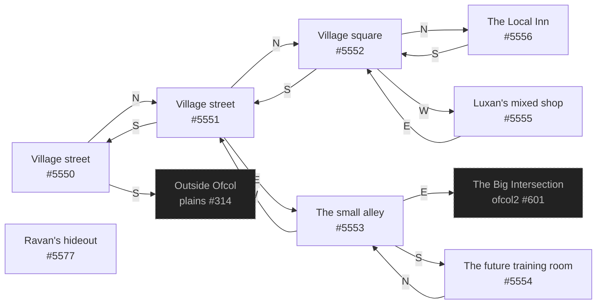

# Alfa Ofcol  `(ofcol)`

[← back to world map](WORLD-MAP.md) · 8 rooms · vnums 5550–5577

Dashed nodes are exits that leave this area.

## Rooms

| VNUM | Name | Exits |
|---:|---|---|
| 5550 | Village street | N→5551 S→314 |
| 5551 | Village street | N→5552 E→5553 S→5550 |
| 5552 | Village square | N→5556 S→5551 W→5555 |
| 5553 | The small alley | E→601 S→5554 W→5551 |
| 5554 | The future training room | N→5553 |
| 5555 | Luxan's mixed shop | E→5552 |
| 5556 | The Local Inn | S→5552 |
| 5577 | Ravan's hideout | — |

