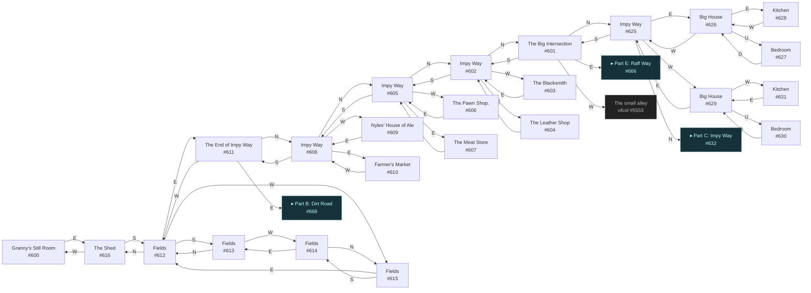
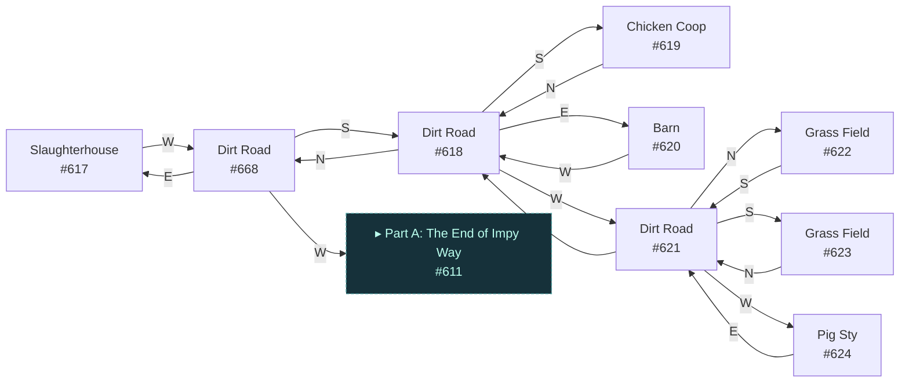
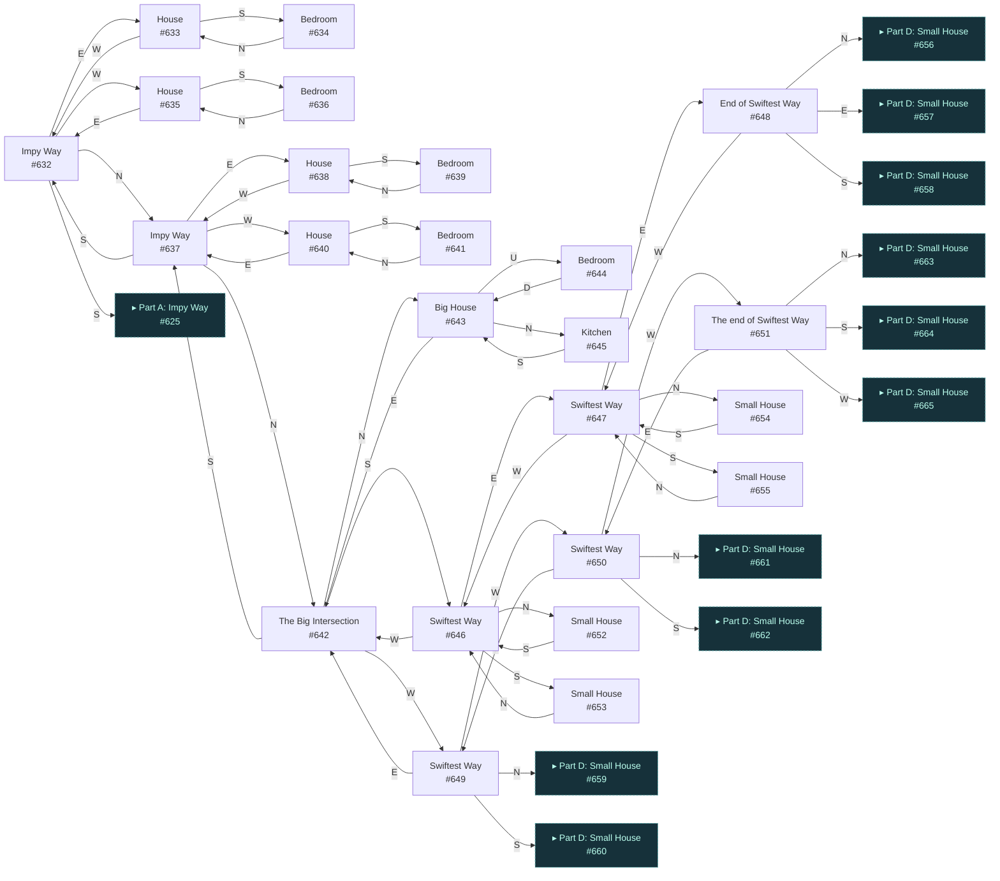
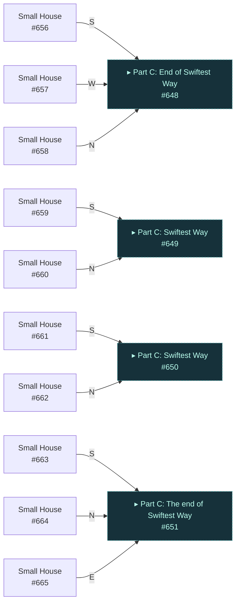
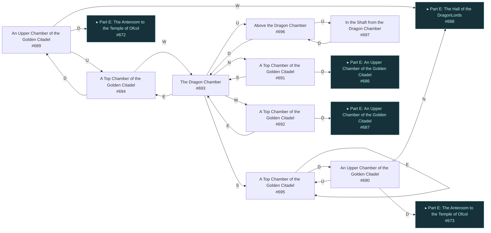

# Hatchet New Ofcol  `(ofcol2)`

[← back to world map](WORLD-MAP.md) · 100 rooms · vnums 600–699

Grey dashed nodes leave the area; green dashed nodes (`▸ Part X`) continue on another sub-map below.

_This area is split into 6 sub-maps for legibility._

## Map — Part A (24 rooms: #600–#631)

## Map — Part B (9 rooms: #617–#668)

## Map — Part C (24 rooms: #632–#655)

## Map — Part D (10 rooms: #656–#665)

## Map — Part E (24 rooms: #666–#699)

```mermaid
graph LR
  R666["Raff Way<br/>#666"]
  R667["Raff Way<br/>#667"]
  R669["The Temple of Ofcol<br/>#669"]
  R670["The Anteroom to the Temple of Ofcol<br/>#670"]
  R671["The Anteroom to the Temple of Ofcol<br/>#671"]
  R672["The Anteroom to the Temple of Ofcol<br/>#672"]
  R673["The Anteroom to the Temple of Ofcol<br/>#673"]
  R674["A Hallway of the Golden Citadel<br/>#674"]
  R675["A Hallway of the Golden Citadel<br/>#675"]
  R676["A Hallway of the Golden Citadel<br/>#676"]
  R677["A Hallway of the Golden Citadel<br/>#677"]
  R678["A Hallway of the Golden Citadel<br/>#678"]
  R679["A Hallway of the Golden Citadel<br/>#679"]
  R680["A Hallway of the Golden Citadel<br/>#680"]
  R681["A Hallway of the Golden Citadel<br/>#681"]
  R682["A Hallway of the Golden Citadel<br/>#682"]
  R683["A Hallway of the Golden Citadel<br/>#683"]
  R684["A Hallway of the Golden Citadel<br/>#684"]
  R685["A Hallway of the Golden Citadel<br/>#685"]
  R686["An Upper Chamber of the Golden Citadel<br/>#686"]
  R687["An Upper Chamber of the Golden Citadel<br/>#687"]
  R688["The Hall of the DragonLords<br/>#688"]
  R698["Inside the Entrance to the Golden Citadel<br/>#698"]
  R699["Outside the Entrance to the Golden Citadel<br/>#699"]
  R666 -->|E| R667
  R666 -->|W| X601
  R667 -->|E| R699
  R667 -->|W| R666
  R669 -->|N| R670
  R669 -->|E| R672
  R669 -->|S| R673
  R669 -->|W| R671
  R670 -->|N| R675
  R670 -->|S| R669
  R670 -->|U| R686
  R671 -->|E| R669
  R671 -->|W| R679
  R671 -->|U| R687
  R672 -->|E| R680
  R672 -->|W| R669
  R672 -->|U| X689
  R673 -->|N| R669
  R673 -->|S| R684
  R673 -->|U| X690
  R674 -->|E| R675
  R674 -->|S| R677
  R675 -->|E| R676
  R675 -->|S| R670
  R675 -->|W| R674
  R676 -->|S| R678
  R676 -->|W| R675
  R677 -->|N| R674
  R677 -->|S| R679
  R678 -->|N| R676
  R678 -->|S| R680
  R679 -->|N| R677
  R679 -->|E| R671
  R679 -->|S| R681
  R679 -->|W| R698
  R680 -->|N| R678
  R680 -->|S| R682
  R680 -->|W| R672
  R681 -->|N| R679
  R681 -->|S| R683
  R682 -->|N| R680
  R682 -->|S| R685
  R683 -->|N| R681
  R683 -->|E| R684
  R684 -->|N| R673
  R684 -->|E| R685
  R684 -->|W| R683
  R685 -->|N| R682
  R685 -->|W| R684
  R686 -->|S| R688
  R686 -->|U| X691
  R686 -->|D| R670
  R687 -->|E| R688
  R687 -->|U| X692
  R687 -->|D| R671
  R688 -->|N| R686
  R688 -->|E| X689
  R688 -->|S| X690
  R688 -->|W| R687
  R698 -->|E| R679
  R698 -->|W| R699
  R699 -->|E| R698
  R699 -->|W| R667
  X601["▸ Part A: The Big Intersection<br/>#601"]:::part
  X689["▸ Part F: An Upper Chamber of the Golden Citadel<br/>#689"]:::part
  X690["▸ Part F: An Upper Chamber of the Golden Citadel<br/>#690"]:::part
  X691["▸ Part F: A Top Chamber of the Golden Citadel<br/>#691"]:::part
  X692["▸ Part F: A Top Chamber of the Golden Citadel<br/>#692"]:::part
  classDef ext fill:#222,stroke:#888,color:#bbb,stroke-dasharray:3 3;
  classDef part fill:#16313a,stroke:#5aa,color:#bfe,stroke-dasharray:4 2;
```

## Map — Part F (9 rooms: #689–#697)

## Rooms

| VNUM | Name | Exits |
|---:|---|---|
| 600 | Granny's Still Room | E→616 |
| 601 | The Big Intersection | N→625 E→666 S→602 W→5553 |
| 602 | Impy Way | N→601 E→604 S→605 W→603 |
| 603 | The Blacksmith | E→602 |
| 604 | The Leather Shop | W→602 |
| 605 | Impy Way | N→602 E→607 S→608 W→606 |
| 606 | The Pawn Shop. | E→605 |
| 607 | The Meat Store | W→605 |
| 608 | Impy Way | N→605 E→610 S→611 W→609 |
| 609 | Nyles' House of Ale | E→608 |
| 610 | Farmer's Market | W→608 |
| 611 | The End of Impy Way | N→608 E→668 W→612 |
| 612 | Fields | N→616 E→611 S→613 W→615 |
| 613 | Fields | N→612 W→614 |
| 614 | Fields | N→615 E→613 |
| 615 | Fields | E→612 S→614 |
| 616 | The Shed | S→612 W→600 |
| 617 | Slaughterhouse | W→668 |
| 618 | Dirt Road | N→668 E→620 S→619 W→621 |
| 619 | Chicken Coop | N→618 |
| 620 | Barn | W→618 |
| 621 | Dirt Road | N→622 E→618 S→623 W→624 |
| 622 | Grass Field | S→621 |
| 623 | Grass Field | N→621 |
| 624 | Pig Sty | E→621 |
| 625 | Impy Way | N→632 E→626 S→601 W→629 |
| 626 | Big House | E→628 W→625 U→627 |
| 627 | Bedroom | D→626 |
| 628 | Kitchen | W→626 |
| 629 | Big House | E→625 W→631 U→630 |
| 630 | Bedroom | D→629 |
| 631 | Kitchen | E→629 |
| 632 | Impy Way | N→637 E→633 S→625 W→635 |
| 633 | House | S→634 W→632 |
| 634 | Bedroom | N→633 |
| 635 | House | E→632 S→636 |
| 636 | Bedroom | N→635 |
| 637 | Impy Way | N→642 E→638 S→632 W→640 |
| 638 | House | S→639 W→637 |
| 639 | Bedroom | N→638 |
| 640 | House | E→637 S→641 |
| 641 | Bedroom | N→640 |
| 642 | The Big Intersection | N→643 E→646 S→637 W→649 |
| 643 | Big House | N→645 S→642 U→644 |
| 644 | Bedroom | D→643 |
| 645 | Kitchen | S→643 |
| 646 | Swiftest Way | N→652 E→647 S→653 W→642 |
| 647 | Swiftest Way | N→654 E→648 S→655 W→646 |
| 648 | End of Swiftest Way | N→656 E→657 S→658 W→647 |
| 649 | Swiftest Way | N→659 E→642 S→660 W→650 |
| 650 | Swiftest Way | N→661 E→649 S→662 W→651 |
| 651 | The end of Swiftest Way | N→663 E→650 S→664 W→665 |
| 652 | Small House | S→646 |
| 653 | Small House | N→646 |
| 654 | Small House | S→647 |
| 655 | Small House | N→647 |
| 656 | Small House | S→648 |
| 657 | Small House | W→648 |
| 658 | Small House | N→648 |
| 659 | Small House | S→649 |
| 660 | Small House | N→649 |
| 661 | Small House | S→650 |
| 662 | Small House | N→650 |
| 663 | Small House | S→651 |
| 664 | Small House | N→651 |
| 665 | Small House | E→651 |
| 666 | Raff Way | E→667 W→601 |
| 667 | Raff Way | E→699 W→666 |
| 668 | Dirt Road | E→617 S→618 W→611 |
| 669 | The Temple of Ofcol | N→670 E→672 S→673 W→671 |
| 670 | The Anteroom to the Temple of Ofcol | N→675 S→669 U→686 |
| 671 | The Anteroom to the Temple of Ofcol | E→669 W→679 U→687 |
| 672 | The Anteroom to the Temple of Ofcol | E→680 W→669 U→689 |
| 673 | The Anteroom to the Temple of Ofcol | N→669 S→684 U→690 |
| 674 | A Hallway of the Golden Citadel | E→675 S→677 |
| 675 | A Hallway of the Golden Citadel | E→676 S→670 W→674 |
| 676 | A Hallway of the Golden Citadel | S→678 W→675 |
| 677 | A Hallway of the Golden Citadel | N→674 S→679 |
| 678 | A Hallway of the Golden Citadel | N→676 S→680 |
| 679 | A Hallway of the Golden Citadel | N→677 E→671 S→681 W→698 |
| 680 | A Hallway of the Golden Citadel | N→678 S→682 W→672 |
| 681 | A Hallway of the Golden Citadel | N→679 S→683 |
| 682 | A Hallway of the Golden Citadel | N→680 S→685 |
| 683 | A Hallway of the Golden Citadel | N→681 E→684 |
| 684 | A Hallway of the Golden Citadel | N→673 E→685 W→683 |
| 685 | A Hallway of the Golden Citadel | N→682 W→684 |
| 686 | An Upper Chamber of the Golden Citadel | S→688 U→691 D→670 |
| 687 | An Upper Chamber of the Golden Citadel | E→688 U→692 D→671 |
| 688 | The Hall of the DragonLords | N→686 E→689 S→690 W→687 |
| 689 | An Upper Chamber of the Golden Citadel | W→688 U→694 D→672 |
| 690 | An Upper Chamber of the Golden Citadel | N→688 U→695 D→673 |
| 691 | A Top Chamber of the Golden Citadel | S→693 D→686 |
| 692 | A Top Chamber of the Golden Citadel | E→693 D→687 |
| 693 | The Dragon Chamber | N→691 E→694 S→695 W→692 U→696 |
| 694 | A Top Chamber of the Golden Citadel | W→693 D→689 |
| 695 | A Top Chamber of the Golden Citadel | E→695 D→690 |
| 696 | Above the Dragon Chamber | U→697 D→693 |
| 697 | In the Shaft from the Dragon Chamber | D→696 |
| 698 | Inside the Entrance to the Golden Citadel | E→679 W→699 |
| 699 | Outside the Entrance to the Golden Citadel | E→698 W→667 |

