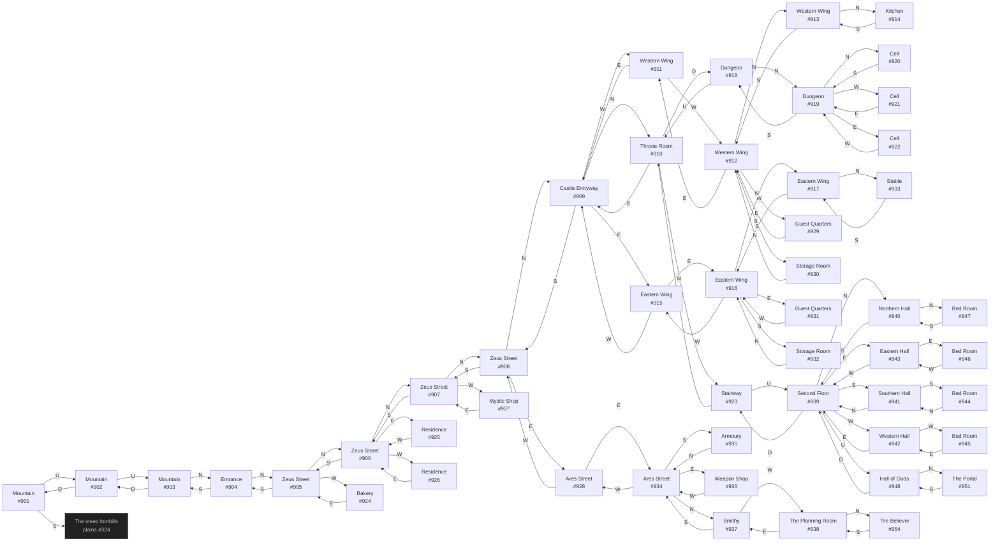

# Generic Olympus  `(olympus)`

[← back to world map](../WORLD-MAP.md) · 50 rooms · vnums 901–954

Dashed nodes are exits that leave this area.

## Rooms

| VNUM | Name | Exits |
|---:|---|---|
| 901 | Mountain | S→324 U→902 |
| 902 | Mountain | U→903 D→901 |
| 903 | Mountain | N→904 D→902 |
| 904 | Entrance | N→905 S→903 |
| 905 | Zeus Street | N→906 S→904 W→924 |
| 906 | Zeus Street | N→907 E→925 S→905 W→926 |
| 907 | Zeus Street | N→908 S→906 W→927 |
| 908 | Zeus Street | N→909 E→928 S→907 |
| 909 | Castle Entryway | N→910 E→915 S→908 W→911 |
| 910 | Throne Room | N→923 S→909 D→918 |
| 911 | Western Wing | E→909 W→912 |
| 912 | Western Wing | N→913 E→911 S→930 W→929 |
| 913 | Western Wing | N→914 S→912 |
| 914 | Kitchen | S→913 |
| 915 | Eastern Wing | E→916 W→909 |
| 916 | Eastern Wing | N→917 E→931 S→932 W→915 |
| 917 | Eastern Wing | N→933 S→916 |
| 918 | Dungeon | N→919 U→910 |
| 919 | Dungeon | N→920 E→922 S→918 W→921 |
| 920 | Cell | S→919 |
| 921 | Cell | E→919 |
| 922 | Cell | W→919 |
| 923 | Stairway | S→910 U→939 |
| 924 | Bakery | E→905 |
| 925 | Residence | W→906 |
| 926 | Residence | E→906 |
| 927 | Mystic Shop | E→907 |
| 928 | Ares Street | E→934 W→908 |
| 929 | Guest Quarters | E→912 |
| 930 | Storage Room | N→912 |
| 931 | Guest Quarters | W→916 |
| 932 | Storage Room | N→916 |
| 933 | Stable | S→917 |
| 934 | Ares Street | N→937 E→936 S→935 W→928 |
| 935 | Armoury | N→934 |
| 936 | Weapon Shop | W→934 |
| 937 | Smithy | S→934 W→938 |
| 938 | The Planning Room | N→954 E→937 |
| 939 | Second Floor | N→940 E→943 S→941 W→942 U→948 D→923 |
| 940 | Northern Hall | N→947 S→939 |
| 941 | Southern Hall | N→939 S→944 |
| 942 | Western Hall | E→939 W→945 |
| 943 | Eastern Hall | E→946 W→939 |
| 944 | Bed Room | N→941 |
| 945 | Bed Room | E→942 |
| 946 | Bed Room | W→943 |
| 947 | Bed Room | S→940 |
| 948 | Hall of Gods | N→951 D→939 |
| 951 | The Portal | S→948 |
| 954 | The Believer | S→938 |

