# Copper Plains of the North  `(plains)`

[← back to world map](../WORLD-MAP.md) · 44 rooms · vnums 300–345

Dashed nodes are exits that leave this area.

```mermaid
graph LR
  R300["Path in the plains<br/>#300"]
  R301["Path in the plains<br/>#301"]
  R302["Path in the plains<br/>#302"]
  R303["Path in the plains<br/>#303"]
  R304["Path in the plains<br/>#304"]
  R305["Path in the plains<br/>#305"]
  R306["Path in the foothills<br/>#306"]
  R307["Path in the foothills<br/>#307"]
  R308["Path in the foothills<br/>#308"]
  R309["Path in the foothills<br/>#309"]
  R310["Path in the foothills<br/>#310"]
  R311["Path in the foothills<br/>#311"]
  R312["The path intersection<br/>#312"]
  R313["Road to Ofcol<br/>#313"]
  R314["Outside Ofcol<br/>#314"]
  R315["Gallow hill<br/>#315"]
  R316["Grassy plains<br/>#316"]
  R317["Grassy plains<br/>#317"]
  R318["Grassy plains<br/>#318"]
  R319["Grassy plains<br/>#319"]
  R320["Grassy plains<br/>#320"]
  R321["Grassy plains<br/>#321"]
  R322["Grassy foothills<br/>#322"]
  R323["The steep foothills<br/>#323"]
  R324["The steep foothills<br/>#324"]
  R325["The steep foothills<br/>#325"]
  R326["The pool in the foothills<br/>#326"]
  R327["The foothills<br/>#327"]
  R330["In front of hut in foothills<br/>#330"]
  R331["Hermit's hut<br/>#331"]
  R332["The ancient path<br/>#332"]
  R333["The ancient path<br/>#333"]
  R334["The ancient path<br/>#334"]
  R335["The ancient path<br/>#335"]
  R336["The wooden bridge<br/>#336"]
  R337["The ancient path<br/>#337"]
  R338["Grassy plains<br/>#338"]
  R339["The Stones of G'harne<br/>#339"]
  R340["Dark smelly tunnels<br/>#340"]
  R341["Dead end of tunnel<br/>#341"]
  R342["Dark smelly tunnels<br/>#342"]
  R343["Dark smelly tunnels<br/>#343"]
  R344["The Hall of G'harne<br/>#344"]
  R345["Steep slope<br/>#345"]
  R300 -->|N| R315
  R300 -->|E| R301
  R300 -->|S| X3904
  R300 -->|W| R316
  R301 -->|E| R302
  R301 -->|W| R300
  R302 -->|N| R303
  R302 -->|W| R301
  R303 -->|N| R304
  R303 -->|E| R317
  R303 -->|S| R302
  R303 -->|W| R315
  R304 -->|N| R305
  R304 -->|S| R303
  R305 -->|N| R306
  R305 -->|E| R321
  R305 -->|S| R304
  R305 -->|W| R320
  R306 -->|N| R326
  R306 -->|E| R307
  R306 -->|S| R305
  R307 -->|E| R308
  R307 -->|W| R306
  R308 -->|N| R309
  R308 -->|W| R307
  R309 -->|E| R310
  R309 -->|S| R308
  R309 -->|W| R326
  R310 -->|N| R327
  R310 -->|E| R311
  R310 -->|W| R309
  R311 -->|E| R312
  R311 -->|W| R310
  R312 -->|N| R313
  R312 -->|S| R332
  R312 -->|W| R311
  R313 -->|N| R314
  R313 -->|S| R312
  R313 -->|W| R327
  R314 -->|N| X5550
  R314 -->|S| R313
  R315 -->|N| R320
  R315 -->|E| R303
  R315 -->|S| R300
  R315 -->|W| R318
  R315 -->|U| X2400
  R316 -->|N| R318
  R316 -->|E| R300
  R317 -->|E| R338
  R317 -->|S| R345
  R317 -->|W| R303
  R318 -->|N| R319
  R318 -->|E| R315
  R318 -->|S| R316
  R319 -->|N| R330
  R319 -->|E| R320
  R319 -->|S| R318
  R320 -->|N| R322
  R320 -->|E| R305
  R320 -->|S| R315
  R320 -->|W| R319
  R321 -->|S| R338
  R321 -->|W| R305
  R322 -->|N| R324
  R322 -->|S| R320
  R322 -->|W| R330
  R323 -->|N| X7800
  R323 -->|E| R324
  R323 -->|S| R330
  R324 -->|N| X901
  R324 -->|E| R325
  R324 -->|S| R322
  R324 -->|W| R323
  R325 -->|E| R326
  R325 -->|W| R324
  R326 -->|E| R309
  R326 -->|S| R306
  R326 -->|W| R325
  R327 -->|E| R313
  R327 -->|S| R310
  R330 -->|N| R323
  R330 -->|E| R322
  R330 -->|S| R319
  R330 -->|W| R331
  R331 -->|E| R330
  R332 -->|N| R312
  R332 -->|S| R333
  R333 -->|N| R332
  R333 -->|S| R334
  R334 -->|N| R333
  R334 -->|S| R335
  R335 -->|N| R334
  R335 -->|E| R336
  R336 -->|E| R337
  R336 -->|W| R335
  R337 -->|E| R339
  R337 -->|W| R336
  R338 -->|N| R321
  R338 -->|W| R317
  R339 -->|W| R337
  R339 -->|D| R340
  R340 -->|S| R341
  R340 -->|W| R342
  R340 -->|U| R339
  R341 -->|N| R340
  R342 -->|E| R340
  R342 -->|W| R343
  R343 -->|E| R342
  R343 -->|W| R344
  R344 -->|E| R343
  X3904["The long dusty trail following the north wall.<br/>moria #3904"]:::ext
  X5550["Village street<br/>ofcol #5550"]:::ext
  X2400["Entrance to Ultima<br/>ultima #2400"]:::ext
  X7800["A Path from the Plains<br/>valley #7800"]:::ext
  X901["Mountain<br/>olympus #901"]:::ext
  classDef ext fill:#222,stroke:#888,color:#bbb,stroke-dasharray:3 3;
```

## Rooms

| VNUM | Name | Exits |
|---:|---|---|
| 300 | Path in the plains | N→315 E→301 S→3904 W→316 |
| 301 | Path in the plains | E→302 W→300 |
| 302 | Path in the plains | N→303 W→301 |
| 303 | Path in the plains | N→304 E→317 S→302 W→315 |
| 304 | Path in the plains | N→305 S→303 |
| 305 | Path in the plains | N→306 E→321 S→304 W→320 |
| 306 | Path in the foothills | N→326 E→307 S→305 |
| 307 | Path in the foothills | E→308 W→306 |
| 308 | Path in the foothills | N→309 W→307 |
| 309 | Path in the foothills | E→310 S→308 W→326 |
| 310 | Path in the foothills | N→327 E→311 W→309 |
| 311 | Path in the foothills | E→312 W→310 |
| 312 | The path intersection | N→313 S→332 W→311 |
| 313 | Road to Ofcol | N→314 S→312 W→327 |
| 314 | Outside Ofcol | N→5550 S→313 |
| 315 | Gallow hill | N→320 E→303 S→300 W→318 U→2400 |
| 316 | Grassy plains | N→318 E→300 |
| 317 | Grassy plains | E→338 S→345 W→303 |
| 318 | Grassy plains | N→319 E→315 S→316 |
| 319 | Grassy plains | N→330 E→320 S→318 |
| 320 | Grassy plains | N→322 E→305 S→315 W→319 |
| 321 | Grassy plains | S→338 W→305 |
| 322 | Grassy foothills | N→324 S→320 W→330 |
| 323 | The steep foothills | N→7800 E→324 S→330 |
| 324 | The steep foothills | N→901 E→325 S→322 W→323 |
| 325 | The steep foothills | E→326 W→324 |
| 326 | The pool in the foothills | E→309 S→306 W→325 |
| 327 | The foothills | E→313 S→310 |
| 330 | In front of hut in foothills | N→323 E→322 S→319 W→331 |
| 331 | Hermit's hut | E→330 |
| 332 | The ancient path | N→312 S→333 |
| 333 | The ancient path | N→332 S→334 |
| 334 | The ancient path | N→333 S→335 |
| 335 | The ancient path | N→334 E→336 |
| 336 | The wooden bridge | E→337 W→335 |
| 337 | The ancient path | E→339 W→336 |
| 338 | Grassy plains | N→321 W→317 |
| 339 | The Stones of G'harne | W→337 D→340 |
| 340 | Dark smelly tunnels | S→341 W→342 U→339 |
| 341 | Dead end of tunnel | N→340 |
| 342 | Dark smelly tunnels | E→340 W→343 |
| 343 | Dark smelly tunnels | E→342 W→344 |
| 344 | The Hall of G'harne | E→343 |
| 345 | Steep slope | — |

