# Hatchet The Rats Lair  `(rats)`

[← back to world map](../WORLD-MAP.md) · 43 rooms · vnums 3801–3899

Dashed nodes are exits that leave this area.

```mermaid
graph LR
  R3801["Below a Dark Stairway<br/>#3801"]
  R3802["A Hallway<br/>#3802"]
  R3803["A Dim Hallway<br/>#3803"]
  R3804["A Dim Hallway Above the Stairway<br/>#3804"]
  R3805["A Small Storage Room<br/>#3805"]
  R3806["A Small Storage Room<br/>#3806"]
  R3807["A Small Storage Room<br/>#3807"]
  R3808["A Small Storage Room<br/>#3808"]
  R3809["A Small Storage Room<br/>#3809"]
  R3810["A Small Storage Room<br/>#3810"]
  R3811["Beneath the Old Stairway<br/>#3811"]
  R3812["A Dark Hallway<br/>#3812"]
  R3813["A Dark Hallway<br/>#3813"]
  R3814["A Dark Hallway<br/>#3814"]
  R3815["A Storage Room<br/>#3815"]
  R3816["A Storage Room<br/>#3816"]
  R3817["A Bedroom<br/>#3817"]
  R3818["A Bedroom<br/>#3818"]
  R3819["A Bedroom<br/>#3819"]
  R3820["A Bedroom<br/>#3820"]
  R3821["A Bedroom<br/>#3821"]
  R3822["A Bedroom<br/>#3822"]
  R3823["A Stairway<br/>#3823"]
  R3824["A Meeting Room<br/>#3824"]
  R3825["At the Bottom of the Stairs<br/>#3825"]
  R3826["The Firedrake's Lair<br/>#3826"]
  R3827["The Treasure Room<br/>#3827"]
  R3828["The Leader's Quarters<br/>#3828"]
  R3829["A Rough Tunnel<br/>#3829"]
  R3830["A T-Intersection in the Tunnels<br/>#3830"]
  R3831["A Large Cage<br/>#3831"]
  R3832["A Bend in the Tunnels<br/>#3832"]
  R3833["A T-Intersection in the Tunnels<br/>#3833"]
  R3834["An End of the Tunnel<br/>#3834"]
  R3835["An End of the Tunnel<br/>#3835"]
  R3836["The Tunnel<br/>#3836"]
  R3837["An End of the Tunnel<br/>#3837"]
  R3838["A Small Shrine<br/>#3838"]
  R3839["On the Other Side of the Dimensional Portal<br/>#3839"]
  R3840["The Living Room of Icaza and Hatchet<br/>#3840"]
  R3841["Hatchet's Study<br/>#3841"]
  R3842["Icaza's Study<br/>#3842"]
  R3899["Icaza's and Hatchet's Bedroom<br/>#3899"]
  R3801 -->|S| R3802
  R3801 -->|U| X3026
  R3802 -->|N| R3801
  R3802 -->|E| R3806
  R3802 -->|S| R3803
  R3802 -->|W| R3805
  R3803 -->|N| R3802
  R3803 -->|E| R3808
  R3803 -->|S| R3804
  R3803 -->|W| R3807
  R3804 -->|N| R3803
  R3804 -->|E| R3810
  R3804 -->|W| R3809
  R3804 -->|D| R3811
  R3805 -->|E| R3802
  R3806 -->|W| R3802
  R3807 -->|E| R3803
  R3808 -->|W| R3803
  R3809 -->|E| R3804
  R3810 -->|W| R3804
  R3811 -->|N| R3812
  R3811 -->|E| R3816
  R3811 -->|W| R3815
  R3811 -->|U| R3804
  R3812 -->|N| R3813
  R3812 -->|E| R3818
  R3812 -->|S| R3811
  R3812 -->|W| R3817
  R3813 -->|N| R3814
  R3813 -->|E| R3820
  R3813 -->|S| R3812
  R3813 -->|W| R3819
  R3814 -->|N| R3823
  R3814 -->|E| R3822
  R3814 -->|S| R3813
  R3814 -->|W| R3821
  R3815 -->|E| R3811
  R3816 -->|W| R3811
  R3817 -->|E| R3812
  R3818 -->|W| R3812
  R3819 -->|E| R3813
  R3820 -->|W| R3813
  R3821 -->|E| R3814
  R3822 -->|W| R3814
  R3823 -->|S| R3814
  R3823 -->|U| R3824
  R3823 -->|D| R3825
  R3824 -->|D| R3823
  R3825 -->|S| R3826
  R3825 -->|U| R3823
  R3826 -->|N| R3825
  R3826 -->|E| R3827
  R3826 -->|S| R3829
  R3826 -->|W| R3828
  R3827 -->|W| R3826
  R3828 -->|E| R3826
  R3829 -->|N| R3826
  R3829 -->|S| R3830
  R3830 -->|N| R3829
  R3830 -->|E| R3832
  R3830 -->|W| R3831
  R3831 -->|E| R3830
  R3832 -->|S| R3833
  R3832 -->|W| R3830
  R3833 -->|N| R3832
  R3833 -->|E| R3835
  R3833 -->|S| R3836
  R3833 -->|W| R3834
  R3834 -->|E| R3833
  R3835 -->|W| R3833
  R3836 -->|N| R3833
  R3836 -->|S| R3837
  R3837 -->|N| R3836
  R3837 -->|S| R3838
  R3838 -->|N| R3837
  R3838 -->|W| R3839
  R3839 -->|E| R3838
  R3839 -->|W| R3840
  R3840 -->|N| R3841
  R3840 -->|E| R3839
  R3840 -->|S| R3842
  R3841 -->|S| R3840
  R3842 -->|N| R3840
  X3026["The Dark Alley<br/>midgaard #3026"]:::ext
  classDef ext fill:#222,stroke:#888,color:#bbb,stroke-dasharray:3 3;
```

## Rooms

| VNUM | Name | Exits |
|---:|---|---|
| 3801 | Below a Dark Stairway | S→3802 U→3026 |
| 3802 | A Hallway | N→3801 E→3806 S→3803 W→3805 |
| 3803 | A Dim Hallway | N→3802 E→3808 S→3804 W→3807 |
| 3804 | A Dim Hallway Above the Stairway | N→3803 E→3810 W→3809 D→3811 |
| 3805 | A Small Storage Room | E→3802 |
| 3806 | A Small Storage Room | W→3802 |
| 3807 | A Small Storage Room | E→3803 |
| 3808 | A Small Storage Room | W→3803 |
| 3809 | A Small Storage Room | E→3804 |
| 3810 | A Small Storage Room | W→3804 |
| 3811 | Beneath the Old Stairway | N→3812 E→3816 W→3815 U→3804 |
| 3812 | A Dark Hallway | N→3813 E→3818 S→3811 W→3817 |
| 3813 | A Dark Hallway | N→3814 E→3820 S→3812 W→3819 |
| 3814 | A Dark Hallway | N→3823 E→3822 S→3813 W→3821 |
| 3815 | A Storage Room | E→3811 |
| 3816 | A Storage Room | W→3811 |
| 3817 | A Bedroom | E→3812 |
| 3818 | A Bedroom | W→3812 |
| 3819 | A Bedroom | E→3813 |
| 3820 | A Bedroom | W→3813 |
| 3821 | A Bedroom | E→3814 |
| 3822 | A Bedroom | W→3814 |
| 3823 | A Stairway | S→3814 U→3824 D→3825 |
| 3824 | A Meeting Room | D→3823 |
| 3825 | At the Bottom of the Stairs | S→3826 U→3823 |
| 3826 | The Firedrake's Lair | N→3825 E→3827 S→3829 W→3828 |
| 3827 | The Treasure Room | W→3826 |
| 3828 | The Leader's Quarters | E→3826 |
| 3829 | A Rough Tunnel | N→3826 S→3830 |
| 3830 | A T-Intersection in the Tunnels | N→3829 E→3832 W→3831 |
| 3831 | A Large Cage | E→3830 |
| 3832 | A Bend in the Tunnels | S→3833 W→3830 |
| 3833 | A T-Intersection in the Tunnels | N→3832 E→3835 S→3836 W→3834 |
| 3834 | An End of the Tunnel | E→3833 |
| 3835 | An End of the Tunnel | W→3833 |
| 3836 | The Tunnel | N→3833 S→3837 |
| 3837 | An End of the Tunnel | N→3836 S→3838 |
| 3838 | A Small Shrine | N→3837 W→3839 |
| 3839 | On the Other Side of the Dimensional Portal | E→3838 W→3840 |
| 3840 | The Living Room of Icaza and Hatchet | N→3841 E→3839 S→3842 |
| 3841 | Hatchet's Study | S→3840 |
| 3842 | Icaza's Study | N→3840 |
| 3899 | Icaza's and Hatchet's Bedroom | — |

