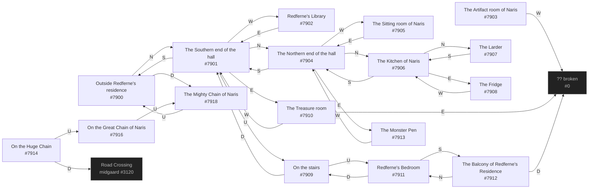

# Diku Redferne's Residence  `(redferne)`

[← back to world map](../WORLD-MAP.md) · 17 rooms · vnums 7900–7918

Dashed nodes are exits that leave this area.

## Rooms

| VNUM | Name | Exits |
|---:|---|---|
| 7900 | Outside Redferne's residence | N→7901 D→7918 |
| 7901 | The Southern end of the hall | N→7904 E→7910 S→7900 W→7902 U→7909 |
| 7902 | Redferne's Library | E→7901 |
| 7903 | The Artifact room of Naris | W→0 |
| 7904 | The Northern end of the hall | N→7906 E→7913 S→7901 W→7905 |
| 7905 | The Sitting room of Naris | E→7904 |
| 7906 | The Kitchen of Naris | N→7907 E→7908 S→7904 |
| 7907 | The Larder | S→7906 |
| 7908 | The Fridge | W→7906 |
| 7909 | On the stairs | U→7911 D→7901 |
| 7910 | The Treasure room | E→0 W→7901 |
| 7911 | Redferne's Bedroom | S→7912 D→7909 |
| 7912 | The Balcony of Redferne's Residence | N→7911 D→0 |
| 7913 | The Monster Pen | W→7904 |
| 7914 | On the Huge Chain | U→7916 D→3120 |
| 7916 | On the Great Chain of Naris | U→7918 |
| 7918 | The Mighty Chain of Naris | U→7900 |

