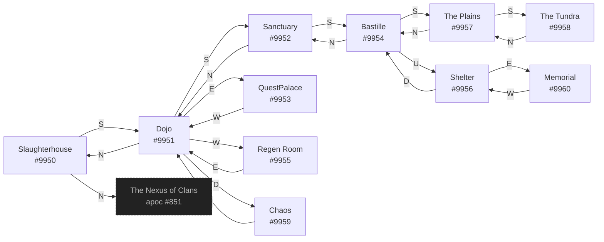

# Malucif The Renegades Headquarters  `(renegades)`

[← back to world map](../WORLD-MAP.md) · 11 rooms · vnums 9950–9960

Dashed nodes are exits that leave this area.

## Rooms

| VNUM | Name | Exits |
|---:|---|---|
| 9950 | Slaughterhouse | N→851 S→9951 |
| 9951 | Dojo | N→9950 E→9953 S→9952 W→9955 D→9959 |
| 9952 | Sanctuary | N→9951 S→9954 |
| 9953 | QuestPalace | W→9951 |
| 9954 | Bastille | N→9952 S→9957 U→9956 |
| 9955 | Regen Room | E→9951 |
| 9956 | Shelter | E→9960 D→9954 |
| 9957 | The Plains | N→9954 S→9958 |
| 9958 | The Tundra | N→9957 |
| 9959 | Chaos | U→9951 |
| 9960 | Memorial | W→9956 |

