# Hatchet Mud School  `(school)`

[← back to world map](../WORLD-MAP.md) · 59 rooms · vnums 3700–3760

Dashed nodes are exits that leave this area.

```mermaid
graph LR
  R3700["Entrance to Mud School<br/>#3700"]
  R3701["A Room in Mud School<br/>#3701"]
  R3702["The Center Room<br/>#3702"]
  R3703["A Room in Mud School<br/>#3703"]
  R3704["A Room in Mud School<br/>#3704"]
  R3705["A Room in Mud School<br/>#3705"]
  R3707["A Room in Mud School<br/>#3707"]
  R3708["A Room in Mud School<br/>#3708"]
  R3709["A Room in Mud School<br/>#3709"]
  R3710["The Blob Cage<br/>#3710"]
  R3711["A Room in Mud School<br/>#3711"]
  R3712["The Cage Room<br/>#3712"]
  R3713["A Cage<br/>#3713"]
  R3714["A Cage<br/>#3714"]
  R3715["A Cage<br/>#3715"]
  R3716["A Cage<br/>#3716"]
  R3717["A Room in Mud School<br/>#3717"]
  R3718["The Store in Mud School<br/>#3718"]
  R3719["A Room in Mud School<br/>#3719"]
  R3720["The Darkened Room<br/>#3720"]
  R3721["The End of Mud School!<br/>#3721"]
  R3722["South Wall of Arena<br/>#3722"]
  R3723["South Wall of Arena<br/>#3723"]
  R3724["South West Corner of Arena<br/>#3724"]
  R3725["South Wall of Arena<br/>#3725"]
  R3726["South East Corner of Arena<br/>#3726"]
  R3727["West Wall of Arena<br/>#3727"]
  R3728["Arena<br/>#3728"]
  R3729["Arena<br/>#3729"]
  R3730["Arena<br/>#3730"]
  R3731["East Wall of Arena<br/>#3731"]
  R3732["West Wall of Arena<br/>#3732"]
  R3733["Arena<br/>#3733"]
  R3734["Center of Arena<br/>#3734"]
  R3735["Arena<br/>#3735"]
  R3736["East Wall of Arena<br/>#3736"]
  R3737["West Wall of Arena<br/>#3737"]
  R3738["Arena<br/>#3738"]
  R3739["Arena<br/>#3739"]
  R3740["Arena<br/>#3740"]
  R3741["East Wall of Arena<br/>#3741"]
  R3742["North West Corner of Arena<br/>#3742"]
  R3743["North Wall of Arena<br/>#3743"]
  R3744["North Wall of Arena<br/>#3744"]
  R3745["North Wall of Arena<br/>#3745"]
  R3746["North East Corner of Arena<br/>#3746"]
  R3748["The Center of the Dungeon<br/>#3748"]
  R3749["The North West Corner of the Dungeon<br/>#3749"]
  R3750["The North Wall of the Dungeon<br/>#3750"]
  R3751["The North East Corner of the Dungeon<br/>#3751"]
  R3752["The West Wall of the Dungeon<br/>#3752"]
  R3753["The East Wall of the Dungeon<br/>#3753"]
  R3754["The South West Corner of the Dungeon<br/>#3754"]
  R3755["The South Wall of the Dungeon<br/>#3755"]
  R3756["The South East Corner of the Dungeon<br/>#3756"]
  R3757["A Room in Mud School<br/>#3757"]
  R3758["Furey's Training Room<br/>#3758"]
  R3759["Hatchet's Guild Room<br/>#3759"]
  R3760["A Safe Room<br/>#3760"]
  R3700 -->|N| R3757
  R3700 -->|S| R3744
  R3700 -->|D| X3001
  R3701 -->|S| R3757
  R3701 -->|W| R3702
  R3702 -->|N| R3703
  R3702 -->|E| R3701
  R3702 -->|S| R3705
  R3702 -->|W| R3704
  R3702 -->|U| R3708
  R3702 -->|D| R3707
  R3703 -->|N| R3709
  R3703 -->|S| R3702
  R3704 -->|E| R3702
  R3705 -->|N| R3702
  R3707 -->|U| R3702
  R3708 -->|D| R3702
  R3709 -->|W| R3711
  R3709 -->|D| R3710
  R3710 -->|U| R3709
  R3711 -->|E| R3709
  R3711 -->|D| R3712
  R3712 -->|N| R3713
  R3712 -->|E| R3716
  R3712 -->|S| R3715
  R3712 -->|W| R3714
  R3712 -->|D| R3717
  R3713 -->|S| R3712
  R3714 -->|E| R3712
  R3715 -->|N| R3712
  R3716 -->|W| R3712
  R3717 -->|E| R3719
  R3717 -->|S| R3718
  R3717 -->|U| R3712
  R3718 -->|N| R3717
  R3719 -->|N| R3720
  R3719 -->|E| R3721
  R3719 -->|W| R3717
  R3720 -->|S| R3719
  R3721 -->|N| R3722
  R3722 -->|N| R3729
  R3722 -->|E| R3725
  R3722 -->|W| R3723
  R3722 -->|U| R3760
  R3723 -->|N| R3728
  R3723 -->|E| R3722
  R3723 -->|W| R3724
  R3723 -->|U| R3760
  R3724 -->|N| R3727
  R3724 -->|E| R3723
  R3724 -->|U| R3760
  R3725 -->|N| R3730
  R3725 -->|E| R3726
  R3725 -->|W| R3722
  R3725 -->|U| R3760
  R3726 -->|N| R3731
  R3726 -->|W| R3725
  R3726 -->|U| R3760
  R3727 -->|N| R3732
  R3727 -->|E| R3728
  R3727 -->|S| R3724
  R3727 -->|U| R3760
  R3728 -->|N| R3733
  R3728 -->|E| R3729
  R3728 -->|S| R3723
  R3728 -->|W| R3727
  R3728 -->|U| R3760
  R3729 -->|N| R3734
  R3729 -->|E| R3730
  R3729 -->|S| R3722
  R3729 -->|W| R3728
  R3729 -->|U| R3760
  R3730 -->|N| R3735
  R3730 -->|E| R3731
  R3730 -->|S| R3725
  R3730 -->|W| R3729
  R3730 -->|U| R3760
  R3731 -->|N| R3736
  R3731 -->|S| R3726
  R3731 -->|W| R3730
  R3731 -->|U| R3760
  R3732 -->|N| R3737
  R3732 -->|E| R3733
  R3732 -->|S| R3727
  R3732 -->|U| R3760
  R3733 -->|N| R3738
  R3733 -->|E| R3734
  R3733 -->|S| R3728
  R3733 -->|W| R3732
  R3733 -->|U| R3760
  R3734 -->|N| R3739
  R3734 -->|E| R3735
  R3734 -->|S| R3729
  R3734 -->|W| R3733
  R3734 -->|U| R3760
  R3734 -->|D| R3748
  R3735 -->|N| R3740
  R3735 -->|E| R3736
  R3735 -->|S| R3730
  R3735 -->|W| R3734
  R3735 -->|U| R3760
  R3736 -->|N| R3741
  R3736 -->|S| R3731
  R3736 -->|W| R3735
  R3736 -->|U| R3760
  R3737 -->|N| R3742
  R3737 -->|E| R3738
  R3737 -->|S| R3732
  R3737 -->|U| R3760
  R3738 -->|N| R3743
  R3738 -->|E| R3739
  R3738 -->|S| R3733
  R3738 -->|W| R3737
  R3738 -->|U| R3760
  R3739 -->|N| R3744
  R3739 -->|E| R3740
  R3739 -->|S| R3734
  R3739 -->|W| R3738
  R3739 -->|U| R3760
  R3740 -->|N| R3745
  R3740 -->|E| R3741
  R3740 -->|S| R3735
  R3740 -->|W| R3739
  R3740 -->|U| R3760
  R3741 -->|N| R3746
  R3741 -->|S| R3736
  R3741 -->|W| R3740
  R3741 -->|U| R3760
  R3742 -->|E| R3743
  R3742 -->|S| R3737
  R3742 -->|U| R3760
  R3743 -->|E| R3744
  R3743 -->|S| R3738
  R3743 -->|W| R3742
  R3743 -->|U| R3760
  R3744 -->|E| R3745
  R3744 -->|S| R3739
  R3744 -->|W| R3743
  R3744 -->|U| R3760
  R3745 -->|E| R3746
  R3745 -->|S| R3740
  R3745 -->|W| R3744
  R3745 -->|U| R3760
  R3746 -->|S| R3741
  R3746 -->|W| R3745
  R3746 -->|U| R3760
  R3748 -->|N| R3750
  R3748 -->|E| R3753
  R3748 -->|S| R3755
  R3748 -->|W| R3752
  R3748 -->|U| R3734
  R3749 -->|E| R3750
  R3749 -->|S| R3752
  R3750 -->|E| R3751
  R3750 -->|S| R3748
  R3750 -->|W| R3749
  R3751 -->|S| R3753
  R3751 -->|W| R3750
  R3752 -->|N| R3749
  R3752 -->|E| R3748
  R3752 -->|S| R3754
  R3753 -->|N| R3751
  R3753 -->|S| R3756
  R3753 -->|W| R3748
  R3754 -->|N| R3752
  R3754 -->|E| R3755
  R3755 -->|N| R3748
  R3755 -->|E| R3756
  R3755 -->|W| R3754
  R3756 -->|N| R3753
  R3756 -->|W| R3755
  R3757 -->|N| R3701
  R3757 -->|E| R3759
  R3757 -->|S| R3700
  R3757 -->|W| R3758
  R3758 -->|E| R3757
  R3759 -->|W| R3757
  R3760 -->|U| X3001
  X3001["The Temple Of Midgaard<br/>midgaard #3001"]:::ext
  classDef ext fill:#222,stroke:#888,color:#bbb,stroke-dasharray:3 3;
```

## Rooms

| VNUM | Name | Exits |
|---:|---|---|
| 3700 | Entrance to Mud School | N→3757 S→3744 D→3001 |
| 3701 | A Room in Mud School | S→3757 W→3702 |
| 3702 | The Center Room | N→3703 E→3701 S→3705 W→3704 U→3708 D→3707 |
| 3703 | A Room in Mud School | N→3709 S→3702 |
| 3704 | A Room in Mud School | E→3702 |
| 3705 | A Room in Mud School | N→3702 |
| 3707 | A Room in Mud School | U→3702 |
| 3708 | A Room in Mud School | D→3702 |
| 3709 | A Room in Mud School | W→3711 D→3710 |
| 3710 | The Blob Cage | U→3709 |
| 3711 | A Room in Mud School | E→3709 D→3712 |
| 3712 | The Cage Room | N→3713 E→3716 S→3715 W→3714 D→3717 |
| 3713 | A Cage | S→3712 |
| 3714 | A Cage | E→3712 |
| 3715 | A Cage | N→3712 |
| 3716 | A Cage | W→3712 |
| 3717 | A Room in Mud School | E→3719 S→3718 U→3712 |
| 3718 | The Store in Mud School | N→3717 |
| 3719 | A Room in Mud School | N→3720 E→3721 W→3717 |
| 3720 | The Darkened Room | S→3719 |
| 3721 | The End of Mud School! | N→3722 |
| 3722 | South Wall of Arena | N→3729 E→3725 W→3723 U→3760 |
| 3723 | South Wall of Arena | N→3728 E→3722 W→3724 U→3760 |
| 3724 | South West Corner of Arena | N→3727 E→3723 U→3760 |
| 3725 | South Wall of Arena | N→3730 E→3726 W→3722 U→3760 |
| 3726 | South East Corner of Arena | N→3731 W→3725 U→3760 |
| 3727 | West Wall of Arena | N→3732 E→3728 S→3724 U→3760 |
| 3728 | Arena | N→3733 E→3729 S→3723 W→3727 U→3760 |
| 3729 | Arena | N→3734 E→3730 S→3722 W→3728 U→3760 |
| 3730 | Arena | N→3735 E→3731 S→3725 W→3729 U→3760 |
| 3731 | East Wall of Arena | N→3736 S→3726 W→3730 U→3760 |
| 3732 | West Wall of Arena | N→3737 E→3733 S→3727 U→3760 |
| 3733 | Arena | N→3738 E→3734 S→3728 W→3732 U→3760 |
| 3734 | Center of Arena | N→3739 E→3735 S→3729 W→3733 U→3760 D→3748 |
| 3735 | Arena | N→3740 E→3736 S→3730 W→3734 U→3760 |
| 3736 | East Wall of Arena | N→3741 S→3731 W→3735 U→3760 |
| 3737 | West Wall of Arena | N→3742 E→3738 S→3732 U→3760 |
| 3738 | Arena | N→3743 E→3739 S→3733 W→3737 U→3760 |
| 3739 | Arena | N→3744 E→3740 S→3734 W→3738 U→3760 |
| 3740 | Arena | N→3745 E→3741 S→3735 W→3739 U→3760 |
| 3741 | East Wall of Arena | N→3746 S→3736 W→3740 U→3760 |
| 3742 | North West Corner of Arena | E→3743 S→3737 U→3760 |
| 3743 | North Wall of Arena | E→3744 S→3738 W→3742 U→3760 |
| 3744 | North Wall of Arena | E→3745 S→3739 W→3743 U→3760 |
| 3745 | North Wall of Arena | E→3746 S→3740 W→3744 U→3760 |
| 3746 | North East Corner of Arena | S→3741 W→3745 U→3760 |
| 3748 | The Center of the Dungeon | N→3750 E→3753 S→3755 W→3752 U→3734 |
| 3749 | The North West Corner of the Dungeon | E→3750 S→3752 |
| 3750 | The North Wall of the Dungeon | E→3751 S→3748 W→3749 |
| 3751 | The North East Corner of the Dungeon | S→3753 W→3750 |
| 3752 | The West Wall of the Dungeon | N→3749 E→3748 S→3754 |
| 3753 | The East Wall of the Dungeon | N→3751 S→3756 W→3748 |
| 3754 | The South West Corner of the Dungeon | N→3752 E→3755 |
| 3755 | The South Wall of the Dungeon | N→3748 E→3756 W→3754 |
| 3756 | The South East Corner of the Dungeon | N→3753 W→3755 |
| 3757 | A Room in Mud School | N→3701 E→3759 S→3700 W→3758 |
| 3758 | Furey's Training Room | E→3757 |
| 3759 | Hatchet's Guild Room | W→3757 |
| 3760 | A Safe Room | U→3001 |

