# Diku Sewer  `(sewer)`

[← back to world map](WORLD-MAP.md) · 177 rooms · vnums 7001–7445

Dashed nodes are exits that leave this area.

```mermaid
graph LR
  R7001["The muddy sewer<br/>#7001"]
  R7002["The muddy sewer junction<br/>#7002"]
  R7003["The mudhole<br/>#7003"]
  R7004["The Dark Pit<br/>#7004"]
  R7005["The muddy sewer<br/>#7005"]
  R7006["The muddy sewer<br/>#7006"]
  R7007["The muddy sewer bend<br/>#7007"]
  R7008["A muddy intersection<br/>#7008"]
  R7009["The Sewer Junction<br/>#7009"]
  R7010["A bend in sewer pipe<br/>#7010"]
  R7011["The muddy sewer pipe<br/>#7011"]
  R7012["The bend in the Muddy sewer<br/>#7012"]
  R7013["A MUDDY intersection<br/>#7013"]
  R7014["Muddy sewer<br/>#7014"]
  R7015["The old well<br/>#7015"]
  R7016["The ordinary bend<br/>#7016"]
  R7017["The sewer junction<br/>#7017"]
  R7018["The ordinary junction<br/>#7018"]
  R7021["A quiet pipe junction<br/>#7021"]
  R7022["The odd room with smooth walls<br/>#7022"]
  R7024["The sewer<br/>#7024"]
  R7025["Another intersection<br/>#7025"]
  R7026["A junction<br/>#7026"]
  R7028["The sewer junction<br/>#7028"]
  R7029["The Triple Junction<br/>#7029"]
  R7030["The Quadruple Junction Under the Dump<br/>#7030"]
  R7031["A triple junction<br/>#7031"]
  R7034["A bend in the sewer pipe<br/>#7034"]
  R7035["The sewer pipe bend<br/>#7035"]
  R7036["The pit<br/>#7036"]
  R7037["The round room<br/>#7037"]
  R7038["The three way junction<br/>#7038"]
  R7039["The Sewer Store Room<br/>#7039"]
  R7041["The Shaft<br/>#7041"]
  R7043["The Sewer Entrance<br/>#7043"]
  R7044["The junction going three ways<br/>#7044"]
  R7045["The Sewer Room<br/>#7045"]
  R7046["The Sewer room<br/>#7046"]
  R7047["The Pool in the Sewer<br/>#7047"]
  R7048["The Sewers<br/>#7048"]
  R7049["The junction<br/>#7049"]
  R7050["The small room<br/>#7050"]
  R7051["The Sewer pipe<br/>#7051"]
  R7052["The Grand Sewer<br/>#7052"]
  R7053["The South end of the Grand Pipe<br/>#7053"]
  R7055["The Edge of The Water Sewer<br/>#7055"]
  R7056["The Dark hallway<br/>#7056"]
  R7057["The dark passageway<br/>#7057"]
  R7058["The dark passageway<br/>#7058"]
  R7059["The dark passageway<br/>#7059"]
  R7060["The dark passageway<br/>#7060"]
  R7061["The Watery Sewer Bend<br/>#7061"]
  R7062["The Watery sewer<br/>#7062"]
  R7063["The Watery sewer<br/>#7063"]
  R7064["The Watery Sewer Junction<br/>#7064"]
  R7065["The Watery sewer<br/>#7065"]
  R7066["The Watery sewer junction<br/>#7066"]
  R7067["The Watery sewer<br/>#7067"]
  R7068["The Watery sewer bend<br/>#7068"]
  R7069["A ledge by the dark pool<br/>#7069"]
  R7070["A ledge by the dark pool<br/>#7070"]
  R7099["The fissure under the ledge<br/>#7099"]
  R7101["Under the mudhole<br/>#7101"]
  R7102["Under the Dark Pit<br/>#7102"]
  R7103["A muddy bend in the sewer system<br/>#7103"]
  R7104["A junction in the sewer pipes<br/>#7104"]
  R7105["Down the old well<br/>#7105"]
  R7106["The northwestern corner of the ledge<br/>#7106"]
  R7107["The narrow ledge<br/>#7107"]
  R7108["The narrow ledge<br/>#7108"]
  R7109["The narrow ledge<br/>#7109"]
  R7110["The narrow ledge<br/>#7110"]
  R7111["The southwestern corner of the ledge<br/>#7111"]
  R7112["An odd intersection<br/>#7112"]
  R7113["The narrow ledge going east to west<br/>#7113"]
  R7114["Mid-air<br/>#7114"]
  R7115["The Broad ledge<br/>#7115"]
  R7116["The northeastern corner of the ledge<br/>#7116"]
  R7117["The narrow eastern ledge<br/>#7117"]
  R7118["The narrow eastern ledge<br/>#7118"]
  R7119["The narrow eastern ledge<br/>#7119"]
  R7120["The narrow eastern ledge<br/>#7120"]
  R7121["The southeastern corner of the ledge<br/>#7121"]
  R7122["Under the pit<br/>#7122"]
  R7123["Under The Shaft<br/>#7123"]
  R7129["The sewer line.<br/>#7129"]
  R7130["The sewer pipe.<br/>#7130"]
  R7190["Mid-air<br/>#7190"]
  R7199["The Edge of the Water<br/>#7199"]
  R7200["The Treasury<br/>#7200"]
  R7201["The inner Lair<br/>#7201"]
  R7202["The Lair<br/>#7202"]
  R7203["The Lair<br/>#7203"]
  R7204["The Lair<br/>#7204"]
  R7205["The Lair<br/>#7205"]
  R7206["The lair.<br/>#7206"]
  R7207["The lair.<br/>#7207"]
  R7208["The lair entrance.<br/>#7208"]
  R7209["The crawlway.<br/>#7209"]
  R7210["The four-way junction.<br/>#7210"]
  R7211["The small cave.<br/>#7211"]
  R7212["The sewer drain.<br/>#7212"]
  R7213["The sewer drain.<br/>#7213"]
  R7214["The drain end.<br/>#7214"]
  R7215["The half-wet drain.<br/>#7215"]
  R7216["Under water in the sewer.<br/>#7216"]
  R7217["The half-dry drain.<br/>#7217"]
  R7218["The very small room.<br/>#7218"]
  R7219["A dry sewer drain.<br/>#7219"]
  R7220["A boring drain.<br/>#7220"]
  R7221["The sewer drain.<br/>#7221"]
  R7222["The sewer drain.<br/>#7222"]
  R7223["The sewer bend.<br/>#7223"]
  R7224["The sewer junction<br/>#7224"]
  R7225["The sewer<br/>#7225"]
  R7229["The strange sewer<br/>#7229"]
  R7230["The damp sewer<br/>#7230"]
  R7231["The strange sewer<br/>#7231"]
  R7232["The sewer<br/>#7232"]
  R7233["The sewer drain<br/>#7233"]
  R7234["The rat's lair<br/>#7234"]
  R7279["The Wall of the Abyss<br/>#7279"]
  R7280["The entrance.<br/>#7280"]
  R7281["The corridor.<br/>#7281"]
  R7282["The Realm of lost souls<br/>#7282"]
  R7283["The T-crossing<br/>#7283"]
  R7284["The firedeath<br/>#7284"]
  R7285["The tortureroom.<br/>#7285"]
  R7286["The hells yard<br/>#7286"]
  R7301["The Entrance to the Realm of silence<br/>#7301"]
  R7399["On the walls of the Abyss<br/>#7399"]
  R7400["Cave entrance<br/>#7400"]
  R7401["Cave tunnel<br/>#7401"]
  R7402["Cave room<br/>#7402"]
  R7403["Cave T-cross<br/>#7403"]
  R7404["Cave turning-point<br/>#7404"]
  R7405["The secret room<br/>#7405"]
  R7406["The mudhole<br/>#7406"]
  R7407["Tunnel<br/>#7407"]
  R7408["The long tunnel<br/>#7408"]
  R7409["The hot room<br/>#7409"]
  R7410["The small room<br/>#7410"]
  R7411["The stalagmite cave<br/>#7411"]
  R7412["The stalagmite tunnel<br/>#7412"]
  R7413["The spongy room<br/>#7413"]
  R7414["The stalagmite T-cross<br/>#7414"]
  R7415["The blind end room<br/>#7415"]
  R7416["The treasure room<br/>#7416"]
  R7417["The square lair<br/>#7417"]
  R7418["The square lair<br/>#7418"]
  R7419["The square lair<br/>#7419"]
  R7420["The lair end<br/>#7420"]
  R7421["East tunnel<br/>#7421"]
  R7422["North tunnel<br/>#7422"]
  R7423["The L-shaped room.<br/>#7423"]
  R7424["The Circular hall.<br/>#7424"]
  R7425["Dusty tunnel<br/>#7425"]
  R7426["The crossing<br/>#7426"]
  R7427["The L-shaped room<br/>#7427"]
  R7428["Dragons lair<br/>#7428"]
  R7429["The burned room<br/>#7429"]
  R7430["The wind tunnel<br/>#7430"]
  R7431["The glittering room<br/>#7431"]
  R7432["The secret passageroom<br/>#7432"]
  R7433["End of long tunnel<br/>#7433"]
  R7434["Stair-room<br/>#7434"]
  R7435["Dark tunnel<br/>#7435"]
  R7436["Entrance to lair<br/>#7436"]
  R7437["North-eastern part of Basilisks cave<br/>#7437"]
  R7438["South-eastern part of basilisks cave<br/>#7438"]
  R7439["North-western part of basilisks cave<br/>#7439"]
  R7440["South-western part of basilisks cave<br/>#7440"]
  R7441["The small cave<br/>#7441"]
  R7442["The northern end of the pool<br/>#7442"]
  R7443["The pool<br/>#7443"]
  R7444["The south end of the pool<br/>#7444"]
  R7445["The pool<br/>#7445"]
  R7001 -->|S| R7002
  R7002 -->|N| R7001
  R7002 -->|E| R7007
  R7002 -->|S| R7003
  R7003 -->|N| R7002
  R7003 -->|D| R7101
  R7004 -->|E| R7009
  R7004 -->|D| R7102
  R7005 -->|E| R7011
  R7005 -->|S| R7006
  R7006 -->|N| R7005
  R7006 -->|E| R7012
  R7007 -->|S| R7008
  R7007 -->|W| R7002
  R7008 -->|N| R7007
  R7008 -->|E| R7014
  R7008 -->|S| R7009
  R7009 -->|N| R7008
  R7009 -->|E| R7017
  R7009 -->|S| R7010
  R7009 -->|W| R7004
  R7010 -->|N| R7009
  R7010 -->|E| R7018
  R7011 -->|E| R7024
  R7011 -->|S| R7021
  R7011 -->|W| R7005
  R7012 -->|S| R7013
  R7012 -->|W| R7006
  R7013 -->|N| R7012
  R7013 -->|E| R7026
  R7013 -->|S| R7014
  R7014 -->|N| R7013
  R7014 -->|W| R7008
  R7015 -->|E| R7028
  R7015 -->|D| R7105
  R7016 -->|E| R7021
  R7016 -->|S| R7017
  R7017 -->|N| R7016
  R7017 -->|S| R7018
  R7017 -->|W| R7009
  R7018 -->|N| R7017
  R7018 -->|E| R7031
  R7018 -->|W| R7010
  R7021 -->|N| R7011
  R7021 -->|E| R7029
  R7021 -->|W| R7016
  R7022 -->|D| R7112
  R7024 -->|E| R7037
  R7024 -->|S| R7025
  R7024 -->|W| R7011
  R7025 -->|N| R7024
  R7025 -->|E| R7038
  R7025 -->|S| R7026
  R7026 -->|N| R7025
  R7026 -->|S| R7028
  R7026 -->|W| R7013
  R7028 -->|N| R7026
  R7028 -->|E| R7034
  R7028 -->|W| R7015
  R7029 -->|E| R7035
  R7029 -->|S| R7030
  R7029 -->|W| R7021
  R7030 -->|N| R7029
  R7030 -->|E| R7036
  R7030 -->|S| R7031
  R7030 -->|W| R7022
  R7030 -->|U| X3030
  R7031 -->|N| R7030
  R7031 -->|E| R7044
  R7031 -->|W| R7018
  R7034 -->|S| R7035
  R7034 -->|W| R7028
  R7035 -->|N| R7034
  R7035 -->|W| R7029
  R7036 -->|W| R7030
  R7036 -->|D| R7122
  R7037 -->|E| R7050
  R7038 -->|E| R7045
  R7038 -->|S| R7039
  R7038 -->|W| R7025
  R7039 -->|N| R7038
  R7041 -->|S| R7043
  R7041 -->|D| R7123
  R7043 -->|N| R7041
  R7043 -->|S| R7044
  R7044 -->|N| R7043
  R7044 -->|E| R7049
  R7044 -->|W| R7031
  R7045 -->|S| R7046
  R7045 -->|W| R7038
  R7046 -->|N| R7045
  R7046 -->|S| R7047
  R7047 -->|N| R7046
  R7047 -->|E| R7053
  R7048 -->|S| R7049
  R7049 -->|N| R7048
  R7049 -->|E| R7060
  R7049 -->|W| R7044
  R7050 -->|E| R7055
  R7050 -->|S| R7051
  R7051 -->|N| R7050
  R7051 -->|S| R7052
  R7052 -->|N| R7051
  R7052 -->|E| R7056
  R7052 -->|S| R7053
  R7053 -->|N| R7052
  R7053 -->|W| R7047
  R7055 -->|E| R7061
  R7055 -->|W| R7050
  R7056 -->|S| R7057
  R7056 -->|W| R7052
  R7057 -->|N| R7056
  R7057 -->|S| R7058
  R7058 -->|N| R7057
  R7058 -->|S| R7059
  R7059 -->|N| R7058
  R7059 -->|S| R7060
  R7060 -->|N| R7059
  R7060 -->|E| R7068
  R7060 -->|W| R7049
  R7061 -->|S| R7062
  R7061 -->|W| R7055
  R7062 -->|N| R7061
  R7062 -->|S| R7063
  R7063 -->|N| R7062
  R7063 -->|S| R7064
  R7064 -->|N| R7063
  R7064 -->|E| R7069
  R7064 -->|S| R7065
  R7065 -->|N| R7064
  R7065 -->|S| R7066
  R7066 -->|N| R7065
  R7066 -->|E| R7070
  R7066 -->|S| R7067
  R7067 -->|N| R7066
  R7067 -->|S| R7068
  R7068 -->|N| R7067
  R7068 -->|W| R7060
  R7069 -->|S| R7070
  R7069 -->|W| R7064
  R7070 -->|N| R7069
  R7070 -->|W| R7066
  R7070 -->|D| R7099
  R7099 -->|U| R7070
  R7099 -->|D| R7199
  R7101 -->|E| R7103
  R7102 -->|E| R7104
  R7102 -->|U| R7004
  R7102 -->|D| R7400
  R7103 -->|S| R7104
  R7103 -->|W| R7101
  R7104 -->|N| R7103
  R7104 -->|E| R7112
  R7104 -->|W| R7102
  R7105 -->|U| R7015
  R7105 -->|D| X0
  R7106 -->|E| R7113
  R7106 -->|S| R7107
  R7107 -->|N| R7106
  R7107 -->|E| R7190
  R7107 -->|S| R7108
  R7108 -->|N| R7107
  R7108 -->|E| R7190
  R7108 -->|S| R7109
  R7109 -->|N| R7108
  R7109 -->|E| R7190
  R7109 -->|S| R7110
  R7110 -->|N| R7109
  R7110 -->|E| R7190
  R7110 -->|S| R7111
  R7111 -->|N| R7110
  R7111 -->|E| R7115
  R7111 -->|S| R7112
  R7111 -->|D| R7279
  R7112 -->|N| R7111
  R7112 -->|E| R7122
  R7112 -->|W| R7104
  R7113 -->|E| R7116
  R7113 -->|S| R7190
  R7113 -->|W| R7106
  R7115 -->|N| R7114
  R7115 -->|E| R7121
  R7115 -->|S| R7129
  R7115 -->|W| R7111
  R7116 -->|S| R7117
  R7116 -->|W| R7113
  R7116 -->|D| R7280
  R7117 -->|S| R7118
  R7117 -->|W| R7114
  R7118 -->|S| R7119
  R7118 -->|W| R7114
  R7119 -->|S| R7120
  R7119 -->|W| R7114
  R7120 -->|E| R7123
  R7120 -->|S| R7121
  R7120 -->|W| R7114
  R7121 -->|N| R7120
  R7121 -->|W| R7115
  R7122 -->|E| X0
  R7122 -->|W| R7112
  R7123 -->|W| R7120
  R7123 -->|U| R7041
  R7129 -->|N| R7115
  R7129 -->|D| R7221
  R7199 -->|U| R7099
  R7200 -->|E| R7201
  R7201 -->|S| R7202
  R7201 -->|W| R7200
  R7202 -->|N| R7201
  R7202 -->|E| R7205
  R7202 -->|S| R7203
  R7203 -->|N| R7202
  R7203 -->|E| R7206
  R7203 -->|S| R7204
  R7204 -->|N| R7203
  R7204 -->|E| R7207
  R7204 -->|S| R7208
  R7205 -->|S| R7206
  R7205 -->|W| R7202
  R7206 -->|N| R7205
  R7206 -->|S| R7207
  R7206 -->|W| R7203
  R7207 -->|N| R7206
  R7207 -->|W| R7204
  R7208 -->|N| R7204
  R7208 -->|E| R7209
  R7209 -->|E| R7210
  R7209 -->|W| R7208
  R7210 -->|N| R7211
  R7210 -->|E| R7212
  R7210 -->|S| R7215
  R7210 -->|W| R7209
  R7211 -->|S| R7210
  R7212 -->|N| R7213
  R7212 -->|W| R7210
  R7213 -->|E| R7214
  R7213 -->|S| R7212
  R7214 -->|W| R7213
  R7215 -->|N| R7210
  R7215 -->|S| R7216
  R7216 -->|N| R7215
  R7216 -->|S| R7217
  R7217 -->|N| R7216
  R7217 -->|E| R7218
  R7217 -->|W| R7219
  R7218 -->|W| R7217
  R7219 -->|E| R7217
  R7219 -->|S| R7220
  R7220 -->|N| R7219
  R7220 -->|E| R7221
  R7221 -->|E| R7222
  R7221 -->|W| R7220
  R7221 -->|U| R7129
  R7222 -->|E| R7223
  R7222 -->|W| R7221
  R7223 -->|N| R7224
  R7223 -->|W| R7222
  R7224 -->|N| R7225
  R7224 -->|S| R7223
  R7224 -->|W| R7229
  R7225 -->|S| R7224
  R7229 -->|E| R7224
  R7229 -->|W| R7230
  R7230 -->|E| R7229
  R7230 -->|W| R7231
  R7231 -->|E| R7230
  R7231 -->|W| R7232
  R7232 -->|N| R7233
  R7232 -->|E| R7231
  R7233 -->|E| R7234
  R7233 -->|S| R7232
  R7234 -->|W| R7233
  R7279 -->|U| R7111
  R7279 -->|D| R7399
  R7280 -->|N| R7281
  R7280 -->|U| R7116
  R7281 -->|E| R7282
  R7281 -->|S| R7280
  R7282 -->|N| R7283
  R7282 -->|W| R7281
  R7283 -->|E| R7286
  R7283 -->|S| R7282
  R7283 -->|W| R7284
  R7285 -->|S| R7286
  R7286 -->|N| R7285
  R7286 -->|W| R7283
  R7301 -->|N| X0
  R7301 -->|U| X0
  R7399 -->|U| R7279
  R7400 -->|N| R7401
  R7400 -->|U| R7102
  R7401 -->|N| R7402
  R7401 -->|S| R7400
  R7402 -->|E| R7403
  R7402 -->|S| R7401
  R7402 -->|W| R7421
  R7403 -->|E| R7404
  R7403 -->|S| R7408
  R7403 -->|W| R7402
  R7404 -->|S| R7405
  R7404 -->|W| R7403
  R7405 -->|N| R7404
  R7405 -->|S| R7406
  R7406 -->|N| R7405
  R7406 -->|W| R7407
  R7407 -->|N| R7408
  R7407 -->|E| R7406
  R7407 -->|S| R7409
  R7408 -->|N| R7403
  R7408 -->|S| R7407
  R7409 -->|N| R7407
  R7409 -->|W| R7410
  R7410 -->|E| R7409
  R7410 -->|W| R7411
  R7411 -->|N| R7414
  R7411 -->|E| R7410
  R7411 -->|S| R7412
  R7412 -->|N| R7411
  R7412 -->|W| R7413
  R7413 -->|E| R7412
  R7413 -->|W| R7445
  R7414 -->|N| R7417
  R7414 -->|E| R7415
  R7414 -->|S| R7411
  R7415 -->|N| R7416
  R7415 -->|W| R7414
  R7416 -->|S| R7415
  R7417 -->|N| R7418
  R7417 -->|S| R7414
  R7417 -->|W| R7420
  R7418 -->|E| R7421
  R7418 -->|S| R7417
  R7418 -->|W| R7419
  R7419 -->|N| R7422
  R7419 -->|E| R7418
  R7419 -->|S| R7420
  R7420 -->|N| R7419
  R7420 -->|E| R7417
  R7421 -->|E| R7402
  R7421 -->|W| R7418
  R7422 -->|N| R7423
  R7422 -->|S| R7419
  R7422 -->|W| R7436
  R7423 -->|E| R7424
  R7423 -->|S| R7422
  R7424 -->|E| R7425
  R7424 -->|W| R7423
  R7425 -->|E| R7426
  R7425 -->|W| R7424
  R7426 -->|N| R7431
  R7426 -->|E| R7430
  R7426 -->|S| R7427
  R7426 -->|W| R7425
  R7427 -->|N| R7426
  R7427 -->|E| R7428
  R7428 -->|N| R7429
  R7428 -->|W| R7427
  R7429 -->|S| R7428
  R7429 -->|W| R7430
  R7430 -->|E| R7429
  R7430 -->|W| R7426
  R7431 -->|E| R7432
  R7431 -->|S| R7426
  R7431 -->|W| R7433
  R7432 -->|W| R7431
  R7433 -->|E| R7431
  R7433 -->|W| R7434
  R7434 -->|S| R7435
  R7434 -->|D| X0
  R7435 -->|N| R7434
  R7435 -->|S| R7436
  R7436 -->|N| R7435
  R7436 -->|E| R7422
  R7436 -->|S| R7437
  R7437 -->|N| R7436
  R7437 -->|S| R7438
  R7437 -->|W| R7439
  R7438 -->|N| R7437
  R7438 -->|W| R7440
  R7439 -->|E| R7437
  R7439 -->|S| R7440
  R7440 -->|N| R7439
  R7440 -->|E| R7438
  R7440 -->|S| R7441
  R7441 -->|N| R7440
  R7441 -->|S| R7442
  R7442 -->|N| R7441
  R7442 -->|E| R7443
  R7442 -->|S| R7444
  R7443 -->|S| R7445
  R7443 -->|W| R7442
  R7444 -->|N| R7442
  R7444 -->|E| R7445
  R7445 -->|N| R7443
  R7445 -->|E| R7413
  R7445 -->|W| R7444
  X3030["The Dump<br/>midgaard #3030"]:::ext
  X0["?? broken<br/>#0"]:::ext
  classDef ext fill:#222,stroke:#888,color:#bbb,stroke-dasharray:3 3;
```

## Rooms

| VNUM | Name | Exits |
|---:|---|---|
| 7001 | The muddy sewer | S→7002 |
| 7002 | The muddy sewer junction | N→7001 E→7007 S→7003 |
| 7003 | The mudhole | N→7002 D→7101 |
| 7004 | The Dark Pit | E→7009 D→7102 |
| 7005 | The muddy sewer | E→7011 S→7006 |
| 7006 | The muddy sewer | N→7005 E→7012 |
| 7007 | The muddy sewer bend | S→7008 W→7002 |
| 7008 | A muddy intersection | N→7007 E→7014 S→7009 |
| 7009 | The Sewer Junction | N→7008 E→7017 S→7010 W→7004 |
| 7010 | A bend in sewer pipe | N→7009 E→7018 |
| 7011 | The muddy sewer pipe | E→7024 S→7021 W→7005 |
| 7012 | The bend in the Muddy sewer | S→7013 W→7006 |
| 7013 | A MUDDY intersection | N→7012 E→7026 S→7014 |
| 7014 | Muddy sewer | N→7013 W→7008 |
| 7015 | The old well | E→7028 D→7105 |
| 7016 | The ordinary bend | E→7021 S→7017 |
| 7017 | The sewer junction | N→7016 S→7018 W→7009 |
| 7018 | The ordinary junction | N→7017 E→7031 W→7010 |
| 7021 | A quiet pipe junction | N→7011 E→7029 W→7016 |
| 7022 | The odd room with smooth walls | D→7112 |
| 7024 | The sewer | E→7037 S→7025 W→7011 |
| 7025 | Another intersection | N→7024 E→7038 S→7026 |
| 7026 | A junction | N→7025 S→7028 W→7013 |
| 7028 | The sewer junction | N→7026 E→7034 W→7015 |
| 7029 | The Triple Junction | E→7035 S→7030 W→7021 |
| 7030 | The Quadruple Junction Under the Dump | N→7029 E→7036 S→7031 W→7022 U→3030 |
| 7031 | A triple junction | N→7030 E→7044 W→7018 |
| 7034 | A bend in the sewer pipe | S→7035 W→7028 |
| 7035 | The sewer pipe bend | N→7034 W→7029 |
| 7036 | The pit | W→7030 D→7122 |
| 7037 | The round room | E→7050 |
| 7038 | The three way junction | E→7045 S→7039 W→7025 |
| 7039 | The Sewer Store Room | N→7038 |
| 7041 | The Shaft | S→7043 D→7123 |
| 7043 | The Sewer Entrance | N→7041 S→7044 |
| 7044 | The junction going three ways | N→7043 E→7049 W→7031 |
| 7045 | The Sewer Room | S→7046 W→7038 |
| 7046 | The Sewer room | N→7045 S→7047 |
| 7047 | The Pool in the Sewer | N→7046 E→7053 |
| 7048 | The Sewers | S→7049 |
| 7049 | The junction | N→7048 E→7060 W→7044 |
| 7050 | The small room | E→7055 S→7051 |
| 7051 | The Sewer pipe | N→7050 S→7052 |
| 7052 | The Grand Sewer | N→7051 E→7056 S→7053 |
| 7053 | The South end of the Grand Pipe | N→7052 W→7047 |
| 7055 | The Edge of The Water Sewer | E→7061 W→7050 |
| 7056 | The Dark hallway | S→7057 W→7052 |
| 7057 | The dark passageway | N→7056 S→7058 |
| 7058 | The dark passageway | N→7057 S→7059 |
| 7059 | The dark passageway | N→7058 S→7060 |
| 7060 | The dark passageway | N→7059 E→7068 W→7049 |
| 7061 | The Watery Sewer Bend | S→7062 W→7055 |
| 7062 | The Watery sewer | N→7061 S→7063 |
| 7063 | The Watery sewer | N→7062 S→7064 |
| 7064 | The Watery Sewer Junction | N→7063 E→7069 S→7065 |
| 7065 | The Watery sewer | N→7064 S→7066 |
| 7066 | The Watery sewer junction | N→7065 E→7070 S→7067 |
| 7067 | The Watery sewer | N→7066 S→7068 |
| 7068 | The Watery sewer bend | N→7067 W→7060 |
| 7069 | A ledge by the dark pool | S→7070 W→7064 |
| 7070 | A ledge by the dark pool | N→7069 W→7066 D→7099 |
| 7099 | The fissure under the ledge | U→7070 D→7199 |
| 7101 | Under the mudhole | E→7103 |
| 7102 | Under the Dark Pit | E→7104 U→7004 D→7400 |
| 7103 | A muddy bend in the sewer system | S→7104 W→7101 |
| 7104 | A junction in the sewer pipes | N→7103 E→7112 W→7102 |
| 7105 | Down the old well | U→7015 D→0 |
| 7106 | The northwestern corner of the ledge | E→7113 S→7107 |
| 7107 | The narrow ledge | N→7106 E→7190 S→7108 |
| 7108 | The narrow ledge | N→7107 E→7190 S→7109 |
| 7109 | The narrow ledge | N→7108 E→7190 S→7110 |
| 7110 | The narrow ledge | N→7109 E→7190 S→7111 |
| 7111 | The southwestern corner of the ledge | N→7110 E→7115 S→7112 D→7279 |
| 7112 | An odd intersection | N→7111 E→7122 W→7104 |
| 7113 | The narrow ledge going east to west | E→7116 S→7190 W→7106 |
| 7114 | Mid-air | — |
| 7115 | The Broad ledge | N→7114 E→7121 S→7129 W→7111 |
| 7116 | The northeastern corner of the ledge | S→7117 W→7113 D→7280 |
| 7117 | The narrow eastern ledge | S→7118 W→7114 |
| 7118 | The narrow eastern ledge | S→7119 W→7114 |
| 7119 | The narrow eastern ledge | S→7120 W→7114 |
| 7120 | The narrow eastern ledge | E→7123 S→7121 W→7114 |
| 7121 | The southeastern corner of the ledge | N→7120 W→7115 |
| 7122 | Under the pit | E→0 W→7112 |
| 7123 | Under The Shaft | W→7120 U→7041 |
| 7129 | The sewer line. | N→7115 D→7221 |
| 7130 | The sewer pipe. | — |
| 7190 | Mid-air | — |
| 7199 | The Edge of the Water | U→7099 |
| 7200 | The Treasury | E→7201 |
| 7201 | The inner Lair | S→7202 W→7200 |
| 7202 | The Lair | N→7201 E→7205 S→7203 |
| 7203 | The Lair | N→7202 E→7206 S→7204 |
| 7204 | The Lair | N→7203 E→7207 S→7208 |
| 7205 | The Lair | S→7206 W→7202 |
| 7206 | The lair. | N→7205 S→7207 W→7203 |
| 7207 | The lair. | N→7206 W→7204 |
| 7208 | The lair entrance. | N→7204 E→7209 |
| 7209 | The crawlway. | E→7210 W→7208 |
| 7210 | The four-way junction. | N→7211 E→7212 S→7215 W→7209 |
| 7211 | The small cave. | S→7210 |
| 7212 | The sewer drain. | N→7213 W→7210 |
| 7213 | The sewer drain. | E→7214 S→7212 |
| 7214 | The drain end. | W→7213 |
| 7215 | The half-wet drain. | N→7210 S→7216 |
| 7216 | Under water in the sewer. | N→7215 S→7217 |
| 7217 | The half-dry drain. | N→7216 E→7218 W→7219 |
| 7218 | The very small room. | W→7217 |
| 7219 | A dry sewer drain. | E→7217 S→7220 |
| 7220 | A boring drain. | N→7219 E→7221 |
| 7221 | The sewer drain. | E→7222 W→7220 U→7129 |
| 7222 | The sewer drain. | E→7223 W→7221 |
| 7223 | The sewer bend. | N→7224 W→7222 |
| 7224 | The sewer junction | N→7225 S→7223 W→7229 |
| 7225 | The sewer | S→7224 |
| 7229 | The strange sewer | E→7224 W→7230 |
| 7230 | The damp sewer | E→7229 W→7231 |
| 7231 | The strange sewer | E→7230 W→7232 |
| 7232 | The sewer | N→7233 E→7231 |
| 7233 | The sewer drain | E→7234 S→7232 |
| 7234 | The rat's lair | W→7233 |
| 7279 | The Wall of the Abyss | U→7111 D→7399 |
| 7280 | The entrance. | N→7281 U→7116 |
| 7281 | The corridor. | E→7282 S→7280 |
| 7282 | The Realm of lost souls | N→7283 W→7281 |
| 7283 | The T-crossing | E→7286 S→7282 W→7284 |
| 7284 | The firedeath | — |
| 7285 | The tortureroom. | S→7286 |
| 7286 | The hells yard | N→7285 W→7283 |
| 7301 | The Entrance to the Realm of silence | N→0 U→0 |
| 7399 | On the walls of the Abyss | U→7279 |
| 7400 | Cave entrance | N→7401 U→7102 |
| 7401 | Cave tunnel | N→7402 S→7400 |
| 7402 | Cave room | E→7403 S→7401 W→7421 |
| 7403 | Cave T-cross | E→7404 S→7408 W→7402 |
| 7404 | Cave turning-point | S→7405 W→7403 |
| 7405 | The secret room | N→7404 S→7406 |
| 7406 | The mudhole | N→7405 W→7407 |
| 7407 | Tunnel | N→7408 E→7406 S→7409 |
| 7408 | The long tunnel | N→7403 S→7407 |
| 7409 | The hot room | N→7407 W→7410 |
| 7410 | The small room | E→7409 W→7411 |
| 7411 | The stalagmite cave | N→7414 E→7410 S→7412 |
| 7412 | The stalagmite tunnel | N→7411 W→7413 |
| 7413 | The spongy room | E→7412 W→7445 |
| 7414 | The stalagmite T-cross | N→7417 E→7415 S→7411 |
| 7415 | The blind end room | N→7416 W→7414 |
| 7416 | The treasure room | S→7415 |
| 7417 | The square lair | N→7418 S→7414 W→7420 |
| 7418 | The square lair | E→7421 S→7417 W→7419 |
| 7419 | The square lair | N→7422 E→7418 S→7420 |
| 7420 | The lair end | N→7419 E→7417 |
| 7421 | East tunnel | E→7402 W→7418 |
| 7422 | North tunnel | N→7423 S→7419 W→7436 |
| 7423 | The L-shaped room. | E→7424 S→7422 |
| 7424 | The Circular hall. | E→7425 W→7423 |
| 7425 | Dusty tunnel | E→7426 W→7424 |
| 7426 | The crossing | N→7431 E→7430 S→7427 W→7425 |
| 7427 | The L-shaped room | N→7426 E→7428 |
| 7428 | Dragons lair | N→7429 W→7427 |
| 7429 | The burned room | S→7428 W→7430 |
| 7430 | The wind tunnel | E→7429 W→7426 |
| 7431 | The glittering room | E→7432 S→7426 W→7433 |
| 7432 | The secret passageroom | W→7431 |
| 7433 | End of long tunnel | E→7431 W→7434 |
| 7434 | Stair-room | S→7435 D→0 |
| 7435 | Dark tunnel | N→7434 S→7436 |
| 7436 | Entrance to lair | N→7435 E→7422 S→7437 |
| 7437 | North-eastern part of Basilisks cave | N→7436 S→7438 W→7439 |
| 7438 | South-eastern part of basilisks cave | N→7437 W→7440 |
| 7439 | North-western part of basilisks cave | E→7437 S→7440 |
| 7440 | South-western part of basilisks cave | N→7439 E→7438 S→7441 |
| 7441 | The small cave | N→7440 S→7442 |
| 7442 | The northern end of the pool | N→7441 E→7443 S→7444 |
| 7443 | The pool | S→7445 W→7442 |
| 7444 | The south end of the pool | N→7442 E→7445 |
| 7445 | The pool | N→7443 E→7413 W→7444 |

