# Anon The Shire  `(shire)`

[← back to world map](../WORLD-MAP.md) · 58 rooms · vnums 1100–1157

Dashed nodes are exits that leave this area.

```mermaid
graph LR
  R1100["A dimly lit path<br/>#1100"]
  R1101["A dimly lit path<br/>#1101"]
  R1102["A dimly lit path<br/>#1102"]
  R1103["Entrance to the Shire<br/>#1103"]
  R1104["Bywater Road<br/>#1104"]
  R1105["The General Store<br/>#1105"]
  R1106["Bywater Road<br/>#1106"]
  R1107["The House of Arms<br/>#1107"]
  R1108["Kid'n Keep<br/>#1108"]
  R1109["A bend in the road<br/>#1109"]
  R1110["Shiriff Post of the Eastern Shire<br/>#1110"]
  R1111["Thain's Office<br/>#1111"]
  R1112["Bywater Road<br/>#1112"]
  R1113["Bywater Road<br/>#1113"]
  R1114["A smial<br/>#1114"]
  R1115["A smial<br/>#1115"]
  R1116["The Ivy Bush<br/>#1116"]
  R1117["Shiriff Training Grounds<br/>#1117"]
  R1118["Bywater Road<br/>#1118"]
  R1119["Shiriff Post of the Bridge<br/>#1119"]
  R1120["Bywater Road<br/>#1120"]
  R1121["The Grocer's Delight<br/>#1121"]
  R1122["Bywater Road<br/>#1122"]
  R1123["Entrance to Watermill<br/>#1123"]
  R1124["The Watermill<br/>#1124"]
  R1125["Rear of watermill<br/>#1125"]
  R1126["Took Hill<br/>#1126"]
  R1127["Northern end of grassy field<br/>#1127"]
  R1128["A grassy field<br/>#1128"]
  R1129["Southern end of grassy field<br/>#1129"]
  R1130["Western end of grassy field<br/>#1130"]
  R1131["Brandywine Bridge<br/>#1131"]
  R1132["Delving Lane<br/>#1132"]
  R1133["Delving Lane<br/>#1133"]
  R1134["Delving Lane<br/>#1134"]
  R1135["Bag End<br/>#1135"]
  R1136["Bedroom<br/>#1136"]
  R1137["Pantry<br/>#1137"]
  R1138["A grassy field<br/>#1138"]
  R1139["Pig pen<br/>#1139"]
  R1140["A stony path<br/>#1140"]
  R1141["Gamgee Residence<br/>#1141"]
  R1142["A barn<br/>#1142"]
  R1143["A chicken coop<br/>#1143"]
  R1144["The Green Dragon<br/>#1144"]
  R1145["Shiriff Post of Delving Lane<br/>#1145"]
  R1146["A dark tunnel<br/>#1146"]
  R1147["A dark tunnel<br/>#1147"]
  R1148["A dark tunnel<br/>#1148"]
  R1149["A three way intersection<br/>#1149"]
  R1150["End of a dark tunnel<br/>#1150"]
  R1151["A dark tunnel<br/>#1151"]
  R1152["A dark tunnel<br/>#1152"]
  R1153["Shiriff Post of the Lower Shire<br/>#1153"]
  R1154["A halfling hole<br/>#1154"]
  R1155["A halfling hole<br/>#1155"]
  R1156["End of a dark tunnel<br/>#1156"]
  R1157["The Inn of the Green Dragon<br/>#1157"]
  R1100 -->|N| R1101
  R1100 -->|S| X6000
  R1101 -->|N| R1102
  R1101 -->|S| R1100
  R1102 -->|N| R1103
  R1102 -->|S| R1101
  R1103 -->|E| R1104
  R1103 -->|S| R1102
  R1103 -->|W| R1118
  R1104 -->|N| R1105
  R1104 -->|E| R1106
  R1104 -->|W| R1103
  R1105 -->|S| R1104
  R1106 -->|N| R1107
  R1106 -->|E| R1109
  R1106 -->|S| R1108
  R1106 -->|W| R1104
  R1107 -->|S| R1106
  R1108 -->|N| R1106
  R1109 -->|E| R1110
  R1109 -->|S| R1112
  R1109 -->|W| R1106
  R1110 -->|E| R1111
  R1110 -->|W| R1109
  R1111 -->|W| R1110
  R1112 -->|N| R1109
  R1112 -->|E| R1117
  R1112 -->|S| R1113
  R1113 -->|N| R1112
  R1113 -->|E| R1115
  R1113 -->|S| R1116
  R1113 -->|W| R1114
  R1114 -->|E| R1113
  R1115 -->|W| R1113
  R1116 -->|N| R1113
  R1117 -->|W| R1112
  R1118 -->|E| R1103
  R1118 -->|S| R1119
  R1118 -->|W| R1120
  R1119 -->|N| R1118
  R1120 -->|N| R1131
  R1120 -->|E| R1118
  R1120 -->|S| R1121
  R1120 -->|W| R1122
  R1121 -->|N| R1120
  R1122 -->|E| R1120
  R1122 -->|S| R1123
  R1122 -->|W| R1126
  R1123 -->|N| R1122
  R1123 -->|S| R1124
  R1124 -->|N| R1123
  R1124 -->|S| R1125
  R1125 -->|N| R1124
  R1125 -->|D| R1146
  R1126 -->|E| R1122
  R1126 -->|W| R1128
  R1127 -->|S| R1128
  R1128 -->|N| R1127
  R1128 -->|E| R1126
  R1128 -->|S| R1129
  R1128 -->|W| R1130
  R1129 -->|N| R1128
  R1130 -->|E| R1128
  R1131 -->|N| R1132
  R1131 -->|S| R1120
  R1132 -->|N| R1133
  R1132 -->|E| R1144
  R1132 -->|S| R1131
  R1133 -->|N| R1134
  R1133 -->|E| R1145
  R1133 -->|S| R1132
  R1133 -->|W| R1138
  R1134 -->|N| R1135
  R1134 -->|S| R1133
  R1135 -->|E| R1137
  R1135 -->|S| R1134
  R1135 -->|W| R1136
  R1136 -->|E| R1135
  R1137 -->|W| R1135
  R1137 -->|D| R1156
  R1138 -->|N| R1142
  R1138 -->|E| R1133
  R1138 -->|S| R1139
  R1139 -->|N| R1138
  R1139 -->|W| R1140
  R1140 -->|N| R1141
  R1140 -->|E| R1139
  R1141 -->|S| R1140
  R1142 -->|N| R1143
  R1142 -->|S| R1138
  R1143 -->|S| R1142
  R1144 -->|W| R1132
  R1144 -->|U| R1157
  R1145 -->|W| R1133
  R1146 -->|E| R1147
  R1146 -->|U| R1125
  R1147 -->|E| R1148
  R1147 -->|W| R1146
  R1148 -->|E| R1149
  R1148 -->|W| R1147
  R1149 -->|N| R1151
  R1149 -->|E| R1150
  R1149 -->|W| R1148
  R1150 -->|W| R1149
  R1150 -->|U| X3001
  R1151 -->|N| R1152
  R1151 -->|E| R1154
  R1151 -->|S| R1149
  R1151 -->|W| R1153
  R1152 -->|N| R1156
  R1152 -->|S| R1151
  R1152 -->|W| R1155
  R1153 -->|E| R1151
  R1154 -->|W| R1151
  R1155 -->|E| R1152
  R1156 -->|S| R1152
  R1156 -->|U| R1137
  R1157 -->|D| R1144
  X6000["The edge of the forest<br/>haon #6000"]:::ext
  X3001["The Temple Of Midgaard<br/>midgaard #3001"]:::ext
  classDef ext fill:#222,stroke:#888,color:#bbb,stroke-dasharray:3 3;
```

## Rooms

| VNUM | Name | Exits |
|---:|---|---|
| 1100 | A dimly lit path | N→1101 S→6000 |
| 1101 | A dimly lit path | N→1102 S→1100 |
| 1102 | A dimly lit path | N→1103 S→1101 |
| 1103 | Entrance to the Shire | E→1104 S→1102 W→1118 |
| 1104 | Bywater Road | N→1105 E→1106 W→1103 |
| 1105 | The General Store | S→1104 |
| 1106 | Bywater Road | N→1107 E→1109 S→1108 W→1104 |
| 1107 | The House of Arms | S→1106 |
| 1108 | Kid'n Keep | N→1106 |
| 1109 | A bend in the road | E→1110 S→1112 W→1106 |
| 1110 | Shiriff Post of the Eastern Shire | E→1111 W→1109 |
| 1111 | Thain's Office | W→1110 |
| 1112 | Bywater Road | N→1109 E→1117 S→1113 |
| 1113 | Bywater Road | N→1112 E→1115 S→1116 W→1114 |
| 1114 | A smial | E→1113 |
| 1115 | A smial | W→1113 |
| 1116 | The Ivy Bush | N→1113 |
| 1117 | Shiriff Training Grounds | W→1112 |
| 1118 | Bywater Road | E→1103 S→1119 W→1120 |
| 1119 | Shiriff Post of the Bridge | N→1118 |
| 1120 | Bywater Road | N→1131 E→1118 S→1121 W→1122 |
| 1121 | The Grocer's Delight | N→1120 |
| 1122 | Bywater Road | E→1120 S→1123 W→1126 |
| 1123 | Entrance to Watermill | N→1122 S→1124 |
| 1124 | The Watermill | N→1123 S→1125 |
| 1125 | Rear of watermill | N→1124 D→1146 |
| 1126 | Took Hill | E→1122 W→1128 |
| 1127 | Northern end of grassy field | S→1128 |
| 1128 | A grassy field | N→1127 E→1126 S→1129 W→1130 |
| 1129 | Southern end of grassy field | N→1128 |
| 1130 | Western end of grassy field | E→1128 |
| 1131 | Brandywine Bridge | N→1132 S→1120 |
| 1132 | Delving Lane | N→1133 E→1144 S→1131 |
| 1133 | Delving Lane | N→1134 E→1145 S→1132 W→1138 |
| 1134 | Delving Lane | N→1135 S→1133 |
| 1135 | Bag End | E→1137 S→1134 W→1136 |
| 1136 | Bedroom | E→1135 |
| 1137 | Pantry | W→1135 D→1156 |
| 1138 | A grassy field | N→1142 E→1133 S→1139 |
| 1139 | Pig pen | N→1138 W→1140 |
| 1140 | A stony path | N→1141 E→1139 |
| 1141 | Gamgee Residence | S→1140 |
| 1142 | A barn | N→1143 S→1138 |
| 1143 | A chicken coop | S→1142 |
| 1144 | The Green Dragon | W→1132 U→1157 |
| 1145 | Shiriff Post of Delving Lane | W→1133 |
| 1146 | A dark tunnel | E→1147 U→1125 |
| 1147 | A dark tunnel | E→1148 W→1146 |
| 1148 | A dark tunnel | E→1149 W→1147 |
| 1149 | A three way intersection | N→1151 E→1150 W→1148 |
| 1150 | End of a dark tunnel | W→1149 U→3001 |
| 1151 | A dark tunnel | N→1152 E→1154 S→1149 W→1153 |
| 1152 | A dark tunnel | N→1156 S→1151 W→1155 |
| 1153 | Shiriff Post of the Lower Shire | E→1151 |
| 1154 | A halfling hole | W→1151 |
| 1155 | A halfling hole | E→1152 |
| 1156 | End of a dark tunnel | S→1152 U→1137 |
| 1157 | The Inn of the Green Dragon | D→1144 |

