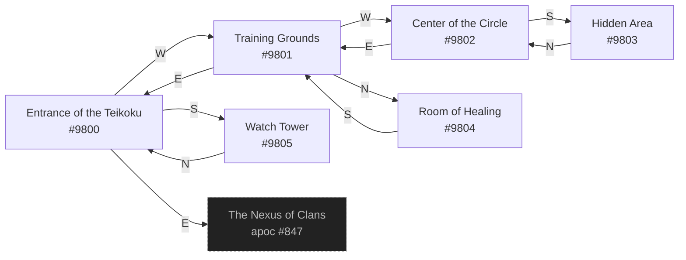

# Tyu Teikoku Headquarters  `(teikoku)`

[← back to world map](WORLD-MAP.md) · 6 rooms · vnums 9800–9805

Dashed nodes are exits that leave this area.

## Rooms

| VNUM | Name | Exits |
|---:|---|---|
| 9800 | Entrance of the Teikoku | E→847 S→9805 W→9801 |
| 9801 | Training Grounds | N→9804 E→9800 W→9802 |
| 9802 | Center of the Circle | E→9801 S→9803 |
| 9803 | Hidden Area | N→9802 |
| 9804 | Room of Healing | S→9801 |
| 9805 | Watch Tower | N→9800 |

