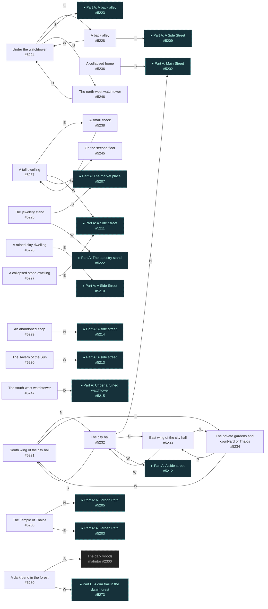
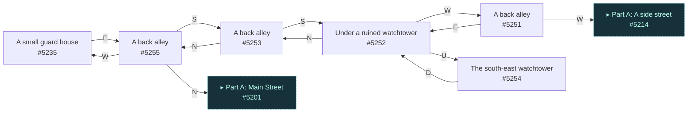
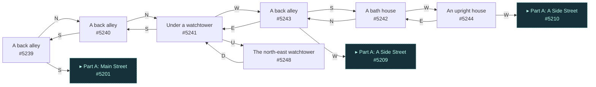

# Anon Thalos  `(thalos)`

[← back to world map](WORLD-MAP.md) · 80 rooms · vnums 5200–5280

Grey dashed nodes leave the area; green dashed nodes (`▸ Part X`) continue on another sub-map below.

_This area is split into 5 sub-maps for legibility._

## Map — Part A (24 rooms: #5200–#5223)

```mermaid
graph LR
  R5200["The Grand Gate of Thalos<br/>#5200"]
  R5201["Main Street<br/>#5201"]
  R5202["Main Street<br/>#5202"]
  R5203["A Garden Path<br/>#5203"]
  R5204["A Garden Path<br/>#5204"]
  R5205["A Garden Path<br/>#5205"]
  R5206["A Garden Path<br/>#5206"]
  R5207["The market place<br/>#5207"]
  R5208["The market place<br/>#5208"]
  R5209["A Side Street<br/>#5209"]
  R5210["A Side Street<br/>#5210"]
  R5211["A Side Street<br/>#5211"]
  R5212["A side street<br/>#5212"]
  R5213["A side street<br/>#5213"]
  R5214["A side street<br/>#5214"]
  R5215["Under a ruined watchtower<br/>#5215"]
  R5216["A back alley<br/>#5216"]
  R5217["The meat stand<br/>#5217"]
  R5218["A back alley<br/>#5218"]
  R5219["The guild house<br/>#5219"]
  R5220["The produce stand<br/>#5220"]
  R5221["The smithy<br/>#5221"]
  R5222["The tapestry stand<br/>#5222"]
  R5223["A back alley<br/>#5223"]
  R5200 -->|E| X5256
  R5200 -->|W| R5201
  R5201 -->|N| X5239
  R5201 -->|E| R5200
  R5201 -->|S| X5255
  R5201 -->|W| R5202
  R5202 -->|N| X5236
  R5202 -->|E| R5201
  R5202 -->|S| X5232
  R5202 -->|W| R5203
  R5203 -->|N| R5204
  R5203 -->|E| R5202
  R5203 -->|S| R5206
  R5203 -->|W| X5250
  R5204 -->|N| R5211
  R5204 -->|S| R5203
  R5204 -->|W| R5205
  R5205 -->|E| R5204
  R5205 -->|S| X5250
  R5206 -->|N| R5203
  R5206 -->|S| R5212
  R5207 -->|N| X5225
  R5207 -->|S| R5220
  R5207 -->|W| R5208
  R5208 -->|N| R5222
  R5208 -->|E| R5207
  R5208 -->|S| R5217
  R5209 -->|E| X5243
  R5209 -->|S| R5210
  R5209 -->|W| X5228
  R5210 -->|N| R5209
  R5210 -->|E| X5244
  R5210 -->|S| R5211
  R5210 -->|W| X5226
  R5211 -->|N| R5210
  R5211 -->|E| X5237
  R5211 -->|S| R5204
  R5211 -->|W| X5227
  R5212 -->|N| R5206
  R5212 -->|E| X5232
  R5212 -->|S| R5213
  R5212 -->|W| R5221
  R5213 -->|N| R5212
  R5213 -->|E| X5230
  R5213 -->|S| R5214
  R5213 -->|W| R5219
  R5214 -->|N| R5213
  R5214 -->|E| X5251
  R5214 -->|S| X5229
  R5214 -->|W| R5218
  R5215 -->|N| R5216
  R5215 -->|E| R5218
  R5215 -->|U| X5247
  R5216 -->|N| R5217
  R5216 -->|S| R5215
  R5217 -->|N| R5208
  R5217 -->|E| R5220
  R5217 -->|S| R5216
  R5218 -->|E| R5214
  R5218 -->|W| R5215
  R5219 -->|E| R5213
  R5220 -->|N| R5207
  R5220 -->|W| R5217
  R5221 -->|E| R5212
  R5222 -->|N| R5223
  R5222 -->|E| X5225
  R5222 -->|S| R5208
  R5223 -->|N| X5224
  R5223 -->|S| R5222
  X5256["▸ Part E: A trail at the end of the dwarf forest<br/>#5256"]:::part
  X5239["▸ Part D: A back alley<br/>#5239"]:::part
  X5255["▸ Part C: A back alley<br/>#5255"]:::part
  X5236["▸ Part B: A collapsed home<br/>#5236"]:::part
  X5232["▸ Part B: The city hall<br/>#5232"]:::part
  X5250["▸ Part B: The Temple of Thalos<br/>#5250"]:::part
  X5225["▸ Part B: The jewelery stand<br/>#5225"]:::part
  X5243["▸ Part D: A back alley<br/>#5243"]:::part
  X5228["▸ Part B: A back alley<br/>#5228"]:::part
  X5244["▸ Part D: An upright house<br/>#5244"]:::part
  X5226["▸ Part B: A ruined clay dwelling<br/>#5226"]:::part
  X5237["▸ Part B: A tall dwelling<br/>#5237"]:::part
  X5227["▸ Part B: A collapsed stone dwelling<br/>#5227"]:::part
  X5230["▸ Part B: The Tavern of the Sun<br/>#5230"]:::part
  X5251["▸ Part C: A back alley<br/>#5251"]:::part
  X5229["▸ Part B: An abandoned shop<br/>#5229"]:::part
  X5247["▸ Part B: The south-west watchtower<br/>#5247"]:::part
  X5224["▸ Part B: Under the watchtower<br/>#5224"]:::part
  classDef ext fill:#222,stroke:#888,color:#bbb,stroke-dasharray:3 3;
  classDef part fill:#16313a,stroke:#5aa,color:#bfe,stroke-dasharray:4 2;
```

## Map — Part B (19 rooms: #5224–#5280)

## Map — Part C (6 rooms: #5235–#5255)

## Map — Part D (7 rooms: #5239–#5248)

## Map — Part E (24 rooms: #5256–#5279)

```mermaid
graph LR
  R5256["A trail at the end of the dwarf forest<br/>#5256"]
  R5257["A trail at the end of the dwarf forest<br/>#5257"]
  R5258["The dwarf forest<br/>#5258"]
  R5259["The dwarf forest<br/>#5259"]
  R5260["The dwarf forest<br/>#5260"]
  R5261["The dwarf forest<br/>#5261"]
  R5262["The dwarf forest<br/>#5262"]
  R5263["The darker dwarf forest<br/>#5263"]
  R5264["The darker dwarf forest<br/>#5264"]
  R5265["The darker dwarf forest<br/>#5265"]
  R5266["The darker dwarf forest<br/>#5266"]
  R5267["A valley in the dark dwarf forest<br/>#5267"]
  R5268["A small ugly cave<br/>#5268"]
  R5269["A small ugly cave<br/>#5269"]
  R5270["Down the path into a dead end<br/>#5270"]
  R5271["The Valley in the dark dwarf forest<br/>#5271"]
  R5272["A dim trail in the dwarf forest<br/>#5272"]
  R5273["A dim trail in the dwarf forest<br/>#5273"]
  R5274["A dim trail in the dwarf forest<br/>#5274"]
  R5275["A bend in the dim trail in the dwarf forest<br/>#5275"]
  R5276["A trail in the dwarf forest<br/>#5276"]
  R5277["A trail in the dwarf forest<br/>#5277"]
  R5278["A trail in the dwarf forest<br/>#5278"]
  R5279["The bend in the trail in the dwarf forest<br/>#5279"]
  R5256 -->|E| R5257
  R5256 -->|W| X5200
  R5257 -->|E| R5258
  R5257 -->|W| R5256
  R5258 -->|N| R5259
  R5258 -->|E| R5262
  R5258 -->|W| R5257
  R5259 -->|N| R5260
  R5259 -->|S| R5258
  R5260 -->|N| R5261
  R5260 -->|S| R5259
  R5261 -->|N| X3502
  R5261 -->|S| R5260
  R5262 -->|E| R5263
  R5262 -->|W| R5258
  R5263 -->|S| R5264
  R5263 -->|W| R5262
  R5264 -->|N| R5263
  R5264 -->|E| R5265
  R5265 -->|E| R5266
  R5265 -->|W| R5264
  R5266 -->|W| R5265
  R5266 -->|D| R5267
  R5267 -->|N| R5271
  R5267 -->|E| X1701
  R5267 -->|S| X9201
  R5267 -->|W| R5268
  R5267 -->|U| R5266
  R5268 -->|E| R5267
  R5268 -->|S| R5269
  R5269 -->|N| R5268
  R5269 -->|D| R5270
  R5270 -->|U| R5269
  R5270 -->|D| X5100
  R5271 -->|N| R5272
  R5271 -->|S| R5267
  R5272 -->|N| R5273
  R5272 -->|S| R5271
  R5273 -->|N| R5274
  R5273 -->|E| X5280
  R5273 -->|S| R5272
  R5274 -->|N| R5275
  R5274 -->|S| R5273
  R5275 -->|S| R5274
  R5275 -->|W| R5276
  R5276 -->|E| R5275
  R5276 -->|W| R5277
  R5277 -->|E| R5276
  R5277 -->|W| R5278
  R5278 -->|E| R5277
  R5278 -->|W| R5279
  R5279 -->|E| R5278
  X5200["▸ Part A: The Grand Gate of Thalos<br/>#5200"]:::part
  X3502["The Cross Roads<br/>midennir #3502"]:::ext
  X1701["Main Eastern Road<br/>wyvern #1701"]:::ext
  X9201["A Mountain Path<br/>canyon #9201"]:::ext
  X5100["City Entrance<br/>drow #5100"]:::ext
  X5280["▸ Part B: A dark bend in the forest<br/>#5280"]:::part
  classDef ext fill:#222,stroke:#888,color:#bbb,stroke-dasharray:3 3;
  classDef part fill:#16313a,stroke:#5aa,color:#bfe,stroke-dasharray:4 2;
```

## Rooms

| VNUM | Name | Exits |
|---:|---|---|
| 5200 | The Grand Gate of Thalos | E→5256 W→5201 |
| 5201 | Main Street | N→5239 E→5200 S→5255 W→5202 |
| 5202 | Main Street | N→5236 E→5201 S→5232 W→5203 |
| 5203 | A Garden Path | N→5204 E→5202 S→5206 W→5250 |
| 5204 | A Garden Path | N→5211 S→5203 W→5205 |
| 5205 | A Garden Path | E→5204 S→5250 |
| 5206 | A Garden Path | N→5203 S→5212 |
| 5207 | The market place | N→5225 S→5220 W→5208 |
| 5208 | The market place | N→5222 E→5207 S→5217 |
| 5209 | A Side Street | E→5243 S→5210 W→5228 |
| 5210 | A Side Street | N→5209 E→5244 S→5211 W→5226 |
| 5211 | A Side Street | N→5210 E→5237 S→5204 W→5227 |
| 5212 | A side street | N→5206 E→5232 S→5213 W→5221 |
| 5213 | A side street | N→5212 E→5230 S→5214 W→5219 |
| 5214 | A side street | N→5213 E→5251 S→5229 W→5218 |
| 5215 | Under a ruined watchtower | N→5216 E→5218 U→5247 |
| 5216 | A back alley | N→5217 S→5215 |
| 5217 | The meat stand | N→5208 E→5220 S→5216 |
| 5218 | A back alley | E→5214 W→5215 |
| 5219 | The guild house | E→5213 |
| 5220 | The produce stand | N→5207 W→5217 |
| 5221 | The smithy | E→5212 |
| 5222 | The tapestry stand | N→5223 E→5225 S→5208 |
| 5223 | A back alley | N→5224 S→5222 |
| 5224 | Under the watchtower | E→5228 S→5223 U→5246 |
| 5225 | The jewelery stand | S→5207 W→5222 |
| 5226 | A ruined clay dwelling | E→5210 |
| 5227 | A collapsed stone dwelling | E→5211 |
| 5228 | A back alley | E→5209 W→5224 |
| 5229 | An abandoned shop | N→5214 |
| 5230 | The Tavern of the Sun | W→5213 |
| 5231 | South wing of the city hall | N→5232 E→5234 |
| 5232 | The city hall | N→5202 E→5233 S→5231 W→5212 |
| 5233 | East wing of the city hall | S→5234 W→5232 |
| 5234 | The private gardens and courtyard of Thalos | N→5233 W→5231 |
| 5235 | A small guard house | E→5255 |
| 5236 | A collapsed home | S→5202 |
| 5237 | A tall dwelling | E→5238 W→5211 U→5245 |
| 5238 | A small shack | W→5237 |
| 5239 | A back alley | N→5240 S→5201 |
| 5240 | A back alley | N→5241 S→5239 |
| 5241 | Under a watchtower | S→5240 W→5243 U→5248 |
| 5242 | A bath house | N→5243 W→5244 |
| 5243 | A back alley | E→5241 S→5242 W→5209 |
| 5244 | An upright house | E→5242 W→5210 |
| 5245 | On the second floor | — |
| 5246 | The north-west watchtower | D→5224 |
| 5247 | The south-west watchtower | D→5215 |
| 5248 | The north-east watchtower | D→5241 |
| 5250 | The Temple of Thalos | N→5205 E→5203 |
| 5251 | A back alley | E→5252 W→5214 |
| 5252 | Under a ruined watchtower | N→5253 W→5251 U→5254 |
| 5253 | A back alley | N→5255 S→5252 |
| 5254 | The south-east watchtower | D→5252 |
| 5255 | A back alley | N→5201 S→5253 W→5235 |
| 5256 | A trail at the end of the dwarf forest | E→5257 W→5200 |
| 5257 | A trail at the end of the dwarf forest | E→5258 W→5256 |
| 5258 | The dwarf forest | N→5259 E→5262 W→5257 |
| 5259 | The dwarf forest | N→5260 S→5258 |
| 5260 | The dwarf forest | N→5261 S→5259 |
| 5261 | The dwarf forest | N→3502 S→5260 |
| 5262 | The dwarf forest | E→5263 W→5258 |
| 5263 | The darker dwarf forest | S→5264 W→5262 |
| 5264 | The darker dwarf forest | N→5263 E→5265 |
| 5265 | The darker dwarf forest | E→5266 W→5264 |
| 5266 | The darker dwarf forest | W→5265 D→5267 |
| 5267 | A valley in the dark dwarf forest | N→5271 E→1701 S→9201 W→5268 U→5266 |
| 5268 | A small ugly cave | E→5267 S→5269 |
| 5269 | A small ugly cave | N→5268 D→5270 |
| 5270 | Down the path into a dead end | U→5269 D→5100 |
| 5271 | The Valley in the dark dwarf forest | N→5272 S→5267 |
| 5272 | A dim trail in the dwarf forest | N→5273 S→5271 |
| 5273 | A dim trail in the dwarf forest | N→5274 E→5280 S→5272 |
| 5274 | A dim trail in the dwarf forest | N→5275 S→5273 |
| 5275 | A bend in the dim trail in the dwarf forest | S→5274 W→5276 |
| 5276 | A trail in the dwarf forest | E→5275 W→5277 |
| 5277 | A trail in the dwarf forest | E→5276 W→5278 |
| 5278 | A trail in the dwarf forest | E→5277 W→5279 |
| 5279 | The bend in the trail in the dwarf forest | E→5278 |
| 5280 | A dark bend in the forest | S→2300 W→5273 |

