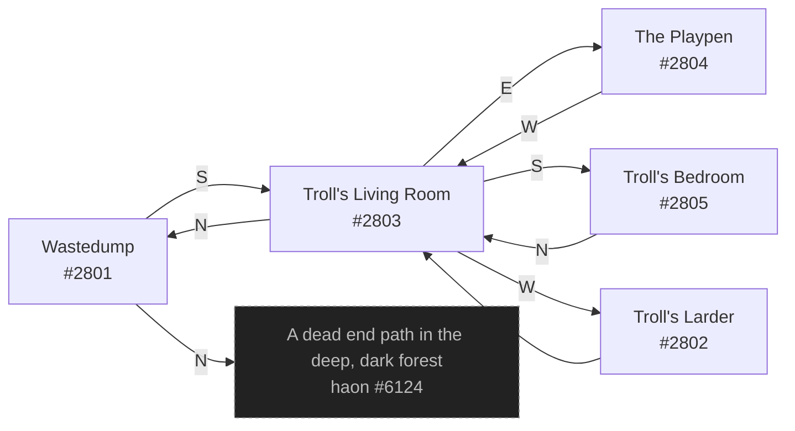

# Merc Troll Den  `(trollden)`

[← back to world map](WORLD-MAP.md) · 5 rooms · vnums 2801–2805

Grey dashed nodes leave the area; green dashed nodes (`▸ Part X`) continue on another sub-map below.

## Map

## Rooms

| VNUM | Name | Exits |
|---:|---|---|
| 2801 | Wastedump | N→6124 S→2803 |
| 2802 | Troll's Larder | E→2803 |
| 2803 | Troll's Living Room | N→2801 E→2804 S→2805 W→2802 |
| 2804 | The Playpen | W→2803 |
| 2805 | Troll's Bedroom | N→2803 |

