# Casret Ultima  `(ultima)`

[← back to world map](WORLD-MAP.md) · 185 rooms · vnums 2400–2584

Dashed nodes are exits that leave this area.

```mermaid
graph LR
  R2400["Entrance to Ultima<br/>#2400"]
  R2401["New Magincia Road<br/>#2401"]
  R2402["New Magincia Road<br/>#2402"]
  R2403["The New Magincia Moongate<br/>#2403"]
  R2404["New Magincia Road<br/>#2404"]
  R2405["New Magincia Road<br/>#2405"]
  R2406["Stables<br/>#2406"]
  R2407["Barn<br/>#2407"]
  R2408["Humility Lane<br/>#2408"]
  R2409["Condemned House<br/>#2409"]
  R2410["Condemned House<br/>#2410"]
  R2411["Attic<br/>#2411"]
  R2412["House<br/>#2412"]
  R2413["Humility Lane<br/>#2413"]
  R2414["Entrance to the Office<br/>#2414"]
  R2415["Katrina's Office<br/>#2415"]
  R2416["Library<br/>#2416"]
  R2417["Library<br/>#2417"]
  R2418["Library<br/>#2418"]
  R2419["Library<br/>#2419"]
  R2420["Library<br/>#2420"]
  R2421["Library Office<br/>#2421"]
  R2422["Library<br/>#2422"]
  R2423["Library<br/>#2423"]
  R2424["Library<br/>#2424"]
  R2425["Library<br/>#2425"]
  R2426["Library<br/>#2426"]
  R2427["Library<br/>#2427"]
  R2428["The Library Moongate<br/>#2428"]
  R2429["Library<br/>#2429"]
  R2430["Library<br/>#2430"]
  R2431["Library<br/>#2431"]
  R2432["Library<br/>#2432"]
  R2433["Library<br/>#2433"]
  R2434["Library<br/>#2434"]
  R2435["Web<br/>#2435"]
  R2436["Library<br/>#2436"]
  R2437["The Center of the Tavern<br/>#2437"]
  R2438["The Northwest Corner of the Tavern<br/>#2438"]
  R2439["The North Wall of the Tavern<br/>#2439"]
  R2440["The Northeast Corner of the Tavern<br/>#2440"]
  R2441["The West Wall of the Tavern<br/>#2441"]
  R2442["The East Wall of the Tavern<br/>#2442"]
  R2443["The Southwest Corner of the Tavern<br/>#2443"]
  R2444["The South Wall of the Tavern<br/>#2444"]
  R2445["The Southeast Corner of the Tavern<br/>#2445"]
  R2446["Cellar<br/>#2446"]
  R2447["Cellar<br/>#2447"]
  R2448["Cellar<br/>#2448"]
  R2449["Cellar<br/>#2449"]
  R2450["The Britain Moongate<br/>#2450"]
  R2451["Cellar<br/>#2451"]
  R2452["Cellar<br/>#2452"]
  R2453["Cellar<br/>#2453"]
  R2454["Cellar<br/>#2454"]
  R2455["The Yew Entrance<br/>#2455"]
  R2456["In Front of the Courthouse<br/>#2456"]
  R2457["Justice Row<br/>#2457"]
  R2458["Under the Stone Arch<br/>#2458"]
  R2459["Bonfire<br/>#2459"]
  R2460["Pub<br/>#2460"]
  R2461["Justice Row<br/>#2461"]
  R2462["Justice Row<br/>#2462"]
  R2463["The Audience Room<br/>#2463"]
  R2464["The Bench<br/>#2464"]
  R2465["Prison<br/>#2465"]
  R2466["Prison<br/>#2466"]
  R2467["Prison Cell<br/>#2467"]
  R2468["Prison Cell<br/>#2468"]
  R2469["Yew Forest<br/>#2469"]
  R2470["Yew Forest<br/>#2470"]
  R2471["Yew Forest<br/>#2471"]
  R2472["Yew Forest<br/>#2472"]
  R2473["Yew Forest<br/>#2473"]
  R2474["Yew Forest<br/>#2474"]
  R2475["Yew Forest<br/>#2475"]
  R2476["Yew Forest<br/>#2476"]
  R2477["Yew Forest<br/>#2477"]
  R2478["Yew Forest<br/>#2478"]
  R2479["Yew Forest<br/>#2479"]
  R2480["Yew Forest<br/>#2480"]
  R2481["Yew Forest<br/>#2481"]
  R2482["Yew Forest<br/>#2482"]
  R2483["Yew Forest<br/>#2483"]
  R2484["The Yew Moongate<br/>#2484"]
  R2485["Dungeon Entrance<br/>#2485"]
  R2486["The Dungeon<br/>#2486"]
  R2487["The Dungeon<br/>#2487"]
  R2488["The Dungeon<br/>#2488"]
  R2489["The Dungeon<br/>#2489"]
  R2490["The Dungeon<br/>#2490"]
  R2491["The Dungeon<br/>#2491"]
  R2492["The Dungeon<br/>#2492"]
  R2493["The Dungeon<br/>#2493"]
  R2494["The Dungeon<br/>#2494"]
  R2495["The Dungeon<br/>#2495"]
  R2496["The Dungeon<br/>#2496"]
  R2497["The Dungeon<br/>#2497"]
  R2498["The Dungeon<br/>#2498"]
  R2499["The Dungeon<br/>#2499"]
  R2500["The Dungeon<br/>#2500"]
  R2501["The Dungeon Moongate<br/>#2501"]
  R2502["Minoc<br/>#2502"]
  R2503["The Armourer<br/>#2503"]
  R2504["Minoc's Fountain<br/>#2504"]
  R2505["The Weaponsmith<br/>#2505"]
  R2506["The Boatseller<br/>#2506"]
  R2507["Sacrifice Street<br/>#2507"]
  R2508["Sacrifice Street<br/>#2508"]
  R2509["Sacrifice Street<br/>#2509"]
  R2510["Forge<br/>#2510"]
  R2511["Residence<br/>#2511"]
  R2512["Residence<br/>#2512"]
  R2513["The Beach<br/>#2513"]
  R2514["The Beach<br/>#2514"]
  R2515["The Beach<br/>#2515"]
  R2516["The Beach<br/>#2516"]
  R2517["The Beach<br/>#2517"]
  R2518["The Whirlpool<br/>#2518"]
  R2519["The Whirlpool<br/>#2519"]
  R2520["The Whirlpool<br/>#2520"]
  R2521["The Whirlpool<br/>#2521"]
  R2522["The Whirlpool<br/>#2522"]
  R2523["The Whirlpool<br/>#2523"]
  R2524["The Whirlpool<br/>#2524"]
  R2525["The Whirlpool<br/>#2525"]
  R2526["The Whirlpool<br/>#2526"]
  R2527["The Minoc Moongate<br/>#2527"]
  R2528["A Campfire<br/>#2528"]
  R2529["Between the Tents<br/>#2529"]
  R2530["In front of the Grand Tent<br/>#2530"]
  R2531["A Small Tent<br/>#2531"]
  R2532["A Small Tent<br/>#2532"]
  R2533["The Treasure Tent<br/>#2533"]
  R2534["The Grand Tent<br/>#2534"]
  R2535["The Map Tent<br/>#2535"]
  R2536["Dupre's Tent<br/>#2536"]
  R2537["A Small Tent<br/>#2537"]
  R2538["Desert Entrance<br/>#2538"]
  R2539["A Small Tent<br/>#2539"]
  R2540["The Desert<br/>#2540"]
  R2541["The Desert<br/>#2541"]
  R2542["The Desert<br/>#2542"]
  R2543["The Desert Moongate<br/>#2543"]
  R2544["The Desert Moongate<br/>#2544"]
  R2545["The Desert<br/>#2545"]
  R2546["The Desert<br/>#2546"]
  R2547["The Desert Moongate<br/>#2547"]
  R2548["The Dragon Cave<br/>#2548"]
  R2549["The Shrine of Spirituality<br/>#2549"]
  R2550["The Place of Ultimate Evil<br/>#2550"]
  R2551["The Place of Ultimate Evil<br/>#2551"]
  R2552["The Place of Ultimate Evil<br/>#2552"]
  R2553["The Place of Ultimate Evil<br/>#2553"]
  R2554["The Place of Ultimate Evil<br/>#2554"]
  R2555["The Place of Ultimate Evil<br/>#2555"]
  R2556["The Graveyard<br/>#2556"]
  R2557["The Graveyard<br/>#2557"]
  R2558["The Graveyard<br/>#2558"]
  R2559["The Graveyard<br/>#2559"]
  R2560["The Graveyard<br/>#2560"]
  R2561["The Graveyard<br/>#2561"]
  R2562["Lord British's Castle Entrance<br/>#2562"]
  R2563["Castle Fountain<br/>#2563"]
  R2564["A staircase<br/>#2564"]
  R2565["Hallways<br/>#2565"]
  R2566["Hallway<br/>#2566"]
  R2567["The Throne Room<br/>#2567"]
  R2568["Batlin's Room<br/>#2568"]
  R2569["The Altar of Honesty<br/>#2569"]
  R2570["The Altar of Compassion<br/>#2570"]
  R2571["The Altar of Valor<br/>#2571"]
  R2572["The Altar of Justice<br/>#2572"]
  R2573["The Altar of Sacrifice<br/>#2573"]
  R2574["The Altar of Honour<br/>#2574"]
  R2575["The Altar of Spirituality<br/>#2575"]
  R2576["The Altar of Humility<br/>#2576"]
  R2577["The Enlightenment<br/>#2577"]
  R2578["In the Warp<br/>#2578"]
  R2579["In the Warp<br/>#2579"]
  R2580["In the Warp<br/>#2580"]
  R2581["The Enlightenment<br/>#2581"]
  R2582["In the Warp<br/>#2582"]
  R2583["In the Warp<br/>#2583"]
  R2584["The Lagoon<br/>#2584"]
  R2400 -->|S| R2401
  R2400 -->|D| X315
  R2401 -->|N| R2400
  R2401 -->|S| R2402
  R2402 -->|N| R2401
  R2402 -->|S| R2403
  R2403 -->|N| R2402
  R2403 -->|E| R2413
  R2403 -->|S| R2404
  R2403 -->|W| R2408
  R2403 -->|U| R2416
  R2404 -->|N| R2403
  R2404 -->|E| R2414
  R2404 -->|S| R2405
  R2405 -->|N| R2404
  R2405 -->|W| R2410
  R2406 -->|S| R2407
  R2407 -->|N| R2406
  R2407 -->|S| R2408
  R2408 -->|N| R2407
  R2408 -->|E| R2403
  R2409 -->|S| R2410
  R2410 -->|N| R2409
  R2410 -->|E| R2405
  R2411 -->|D| R2412
  R2412 -->|S| R2413
  R2412 -->|U| R2411
  R2413 -->|N| R2412
  R2413 -->|W| R2403
  R2414 -->|S| R2415
  R2414 -->|W| R2404
  R2415 -->|N| R2414
  R2416 -->|E| R2417
  R2416 -->|W| R2436
  R2417 -->|E| R2418
  R2417 -->|W| R2416
  R2418 -->|E| R2419
  R2418 -->|W| R2417
  R2419 -->|S| R2420
  R2419 -->|W| R2418
  R2420 -->|N| R2419
  R2420 -->|W| R2421
  R2421 -->|E| R2420
  R2421 -->|W| R2422
  R2422 -->|E| R2421
  R2422 -->|W| R2423
  R2423 -->|E| R2422
  R2423 -->|S| R2424
  R2424 -->|N| R2423
  R2424 -->|E| R2425
  R2425 -->|E| R2426
  R2425 -->|W| R2424
  R2426 -->|E| R2427
  R2426 -->|W| R2425
  R2427 -->|S| R2429
  R2427 -->|W| R2426
  R2428 -->|N| R2432
  R2428 -->|U| R2437
  R2429 -->|N| R2427
  R2429 -->|W| R2430
  R2430 -->|E| R2429
  R2430 -->|W| R2431
  R2431 -->|E| R2430
  R2431 -->|W| R2432
  R2432 -->|E| R2431
  R2432 -->|S| R2428
  R2432 -->|W| R2433
  R2433 -->|N| R2434
  R2433 -->|E| R2432
  R2434 -->|N| R2435
  R2434 -->|S| R2433
  R2435 -->|N| R2436
  R2435 -->|S| R2434
  R2436 -->|E| R2416
  R2436 -->|S| R2435
  R2437 -->|N| R2439
  R2437 -->|E| R2442
  R2437 -->|S| R2444
  R2437 -->|W| R2441
  R2438 -->|E| R2439
  R2438 -->|S| R2441
  R2439 -->|E| R2440
  R2439 -->|S| R2437
  R2439 -->|W| R2438
  R2440 -->|S| R2442
  R2440 -->|W| R2439
  R2441 -->|N| R2438
  R2441 -->|E| R2437
  R2441 -->|S| R2443
  R2442 -->|N| R2440
  R2442 -->|S| R2445
  R2442 -->|W| R2437
  R2443 -->|N| R2441
  R2443 -->|E| R2444
  R2443 -->|D| R2446
  R2444 -->|N| R2437
  R2444 -->|E| R2445
  R2444 -->|W| R2443
  R2445 -->|N| R2442
  R2445 -->|W| R2444
  R2446 -->|E| R2447
  R2446 -->|S| R2449
  R2446 -->|U| R2443
  R2447 -->|E| R2448
  R2447 -->|S| R2450
  R2447 -->|W| R2446
  R2448 -->|S| R2451
  R2448 -->|W| R2447
  R2449 -->|N| R2446
  R2449 -->|E| R2450
  R2449 -->|S| R2452
  R2450 -->|N| R2447
  R2450 -->|E| R2451
  R2450 -->|S| R2453
  R2450 -->|W| R2449
  R2450 -->|U| R2456
  R2451 -->|N| R2448
  R2451 -->|S| R2454
  R2451 -->|W| R2450
  R2452 -->|N| R2449
  R2452 -->|E| R2453
  R2453 -->|N| R2450
  R2453 -->|E| R2454
  R2453 -->|W| R2452
  R2454 -->|N| R2451
  R2454 -->|W| R2453
  R2455 -->|N| R2470
  R2455 -->|S| R2456
  R2456 -->|N| R2455
  R2456 -->|E| R2457
  R2456 -->|S| R2463
  R2456 -->|W| R2462
  R2457 -->|E| R2458
  R2457 -->|W| R2456
  R2458 -->|E| R2459
  R2458 -->|W| R2457
  R2459 -->|W| R2458
  R2460 -->|E| R2461
  R2461 -->|E| R2462
  R2461 -->|W| R2460
  R2462 -->|E| R2456
  R2462 -->|W| R2461
  R2463 -->|N| R2456
  R2463 -->|S| R2464
  R2464 -->|N| R2463
  R2464 -->|E| R2465
  R2464 -->|W| R2466
  R2465 -->|N| R2468
  R2465 -->|W| R2464
  R2466 -->|N| R2467
  R2466 -->|E| R2464
  R2467 -->|S| R2466
  R2468 -->|S| R2465
  R2469 -->|N| R2478
  R2469 -->|E| R2470
  R2469 -->|S| R2479
  R2469 -->|W| R2473
  R2470 -->|N| R2477
  R2470 -->|E| R2471
  R2470 -->|S| R2455
  R2470 -->|W| R2469
  R2471 -->|N| R2476
  R2471 -->|E| R2472
  R2471 -->|S| R2481
  R2471 -->|W| R2470
  R2472 -->|N| R2475
  R2472 -->|E| R2473
  R2472 -->|S| R2482
  R2472 -->|W| R2471
  R2473 -->|N| R2474
  R2473 -->|E| R2469
  R2473 -->|S| R2483
  R2473 -->|W| R2472
  R2474 -->|N| R2483
  R2474 -->|E| R2478
  R2474 -->|S| R2473
  R2474 -->|W| R2475
  R2475 -->|N| R2482
  R2475 -->|E| R2474
  R2475 -->|S| R2472
  R2475 -->|W| R2476
  R2476 -->|N| R2481
  R2476 -->|E| R2475
  R2476 -->|S| R2471
  R2476 -->|W| R2477
  R2477 -->|N| R2480
  R2477 -->|E| R2476
  R2477 -->|S| R2470
  R2477 -->|W| R2478
  R2478 -->|N| R2479
  R2478 -->|E| R2477
  R2478 -->|S| R2469
  R2478 -->|W| R2474
  R2479 -->|N| R2469
  R2479 -->|E| R2480
  R2479 -->|S| R2478
  R2479 -->|W| R2483
  R2480 -->|N| R2484
  R2480 -->|E| R2481
  R2480 -->|S| R2477
  R2480 -->|W| R2479
  R2481 -->|N| R2471
  R2481 -->|E| R2482
  R2481 -->|S| R2476
  R2481 -->|W| R2480
  R2482 -->|N| R2472
  R2482 -->|E| R2483
  R2482 -->|S| R2475
  R2482 -->|W| R2481
  R2483 -->|N| R2473
  R2483 -->|E| R2479
  R2483 -->|S| R2474
  R2483 -->|W| R2482
  R2484 -->|S| R2480
  R2484 -->|U| R2485
  R2485 -->|U| R2487
  R2485 -->|D| R2484
  R2486 -->|N| R2490
  R2487 -->|N| R2491
  R2487 -->|D| R2485
  R2488 -->|N| R2492
  R2488 -->|E| R2489
  R2489 -->|W| R2488
  R2490 -->|N| R2494
  R2490 -->|E| R2491
  R2490 -->|S| R2486
  R2491 -->|N| R2495
  R2491 -->|E| R2492
  R2491 -->|S| R2487
  R2491 -->|W| R2490
  R2492 -->|E| R2493
  R2492 -->|S| R2488
  R2492 -->|W| R2491
  R2493 -->|N| R2497
  R2493 -->|W| R2492
  R2494 -->|N| R2498
  R2494 -->|S| R2490
  R2495 -->|N| R2499
  R2495 -->|E| R2496
  R2495 -->|S| R2491
  R2496 -->|N| R2500
  R2496 -->|W| R2495
  R2497 -->|S| R2493
  R2498 -->|S| R2494
  R2499 -->|S| R2495
  R2500 -->|E| R2501
  R2500 -->|S| R2496
  R2501 -->|W| R2500
  R2501 -->|U| R2502
  R2502 -->|N| R2515
  R2502 -->|S| R2504
  R2503 -->|E| R2504
  R2504 -->|N| R2502
  R2504 -->|E| R2505
  R2504 -->|S| R2508
  R2504 -->|W| R2503
  R2505 -->|W| R2504
  R2506 -->|E| R2507
  R2507 -->|E| R2508
  R2507 -->|S| R2511
  R2507 -->|W| R2506
  R2508 -->|N| R2504
  R2508 -->|E| R2509
  R2508 -->|W| R2507
  R2509 -->|E| R2510
  R2509 -->|S| R2512
  R2509 -->|W| R2508
  R2510 -->|W| R2509
  R2511 -->|N| R2507
  R2512 -->|N| R2509
  R2513 -->|E| R2514
  R2513 -->|W| R2584
  R2514 -->|E| R2515
  R2514 -->|W| R2513
  R2515 -->|E| R2516
  R2515 -->|S| R2502
  R2515 -->|W| R2514
  R2516 -->|E| R2517
  R2516 -->|W| R2515
  R2517 -->|W| R2516
  R2518 -->|N| R2521
  R2518 -->|E| R2519
  R2518 -->|S| R2584
  R2518 -->|W| R2520
  R2519 -->|N| R2522
  R2519 -->|E| R2520
  R2519 -->|S| R2525
  R2519 -->|W| R2518
  R2520 -->|N| R2523
  R2520 -->|E| R2518
  R2520 -->|S| R2526
  R2520 -->|W| R2519
  R2521 -->|N| R2524
  R2521 -->|E| R2522
  R2521 -->|S| R2518
  R2521 -->|W| R2523
  R2522 -->|N| R2525
  R2522 -->|E| R2523
  R2522 -->|S| R2519
  R2522 -->|W| R2521
  R2523 -->|N| R2526
  R2523 -->|E| R2521
  R2523 -->|S| R2520
  R2523 -->|W| R2522
  R2524 -->|N| R2527
  R2524 -->|E| R2525
  R2524 -->|S| R2521
  R2524 -->|W| R2526
  R2525 -->|N| R2519
  R2525 -->|E| R2526
  R2525 -->|S| R2522
  R2525 -->|W| R2524
  R2526 -->|N| R2520
  R2526 -->|E| R2524
  R2526 -->|S| R2523
  R2526 -->|W| R2525
  R2527 -->|S| R2524
  R2527 -->|U| R2528
  R2528 -->|N| R2538
  R2528 -->|E| R2529
  R2528 -->|S| R2532
  R2529 -->|E| R2530
  R2529 -->|W| R2528
  R2530 -->|E| R2531
  R2530 -->|S| R2534
  R2530 -->|W| R2529
  R2531 -->|W| R2530
  R2532 -->|N| R2528
  R2533 -->|E| R2534
  R2534 -->|N| R2530
  R2534 -->|E| R2535
  R2534 -->|S| R2536
  R2534 -->|W| R2533
  R2535 -->|W| R2534
  R2536 -->|N| R2534
  R2537 -->|E| R2538
  R2538 -->|N| R2541
  R2538 -->|E| R2539
  R2538 -->|W| R2537
  R2539 -->|W| R2538
  R2540 -->|N| R2544
  R2540 -->|E| R2541
  R2541 -->|E| R2542
  R2541 -->|S| R2538
  R2541 -->|W| R2540
  R2542 -->|N| R2546
  R2542 -->|E| R2543
  R2542 -->|W| R2541
  R2543 -->|W| R2542
  R2543 -->|U| R2549
  R2544 -->|S| R2540
  R2544 -->|U| X1
  R2545 -->|N| R2548
  R2545 -->|E| R2546
  R2546 -->|E| R2547
  R2546 -->|S| R2542
  R2546 -->|W| R2545
  R2547 -->|W| R2546
  R2547 -->|U| X1
  R2548 -->|S| R2545
  R2549 -->|N| R2554
  R2549 -->|S| R2557
  R2549 -->|U| R2562
  R2550 -->|E| R2551
  R2550 -->|S| R2553
  R2551 -->|E| R2552
  R2551 -->|S| R2554
  R2551 -->|W| R2550
  R2552 -->|S| R2555
  R2552 -->|W| R2551
  R2553 -->|N| R2550
  R2553 -->|E| R2554
  R2554 -->|N| R2551
  R2554 -->|E| R2555
  R2554 -->|S| R2549
  R2554 -->|W| R2553
  R2555 -->|N| R2552
  R2555 -->|W| R2554
  R2556 -->|E| R2557
  R2556 -->|S| R2559
  R2557 -->|N| R2549
  R2557 -->|E| R2558
  R2557 -->|S| R2560
  R2557 -->|W| R2556
  R2558 -->|S| R2561
  R2558 -->|W| R2557
  R2559 -->|N| R2556
  R2559 -->|E| R2560
  R2560 -->|N| R2557
  R2560 -->|E| R2561
  R2560 -->|W| R2559
  R2561 -->|N| R2558
  R2561 -->|W| R2560
  R2562 -->|N| R2563
  R2563 -->|N| R2565
  R2563 -->|S| R2562
  R2564 -->|E| R2565
  R2564 -->|U| R2569
  R2565 -->|N| R2567
  R2565 -->|E| R2566
  R2565 -->|S| R2563
  R2565 -->|W| R2564
  R2566 -->|N| R2568
  R2566 -->|W| R2565
  R2567 -->|S| R2565
  R2568 -->|S| R2566
  R2569 -->|N| R2570
  R2570 -->|N| R2571
  R2571 -->|N| R2572
  R2572 -->|N| R2573
  R2573 -->|N| R2574
  R2574 -->|N| R2575
  R2575 -->|N| R2576
  R2576 -->|N| R2577
  R2577 -->|U| R2578
  R2578 -->|U| R2579
  R2579 -->|U| R2580
  R2580 -->|U| R2581
  R2581 -->|U| R2582
  R2582 -->|U| R2583
  R2584 -->|N| R2518
  R2584 -->|E| R2513
  X315["Gallow hill<br/>plains #315"]:::ext
  X1["The Void<br/>limbo #1"]:::ext
  classDef ext fill:#222,stroke:#888,color:#bbb,stroke-dasharray:3 3;
```

## Rooms

| VNUM | Name | Exits |
|---:|---|---|
| 2400 | Entrance to Ultima | S→2401 D→315 |
| 2401 | New Magincia Road | N→2400 S→2402 |
| 2402 | New Magincia Road | N→2401 S→2403 |
| 2403 | The New Magincia Moongate | N→2402 E→2413 S→2404 W→2408 U→2416 |
| 2404 | New Magincia Road | N→2403 E→2414 S→2405 |
| 2405 | New Magincia Road | N→2404 W→2410 |
| 2406 | Stables | S→2407 |
| 2407 | Barn | N→2406 S→2408 |
| 2408 | Humility Lane | N→2407 E→2403 |
| 2409 | Condemned House | S→2410 |
| 2410 | Condemned House | N→2409 E→2405 |
| 2411 | Attic | D→2412 |
| 2412 | House | S→2413 U→2411 |
| 2413 | Humility Lane | N→2412 W→2403 |
| 2414 | Entrance to the Office | S→2415 W→2404 |
| 2415 | Katrina's Office | N→2414 |
| 2416 | Library | E→2417 W→2436 |
| 2417 | Library | E→2418 W→2416 |
| 2418 | Library | E→2419 W→2417 |
| 2419 | Library | S→2420 W→2418 |
| 2420 | Library | N→2419 W→2421 |
| 2421 | Library Office | E→2420 W→2422 |
| 2422 | Library | E→2421 W→2423 |
| 2423 | Library | E→2422 S→2424 |
| 2424 | Library | N→2423 E→2425 |
| 2425 | Library | E→2426 W→2424 |
| 2426 | Library | E→2427 W→2425 |
| 2427 | Library | S→2429 W→2426 |
| 2428 | The Library Moongate | N→2432 U→2437 |
| 2429 | Library | N→2427 W→2430 |
| 2430 | Library | E→2429 W→2431 |
| 2431 | Library | E→2430 W→2432 |
| 2432 | Library | E→2431 S→2428 W→2433 |
| 2433 | Library | N→2434 E→2432 |
| 2434 | Library | N→2435 S→2433 |
| 2435 | Web | N→2436 S→2434 |
| 2436 | Library | E→2416 S→2435 |
| 2437 | The Center of the Tavern | N→2439 E→2442 S→2444 W→2441 |
| 2438 | The Northwest Corner of the Tavern | E→2439 S→2441 |
| 2439 | The North Wall of the Tavern | E→2440 S→2437 W→2438 |
| 2440 | The Northeast Corner of the Tavern | S→2442 W→2439 |
| 2441 | The West Wall of the Tavern | N→2438 E→2437 S→2443 |
| 2442 | The East Wall of the Tavern | N→2440 S→2445 W→2437 |
| 2443 | The Southwest Corner of the Tavern | N→2441 E→2444 D→2446 |
| 2444 | The South Wall of the Tavern | N→2437 E→2445 W→2443 |
| 2445 | The Southeast Corner of the Tavern | N→2442 W→2444 |
| 2446 | Cellar | E→2447 S→2449 U→2443 |
| 2447 | Cellar | E→2448 S→2450 W→2446 |
| 2448 | Cellar | S→2451 W→2447 |
| 2449 | Cellar | N→2446 E→2450 S→2452 |
| 2450 | The Britain Moongate | N→2447 E→2451 S→2453 W→2449 U→2456 |
| 2451 | Cellar | N→2448 S→2454 W→2450 |
| 2452 | Cellar | N→2449 E→2453 |
| 2453 | Cellar | N→2450 E→2454 W→2452 |
| 2454 | Cellar | N→2451 W→2453 |
| 2455 | The Yew Entrance | N→2470 S→2456 |
| 2456 | In Front of the Courthouse | N→2455 E→2457 S→2463 W→2462 |
| 2457 | Justice Row | E→2458 W→2456 |
| 2458 | Under the Stone Arch | E→2459 W→2457 |
| 2459 | Bonfire | W→2458 |
| 2460 | Pub | E→2461 |
| 2461 | Justice Row | E→2462 W→2460 |
| 2462 | Justice Row | E→2456 W→2461 |
| 2463 | The Audience Room | N→2456 S→2464 |
| 2464 | The Bench | N→2463 E→2465 W→2466 |
| 2465 | Prison | N→2468 W→2464 |
| 2466 | Prison | N→2467 E→2464 |
| 2467 | Prison Cell | S→2466 |
| 2468 | Prison Cell | S→2465 |
| 2469 | Yew Forest | N→2478 E→2470 S→2479 W→2473 |
| 2470 | Yew Forest | N→2477 E→2471 S→2455 W→2469 |
| 2471 | Yew Forest | N→2476 E→2472 S→2481 W→2470 |
| 2472 | Yew Forest | N→2475 E→2473 S→2482 W→2471 |
| 2473 | Yew Forest | N→2474 E→2469 S→2483 W→2472 |
| 2474 | Yew Forest | N→2483 E→2478 S→2473 W→2475 |
| 2475 | Yew Forest | N→2482 E→2474 S→2472 W→2476 |
| 2476 | Yew Forest | N→2481 E→2475 S→2471 W→2477 |
| 2477 | Yew Forest | N→2480 E→2476 S→2470 W→2478 |
| 2478 | Yew Forest | N→2479 E→2477 S→2469 W→2474 |
| 2479 | Yew Forest | N→2469 E→2480 S→2478 W→2483 |
| 2480 | Yew Forest | N→2484 E→2481 S→2477 W→2479 |
| 2481 | Yew Forest | N→2471 E→2482 S→2476 W→2480 |
| 2482 | Yew Forest | N→2472 E→2483 S→2475 W→2481 |
| 2483 | Yew Forest | N→2473 E→2479 S→2474 W→2482 |
| 2484 | The Yew Moongate | S→2480 U→2485 |
| 2485 | Dungeon Entrance | U→2487 D→2484 |
| 2486 | The Dungeon | N→2490 |
| 2487 | The Dungeon | N→2491 D→2485 |
| 2488 | The Dungeon | N→2492 E→2489 |
| 2489 | The Dungeon | W→2488 |
| 2490 | The Dungeon | N→2494 E→2491 S→2486 |
| 2491 | The Dungeon | N→2495 E→2492 S→2487 W→2490 |
| 2492 | The Dungeon | E→2493 S→2488 W→2491 |
| 2493 | The Dungeon | N→2497 W→2492 |
| 2494 | The Dungeon | N→2498 S→2490 |
| 2495 | The Dungeon | N→2499 E→2496 S→2491 |
| 2496 | The Dungeon | N→2500 W→2495 |
| 2497 | The Dungeon | S→2493 |
| 2498 | The Dungeon | S→2494 |
| 2499 | The Dungeon | S→2495 |
| 2500 | The Dungeon | E→2501 S→2496 |
| 2501 | The Dungeon Moongate | W→2500 U→2502 |
| 2502 | Minoc | N→2515 S→2504 |
| 2503 | The Armourer | E→2504 |
| 2504 | Minoc's Fountain | N→2502 E→2505 S→2508 W→2503 |
| 2505 | The Weaponsmith | W→2504 |
| 2506 | The Boatseller | E→2507 |
| 2507 | Sacrifice Street | E→2508 S→2511 W→2506 |
| 2508 | Sacrifice Street | N→2504 E→2509 W→2507 |
| 2509 | Sacrifice Street | E→2510 S→2512 W→2508 |
| 2510 | Forge | W→2509 |
| 2511 | Residence | N→2507 |
| 2512 | Residence | N→2509 |
| 2513 | The Beach | E→2514 W→2584 |
| 2514 | The Beach | E→2515 W→2513 |
| 2515 | The Beach | E→2516 S→2502 W→2514 |
| 2516 | The Beach | E→2517 W→2515 |
| 2517 | The Beach | W→2516 |
| 2518 | The Whirlpool | N→2521 E→2519 S→2584 W→2520 |
| 2519 | The Whirlpool | N→2522 E→2520 S→2525 W→2518 |
| 2520 | The Whirlpool | N→2523 E→2518 S→2526 W→2519 |
| 2521 | The Whirlpool | N→2524 E→2522 S→2518 W→2523 |
| 2522 | The Whirlpool | N→2525 E→2523 S→2519 W→2521 |
| 2523 | The Whirlpool | N→2526 E→2521 S→2520 W→2522 |
| 2524 | The Whirlpool | N→2527 E→2525 S→2521 W→2526 |
| 2525 | The Whirlpool | N→2519 E→2526 S→2522 W→2524 |
| 2526 | The Whirlpool | N→2520 E→2524 S→2523 W→2525 |
| 2527 | The Minoc Moongate | S→2524 U→2528 |
| 2528 | A Campfire | N→2538 E→2529 S→2532 |
| 2529 | Between the Tents | E→2530 W→2528 |
| 2530 | In front of the Grand Tent | E→2531 S→2534 W→2529 |
| 2531 | A Small Tent | W→2530 |
| 2532 | A Small Tent | N→2528 |
| 2533 | The Treasure Tent | E→2534 |
| 2534 | The Grand Tent | N→2530 E→2535 S→2536 W→2533 |
| 2535 | The Map Tent | W→2534 |
| 2536 | Dupre's Tent | N→2534 |
| 2537 | A Small Tent | E→2538 |
| 2538 | Desert Entrance | N→2541 E→2539 W→2537 |
| 2539 | A Small Tent | W→2538 |
| 2540 | The Desert | N→2544 E→2541 |
| 2541 | The Desert | E→2542 S→2538 W→2540 |
| 2542 | The Desert | N→2546 E→2543 W→2541 |
| 2543 | The Desert Moongate | W→2542 U→2549 |
| 2544 | The Desert Moongate | S→2540 U→1 |
| 2545 | The Desert | N→2548 E→2546 |
| 2546 | The Desert | E→2547 S→2542 W→2545 |
| 2547 | The Desert Moongate | W→2546 U→1 |
| 2548 | The Dragon Cave | S→2545 |
| 2549 | The Shrine of Spirituality | N→2554 S→2557 U→2562 |
| 2550 | The Place of Ultimate Evil | E→2551 S→2553 |
| 2551 | The Place of Ultimate Evil | E→2552 S→2554 W→2550 |
| 2552 | The Place of Ultimate Evil | S→2555 W→2551 |
| 2553 | The Place of Ultimate Evil | N→2550 E→2554 |
| 2554 | The Place of Ultimate Evil | N→2551 E→2555 S→2549 W→2553 |
| 2555 | The Place of Ultimate Evil | N→2552 W→2554 |
| 2556 | The Graveyard | E→2557 S→2559 |
| 2557 | The Graveyard | N→2549 E→2558 S→2560 W→2556 |
| 2558 | The Graveyard | S→2561 W→2557 |
| 2559 | The Graveyard | N→2556 E→2560 |
| 2560 | The Graveyard | N→2557 E→2561 W→2559 |
| 2561 | The Graveyard | N→2558 W→2560 |
| 2562 | Lord British's Castle Entrance | N→2563 |
| 2563 | Castle Fountain | N→2565 S→2562 |
| 2564 | A staircase | E→2565 U→2569 |
| 2565 | Hallways | N→2567 E→2566 S→2563 W→2564 |
| 2566 | Hallway | N→2568 W→2565 |
| 2567 | The Throne Room | S→2565 |
| 2568 | Batlin's Room | S→2566 |
| 2569 | The Altar of Honesty | N→2570 |
| 2570 | The Altar of Compassion | N→2571 |
| 2571 | The Altar of Valor | N→2572 |
| 2572 | The Altar of Justice | N→2573 |
| 2573 | The Altar of Sacrifice | N→2574 |
| 2574 | The Altar of Honour | N→2575 |
| 2575 | The Altar of Spirituality | N→2576 |
| 2576 | The Altar of Humility | N→2577 |
| 2577 | The Enlightenment | U→2578 |
| 2578 | In the Warp | U→2579 |
| 2579 | In the Warp | U→2580 |
| 2580 | In the Warp | U→2581 |
| 2581 | The Enlightenment | U→2582 |
| 2582 | In the Warp | U→2583 |
| 2583 | In the Warp | — |
| 2584 | The Lagoon | N→2518 E→2513 |

