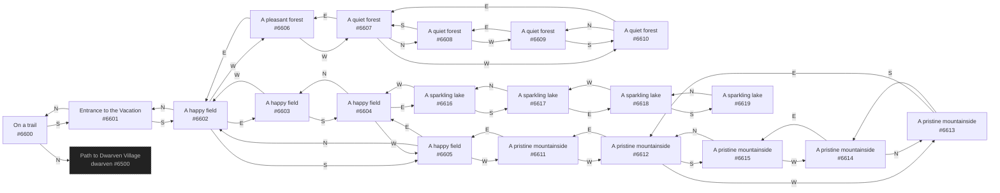

# Alathon Pikachu's Vacation  `(vacation)`

[← back to world map](../WORLD-MAP.md) · 20 rooms · vnums 6600–6619

Dashed nodes are exits that leave this area.

## Rooms

| VNUM | Name | Exits |
|---:|---|---|
| 6600 | On a trail | N→6500 S→6601 |
| 6601 | Entrance to the Vacation | N→6600 S→6602 |
| 6602 | A happy field | N→6601 E→6603 S→6605 W→6606 |
| 6603 | A happy field | S→6604 W→6602 |
| 6604 | A happy field | N→6603 E→6616 W→6605 |
| 6605 | A happy field | N→6602 E→6604 W→6611 |
| 6606 | A pleasant forest | E→6602 W→6607 |
| 6607 | A quiet forest | N→6608 E→6606 W→6610 |
| 6608 | A quiet forest | S→6607 W→6609 |
| 6609 | A quiet forest | E→6608 S→6610 |
| 6610 | A quiet forest | N→6609 E→6607 |
| 6611 | A pristine mountainside | E→6605 W→6612 |
| 6612 | A pristine mountainside | E→6611 S→6615 W→6613 |
| 6613 | A pristine mountainside | E→6612 S→6614 |
| 6614 | A pristine mountainside | N→6613 E→6615 |
| 6615 | A pristine mountainside | N→6612 W→6614 |
| 6616 | A sparkling lake | S→6617 W→6604 |
| 6617 | A sparkling lake | N→6616 E→6618 |
| 6618 | A sparkling lake | S→6619 W→6617 |
| 6619 | A sparkling lake | N→6618 |

