# Hatchet Valley of the Elves  `(valley)`

[← back to world map](../WORLD-MAP.md) · 84 rooms · vnums 7800–7883

Dashed nodes are exits that leave this area.

```mermaid
graph LR
  R7800["A Path from the Plains<br/>#7800"]
  R7801["Along the Path<br/>#7801"]
  R7802["A Small Trail<br/>#7802"]
  R7803["A Small Trail<br/>#7803"]
  R7804["The Overlook<br/>#7804"]
  R7805["The Entrance to the Valley of the Elves<br/>#7805"]
  R7806["The Edge of the Valley<br/>#7806"]
  R7807["The Edge of the Valley<br/>#7807"]
  R7808["The Edge of the Valley<br/>#7808"]
  R7809["The Valley of the Elves<br/>#7809"]
  R7810["The Valley of the Elves<br/>#7810"]
  R7811["The Valley of the Elves<br/>#7811"]
  R7812["The Edge of the Valley<br/>#7812"]
  R7813["The Edge of the Valley<br/>#7813"]
  R7814["The Valley of the Elves<br/>#7814"]
  R7815["The Valley of the Elves<br/>#7815"]
  R7816["The Valley of the Elves<br/>#7816"]
  R7817["The Edge of the Valley<br/>#7817"]
  R7818["The Edge of the Valley<br/>#7818"]
  R7819["The Valley of the Elves<br/>#7819"]
  R7820["The Valley of the Elves<br/>#7820"]
  R7821["The Valley of the Elves<br/>#7821"]
  R7822["The Edge of the Valley<br/>#7822"]
  R7823["The Edge of the Valley<br/>#7823"]
  R7824["The Edge of the Valley<br/>#7824"]
  R7825["The Edge of the Valley<br/>#7825"]
  R7826["A Trail Leading from the Valley<br/>#7826"]
  R7827["Along the Trail<br/>#7827"]
  R7828["A Bend in the Trail<br/>#7828"]
  R7829["A Smaller Valley<br/>#7829"]
  R7830["A Trail in the Valley<br/>#7830"]
  R7831["A Trail in the Valley<br/>#7831"]
  R7832["A Trail in the Valley<br/>#7832"]
  R7833["A Trail in the Valley<br/>#7833"]
  R7834["The Elf Home<br/>#7834"]
  R7835["The Kitchen<br/>#7835"]
  R7836["A Trail in the Valley<br/>#7836"]
  R7837["A Trail in the Valley<br/>#7837"]
  R7838["The Living Room<br/>#7838"]
  R7839["The Storage Room<br/>#7839"]
  R7840["A Trail in the Valley<br/>#7840"]
  R7841["A Trail in the Valley<br/>#7841"]
  R7842["A Trail in the Valley<br/>#7842"]
  R7843["A Trail in the Valley<br/>#7843"]
  R7844["A Trail in the Valley<br/>#7844"]
  R7845["The Elders' Room<br/>#7845"]
  R7846["The Storage Room<br/>#7846"]
  R7847["The Sleeping Quarters<br/>#7847"]
  R7848["Study<br/>#7848"]
  R7849["Along a Windy Trail on the Rim of the Valley<br/>#7849"]
  R7850["Along a Windy Trail on the Rim of the Valley<br/>#7850"]
  R7851["Along a Windy Trail on the Rim of the Valley<br/>#7851"]
  R7852["Along a Windy Trail on the Rim of the Valley<br/>#7852"]
  R7853["Along a Windy Trail on the Rim of the Valley<br/>#7853"]
  R7854["Along a Windy Trail on the Rim of the Valley<br/>#7854"]
  R7855["Along a Windy Trail on the Rim of the Valley<br/>#7855"]
  R7856["Along a Windy Trail on the Rim of the Valley<br/>#7856"]
  R7857["Along a Windy Trail on the Rim of the Valley<br/>#7857"]
  R7858["On the Rope Bridge<br/>#7858"]
  R7859["Along a Windy Trail on the Rim of the Valley<br/>#7859"]
  R7860["Along a Windy Trail on the Rim of the Valley<br/>#7860"]
  R7861["Along a Windy Trail on the Rim of the Valley<br/>#7861"]
  R7862["Along a Windy Trail on the Rim of the Valley<br/>#7862"]
  R7863["Along a Windy Trail on the Rim of the Valley<br/>#7863"]
  R7864["Along a Windy Trail on the Rim of the Valley<br/>#7864"]
  R7865["Along a Windy Trail on the Rim of the Valley<br/>#7865"]
  R7866["Along a Windy Trail on the Rim of the Valley<br/>#7866"]
  R7867["Along a Windy Trail on the Rim of the Valley<br/>#7867"]
  R7868["A Bend in the Trail<br/>#7868"]
  R7869["A Bend in the Trail<br/>#7869"]
  R7870["The Small Valley<br/>#7870"]
  R7871["The Small Valley<br/>#7871"]
  R7872["The Small Valley<br/>#7872"]
  R7873["The Small Valley<br/>#7873"]
  R7874["The Small Valley<br/>#7874"]
  R7875["The Small Valley<br/>#7875"]
  R7876["The Small Valley<br/>#7876"]
  R7877["The Small Valley<br/>#7877"]
  R7878["Inside the Small Shack<br/>#7878"]
  R7879["Beneath the Small Shack<br/>#7879"]
  R7880["The Den of the Pyrohydra<br/>#7880"]
  R7881["The Workroom<br/>#7881"]
  R7882["The Storage Room<br/>#7882"]
  R7883["WAY Far Down into the Valley<br/>#7883"]
  R7800 -->|N| R7801
  R7800 -->|S| X323
  R7801 -->|N| R7804
  R7801 -->|E| R7803
  R7801 -->|S| R7800
  R7801 -->|W| R7802
  R7802 -->|N| R7867
  R7802 -->|E| R7801
  R7803 -->|N| R7849
  R7803 -->|W| R7801
  R7804 -->|S| R7801
  R7804 -->|D| R7805
  R7805 -->|N| R7810
  R7805 -->|E| R7807
  R7805 -->|W| R7806
  R7805 -->|U| R7804
  R7806 -->|N| R7809
  R7806 -->|E| R7805
  R7807 -->|N| R7811
  R7807 -->|W| R7805
  R7808 -->|N| R7813
  R7808 -->|E| R7809
  R7809 -->|N| R7814
  R7809 -->|E| R7810
  R7809 -->|S| R7806
  R7809 -->|W| R7808
  R7810 -->|N| R7815
  R7810 -->|E| R7811
  R7810 -->|S| R7805
  R7810 -->|W| R7809
  R7811 -->|N| R7816
  R7811 -->|E| R7812
  R7811 -->|S| R7807
  R7811 -->|W| R7810
  R7812 -->|N| R7817
  R7812 -->|W| R7811
  R7813 -->|N| R7818
  R7813 -->|E| R7814
  R7813 -->|S| R7808
  R7813 -->|U| R7863
  R7814 -->|N| R7819
  R7814 -->|E| R7815
  R7814 -->|S| R7809
  R7814 -->|W| R7813
  R7815 -->|N| R7820
  R7815 -->|E| R7816
  R7815 -->|S| R7810
  R7815 -->|W| R7814
  R7816 -->|N| R7821
  R7816 -->|E| R7817
  R7816 -->|S| R7811
  R7816 -->|W| R7815
  R7817 -->|N| R7822
  R7817 -->|S| R7812
  R7817 -->|W| R7816
  R7817 -->|U| R7853
  R7818 -->|E| R7819
  R7818 -->|S| R7813
  R7819 -->|N| R7823
  R7819 -->|E| R7820
  R7819 -->|S| R7814
  R7819 -->|W| R7818
  R7820 -->|N| R7824
  R7820 -->|E| R7821
  R7820 -->|S| R7815
  R7820 -->|W| R7819
  R7821 -->|N| R7825
  R7821 -->|E| R7822
  R7821 -->|S| R7816
  R7821 -->|W| R7820
  R7822 -->|S| R7817
  R7822 -->|W| R7821
  R7823 -->|E| R7824
  R7823 -->|S| R7819
  R7824 -->|N| R7826
  R7824 -->|E| R7825
  R7824 -->|S| R7820
  R7824 -->|W| R7823
  R7825 -->|S| R7821
  R7825 -->|W| R7824
  R7826 -->|N| R7827
  R7826 -->|S| R7824
  R7826 -->|U| R7858
  R7827 -->|E| R7828
  R7827 -->|S| R7826
  R7827 -->|W| R7868
  R7828 -->|N| R7829
  R7828 -->|W| R7827
  R7829 -->|N| R7834
  R7829 -->|E| R7831
  R7829 -->|S| R7828
  R7829 -->|W| R7830
  R7830 -->|N| R7832
  R7830 -->|E| R7829
  R7831 -->|E| R7833
  R7831 -->|W| R7829
  R7832 -->|N| R7837
  R7832 -->|S| R7830
  R7833 -->|N| R7836
  R7833 -->|W| R7831
  R7834 -->|N| R7838
  R7834 -->|E| R7835
  R7834 -->|S| R7829
  R7835 -->|N| R7839
  R7835 -->|W| R7834
  R7836 -->|N| R7840
  R7836 -->|S| R7833
  R7837 -->|N| R7841
  R7837 -->|S| R7832
  R7838 -->|E| R7839
  R7838 -->|S| R7834
  R7839 -->|S| R7835
  R7839 -->|W| R7838
  R7839 -->|U| R7848
  R7840 -->|N| R7844
  R7840 -->|S| R7836
  R7841 -->|E| R7842
  R7841 -->|S| R7837
  R7842 -->|E| R7843
  R7842 -->|W| R7841
  R7843 -->|E| R7844
  R7843 -->|W| R7842
  R7844 -->|S| R7840
  R7844 -->|W| R7843
  R7845 -->|N| R7847
  R7845 -->|E| R7846
  R7846 -->|N| R7848
  R7846 -->|W| R7845
  R7847 -->|E| R7848
  R7847 -->|S| R7845
  R7848 -->|S| R7846
  R7848 -->|W| R7847
  R7848 -->|D| R7839
  R7849 -->|E| R7850
  R7849 -->|S| R7803
  R7849 -->|D| R7883
  R7850 -->|N| R7851
  R7850 -->|W| R7849
  R7850 -->|D| R7883
  R7851 -->|E| R7852
  R7851 -->|S| R7850
  R7851 -->|D| R7883
  R7852 -->|N| R7853
  R7852 -->|W| R7851
  R7852 -->|D| R7883
  R7853 -->|N| R7854
  R7853 -->|S| R7852
  R7853 -->|D| R7817
  R7854 -->|S| R7853
  R7854 -->|W| R7855
  R7854 -->|D| R7883
  R7855 -->|N| R7856
  R7855 -->|E| R7854
  R7855 -->|D| R7883
  R7856 -->|S| R7855
  R7856 -->|W| R7857
  R7856 -->|D| R7883
  R7857 -->|E| R7856
  R7857 -->|W| R7858
  R7857 -->|D| R7883
  R7858 -->|E| R7857
  R7858 -->|W| R7859
  R7858 -->|D| R7826
  R7859 -->|E| R7858
  R7859 -->|W| R7860
  R7859 -->|D| R7883
  R7860 -->|E| R7859
  R7860 -->|S| R7861
  R7860 -->|D| R7883
  R7861 -->|N| R7860
  R7861 -->|W| R7862
  R7861 -->|D| R7883
  R7862 -->|E| R7861
  R7862 -->|S| R7863
  R7862 -->|D| R7883
  R7863 -->|N| R7862
  R7863 -->|S| R7864
  R7863 -->|D| R7813
  R7864 -->|N| R7863
  R7864 -->|E| R7865
  R7864 -->|D| R7883
  R7865 -->|S| R7866
  R7865 -->|W| R7864
  R7865 -->|D| R7883
  R7866 -->|N| R7865
  R7866 -->|E| R7867
  R7866 -->|D| R7883
  R7867 -->|S| R7802
  R7867 -->|W| R7866
  R7867 -->|D| R7883
  R7868 -->|N| R7869
  R7868 -->|E| R7827
  R7869 -->|S| R7868
  R7869 -->|W| R7870
  R7870 -->|N| R7871
  R7870 -->|E| R7869
  R7870 -->|S| R7872
  R7870 -->|W| R7878
  R7871 -->|S| R7870
  R7871 -->|W| R7873
  R7872 -->|N| R7870
  R7872 -->|W| R7877
  R7873 -->|E| R7871
  R7873 -->|W| R7874
  R7874 -->|E| R7873
  R7874 -->|S| R7875
  R7875 -->|N| R7874
  R7875 -->|S| R7876
  R7876 -->|N| R7875
  R7876 -->|E| R7877
  R7877 -->|E| R7872
  R7877 -->|W| R7876
  R7878 -->|E| R7870
  R7878 -->|D| R7879
  R7879 -->|S| R7880
  R7879 -->|U| R7878
  R7880 -->|N| R7879
  R7880 -->|E| R7882
  R7880 -->|W| R7881
  R7881 -->|E| R7880
  R7882 -->|W| R7880
  X323["The steep foothills<br/>plains #323"]:::ext
  classDef ext fill:#222,stroke:#888,color:#bbb,stroke-dasharray:3 3;
```

## Rooms

| VNUM | Name | Exits |
|---:|---|---|
| 7800 | A Path from the Plains | N→7801 S→323 |
| 7801 | Along the Path | N→7804 E→7803 S→7800 W→7802 |
| 7802 | A Small Trail | N→7867 E→7801 |
| 7803 | A Small Trail | N→7849 W→7801 |
| 7804 | The Overlook | S→7801 D→7805 |
| 7805 | The Entrance to the Valley of the Elves | N→7810 E→7807 W→7806 U→7804 |
| 7806 | The Edge of the Valley | N→7809 E→7805 |
| 7807 | The Edge of the Valley | N→7811 W→7805 |
| 7808 | The Edge of the Valley | N→7813 E→7809 |
| 7809 | The Valley of the Elves | N→7814 E→7810 S→7806 W→7808 |
| 7810 | The Valley of the Elves | N→7815 E→7811 S→7805 W→7809 |
| 7811 | The Valley of the Elves | N→7816 E→7812 S→7807 W→7810 |
| 7812 | The Edge of the Valley | N→7817 W→7811 |
| 7813 | The Edge of the Valley | N→7818 E→7814 S→7808 U→7863 |
| 7814 | The Valley of the Elves | N→7819 E→7815 S→7809 W→7813 |
| 7815 | The Valley of the Elves | N→7820 E→7816 S→7810 W→7814 |
| 7816 | The Valley of the Elves | N→7821 E→7817 S→7811 W→7815 |
| 7817 | The Edge of the Valley | N→7822 S→7812 W→7816 U→7853 |
| 7818 | The Edge of the Valley | E→7819 S→7813 |
| 7819 | The Valley of the Elves | N→7823 E→7820 S→7814 W→7818 |
| 7820 | The Valley of the Elves | N→7824 E→7821 S→7815 W→7819 |
| 7821 | The Valley of the Elves | N→7825 E→7822 S→7816 W→7820 |
| 7822 | The Edge of the Valley | S→7817 W→7821 |
| 7823 | The Edge of the Valley | E→7824 S→7819 |
| 7824 | The Edge of the Valley | N→7826 E→7825 S→7820 W→7823 |
| 7825 | The Edge of the Valley | S→7821 W→7824 |
| 7826 | A Trail Leading from the Valley | N→7827 S→7824 U→7858 |
| 7827 | Along the Trail | E→7828 S→7826 W→7868 |
| 7828 | A Bend in the Trail | N→7829 W→7827 |
| 7829 | A Smaller Valley | N→7834 E→7831 S→7828 W→7830 |
| 7830 | A Trail in the Valley | N→7832 E→7829 |
| 7831 | A Trail in the Valley | E→7833 W→7829 |
| 7832 | A Trail in the Valley | N→7837 S→7830 |
| 7833 | A Trail in the Valley | N→7836 W→7831 |
| 7834 | The Elf Home | N→7838 E→7835 S→7829 |
| 7835 | The Kitchen | N→7839 W→7834 |
| 7836 | A Trail in the Valley | N→7840 S→7833 |
| 7837 | A Trail in the Valley | N→7841 S→7832 |
| 7838 | The Living Room | E→7839 S→7834 |
| 7839 | The Storage Room | S→7835 W→7838 U→7848 |
| 7840 | A Trail in the Valley | N→7844 S→7836 |
| 7841 | A Trail in the Valley | E→7842 S→7837 |
| 7842 | A Trail in the Valley | E→7843 W→7841 |
| 7843 | A Trail in the Valley | E→7844 W→7842 |
| 7844 | A Trail in the Valley | S→7840 W→7843 |
| 7845 | The Elders' Room | N→7847 E→7846 |
| 7846 | The Storage Room | N→7848 W→7845 |
| 7847 | The Sleeping Quarters | E→7848 S→7845 |
| 7848 | Study | S→7846 W→7847 D→7839 |
| 7849 | Along a Windy Trail on the Rim of the Valley | E→7850 S→7803 D→7883 |
| 7850 | Along a Windy Trail on the Rim of the Valley | N→7851 W→7849 D→7883 |
| 7851 | Along a Windy Trail on the Rim of the Valley | E→7852 S→7850 D→7883 |
| 7852 | Along a Windy Trail on the Rim of the Valley | N→7853 W→7851 D→7883 |
| 7853 | Along a Windy Trail on the Rim of the Valley | N→7854 S→7852 D→7817 |
| 7854 | Along a Windy Trail on the Rim of the Valley | S→7853 W→7855 D→7883 |
| 7855 | Along a Windy Trail on the Rim of the Valley | N→7856 E→7854 D→7883 |
| 7856 | Along a Windy Trail on the Rim of the Valley | S→7855 W→7857 D→7883 |
| 7857 | Along a Windy Trail on the Rim of the Valley | E→7856 W→7858 D→7883 |
| 7858 | On the Rope Bridge | E→7857 W→7859 D→7826 |
| 7859 | Along a Windy Trail on the Rim of the Valley | E→7858 W→7860 D→7883 |
| 7860 | Along a Windy Trail on the Rim of the Valley | E→7859 S→7861 D→7883 |
| 7861 | Along a Windy Trail on the Rim of the Valley | N→7860 W→7862 D→7883 |
| 7862 | Along a Windy Trail on the Rim of the Valley | E→7861 S→7863 D→7883 |
| 7863 | Along a Windy Trail on the Rim of the Valley | N→7862 S→7864 D→7813 |
| 7864 | Along a Windy Trail on the Rim of the Valley | N→7863 E→7865 D→7883 |
| 7865 | Along a Windy Trail on the Rim of the Valley | S→7866 W→7864 D→7883 |
| 7866 | Along a Windy Trail on the Rim of the Valley | N→7865 E→7867 D→7883 |
| 7867 | Along a Windy Trail on the Rim of the Valley | S→7802 W→7866 D→7883 |
| 7868 | A Bend in the Trail | N→7869 E→7827 |
| 7869 | A Bend in the Trail | S→7868 W→7870 |
| 7870 | The Small Valley | N→7871 E→7869 S→7872 W→7878 |
| 7871 | The Small Valley | S→7870 W→7873 |
| 7872 | The Small Valley | N→7870 W→7877 |
| 7873 | The Small Valley | E→7871 W→7874 |
| 7874 | The Small Valley | E→7873 S→7875 |
| 7875 | The Small Valley | N→7874 S→7876 |
| 7876 | The Small Valley | N→7875 E→7877 |
| 7877 | The Small Valley | E→7872 W→7876 |
| 7878 | Inside the Small Shack | E→7870 D→7879 |
| 7879 | Beneath the Small Shack | S→7880 U→7878 |
| 7880 | The Den of the Pyrohydra | N→7879 E→7882 W→7881 |
| 7881 | The Workroom | E→7880 |
| 7882 | The Storage Room | W→7880 |
| 7883 | WAY Far Down into the Valley | — |

