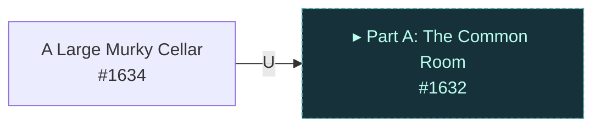

# Tyrst Wyvern's Tower  `(wyvern)`

[← back to world map](WORLD-MAP.md) · 61 rooms · vnums 1601–1720

Grey dashed nodes leave the area; green dashed nodes (`▸ Part X`) continue on another sub-map below.

_This area is split into 4 sub-maps for legibility._

## Map — Part A (24 rooms: #1601–#1633)

```mermaid
graph LR
  R1601["Rough East-West Path<br/>#1601"]
  R1602["Rough Path Between the Hills<br/>#1602"]
  R1603["Path through an Open Area<br/>#1603"]
  R1604["West Side of Moat<br/>#1604"]
  R1605["Path North of Moat<br/>#1605"]
  R1606["Cluster of Buildings<br/>#1606"]
  R1607["House of Pancakes<br/>#1607"]
  R1608["Old Store Room<br/>#1608"]
  R1609["Empty Room<br/>#1609"]
  R1610["Minotaur's Room<br/>#1610"]
  R1620["Western Moat<br/>#1620"]
  R1621["Northern Moat<br/>#1621"]
  R1622["Southern Moat<br/>#1622"]
  R1623["Tower Foyer<br/>#1623"]
  R1624["The Grand Lobby<br/>#1624"]
  R1625["Base of the Western Tower<br/>#1625"]
  R1626["The Musty Corridor<br/>#1626"]
  R1627["Kitchen<br/>#1627"]
  R1628["Conservatory<br/>#1628"]
  R1629["The Dining Hall<br/>#1629"]
  R1630["Art Gallery<br/>#1630"]
  R1631["Base of the Eastern Tower<br/>#1631"]
  R1632["The Common Room<br/>#1632"]
  R1633["Servant's Quarters<br/>#1633"]
  R1601 -->|E| R1602
  R1601 -->|W| X1702
  R1602 -->|E| R1603
  R1602 -->|W| R1601
  R1603 -->|E| R1604
  R1603 -->|W| R1602
  R1604 -->|N| R1605
  R1604 -->|E| R1620
  R1604 -->|W| R1603
  R1605 -->|N| R1606
  R1605 -->|S| R1604
  R1606 -->|N| R1609
  R1606 -->|E| R1607
  R1606 -->|S| R1605
  R1606 -->|W| R1608
  R1608 -->|E| R1606
  R1609 -->|S| R1606
  R1609 -->|D| R1610
  R1610 -->|U| R1609
  R1620 -->|N| R1621
  R1620 -->|E| R1623
  R1620 -->|S| R1622
  R1620 -->|W| R1604
  R1621 -->|S| R1620
  R1622 -->|N| R1620
  R1623 -->|E| R1624
  R1623 -->|W| R1620
  R1624 -->|E| R1625
  R1624 -->|W| R1623
  R1625 -->|N| R1627
  R1625 -->|E| R1626
  R1625 -->|S| R1628
  R1625 -->|W| R1624
  R1626 -->|N| R1629
  R1626 -->|E| R1631
  R1626 -->|S| R1630
  R1626 -->|W| R1625
  R1627 -->|S| R1625
  R1628 -->|N| R1625
  R1629 -->|S| R1626
  R1630 -->|N| R1626
  R1631 -->|N| R1632
  R1631 -->|S| R1633
  R1631 -->|W| R1626
  R1631 -->|U| X1635
  R1632 -->|S| R1631
  R1632 -->|D| X1634
  R1633 -->|N| R1631
  X1702["▸ Part D: Crossroads to the Wilderness<br/>#1702"]:::part
  X1635["▸ Part C: On the First Staircase<br/>#1635"]:::part
  X1634["▸ Part B: A Large Murky Cellar<br/>#1634"]:::part
  classDef ext fill:#222,stroke:#888,color:#bbb,stroke-dasharray:3 3;
  classDef part fill:#16313a,stroke:#5aa,color:#bfe,stroke-dasharray:4 2;
```

## Map — Part B (1 rooms: #1634–#1634)

## Map — Part C (18 rooms: #1635–#1652)

```mermaid
graph LR
  R1635["On the First Staircase<br/>#1635"]
  R1636["Second Level of the Eastern Tower<br/>#1636"]
  R1637["The Elegant Hall<br/>#1637"]
  R1638["The Shaman's Room<br/>#1638"]
  R1639["The Library<br/>#1639"]
  R1640["Second Level of the Western Tower<br/>#1640"]
  R1641["On the Balcony<br/>#1641"]
  R1642["The Spiral Stairs<br/>#1642"]
  R1643["Third Level of Western Tower<br/>#1643"]
  R1644["It's too dark to see anything!<br/>#1644"]
  R1645["The Armory<br/>#1645"]
  R1646["The Officer's Quarters<br/>#1646"]
  R1647["Third Level of Eastern Tower<br/>#1647"]
  R1648["Turret of the Eastern Tower<br/>#1648"]
  R1649["On the Catwalk<br/>#1649"]
  R1650["Turret of the Western Tower<br/>#1650"]
  R1651["On the Other Side<br/>#1651"]
  R1652["The Chamber<br/>#1652"]
  R1635 -->|U| R1636
  R1635 -->|D| X1631
  R1636 -->|W| R1637
  R1636 -->|D| R1635
  R1637 -->|N| R1638
  R1637 -->|E| R1636
  R1637 -->|S| R1639
  R1637 -->|W| R1640
  R1638 -->|S| R1637
  R1639 -->|N| R1637
  R1640 -->|E| R1637
  R1640 -->|W| R1641
  R1640 -->|U| R1642
  R1641 -->|E| R1640
  R1642 -->|U| R1643
  R1642 -->|D| R1640
  R1643 -->|E| R1644
  R1643 -->|D| R1642
  R1644 -->|N| R1645
  R1644 -->|E| R1647
  R1644 -->|S| R1646
  R1644 -->|W| R1643
  R1645 -->|S| R1644
  R1646 -->|N| R1644
  R1647 -->|W| R1644
  R1647 -->|U| R1648
  R1648 -->|W| R1649
  R1648 -->|D| R1647
  R1649 -->|E| R1648
  R1649 -->|W| R1650
  R1650 -->|E| R1649
  R1650 -->|W| R1651
  R1651 -->|E| R1650
  R1651 -->|W| R1652
  R1652 -->|E| R1651
  X1631["▸ Part A: Base of the Eastern Tower<br/>#1631"]:::part
  classDef ext fill:#222,stroke:#888,color:#bbb,stroke-dasharray:3 3;
  classDef part fill:#16313a,stroke:#5aa,color:#bfe,stroke-dasharray:4 2;
```

## Map — Part D (18 rooms: #1701–#1720)

```mermaid
graph LR
  R1701["Main Eastern Road<br/>#1701"]
  R1702["Crossroads to the Wilderness<br/>#1702"]
  R1703["Trading Post<br/>#1703"]
  R1704["Trail north of crossroads<br/>#1704"]
  R1705["Trail south of forest<br/>#1705"]
  R1706["Entrance to the forest<br/>#1706"]
  R1707["Trail in Dark Oak Forest<br/>#1707"]
  R1708["Junction in Dark Forest<br/>#1708"]
  R1709["Path to Centaur Village<br/>#1709"]
  R1710["The East side of the Centaur Clearing<br/>#1710"]
  R1711["West side of the Centaur Clearing<br/>#1711"]
  R1712["A Centaur's Hut<br/>#1712"]
  R1713["A Centaur's Hut<br/>#1713"]
  R1714["A Centaur's Hut<br/>#1714"]
  R1715["A Centaur's Hut<br/>#1715"]
  R1716["Entrance to a Large Hut<br/>#1716"]
  R1717["Back of a Large Hut<br/>#1717"]
  R1720["Eastern Path in Dark Forest<br/>#1720"]
  R1701 -->|E| R1702
  R1701 -->|W| X5267
  R1702 -->|N| R1704
  R1702 -->|E| X1601
  R1702 -->|S| R1703
  R1702 -->|W| R1701
  R1703 -->|N| R1702
  R1704 -->|N| R1705
  R1704 -->|S| R1702
  R1705 -->|N| R1706
  R1705 -->|S| R1704
  R1706 -->|N| R1707
  R1706 -->|S| R1705
  R1707 -->|N| R1708
  R1707 -->|S| R1706
  R1708 -->|E| R1720
  R1708 -->|S| R1707
  R1708 -->|W| R1709
  R1709 -->|E| R1708
  R1709 -->|W| R1710
  R1710 -->|N| R1712
  R1710 -->|E| R1709
  R1710 -->|S| R1713
  R1710 -->|W| R1711
  R1711 -->|N| R1714
  R1711 -->|E| R1710
  R1711 -->|S| R1715
  R1711 -->|W| R1716
  R1712 -->|S| R1710
  R1713 -->|N| R1710
  R1714 -->|S| R1711
  R1715 -->|N| R1711
  R1716 -->|E| R1711
  R1716 -->|W| R1717
  R1717 -->|E| R1716
  R1720 -->|W| R1708
  X5267["A valley in the dark dwarf forest<br/>thalos #5267"]:::ext
  X1601["▸ Part A: Rough East-West Path<br/>#1601"]:::part
  classDef ext fill:#222,stroke:#888,color:#bbb,stroke-dasharray:3 3;
  classDef part fill:#16313a,stroke:#5aa,color:#bfe,stroke-dasharray:4 2;
```

## Rooms

| VNUM | Name | Exits |
|---:|---|---|
| 1601 | Rough East-West Path | E→1602 W→1702 |
| 1602 | Rough Path Between the Hills | E→1603 W→1601 |
| 1603 | Path through an Open Area | E→1604 W→1602 |
| 1604 | West Side of Moat | N→1605 E→1620 W→1603 |
| 1605 | Path North of Moat | N→1606 S→1604 |
| 1606 | Cluster of Buildings | N→1609 E→1607 S→1605 W→1608 |
| 1607 | House of Pancakes | — |
| 1608 | Old Store Room | E→1606 |
| 1609 | Empty Room | S→1606 D→1610 |
| 1610 | Minotaur's Room | U→1609 |
| 1620 | Western Moat | N→1621 E→1623 S→1622 W→1604 |
| 1621 | Northern Moat | S→1620 |
| 1622 | Southern Moat | N→1620 |
| 1623 | Tower Foyer | E→1624 W→1620 |
| 1624 | The Grand Lobby | E→1625 W→1623 |
| 1625 | Base of the Western Tower | N→1627 E→1626 S→1628 W→1624 |
| 1626 | The Musty Corridor | N→1629 E→1631 S→1630 W→1625 |
| 1627 | Kitchen | S→1625 |
| 1628 | Conservatory | N→1625 |
| 1629 | The Dining Hall | S→1626 |
| 1630 | Art Gallery | N→1626 |
| 1631 | Base of the Eastern Tower | N→1632 S→1633 W→1626 U→1635 |
| 1632 | The Common Room | S→1631 D→1634 |
| 1633 | Servant's Quarters | N→1631 |
| 1634 | A Large Murky Cellar | U→1632 |
| 1635 | On the First Staircase | U→1636 D→1631 |
| 1636 | Second Level of the Eastern Tower | W→1637 D→1635 |
| 1637 | The Elegant Hall | N→1638 E→1636 S→1639 W→1640 |
| 1638 | The Shaman's Room | S→1637 |
| 1639 | The Library | N→1637 |
| 1640 | Second Level of the Western Tower | E→1637 W→1641 U→1642 |
| 1641 | On the Balcony | E→1640 |
| 1642 | The Spiral Stairs | U→1643 D→1640 |
| 1643 | Third Level of Western Tower | E→1644 D→1642 |
| 1644 | It's too dark to see anything! | N→1645 E→1647 S→1646 W→1643 |
| 1645 | The Armory | S→1644 |
| 1646 | The Officer's Quarters | N→1644 |
| 1647 | Third Level of Eastern Tower | W→1644 U→1648 |
| 1648 | Turret of the Eastern Tower | W→1649 D→1647 |
| 1649 | On the Catwalk | E→1648 W→1650 |
| 1650 | Turret of the Western Tower | E→1649 W→1651 |
| 1651 | On the Other Side | E→1650 W→1652 |
| 1652 | The Chamber | E→1651 |
| 1701 | Main Eastern Road | E→1702 W→5267 |
| 1702 | Crossroads to the Wilderness | N→1704 E→1601 S→1703 W→1701 |
| 1703 | Trading Post | N→1702 |
| 1704 | Trail north of crossroads | N→1705 S→1702 |
| 1705 | Trail south of forest | N→1706 S→1704 |
| 1706 | Entrance to the forest | N→1707 S→1705 |
| 1707 | Trail in Dark Oak Forest | N→1708 S→1706 |
| 1708 | Junction in Dark Forest | E→1720 S→1707 W→1709 |
| 1709 | Path to Centaur Village | E→1708 W→1710 |
| 1710 | The East side of the Centaur Clearing | N→1712 E→1709 S→1713 W→1711 |
| 1711 | West side of the Centaur Clearing | N→1714 E→1710 S→1715 W→1716 |
| 1712 | A Centaur's Hut | S→1710 |
| 1713 | A Centaur's Hut | N→1710 |
| 1714 | A Centaur's Hut | S→1711 |
| 1715 | A Centaur's Hut | N→1711 |
| 1716 | Entrance to a Large Hut | E→1711 W→1717 |
| 1717 | Back of a Large Hut | E→1716 |
| 1720 | Eastern Path in Dark Forest | W→1708 |

