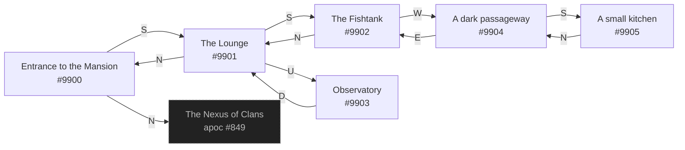

# Trunker Z-Rollers Headquarters  `(zrollers)`

[← back to world map](../WORLD-MAP.md) · 6 rooms · vnums 9900–9905

Dashed nodes are exits that leave this area.

## Rooms

| VNUM | Name | Exits |
|---:|---|---|
| 9900 | Entrance to the Mansion | N→849 S→9901 |
| 9901 | The Lounge | N→9900 S→9902 U→9903 |
| 9902 | The Fishtank | N→9901 W→9904 |
| 9903 | Observatory | D→9901 |
| 9904 | A dark passageway | E→9902 S→9905 |
| 9905 | A small kitchen | N→9904 |

